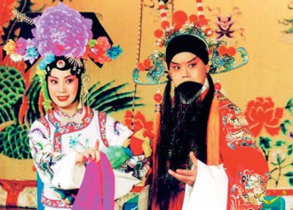
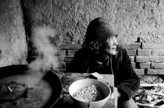

<!-- # 四郎探母 -->

看四郎探母，我一般只看一折——《坐宫》，也就是很多人都非常熟悉的，杨四郎高唱一句“叫小番”。那之后的戏，我就不再往下看了。不是因为不好看了，而是因为不敢看了。

****

我不是一个动不动就感动的人。

昨天后知后觉看《一代宗师》，我深深怀疑我的审美一定和太多人太不一样：我一点也没看出来这电影好在什么地方——说了几句很有道理很深层的话，但台词和剧情之间、和人物之间，到底有些什么关系，我一点也没看出来。人物的性格我也看不出来，动机更理解不了。我想，或许是因为故事太大，铺垫太少，换景太多，氛围太作！

只是每次看《见娘》一折，我都会泪流满面无声抽泣。

常理来说，我对于这种十五年不见娘面，第一眼看到都认不出来的情怀，对于这种两国敌对的情怀，不很能理解了。毕竟我的中小大学都在浙江，两小时的车程罢了。

其他的京剧，离人泪的《霸王别姬》，我看了并不觉得怎么感动，以至于值得赔上几滴眼泪。悲欢人世的《锁麟囊》，我看了也并没有觉得怎么令人感慨，只是人间常态罢了。越剧婺剧或昆曲之中，也有很多悲剧色彩的故事，《梁祝》也好，《五女拜寿》或者《珍珠塔》之类的，也都不曾催我泪下。

倒是有一出义乌人的道情，叫做什么王永庆什么，名字记不得了，听的时候很是感慨，有时候会听哭起来。

但《见娘》一折，真是看一次哭一次，后来索性就不敢看了，怕被人看到这莫名的眼泪。

想想，也许只是因为这之前的铺垫很是够了：杨四郎十五年隐姓埋名，终于要见到魂牵梦萦的母亲，却没有令牌可以出关。无奈之下一个人坐在家里偷偷地抹眼泪——如杨四郎这般虎将之泪，是不易见到的，只有母子父子之思，才能催动五脏，泪如雨下。

大约旧时代里拼出来的人都是这样。从小到大只见过父亲哭过一回，就是祖母去世的时候。祖母在世的时候已经病痛缠身，但是不愿意住在医院，坚持在家里。临去的时候，祖母对着一屋子儿女，气若游丝地突出几句话：现在去治还来不来的及啊？还有没有药医啊……姑姑们和父亲、叔叔都泣不成声。祖母叹一口气，就去了。

铁镜公主见到驸马眼泪汪汪，就详加询问。四郎无奈之下，说出身世，并求令牌。其实上，公主也是冒着一颗人头去偷令牌啊！这一切，都让着短短几小时的来回，短短可能只有十几分钟的母子相聚，更显珍贵。

令人感慨的是，佘太君见到杨四郎，哭过之后，并不谈家国天下，而是问他铁镜公主是不是贤惠！这是多么家常的一个问题呢！十五年母子未见，几句家常，便是一辈子难忘的恩情了。

这一出戏，也许年轻的人看着并不怎么感慨，也会觉得无趣。

然张大春《聆听父亲》中，不断出现的这一出《四郎探母》，便是大江大河对岸的人，思念千山万水小深沟里的白发老娘，更有两国敌对难通消息的另一层思念。思念故土，思念故乡，思念家里的老妈妈。

那一代的台湾台湾“外省人”，那一代的老兵，听了一辈子《四郎探母》，也只是“有心去宋营见母一面”，却“怎奈何没有令箭怎过关”，一辈子都想着“宋营离此路途远，快马加鞭一夜还”，却不知道有多少人一辈子再也没见过十八岁时候见到的母亲了。

所以如张大春的父亲一般：每到古历八月二十二、三月二十一这天(我奶奶的冥诞和忌日)上，家里总要上供,香烛鲜花素果时鲜之余,三十三转的老唱盘上放着《四郎探母》……

所以台湾眷村的老人们，在四面竹篱笆的拥挤空间中，听着《见娘》，老泪纵横地哼着“我有家归不得”……

也许这就是那样的儿子对母亲唯一可行的报答了。

前述王家卫的大作，唯一觉得对味的，就是堂子里那一句：杨延辉坐宫院自思自叹，想起了当年事好不惨然。

这是整出戏的第一句，后面还有一大串独唱：

我好比笼中鸟有翅难展，我好比虎离山受了孤单。

我好比南来雁失群飞散，我好比浅水龙困在沙滩。想当年沙滩会一场血战，只杀得血成河尸骨堆山。只杀得杨家将东逃西散，

只杀得众儿郎滚下马鞍。我被擒改名姓方脱此难，

困番邦招驸马一十五年。萧天佐摆天门两下里会战，我的娘领人马来到北番。我有心回宋营见母一面，怎奈我身在番远隔天边。思老母不由儿肝肠痛断，想老娘背地里珠泪不干。眼睁睁高堂母难得见，儿的老娘啊！要相逢除非是梦里团圆。

想来，那些战火连年的时代，离家索居的儿子，思念起永世不见的母亲来，不正是这样的唱词吗？

或许有一天，等我们自己白发满头，父母俱往的时候，连这一折《坐宫》，都不忍卒听了。

_ _

（采编：刘铮；配图:季节扬；责编：刘铮）

[【艺评专题】略说沈从文与汪曾祺](/archives/33560)——汪曾祺比沈从文多了士大夫气，文人气，写得更“雅”，更像文人画，更有人情世故。沈从文是真正的赤子之心，看什么都是小孩子的视角，明澈中有残酷，残酷是因为面对真相时候的心平气和。

[【艺评专题】打龙袍](/archives/33743)——正如列宁称托尔斯泰为“俄国革命的一面镜子”，一切文艺作品都不自觉地折射出了所属时代的某一面。时隔若干世纪，我们又能从《打龙袍》中看出怎样的时代气象与人物风流？

[【艺评专题】王小波的不幸](/archives/33899)——迟早有一天，我们都会满足于140字的微杂文，以及《王小波最伤人的89句话》。有一天我们都会死去，追求智慧的道路还会有人在走着。但一想到这些人越来越少且越来越懒，我心里就很害怕。

[【艺评专题】走向不和](/archives/33941)——都说中国人坚忍善良质朴勤恳，我看中国人才最是霸气十足，别的国家建国史里总能找出些妥协、合作的痕迹，我们的开国先贤却非要唯我独尊，通杀全盘。每一次变革总需要血流漂杵、动乱不堪，总会引起国人的咒骂与怨言。 [【艺评专题】老尽少年心，无复相思人](/archives/40982)——成功的房地产商人们，都是当年失败的诗人。要是能够像吴笑宇那样发了财，成了胖子也没啥。就怕成了身无长物的穷人，还肥肠脑满。
