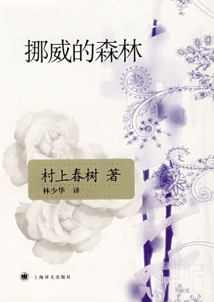
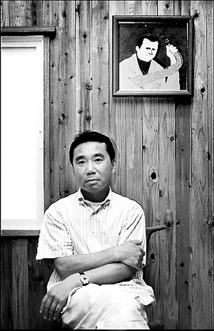
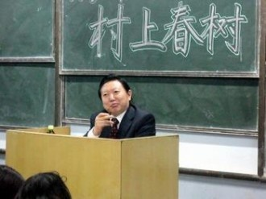

<!-- # 林少华：最好的尚未来临 -->

《林少华》这本以日本文学为主攻方向的杂志创刊于60年前。你看到这个名字时是否觉得似曾相识，又说不出个所以然来，如果我提醒一句：“村上春树”，或许你会恍然大悟：“哦，对，我看过林少华翻译的《挪威的森林》。”

**村上少华去见林春树**

百度百科里搜索林少华会看到这样的句子：当无数年轻易感的心被村上春树打动时，其实又何尝不是被林少华的译文打动呢？北师大学者王向远《二十世纪中国的日本翻译文学史》有这样的评价：“可以说，村上春树在我国的影响，很大程度依赖于林少华译文的精彩。”

林先生也未曾料到，在广州的那个“经济状况一点都不美妙”的冬天竟会对自己的人生产生如此的影响：一本《挪威的森林》，三十年畅销不衰，使得村上春树和林少华这两个名字紧紧的连结在一起。争议从来没有断过，有认为赖明珠译本更加贴合原著的，也有类似于豆瓣上“林少华的逆袭”这样的小组坚决支持林少华译本的，“翻译的境界可以分为三个：信、达、雅，村上的文体有自己的特点和节奏，唯有传递出原文之美，使中国读者感受到日本读者读书的感觉时，才算是翻译的成功。”林先生轻轻地捋了一下额前的头发，用自己特有的语速回答。

本着八卦的精神，作为采访记者的我们虽然没有仔细调查村上跟林先生的星座血型、生辰八字，但是仔细询问了二人的相似之处。“作为翻译来讲，对脾气是一件相当重要的事情，（我）对村上君性格上十分欣赏，翻译起来也是相当惬意。”谈到翻译三岛由纪夫这一典型的硬汉文学时，林少华说他“头疼的不行”。

住在中山陵深处的青年旅社，阔别十年之后来到南京的林先生依然喜欢远离闹市，并不要人陪同，也不带地图，情愿在紫金山间迷途；漫无目的地行走时撞见明孝陵，倒也平添了一分意料之外的惊喜。从林先生那里了解到的村上春树，孤独对他来说也是一个享受的过程：能不参加社交活动就绝不参加，与生人交谈绝对不习惯，除了一个星期去两次在东京的事务所外，几乎置身世外。

林少华对日语的体察有着自己微妙的情感，虽然日本文学几乎没有海明威或是雷蒙德卡佛（尽管雷蒙德卡佛对村上的影响至深）这般作家短促有力的表达，在日语的叙述语境中，把握住“微妙”的变化也就把握住了要义。早上看到明孝陵内秋叶静美之景时，林先生指着地上的枫叶：“日本传统文学中的‘物哀’之美也大概如此。”之后便不多言，只是后来归途时看到环卫工人在清扫落叶，他说：“这么美的风景，大可以不扫嘛。”

不注重修辞的翻译家不是好作家。林少华跟村上的相近之处除了性格上的喜好孤独之外，二个人也都是译者，村上对于美国文学及欧洲文学都有自己的理解，翻译了不少西方文学到日本；而林先生除了翻译之外，也是一位散文家，尤其在修辞上极为注意。当要他在故事情节与修辞二者中择其一时，林先生呷一口绿茶：“还是修辞吧，文学的想象力可能很多人都有，而修辞的独特性却不是一般人所能拥有的”。而村上在谈到创作时说：“最重要的就是节奏。”

村上春树有个说法——人这一存在，就像一座二层楼，地下室才真正住着自己的灵魂，只有一扇隐秘的门可以入内。在林少华看来，他有着一把通往这间地下室的钥匙。

**每个时代的青春都有自己的关键词**

我们所置身的这个时代，所有的人在嘈杂中抱成一团：唯利主义、道德缺失、浮躁冷漠，似乎正是何勇又蹦又跳穿着海魂衫吼出的“整个世界就是一个垃圾场”。大至一个国家，一夜之间它可以破产；小到一个人，发达的社交网络使你应接不暇的同时又感到一无所获。伍迪艾伦这个一直絮絮叨叨的小老头在《午夜巴黎》那些令人眩晕的镜头无非告诉我们身为人的普遍性怀旧的情绪。70年代在姜文肆意的叙述中何尝不是蛊惑？80年代的大学又在多少小说里缱绻？

想象是没有责任的，然而70年代成长的人到了村上的笔下毫无疑问是如同佐伯一般受到损毁，无论自己有没有留意到。以文革这个最具有标志性意义的年份为例，在“青一色”海洋里青涩的男生与害羞的女生，穿一件漂亮的衣服也只是奢望。“你们还是幸福的，较之而言。”林先生清楚地记得，班里当时有一个南宁的高干子弟，一次穿了个花领子，就被团委书记叫去谈话。靓丽虽然不能作为标准来评判幸福，但选择的自由与个人的意志却可以。在那样一个时代，作为个体的人被忽略，巨大虚幻的口号吞没岁月的青葱，勉强值得说出来一爽的事就是：男神女神与男女屌丝还不如今日这般泾渭分明，三代贫农才是优越的政治成分。

如果我们的青春大致以“迷茫”定义，那么林先生的青春应该是“政治挂帅，革命第一”的八字方针。林先生的大学，用他自己的话来说只能是具有黑色意义的“幽默”。林先生是通过工农推荐制上大学的，虽然自幼受到家庭熏陶，对中国古典文学有着极大的兴趣，几本偷偷“压箱底儿”的“封建”图书读了一遍又一遍；但是根据国家要求，大学只能读日语，根本没有选择权利，而在大学之前，他对日语的印象仅仅是抗日影片中最初的“米西米西，八嘎亚路”。在林先生真正静下心来读书之后，文革来临，所有的学生停课革命，一会儿学工，一会儿学农，一会儿学军。这样的“疯狂”岁月在他们那一代人的记忆里留下无可挽回损毁，林先生如此，王小波、史铁生也如此。

对于我们这一代人的大学，林少华有自己的看法。拿出勤率讲，他不希望自己的学生不来上课，但是也不会强制要求，只要班级出勤率在三分之一以上、说得过去就好。“大学其实就是给了你四年大块可以读书的时间，要放开自己的想象力，根据自己的潜力、爱好，放开胆子去读。”

**知识分子自己就该是一本厚重的书**

依然能清晰地记起在禄口机场初见林先生的情景：一身笔挺的西服，头发齐整，拖着轻便的行李箱，跟想象中六十岁上下的教授形象相差甚远。这位如村上一般行事低调、坚决拒绝行政化的教授，在雕刻时光喝咖啡时说：“倘使自己做个林处长，想必也就做不成翻译家了，那东西琐事太多。”

住在青岛崂山的余脉缓坡上，窗外壮阔的黄海已经被新建的高楼所遮挡，他依然在自己的“窥海斋”怡然自得。书屋四壁都是书，生活极其复古，几乎不用电脑，回邮件写信都是由夫人梁老师代理，不出远门也绝不带手机。这种硬生生的外界的打扰他并不喜欢，在自己的天地里悠哉游哉才是本性。说来有趣，因林老师夫人梁阿姨过生日，我写邮件送去祝福，因文稿翻译和重校忙得浑天黑地的林先生，一拍脑门就急忙出门给梁阿姨买生日蛋糕去了。

他是梁阿姨的丈夫，他是小女儿的慈父，他又是世界上翻译村上春树作品最多的翻译家、把村上春树带入中国的第一人，更多的时候，他只是一名同大多数人一样的读者。林先生床头摆放着一本《陈寅恪的最后二十年》；他在南邮的讲座中，也向影响他的三位作家致敬：“王小波、史铁生、村上春树——为了灵魂的自由”。来南京当晚，他就行至先锋书店。在真理大道上，林先生“相逢”村上春树的作品架，他拿起新出版的村上春树游记、散文，怀着一份我们无从体会的心情。临了，即使行程匆匆，林先生还是在偌大的先锋书店找到几本想读的书，说是“路上看看”。每到一座城市必到当地的书店逛逛，这已成为他的一种习惯。

并不高调的林老师最终还是被先锋的店员认出，译者与读者之间的互动也许正是这二十几年并非徒然虚晃的证明。在学校演讲时，原本没有设置签售环节，但南京全城赶来的近千名读者还是携着村上的、或是林老师的著作（当然也包含施小炜先生的译本）前来，林先生也都一一给予赠语签名，致使活动比原计划延长了一个半小时之多，至到晚上11时方才结束。因为已经超过学校礼堂的开放时间，工作人员在团委老师的指示下试图驱散人群，林先生摆手说不必，一定签至最后一个。风度这种形而上的魅力，真正体现于细节之处。

如果你读过林少华先生的散文，以上的场景想必可以想象出来。这是一位真性情的教授，是一个依然在捍卫“知识分子”尊严的先生。著论《高墙与鸡蛋》：“无论高墙如何正确，我也坚决选择站在蛋的一边”。年纪并没阻挡韩寒与林少华之间的赏识。林先生曾撰写博文称：“十个大学教授未必抵得上一个韩寒”；而第一期就夭折的《独唱团》也转载了林先生的散文。

同村上见面时的谈话不仅成了林少华村上文学评论集的书名——《为了灵魂的自由》，也表达了他的心声：即使身体自由不了，也想让灵魂获得自由。

参加当晚演讲的同学想必没有忘记，这位报书名像报菜名一般的老先生――林少华也许不是一位演讲家，但确是真正的读书人、值得尊敬的教授。马上就要60岁的林先生几次流露出对大学的不舍：“究竟还是喜欢大学的这个氛围。不同于理工科四五十岁的学术黄金期，文科教授的积淀更久一些，60岁正是发力期，我最好的岁月尚未来临。”

（责编：徐海星）

（来自投稿邮箱：beidouxrw@163.com)
