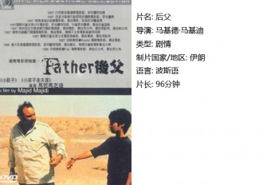
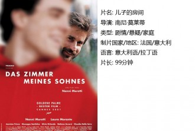
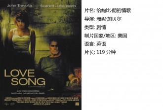

<!-- # 他们 -->

妹妹刚出生的时候，父亲因为工伤骨折在医院疗养，大约半个月后他才第一次见到妹妹。那时候妹妹并不胖，小小的脸，包在厚厚的褥子里，着实惹人怜爱。我把妹妹抱到父亲身前，他“嘿”地笑出声，眼睛眯成一条缝，露出黄白虎牙，许久没有刮胡子，加上生病，外形是潦倒而虚弱的，但是整个人有异样的神采。父爱如山。我想不出有什么词语更能贴切的形容我对于父亲的理解。

他们的情感坚韧而深刻，不虚华昂贵；他们的表达沉重而笨拙，不流于表情。他们在你年轻时你无法理解，觉得厌烦无趣。他们在你的一次次的不耐烦中变得沉默寡言。你们在岁月里慢慢生疏。直到有一天，也许事业失败，你变得伤心失意；也许感情不顺，你有点轻言生死。第一个来到你身边的还是他们。他们的手粗糙宽大，肩膀骨瘦嶙峋，也许那一刻，你才明白，他们早已在漫长的岁月里老去，带着爱意深沉。他们的名字叫做父亲。

**一、

洗澡**

——“出差呀”

——“不，回来看看”

——“还吃的惯吧”

——“还好，挺香的”

——“不常吃吧那边”

——“偶尔也吃，不过没这么好的酱。您身体还好吧”

——“还好，能吃能睡能干活”

中国式的爱意表达，都是相互在意的人，却掖着藏着，好似被人知道是很害羞的事情。影片中对父子关系的处理很到位，老大常年在外，和父亲的关系不免有些生疏，老二虽然是一个傻子，父亲却没有丝毫嫌弃，他对自己的儿子们倾注了深深的爱。但是影片的野心不仅仅是表达一种情感，他试图展示的是一个时代的面貌。在某种程度上来说他失败了，穿插的陕北风情以及对洗澡的崇高解释，在父子脉脉的温情中显得格格不入。

我试图去理解导演。每一个人的记忆里都有一个洗澡堂子，它也许不甚干净，藏污纳垢，但是你总愿意在里面泡个澡呆个几十分钟。水汽弥漫着，人和人几乎互相看不清楚，大家愉快的高声聊天，不用担心隐私被窥探，舒适而安心。这是属于旧时光的美好回忆，现在城市节奏日益快速，洗澡吃饭都称不上是享受而只是必须。父亲却坚守着一种几近老旧的生活方式，用心经营；他也想用霓虹灯来做招牌，却一直到他死后才如愿，他终究是活在过去的人，当霓虹灯亮起来的时候，也许就是一个时代的终结了。

**二、父亲**

本片由伊朗导演马基德·马基迪执导，也许这个名字有些陌生，但是提到他的另外一部作品《小鞋子》却广为人知。伊朗的儿童电影独具特色，在《父亲》里讲述的是一个父亲和孩子的故事。

这个父亲有点不太寻常，他是后父，不管是在童话里还是现实中，不是亲生这一点总是带着些许邪恶的，它往往和残忍反派暴虐联系在一起。这个父亲有着大大的肚子，他爱小孩子，于是娶了一个有四个孩子的寡妇，看的出来他爱她。但是寡妇年轻的儿子不能接受，年仅十四岁的儿子觉得自己已经长大成人可以养起一个家，他哪里知道世道艰难，有些事情不仅仅是有钱便可以解决的。一个家庭不能没有父亲，何况他还善良待你如亲子，当然可能他的脾气不太好。这也是我非常欣赏本片的一点，即他的后父没有披上神圣的外衣，他始终是脾气有点暴躁的却不乏柔情的一个男子，他身上有很多优点，他具备父亲角色所应该有的一切，当他们穿越沙漠，他表现出来的刚毅和勇敢深深的打动了儿子，男孩子从来都只崇拜强者，他终于认同他。

电影结局和《小鞋子》有相似之处，一张全家福照片顺着水流缓缓漂到儿子眼前，温馨和谐。这又是一个美满大结局。

三、

儿子的房间

这部电影曾经获得过2001年戛纳的最佳影片奖。

世上总有形形色色各不相同的悲哀，有的人工作顺利身体健康却一直心心念想自杀，有的人陷入某种性癖不可自拔，有的人喜欢倾吐苦水依靠购物进行自我安慰，他们患有心理疾病，絮絮叨叨向心理医生咨询，希望得到某种解脱。但是有谁知道，医生本人也陷入了深深的悲痛中，如果连专业心理医生都无法自我调节的伤痛，是不是生命中的最痛？儿子的意外去世打破了这个幸福和睦的四口之家，去世的原因都乏善可陈，只是意外，什么都没有发生，只是潜艇时氧气耗尽，如此而已。我想，那种悲哀是一种无力感，因为你什么都不能做，什么都做不了，这一切就是发生了，然后只能接受。父亲在游乐场体验失重和旋转的过程中一直面无表情，是不是体验了死亡的感觉就能离儿子更近一些？

如果空虚和悲痛你选择什么，我选择悲痛，沉浸在心底的悲痛。当三个人面对碧蓝广阔的海洋，相视微笑，剩下的人要代替死去的人继续生活。

四、给鲍比朗的情歌

典型的美国电影，开头和结尾都带着强烈的美国式说教，但是这丝毫不影响我们喜欢这部电影，以及电影里这个美丽的城市。

女主角是斯嘉丽约翰逊，那时她20岁，饰演一个18岁的少女。红艳艳的嘴唇，眼神清澈。她说，我只是一个小女孩。她三岁的时候离开妈妈，从小就知道自己的名字代表杂草，她的青春期是混乱而放纵的，甚至还错过了妈妈的葬礼。当她赶回母亲留给自己的小屋时，她遇到了鲍比。鲍比年轻时可能风度翩翩，但是他现在只是一个让人有些厌烦的小色老头。他一直在体验一种只有在小说中才出现的生活，他的家庭失败，被上帝抛弃，他不是一个合格的父亲，甚至，他连自己还有一个女儿都不知晓。但是当他穿戴一新和斯嘉丽翩翩起舞，我很容易便原谅了他，这个心中永远住着一个小男孩的老人，他始终没有停下追逐生活的脚步。他能带给女儿的远比我们想象的多。

“我们永远都不该停止寻找，在我们寻找的终点，我们又回到了起点，然后一切仿如初见。”如果世上的每一件事都是如此发生和结局，该多好。

【如何下载】

请加入独立影像流动分享群，在群邮件中下载本期所推荐的独立电影！

1．请加群187213480，入群请注意以下几点哦： 2.流动群专供北斗读者下载本栏目所推荐的资源，验证身份时请注明“北斗读者”。 3.当期资源自发布后14天内可以下载，到期后工作人员将手动删除以上传后续资源，请注意时间。

（采编：卢静；配图：卢静；责编：黄楚涵）

[【父亲专题】继父](/archives/28950)——当你能够看透并怜悯敌人时，你才算真正战胜了他。当你能够平静地回忆并叙述时，你才算真正战胜了自己。 [【父亲专题】我和他](/archives/26164)——当我们毫无挽回地长大，猛然回首，发现父亲就在那儿，在家里的沙发上，在我们的血和心上。 [【父亲专题】为君细写一联春](/archives/35046)——回首前尘，想起多年来父亲对于写春联、贴春联、读春联的用意变化，才发现他的孤愤嘲诮一年比一年深。我现在每年作一副春联，发现自己家门口老有父亲走过的影子。 [【父亲专题】父亲的手笛](/archives/35312)——父亲的手笛里，有他一生的欢喜和柔肠，他执拗地吹奏，却不再被懂得。 [【父亲专题】父亲](/archives/35210)——我们每个人的意识深层都有对父母老去的恐惧，时间在运行中仿佛作了个交换，子女逐渐强大的代价是父母的迅速衰老，意识到这一点会让我们带突然陷入惊悚与战栗中。 [【父亲专题】与父书](/archives/35424)——邻家有子，既富且贵，前程锦绣，夸示于父母。父母若脱不得桎梏，只得孩儿自骂狠心，亦无良策；若能炼到心如古井，波澜不起，只“由他去”三字足矣。
