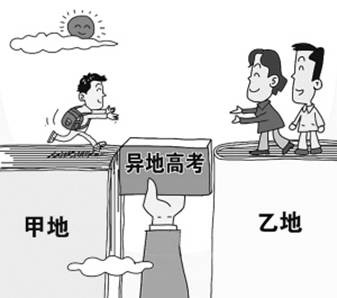
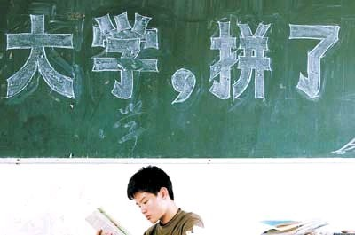

<!-- # 第七十八期：老师，我该在哪里高考？ -->

引语：还有不到一个月，就又要高考了。长途专线运输总是压力山大，扛过了春运，还得hold得住数以万计的不被“准入”的异地考生返回原学籍地参加高考。本期说法为您解析异地高考改革的成果和未来。

**还有不到一个月，就又到高考了。**

长途专线运输总是压力山大，扛过了春运，还得hold得住数以万计的不被“准入”的异地考生返回原学籍地参加高考。一批批独自返还的考生们，一来即将单枪匹马地挑战截然不同的学习课程，二来不得不赤手空拳地应对陌生的高考制度，**与正常考生相较，他们费去的不仅是时间，更是心力。其痛苦非经历者未可知。**

某青年怒了：**异地考生凭什么被“遣返”？！他们平等接受教育的权利呢？宪法顶个球用？！**非沪籍女孩就异地高考约辩沪籍人士事件当事人占海特为其中代表之一，她在其微博中反复强调，允许随迁子女学籍地中高考所有未成年学生最基本的人权。

人们感同身受，呼吁着成千上万的异地生完完全全平等的受教育权利，强烈要求政府保证全部异地生平平稳稳就地参加高考。

与此同时，某仁兄也怒了：**那本地考生的权利呢？这么多随迁子女的涌入不得把资源都挤掉，这对本地考生来说公平么？本地考生也有平等受教育的权利啊！**像去年在北京非京籍家长与京籍人士的激烈骂战中，本地市民最为担心的便是：外地人已然严重影响本地居民正当权益，开放异地高考则会使情况更糟。

人们也感同身受，怯生生地揣了揣兜儿，觉得大城市的孩纸其实也挺可怜的。

的确，**平等参加高考的权利原则上就是平等接受高等教育的前提。而平等接受高考教育的权利蕴含于受教育平等权**。公民平等受教育的权利是经白纸黑字地明确规定着的。《世界人权宣言》第26条规定：**人人都有受教育的权利，高等教育应根据成绩而对一切人平等开放。该规定禁止获得这些层次教育的不合理差别。**《公民权利和政治权利国际公约》中亦规定教育的平等权应得到一般性保障。《经济、社会和文化权利国际公约》第13条第2款规定：高等教育应根据成绩，以一切适当方法，对一切人平等开放。**我国现行《宪法》第33条第2款和第46条第1款明文规定：“中华人民共和国公民在法律面前一律平等”；“中华人民共和国公民有受教育的权利和义务”。由此可见，我国公民享有宪法和法律赋予的平等受教育的权利，没有合适的理由政府不得实施不合理的差别待遇。**

但是，如果单纯只从我国宪法所规定的“公民享有平等的受教育权利”来争辩异地高考问题，未免显得太过单薄无力。**法律的核心就在于法益的衡平。权利的主张，不得受干涉的同时也讲究其范围。**打个比方说，要是每个人都强调自身的隐私权，是不是所有人都必须相互保持个距离以保证各自独处而不受打扰了？那在比肩叠迹的城市街头，恐怕放眼过去都是侵权行为。

**一个良好社会的构架离不开权利的磨合与利益的博弈，进而在异地高考准入的问题上，对外籍考生的限制程度是解决问题的关键。**真正公平的异地高考方案必须既要充分保障多数务工人员随迁子女平等参加高考的权利，又不能危及本地考生的应有利益。达到利益平衡才是症结所在，这也是为什么人口流入集中地区的政府异地高考“破冰”行动如此艰难坎坷的原因。

一．

且看各省市已出方案

**2012年8月31日，教育部给各地布置了个作业，要求各地年底前出台允许异地高考时间表。**各省市纷纷忙活开来，最勤奋的当属山东省。山东省率先出台允许异地高考的有关方案：凡在山东省高中段有完整学习经历的非户籍考生均可在山东就地(所就学的高中段学校所在地)报名参加高考，并与山东省考生享受同等的录取政策。此后相继出台的方案中也不乏与山东省同样宽松的，如安徽省，福建省等。在已知方案中条件门槛最低的方案来自江西省：仅需在江西高中阶段具有一年以上学习经历并取得学籍，即可就地高考。能够像这样轻松厚道地接纳绝多数外籍学子，当然不是因为这些地方的人民或政府有着海纳百川，包罗万象的胸怀，只是因为这些地方的教育资源与迁入人口之间，本地考生与外地考生之间不至于鬻矛誉盾而已。

**人口流出大省“门槛低”，人口流入大省“门槛高”。京沪粤三省（市）千呼万唤始出来的仍是以水投水，名易实贸的方案**：

**广东省的方案主打“积分入户”**。自2013年起，通过积分入户广东的异地务工人员、高技能人才，其随迁子女可在广东报名参加高考。其他符合条件的随迁子女从2014年开始可以报考高等职业学院，2016年可以报名参加高考，欲分三步渐进式实施。不符合报考条件的可借考，但需回到户籍所在省(市)参加录取。

**上海市计划于2014年试行的方案与《上海市居住证管理办法》相衔接**，进城务工人员符合上海市进城务工人员管理制度规定的基本要求并达到一定积分的，其子女可在上海参加高中阶段学校招生考试，接受高中阶段教育；以及随迁子女在上海参加高中阶段学校招生考试并完成高中阶段完整学习经历后，可在上海参加普通高等学校招生考试。

**北京市推出的是过渡方案**，从2013年起父母有居住证明及稳定住所，稳定职业及社保满3年的，随迁子女有学籍且已连读初中3年，可参加中职考试录取。后年起，有居住证明及稳定住所，稳定职业及社保满6年，子女有学籍且连读高中3年，可参加高职考试录取，毕业后可参加升本考试录取。

**广东强调循序渐进，可步子小得让人觉得扭扭捏捏；上海的突破和预想中的一样小；而北京甚至只是个过渡方案，保守得被网民调侃为：交了张白卷。**

作为全中国地狭人稠、生齿日繁的城市的“典范”，**这仨儿排除万难，顶着重重压力、磕磕绊绊地周旋于各个利益集团之间，最终在期限之日交上了作业，并且有了各自不同程度的突破，是值得鼓励和赞许的**。但是，本地居民在利益博弈上的胜利显而易见，“本土主义”粉墨登场。这意味着本地居民的权利竟优于外来人口的权利，利益天平还是东倒西歪。套用窦美人的话，我们**“可以理解，但是不可以原谅”**。

2、异地高考政策根基不稳

**异地高考的方案无论门槛高低，都无法达到真正的公平。**因为他们在基础上就已经输了——**户籍制度本身就是显失公平的。**

自1958年始沿用至今的《中华人名共和国户口登记条例》以户口的形式给每一位公民贴上了“标签”，地域之差与城乡之别借此开诚布公，对人加以堂而皇之的定性划分。

《世界人权宣言》第一条开宗明义：人人生而自由，在尊严和权利上一律平等。我国宪法亦明确规定：国家尊重和保障人权。更何况，所谓“天赋人权”，每个人一出生都是雅量高致的，其人权的享有也不因国家有无规定而有所增减。故而国家怎么可以用携着身份色彩的户口加以区分，颇有些封妻荫子的“世袭”的意思。当年户籍制度是为了配合计划经济体制而设立，随着市场经济的建立的发展，户籍制度更是丧失了必要性。

如今，经济发展不平衡的态势江河日下，两极分化的残酷现状与共同富裕的美好愿望早已南辕北辙，户籍制度已然异化为导致公民在升学、就业等诸多领域形成不平等地位的制度性基础，致使我们的社会悲哀地构建起逐渐根深蒂固的身份差别。

已成为当今中国制度基础的户籍制度理应及时改革。逐渐废除户口其身份地位性，使之仅仅成为一个区别公民出生以及后来生活居住所在地的符号，用于解决确定各级各地司法机关管辖权范围等问题。当然，这需要全国社会全面协调发展，尤其是经济健康平衡发展做基础。

如果改革不通，那么户籍制度就会像人体内逐渐坏死的肌肉一样，应当早日切除。虽然切除的过程可能会痛不欲生，代价惨重，但是这是唯一活命的机会。

三、

多数现有政策半心半意

平等权的保护标准分为形式平等和实质平等——形式平等是指相同情况相同对待，不同情况不同对待；实质平等要求公民权利之间本质上的平等对待**。政府在异地考生和本地考生之间设置的准入标准是基于户籍不同做出的区别对待；对于同属异地生的随迁子女，以家长的薪资、保险、职业和考生在当地连续就学时长等为标准区分不同情况做出了不同对待。**乍一看满足了形式平等，实质上并没有达到双方的利益的平衡，而是侵害了随迁子女的平等受教育权，尤其是农民工子女的权利。如何保证实质平等呢？我认为，首先撇开户口差异，接着只要父母及其子女在本地生活、工作、学习长达一定时间以致融入本地社会与本地居民无差时，就应当给以同样的待遇。这些异地考生就应该被允许就地参加高考。

综合着看，各省市设置门槛的手段都有些固定路数：

**路数一：要求家长一定有稳定的工作、住所和收入。**

这样的标准是否合理？首先，绝大多数外来人口都没有机关事业单位编制，也不在国企工作，在私营单位工作的他们难免经常变换工作。他们大多没有自己的住房，租房住的他们难免经常变换住所。所以，将稳定的工作、住所和收入作为“家长条件”之一，看似不高实则很高，很多外来人口都达不到。况且,**究竟何为“稳定”有些模糊，一些地方难免标准从严，将绝大多数随迁子女拒于

“异地高考”门外**。实际上，没有稳定的工作不意味着没有稳定的收入，一个没有稳定工作的人很有可能拥有相当可观的收入，能为城市发展作出可观的贡献。在当下这个求变的时代，将“稳定”作为异地高考的标准，其正当性基础何在，难免引来质疑。

依据我国《教育法》规定，“公民不分民族、种族、性别、职业、财产状况、宗教信仰等，依法享有平等的受教育机会”。要求家长有“稳定的工作”、“稳定的收入”**似乎有以“职业、财产状况”来区别对待学生的受教育权利之嫌。**家庭境况没有理由成为随迁子女受教育权利的影响因素。家长的职业工作或薪资水平等情况的不同与考生成绩、水平以及参考资格之间没有本质联系，不应划入准入条件中。

例如，大量农民工的子女家境贫寒，通常在底层从事工作，即使他们的孩子已经接受了9年义务教育，完全习惯了流入地的教育氛围和考试方式，与当地考生已经“混为一体”，不存在学业上的区别，却仍被迫在临近升学考试时因未获参考资格而返乡参考；又如，某些投机取巧的“高考移民”，在流入地的学籍上挂着一个名字以达到考生要求，因为其家境殷实而当然可以轻而易举地达到家长条件，最后便成为了“特殊福利”的享有者；由此可见，在求学过程中已经“混同”的学生在临近高考时却突然强调户籍身份，而某些从未在本地真正上过学的却有了参加高考的机会，这显然不符合平等权实质平等的要求。

**路数二：要求家长缴纳各种社会保险，并达一定量**

目前并非所有的务工人员所在单位都会积极主动地为员工缴纳社会保险，有些单位由社会保险法制意识不强，逃避缴纳社会保险的现象时有发生。因此，如果进城务工人员所在单位没有为进城务工人员缴纳社会保险，作为家长自然无法向教育行政主管部门提交缴纳社会保险的相关证据资料，而如果教育行政主管部门根据上述规定，以家长没有缴纳或没有全部缴纳社会保险为由，不让其随迁子女在流入地参加高考，实属不合理。相关数据显示：从城市外来工的现实生存状况来看，家长要有“稳定住所”、“交了各种保险”等条件也相当苛刻。

**路数三：要求学生在本地上学已满一定时间。**

这具有一定合理性。这个最简单基本的条件倒是各省市“志同道合”的地方，**时间是必须设置的条件，这是出于保护本地居民的权利。**

但是，时间的长短设置又是门学问。究竟要多久应该取决于随迁子女在流入地与本地考生共同接受教育多长时间才可以达到充分习惯了流入地的教育方式的程度，更关键的是要多久流入地才可以自如地容纳这一些学生的存在。我的建议是，**当这些异地考生被允许按统一标准参加高考与录取对流入地应届高考的影响已经可估可控的时候，便是他们应该被准入的时候**。政策中要求学生在本地上学满足的时间，是指普遍上异地学生习惯本地学习所需的最少时间。并且结合家长条件，在这个时间间段内，父母也应该保持在本地持续工作的状态。

四、

兵无常势，子母相权的学问

《孙子兵法•虚实篇》中强调：夫兵形象水，水之行避高而趋下，兵之形避实而击虚；水因地而制流，兵因敌而制胜。故兵无常势，水无常形。指的是用兵无一成不变的形势。用以说明办事要因时、因地制宜,具体问题要用具体办法去解决。

在各地不同的具体情况上，异地高考准入规则的设计要统筹考虑进城务工人员随迁子女升学考试需求和人口流入地教育资源承载能力等现实可能，反复推敲。在全国范围内调教育资源十分重要。人口流出地要加大力度发展教育，可以铆足劲儿地鼓励生源回流；在异地高考准入上不失原则地加以放宽；人口流入地也要继续拓展教育资源，并且设置合适的时间要求，严格审查父母是否在本地稳定地工作，不偏不倚地允许异地考生就地参加高考。

**在时间上，如广东、北京等地采取渐进方式并无不可，应当选择最合适的时间推出最合适的政策。**就像劝和的人绝对不能在俩人都正在气头上声嘶力竭地争吵时说些大道理，否则只有挨打的份儿。北京是两边家长闹得最凶的地方，首先推出过渡方案也是无可厚非的。只不过北京打马虎眼的痕迹实在是太明显了，过渡政策根本一点也没什么实质性进步。

《国语》中介绍“货币之重者、大者为母，轻者、小者为子。币轻物贵，推行重币以市贵物，称母权子；币重物轻，推行轻币以市贱物，亦不废重，称之权母。”子母相权，即指轻重并行，维持一定的平衡的道理。

**出于保护本地居民利益的目的而调高门槛，最后的结果会使政策根本上丧失了可实施性。**以今年高考已经实施的浙江省为例，绝大部分异地学生可以不受限地在浙江参加高考，可是填志愿时，其中大多数学生仅仅符合报考高职专科院校的资格，无缘本科教育。难怪有浙江的异地考生在微博上自嘲称：“一入浙江深似海，从此学位是路人”。

更有人暗讽，怀才之人要多深爱着浙江，才愿意放弃本科录取的可能性啊！可见其可实行之低，更何况浙江与京粤沪相比已经算是比较宽容的了。本地居民当然享有不可侵犯的权利，他们的利益当然要保护，并且要有切实有力地保护。然而，过犹不及。如果像现在这样，允许异地高考的政策多是些外交辞令，因循苟且，沿袭旧的，敷衍应付，无法真正得以实施，无法踏踏实实地帮到异地考生们。不光从现实的角度上来说无法保护到异地考生的平等受教育权利，而且从长远的利益出发，这不利于整个社会矛盾的协调，整个城市高效的建设，最终损害的也是本地居民的利益。前面讲过异地高考准入本质上就是个法益的平衡问题。因此，子母相权的精神需铮铮落实到包括大的方向设定，小的计划实施，甚至每一个细节上的考虑上，做到轻重并行，维持平衡。

不得不承认的是，“异地高考”准入是一个政治，经济，文化，社会，历史甚至地理等多重因素综合作用的问题，盘根错节，纵横交错，阻力重重，扑朔迷离。会不会有人说：你仅仅从法律角度，就凭着顶个“球”用的宪法，在毫无人权可言的中国高谈阔论平等权、受教育权，要求政府做这做那，要求本地居民牺牲既有利益，作出重大退让，是不是太傻太天真了？**但是，异地高考这样一个问题必须权衡好各方面利益，逐步解决。我希望这样的改革不会戛然而止，我希望不会再有学生困惑地起身问老师：老师，我该在哪里高考？**

（编辑：陈昱嘉；责编：陈澜鑫、于轶婷） P.S.加入“七星说法读者群”，我们一起说法！群号：262980026。
