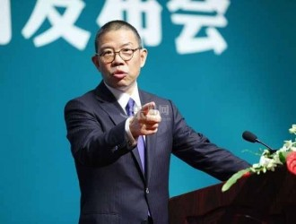
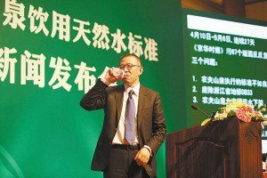

<!-- # 第七十九期：农夫山泉有点悬？ -->

### “标准门”其实很简单

现在看来，在折腾了一个多月之后，《京华时报》目前的处境只能说是彻底“杯具”了。76个版面的报道从原本义正词严的舆论监督，沦为记者无知和草率的最好证据。

可是，笔者不觉得《京华时报》有什么值得同情的地方。若是作为普通消费者，确实没必要把我国饮用水的质量标准研究得多么透彻，但是作为“社会公器”的媒体，尤其是打着行使舆论监督权的旗号，自然要对报道中的每一句话保持一种审慎的，负责任的态度。换句话说，不懂不怪你，可是明明啥也不懂还要装作真理在握就是你的错了。

在新闻发布会上，《京华时报》记者在钟睒睒董事长长达一个小时的发言，详细讲解中国饮用水标准体系之后，还正义凛然地质疑农夫山泉为何执行浙江地区标准而非国家标准。这位董事长听到这个问题时脸上有一种忍俊不禁的表情。

这个标准体系真的有这么难理解么？显然不是。

**所谓标准，分为安全标准和质量标准两部分。其中，安全标准（Security Standard）是指为保护人体健康，生命和财产的安全而制定的标难，是强制性标准，即必须执行的标准。而规定产品质量特性应达到的技术要求，称为“产品质量标准”

（Product quality standard）。后者又包括国际标准，国家标准，行业标准，地方标准，企业标准等级别。**

**显而易见地，安全标准和质量标准是两回事，是不能混为一谈的。**

钟睒睒指出，瓶装饮用水的国家标准GB19298为国家安全标准，DB品质标准为浙江省的DB33383，**农夫山泉同时执行浙江的品质标准和强制执行的国家安全标准，农夫山泉执行地标，不等于只执行地方标准。**

如果你看到这里，没觉得有什么疑问的话，那么我想说，"标准门"事件的核心就是这么简单的一个问题。《**京华时报》记者混淆了安全标准和质量标准的概念，并以此为依据质疑农夫山泉的产品质量。**也就是说，媒体自己先掉进了误区，然后再带着一众未经独立思考的围观者一起跳进了坑里。

### 名誉权官司能打赢吗？

日前，农夫山泉已经向北京市中级人民法院递交了诉讼材料，要求《京华时报》赔偿名誉权损失6000万元。

关于新闻媒体的名誉权官司，在我国的司法实践中早已不算新鲜事了。北京外国语大学国际新闻与传播系教授展江对农夫山泉提起诉讼表示支持。

但是，因为我国没有新闻法，传播法之类的专门立法，因此这类案件也只能参考一般的民事侵权行为来审判。**一般认为，新闻侵害名誉权的构成要件包括以下几点：**

**

一，行为人实施了侮辱，诽谤等侵害行为**

**

二，指向特定的受害人**

**

三，损害事实的存在**

**

四，行为人主观上的过错**

下面，笔者就这四项要件对《京华时报》关于农夫山泉的报道是否构成侵权进行分析：

首先，《京华时报》的报道是否构成诽谤？诽谤，是指故意捏造或散布虚假的事实以损毁他人的名誉。在新闻侵害名誉中，诽谤一般表现为文字诽谤的形式。《京华时报》在报道中称农夫山泉（特定受害人）的水质不如自来水，而这种说法已经在浙江省质监局抽查农夫山泉瓶装饮用天然水合格率100%的事实面前不攻自破。可见报道中确实存在虚假事实。

其次，尽管农夫山泉的反应还算及时，但是其销售仍遭遇严重打击，各地均出现大量退货情况，也就是说损害事实是存在的。至于这里的过错，又有故意和过失之分。**一般侵害名誉权都要求主观上具有故意，但是，由于新闻工作的复杂性，也有可能因为采访不深入，文风欠踏实或听信一面之词等原因导致特定受害人的名誉受到侵害。**在这种情况下，新闻媒体仍然要承担侵权责任。因此，笔者认为《京华时报》的侵权行为可以成立。

不过，展江教授也提出了一些忧虑，比如担心北京方面和浙江方面出来协调，法律以外的因素起作用，最后就不了了之。在中国，这种考虑也不算杞人忧天了。又比如，涉及到大公司的名誉权，诉讼就会比较复杂，复杂在于采访相关证据的获得以及索赔金额。这些问题在将来的诉讼过程中如何解决，我们可以拭目以待。

### 自由的界限：从舆论监督到舆论暴力

农夫山泉董事长钟睒睒在新闻发布会的结束语中说：**“一个社会，任何权利都必须有其权界，并保障和尊重每一个个体的自由，尤其是言论的自由。平等对话，这不但是为了自己，也是为了社会。”**

**

自由绝对不是想做什么就能做什么，相反，如果每个人都能想做什么就做什么，那么自由也将不复存在，因为别人也将拥有同样的权
