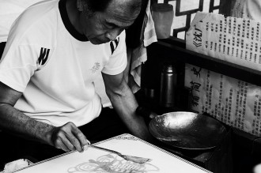
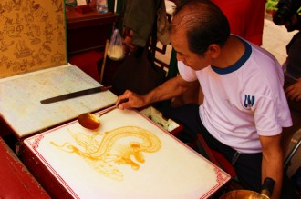
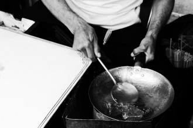
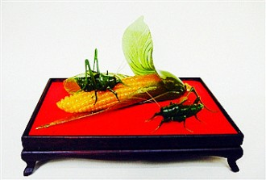

<!-- # “我卖的不是糖，是手艺”——专访津门糖画老艺人张福海 -->

老张今天中午十一点时才到自己作糖画的摊位，“今儿礼拜五，游客少，晚来点儿没嘛事儿。我都这岁数了，再起早贪黑挣钱去？傻吧？”老张一边和隔壁摊位捏面人儿的师傅念叨着，一边不急不忙的摆上自己作糖画的家什。

**_

_****_

_**_

__ _

_大家都知道古文化街有个作糖画的老张_**__**

**老张的故事还要从建国时说起******

老张今年虚岁65，是共和国的同龄人，从他开始作糖画到现在已经33年，，说起当初入这一行的原因，老张直言不讳：“没有你们想象的那么好，那时候穷，没办法，不做点儿小生意，日子难过啊。”

老张自小参加文工团，学跳舞。后来初中刚上两年，文化大革命就开始了，于是老张被动地成为“老三届”[i]的一员。没过多久，全国各大城市又开始了上山下乡运动。老张没办法，又找回文工团，软磨硬泡下，文工团收了他，可不久却被对调[[ii]](file:///C:/Users/anja/Documents/Tencent%20Files/1450015895/FileRecv/%E7%B3%96%E5%A0%86%E5%84%BF%EF%BC%88%E7%BB%88%E7%A8%BF%EF%BC%89%202.doc#_edn2)到了电影院，看起来工作很体面，但事实上挣的很少，没法养活自己。“后来我就为了多挣四块钱工资，直接到磨床厂里当钳工啦！”

到了改革开放前夕，当了十几年钳工的老张日子过得依然拮据。

“四十一块六毛四”[[iii]](file:///C:/Users/anja/Documents/Tencent%20Files/1450015895/FileRecv/%E7%B3%96%E5%A0%86%E5%84%BF%EF%BC%88%E7%BB%88%E7%A8%BF%EF%BC%89%202.doc#_edn3)老张把当时的工资记得分毫不差。“太难忘啦，当时这样的工资养一大家子人可真不容易，每天早餐只花三分钱！”到了八十年代，计划经济政策有所松动，老张便开始琢磨着挣点“外快”。想起小时候自己家门口捏糖人儿的很受欢迎，老张便开始琢磨起这门手艺，后来便有了这个“糖画张”。老张说开始时卖糖画只能偷偷摸摸的，“单位还不允许职工做生意呢，一发现就开除啦！”一口熬糖稀的小锅，一个小火炉，一块大理石，一个勺子便是老张当年走街串巷全部的家当。只是当时的老张也没有想到，这个挣外快的手艺竟成了他后半辈子所热衷的事业……

**缘起于明**

糖画具体出现的时间已不可考，但据老张说糖画最初叫糖皮影儿，创始人是明代神机妙算的刘伯温。[[iv]](file:///C:/Users/anja/Documents/Tencent%20Files/1450015895/FileRecv/%E7%B3%96%E5%A0%86%E5%84%BF%EF%BC%88%E7%BB%88%E7%A8%BF%EF%BC%89%202.doc#_edn4)据说当年朱元璋夺得天下后要杀功臣，刘伯温早有预料，便逃到民间，扮作一个作糖画的手艺人，之后便以此为业，直到终老。糖皮影儿的技术就此传了下来，又经后人发展，画中形象不断增多，小说戏曲中的帝王将相，小孩儿喜爱的鸟兽虫鱼也成为糖画中常见的形象。

老张说他对糖画的起源一点儿都不在乎，“书上说是书上说，哪个时期开始的有嘛关系，我们这些做手艺的只知道当年的老祖宗们发明这个东西不容易啊，现在什么书上说的什么历史啊内涵啊都挺好，其实哪儿有他们说的那么光荣那么轻松？”老张举了个例子“早些年画糖画儿时谁给钱啊？没人给钱，给双穿破的旧鞋，就能换两张糖画儿！”。“也就比要饭的强那么点儿罢了”老张不停地强调这句话，。

_

__正在作画的老张_

“在津门的手艺行当里，我这糖画的技术算不上精巧，就图一乐呵。但整个津门地区把这门手艺叫糖画，还是打我这儿开始的。”老张一边画着糖画，一边介绍。据老张讲，作糖画手艺的精髓在于“画”上，一把满乘金色糖稀的勺子便是画笔，靠不断流下的糖稀作线条，手臂缓缓移动，勾勒出各种形状，与沙画的原理大致相同。在旁人看来用糖稀作画简直不可思议，但在老张手中，勺子似乎是活了一般，腾云驾雾的飞龙、顺流而下的船舫，无论是活物还是静物，普通的糖画在老张的手下不到五分钟便可跃然而出。少顷，汉白玉石板上闪着光泽的“糖稀”渐凉渐干，粘上一支竹签，轻轻一撬，一幅甜的腻人的糖画便活在手上。老张说作糖画没有纸上作画那样有色彩、焦点这些讲究，但它难在一气呵成——从第一滴糖稀落下便不能停止，中间不可能有思考时间，不然几笔之间相隔时间过长糖稀的凝结程度就不一样，成品在拿起时也就难以保持形状了。

在老张看来，画糖画最重要的便是轮廓，其技巧无非“手稳，画准”四字，但老张却是在这四个字上研究了几十年。“别看画糖画是手工的技术，但是要想把这个四个字练好，就跟学知识一样，悟性太重要了！没了悟性，就算手能稳稳的画出来，但是画的速度不一样，造型最后也不同，人们看的效果就更不一样了。譬如说画一只公鸡，就算两个高手最终画出的线条大致一样，区别往往就在公鸡鸡冠那一笔上呢!”

老张几十年来不仅将作糖画的手艺锤炼地越来越精妙，也创造出不少新的糖画技巧。“我刚开始作糖画时没事儿就在铁锅上煮糖稀，想着用不同熔点儿的糖做一些新东西”。经过三年的摸索，老张终于研究出自己的“独门秘籍”——立体糖画。老张起初最得意的立体糖画是一个蟑螂，“我那个蟑螂，风吹须动，可须就是不断，人们都叫绝呢！”说到这里，老张表现出采访过程中少有的兴奋。“做立体糖画比平面的难多啦，要三口锅一起烧，火候还得把握好，哪一口锅稍微热一点儿或是凉一点儿，都得熄火重做呢”。据老张讲，一次为做一个糖画竹笼，他硬是一夜没睡，“做一个笼子比做蟑螂要难得多，先要在石板上画好，画的时候比例尺寸一点儿不能乱，不然沾不上。面儿上画出的东西拿起来沾时也麻烦，平面与立体之间差别太大了。”而正是以这个竹篮为基础做出的作品《竹篮龙虾》，让老张在第二届天津民间艺术节上再获金奖。

**卖糖画儿卖的是手艺，不是糖**

老张现在在天津著名的文化景点古文化街卖糖画，但让老张不高兴的是，现在看他糖画的人们往往只看重钱，而不是他的手艺。老张说他现在出售的最贵的糖画是一条半米长的糖龙，卖60块钱。但好多过往的人常常念叨“这么一个东西就能卖60？太坑人了！”老张每次听到都很不高兴。一次趁游客少时老张自己画了一条糖龙，画好后随手送给了一个从摊子前经过的年轻人。年轻人很惊奇，一边吃着一边看老张给后来的游客作糖画。看老张画了几张后，年轻人硬是要塞给老张一百块钱，不停地说着“师傅，我谢谢您送我这一糖画，但我不能白要，看了这么半天，我觉得您这手艺就值这么些钱！”老张最后也没收那一百块钱，但这件事儿让老张很高兴“还是有人看重我的手艺的，这我就高兴啦！”

老张说他在八十年代刚开始学糖画时他的糖画卖一毛钱一个，不仅因为那时候物价便宜，也是因为自己初出茅庐，觉得自己的手艺就值那么些钱。但那时老张一天能卖200个糖画。老张说他后来钻研了几十年，每天盯着糖锅找合适的熔点，又自己研究出立体糖画的画法，如今才敢卖现在这个价钱。“我觉得我这手艺值多少钱我就卖多少钱，你说我都65了，孙子都上小学了我还能只在乎钱？这手艺不说别的，就是一分价钱一分货，我心里值多少钱它就卖多少钱。”说这话时老张有些激动，脸上表现出少见的坚决。

老张2004年参加了中华民间艺术博览会，并取得博览会金奖。之后老张又获联合国教科文组织授予的“民间工艺美术大师”的称号，今年还被收录进中国文联编撰的《中国民间艺术家荟萃》，诸如此类的大奖小奖近些年没断过。记者看过厚厚的一叠获奖证书时后问老张为什么不把这些证书挂到摊位前作广告。老张摇了摇头，说：“靠手艺吃饭呢就得在手底下见真章，这些虚名什么的，没嘛用。卖糖画儿我卖的是我的手艺，不是糖。”

**不挣钱的手艺，现在谁还干******

老张没收徒弟，问起原因，老张想了半天，叹了口气，说：“以前的时候啊，师徒关系就是另一种‘父子’关系。但是你看现在的社会，谁不往钱看呐。你说我收一徒弟，他能跟以前的徒弟一样跟师傅一条心吗？世道变啦，人心也变啦！”说完这句话老张沉默了一段时间，又说到：“不过要是谁现在给我交学费来学这门手艺，我倒是愿意教给他。至少最后如果真的散了，不伤人不伤己。这样不省力，但省心”。

问起老张怕不怕自己研究了半辈子的技艺会失传，他脸上一副淡然的表情“失传就失传了，刚才你说我这糖画算是民间艺术，但是再好的艺术得有物质基础啊。没了钱，养家糊口都做不到，谁还愿意干。现在的糖画就属于不能养家糊口的，哈！等过了几年，人们想起这门儿手艺，觉得它有价值，想起来了就又去干了。我的手艺会失传但糖画这门手艺断不了。”

“可到了那时这您大半辈子研究出来的绝活却没人再会了！”

“没了也就就没了，刚才也说了，糖画这东西是外行看门道，在你们看来只要画的像就完了，谁还追求其他东西呢？谁还能跟我似的，玩儿小孩子吃的耍货[[v]](file:///C:/Users/anja/Documents/Tencent%20Files/1450015895/FileRecv/%E7%B3%96%E5%A0%86%E5%84%BF%EF%BC%88%E7%BB%88%E7%A8%BF%EF%BC%89%202.doc#_edn5)玩儿个半辈子？”说这话时，老张一脸淡然。

_老张用了十几年的铁锅最近多出不少毛病_

据《民俗学概论》一书中介绍，“古代民间手工艺出现的首要目的便是解决百姓衣食住行等物质生活的需要”。但在当今社会，随着物质的充裕，民间手工艺的物质需求在被不断地削弱。因此在民俗学的研究中，钟敬文、乌丙安等众多学者始终认为重视民间手工艺的精神价值才是保护民间手工艺的关键所在。但在老张看来，现在古文化街，从游客到手艺人都是只问价钱，不问价值。“买东西的浮躁，做东西的也浮躁，时间一长，这手艺里有什么精神价值，谁管它”。

老张说他和天津所有老手艺人始终都有一个心愿，就是希望自己的手艺让大家喜欢。他认为传统手工艺只是一种街头的市民文化，真要像搞学术那样正襟危坐地去研究，进了大雅之堂，这些手艺就不“活”了。老张说：“所有民间手工艺都得扎根在老百姓中间，给老百姓带来快乐。让平头百姓觉得这门儿手艺值得人家去尊重，这才是传统手工艺发展的根本。”

老张这些年发现随着一些老艺人的逝去，身边像他这样因为热爱才做手工艺的越来越少了，现在大多数人做东西只求卖钱，不追求手艺的精妙。但是老张也知道，传统手工艺之所以受到人们喜爱的原因还是在于手艺人的精雕细琢，传统手艺更不能仅仅靠政策帮持和商业的运作来保存，要让传统手工艺等非物质文化遗产更好的被继承，需要的是通过手艺唤醒人们对历史技能和古代传统的敬意。

老张说他有一天问自己上小学的孙子愿不愿意跟着他学作糖画，却没想到孙子脱口答道：“我才不学作糖画，我以后要当公务员，挣大钱……”

(记者：李卓；责编：郑萃颖）

老张获奖作品：

[caption id="attachment_38537" align="aligncenter" width="330"]

《玉米蝈蝈》获第六届中国民间文艺山花奖[/caption] [caption id="attachment_38538" align="aligncenter" width="330"]

《竹篮龙虾》在第三届中华天津民间艺术精品博览会中再获金奖[/caption]

*

* *

[i] 中国大陆1966——1968三届初、高中毕业生，合称老三届。老三届学生出校后基本都成为红卫兵。后经历上山下乡运动，多是到了[新疆](http://baike.baidu.cn/view/138069.htm)，[东北](http://baike.baidu.cn/view/16740.htm)[北大荒](http://baike.baidu.cn/view/24675.htm)，[西南](http://baike.baidu.cn/view/310055.htm)[西双版纳](http://baike.baidu.cn/view/19773.htm)，内蒙等边疆地区垦荒。

[ii] 对调工作，大概在上世纪70年代中期兴起。夫妻两地分居、远离家乡的人，在城市某个特定的地方：电线杆、树上贴上自己的对调启事，留下联系地址，等人来找自己。双方单位性质一样，就可以写对调报告，经审批后，就可办理手续。但审批也很麻烦，要审查对方的家庭出身、政治面貌等等。

[iii] 据记者调查了解，这样的工资水平在当时的天津对于三口之家来讲属较贫困家庭。

[iv] 据《明史·刘基传》载，刘伯温虽数次告老还乡，但从未有出逃一说，况刘伯温二子乃当朝大吏，更不可能有独自出逃的可能。但民间各类手艺、行当常有关于自己手艺的传说，如为商者常以关公为其神佑。种种传说其因大多众说纷纭，难以考证。读者在此不必追求史实。

[[v]](file:///C:/Users/anja/Documents/Tencent%20Files/1450015895/FileRecv/%E7%B3%96%E5%A0%86%E5%84%BF%EF%BC%88%E7%BB%88%E7%A8%BF%EF%BC%89%202.doc#_ednref5)

天津方言，即玩具。
