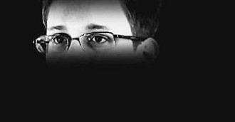

<!-- # 第四十一期：谁来维护安全、谁来保护自由？ -->

**事件回放：**

2013年6月，美国前中央情报局（CIA）雇员、现国家安全局防务承包商博斯公司雇员爱德华·斯诺登经由英国《卫报》和美国《华盛顿邮报》自曝身份，承认他揭露包括“棱镜”项目在内的美国政府多个秘密情报监视项目，说自己无惧无悔。斯诺登告诉《卫报》记者：“我愿意牺牲一切的原因是，良心上无法允许美国政府侵犯全球民众隐私、互联网自由。我不想致任何人于危险之中。”此后斯诺登逃离美国，藏身香港。

美国政府以安全为名对公民进行的情报监视，是对自由主义的原则的违背、还是为保护自由做的努力？在国家安全问题上我们也需要不断削弱政府的力量吗？在这一问题中，新保守主义和奥派的观点谁对谁错？本期七星视点，为你呈现两方观点的交锋。

**郑浩：从“棱镜计划”看国家对个人自由的威胁**

“1995年，盖勒普调查发现，39%的美国人认为联邦政府规模和权力过大，以至于产生了对普通公民自由和权利的直接威胁。而去掉‘直接’之后重新调查，结果变成52%。”这段材料引自大卫鲍兹经典著作《古典自由主义》的第一章开篇。

我们从1995年回到2013年6月。斯诺登的泄露美国安全计划的事情发生在中美两国元首会晤期间，一经披露就引起世界哗然。美国政府的“棱镜”计划到底意味着什么？针对国安局向网络公司索取公民的私人信息问题其实已经造成对私人权利的一种侵害。美国政府打着反恐的旗帜所做的已经事情，早已对当初建国的国父们的初衷形成一种破坏。

斯诺事件的发生只是美国政府权力侵害私人权利的冰山一角，而关于斯诺究竟是英雄还是叛徒的争论其实也很容易理解。我们生活在现代社会，**有人借用权利让渡谈论权利保护，而这种私人权利的让渡究竟多少合适，标准确是由政府来决定，这本身就是一件荒谬的事情。**

现在的美国政府已经变的越来越大，以至于强大到威胁人们的自由。从赫尔姆斯（美国共和党人，1973年——2003年担任北卡罗来纳州参议员。1996年担任参议院外交委员会主席，主导通过制裁与古巴有生意往来的国家和企业）到杰西·杰克逊（美国著名黑人民权领袖）都试图将他的道德准则施加给两亿五千万美国人。

很多的自由主义者忘记了自己所信仰的事情，认为政府可以很理性的保护人民的安全和自由。**美国的开国元勋本杰明·富兰克林说过：准备用自由换取暂时安全的人们，既不配得到自由，也不配得到安全。**有些美国例外论者对监听的认可有种不愿承认现实的心理在里面，为了维护自己心里＂美国是自由主义天堂＂的幻相，而放弃了护守自由主义所必需的诚实。历史学家保罗·约翰逊在他的著作《现代》中写道：对多种形式的集体主义的幻灭仅仅是一个方面，其背后是更深层次的对国家善行的代表的信念的破灭。国家是二十世纪最大的受益者，也是最大的失败者······于此相反，凡尔赛合约时代，大多数知识分子相信扩大的国家政府将会带来人民整体的幸福程度的增加，而到了二十世纪八十年代，除了一小做狂热分子之外，这种观点基本没有人相信了。政府不断被证明是一个挥霍无度的花钱者，一个超级败家子。国家政府也被证明是最大的杀手。我们为什么有理由相信政府通过监视我们的电话，我们的邮件是在保护我们的安全？

为了保护权利，人们建立了政府，但政府是一种危险的制度。正是基于这样的原因我们才对斯诺登保持一种敬畏。阿克顿勋爵说：权力产生腐败，绝对权力产生绝对腐败。而一些人却相信美国政府官员会比其他的国家做得更好。而这种人我们可以称为“美国例外论者”。在斯诺登曝光美国棱镜计划之后，他们的论调变得政治正确，他们认为美国监听项目是正确的，而为斯诺登辩护则变成为恐怖主义背书。恐怖主义和杀人犯固然是十分的可恨，而且他们也应该受到惩罚。**但是借助政府的手去监控和获取信息却是十分低效的途径。**

美国国安局长极力为棱镜计划辩护，声称该计划帮助政府成功挫败了十余次恐怖活动。然而事实上9·11发生前，美国情报机构早就已经零碎地掌握了大量有关“基地”组织的情报。其要点包括，1998年肯尼亚和坦桑尼亚美国使馆受袭事件，1995年在菲律宾发现的有关恐怖袭击的计划，2000年科尔号军舰受袭事件等一系列征兆。此外，本·拉登和扎瓦赫里的情况美国情报机构都早就掌握。并且，之前联邦调查局纽约办事处的负责人约翰·奥尼尔（John O'Neil）及其领导的I-49小组也早就紧密跟进了有关“基地”组织的动向。可惜的是，奥尼尔在情治机构内不受重视，因其个性古怪而仕途不顺，其情报活动也受到官僚机构的掣肘。2001年911当天，奥尼尔死于恐怖袭击之中。这一段历史事实由美国记者劳伦斯·赖特（Lawrence Wright）详细周密调查后，撰写为《巨塔杀机》一书。作者调查了数百位相关人员，查阅了大量档案和卷宗后发现，正是冷战后美国对新的国际形势的迟钝，官僚机构特别是情报机构不能适时作出调整，并有效配置资源，导致了在获得大量有效情报后竟然无法加以整合，并作出有效研判。**问题主要不是出在缺少情报，而是出在情报工作效率低下。**《纽约时报》在今年四月报道说，大部分国内恐怖主义阴谋事实上都是联邦调查局精心设计和推动的钓鱼式行动。根据报道，“在911过后美国本土上的22件最可怕的恐怖袭击计划中，有14件都是钓鱼式行动。

美国联邦政府绝非天使。政府在它最好的时候都是一个祸害。此语出自美国革命的灵魂人物潘恩的《常识》。许多将维护美国联邦政府大规模监听视为政治正确的人都忘记了这一谆谆教导。**为美国政府的大规模监听计划辩护的理由都是十足的功利主义和结果论逻辑。认为只要有效果就可以干，这等于是以目的证明手段之正确。如此看法就是放弃自由主义的正当性底线。**这些人并非不知道自己是在狡辩，因此他们开出了一个更加可笑的理由——美国是自由世界的柱石，它的政府为反对恐怖主义和暴政进行监听便是正当的。自由主义是普世规则，既要用来量非美国家，也要用来量美国本身。美国绝不应该是自由道义的例外者。

我们理解美国曾受到的恐怖袭击伤害，也理解因为这种伤害而做出的过分反应。但我们同样不要忘记，任何动机都可能被利用。美国的宪法是依照《独立宣言》中建立一个适合自由人民的理念而写成的。他所遵循的原则是个人拥有自然权利先于政府的建立，政府的一切权力均来源于个人为了保护自己的权利而授予政府的权力。国父们审慎的列举了联邦政府的权力，并且我们可以看出美国的联邦党人一开始就表现了对权力的不信任。

而斯诺登正是一个爱国者，一个坚定的自由者，他信奉的是宪法爱国主义，是公民对现代民族国家普遍确立的关于平等自由权利的宪法原则的认同和忠诚。面对国家，面对政府的时候，不要忘了“老大哥，正在看着你”，你就不会忘掉《1984》，就会记着自由的可贵。

**张舸：为干预主义的辩护**

有一些自由主义者们认为，对政府能力的削弱是约束政府使其不致为恶的关键所在。将这个逻辑推广到国际事务上，那就是要坚定地削减武装部队直至其无力抵抗侵略，当然更加无力干预别国的事务；以及，反间谍的活动毫无疑问是对本国国民自由的侵害，所以这也是不可接受的。

逻辑上这是一贯的：如果将政府视作“必要的恶”，那么在这个必要的范围内，政府的职责当然是越小越好。然而政府本身又是倾向于自我扩大的，所以要控制政府，就非极力约束其能力不可。自由的社会来自于自由的公民，而不来自于政府的力量。

然而，我们时代的现实政治，从来没有这么简单。**一百年来，自由世界是一贯地经受着种种形态的极权主义的威胁。这种威胁并不仅仅来自直接的军事入侵；这种威胁更多时候体现为来自自由世界内部的对自由世界的自我保护能力的削弱。讽刺的是，这种削弱之所以成为可能，正是由于自由本身。**

60年前，一场争论曾经深刻地挑战了保卫自由世界的措施的根基。当麦卡锡参议员不论是由于对自由的热爱，或是由于某种政治上的野心，而（并不是全无根基地）指控众多美国政府雇员参与了共产主义者的阴谋时，相关的证据由于政治上的原因被政府封存起来。由于证据的缺乏，麦卡锡的指控终于扩大到捕风捉影。这招致了强烈的反弹。在此后数十年间，主流话语将麦卡锡的时代指责为恐怖迫害，清白的公务人员因为这些无根据的指控而蒙冤，高级官员哈里·怀特（这个克格勃间谍！）因为“伪证”带来的压力而心脏病身亡。而杜鲁门时代针对共产主义者颠覆活动和公职人员审查的法令，则被看作是对民主政治和个人自由的破坏，而非处于国家安全的需要。从此，麦卡锡时代成为了这样一种教训：清除自由之敌的一切努力，都将最终指向危害自由。

然而随着冷战的结束，大量关于苏联间谍行动的资料得到解密。直至这时，历史学家们才终于能够公正地理解这段历史。美国政府并没有丧失理性地迫害公民，恰恰相反，众多被指控的却最终没有被定罪的人，其行为最终被克格勃在美国的组织与莫斯科的往来电文中得到证实。麦卡锡主义并不是一种受迫害妄想者对虚幻威胁的过激反应，而是对迫在眉睫的危险的、恰如其分的自卫措施。然而，如果美国人直到认识到这一点的90年代才采取行动，我们将难以想像后果将会如何。

保守主义者当然理解抽象的、理论上的对自由的诉求。**实际上，保守主义者之所以维护传统价值，正是因为其能够最大程度上地保护自由。**然而也正因为对自由的审慎，保守主义者更加不会相信，某种被设计出来的政府形式会更好地运行。人类社会的发展，使得社会越来越复杂，存在的事务越来越多。如今，美国总统所具有的权力无数倍地超过一个罗马皇帝，然而没有人能够认为罗马人比美国人更自由，因为一种复杂的、长期演化而产生的政治制度，确实有效地约束了这种权力的使用。

**既然如此，在一个良好发育的代议制政体中，呼吁对政府权力的约束当然是正当的，却并没有多大价值——这种权力本来就并不面对多少失控的风险。**另一方面，政府是否能够适当地履行维护自由的职责，往往是更加值得关心的。既然有了充分的约束，那么要求政府更高效地保护民众，保护自由世界，就是一种完全合理的诉求。

在历史上的很多时候，如果国际干预能够更及时、更有效，就能够避免很多灾难。美国在波黑事务上拖延了四年，在索马里付出了相当小的伤亡便放弃了，在科索沃也几乎临阵退缩。科索沃的事情，是美国保守主义者的耻辱：由于冷战遗留的地缘政治思路，他们竟然在国会引用越战时的反战诗歌！所幸这次干预并没有被拖延太多。

一种意料之中的批评是，对敌人的过敏，是导向极权政体的重要因素。的确，纳粹的出现正是对此的一个证明。我并不希望在这篇文章中倾向施派的观点。然而应当指出，**防止极权政体的产生，并不是依靠软弱无能的政府，而是依靠广泛的地方自治和分权。**另一方面，盎格鲁－撒克逊语境下的“昭昭天命”，和日耳曼语境下的“生存空间”，其含义也截然不同。难道可以因为一种并不确实的危险，在确实的危险面前解除武装吗？

令人惊讶的是，有一些自由主义者认为，对自由的追求本身就足以保护自由世界免受极权主义的破坏，而约束政府的干预行为，就能从根本上消除恐怖主义的威胁。所以监督政府而放任极权主义、恐怖主义竟然是一种好的平衡。那么你们是想要在古拉格还是在夹边沟实践你们的自由理想呢？

**自由并不是一种想像，自由是在我们这个并不美好的世界中的一种充满了妥协的实践。**如今，那个最大的极权国家已经成为历史了，然而某几个“大国”取而代之地扮演着一种威胁性的角色。在这样的时候，干预主义仍然展现着对“Freedom is not free”的一种诠释。回到“棱镜”上来，如今披露的资料显示，美国政府的监视行为，仍然是在正当程序之下。这种监视并谈不上如何“侵犯自由”，而纵使其使人产生了隐私受损的不适感，我仍倾向于认为这是时代的发展造成的政府权力的自然扩大，从而引致的困难。所以这一事件并不足以挑战保卫自由世界的正当性——为了自由，人们确实可能需要付出代价。

**编辑小结**：从两篇文章看出，郑浩的观点有二：政府权力的动用必然会产生对自由的威胁；政府监控信息、搜集情报是低效的。因此让渡自由获取安全的理由不能成立。张舸的观点则认为自由本身对自由的维护能力有限，现实中的自由是一种妥协；美国的政治体制已经让政府权力受到了制衡，因此可以相信它对部分权力的运用。小编以为，动用政府权力是一件很坏的事，但我们还需思考，其他办法是否能做得更好呢？任何手段都有其成本和收益，在现实政策的分析中，当我们从理论上思考完如何保证自由后，还要看到现实中种种复杂因素，在现有的约束条件下选择最优的方案。自由应是一种可实现的理想，而不只是一个梦。

（编辑：张舸，郑浩；责编：刘迎）
