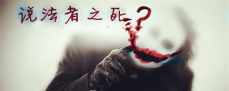
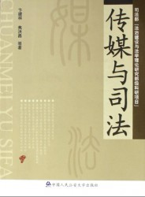

<!-- # 第八十八期:说法者之死 -->

有一条线，从2010年药家鑫案和李启铭案开始，慢慢延伸向下。从东莞女生厕所不幸身死引发的讨论再到强制引产案件中受害者是不是故意骗取赔偿，从寝室投毒案再到朱令案的追凶，从盗取车辆致使婴儿死亡的案犯再到厦门公交车案的犯罪者。

说法者、旁观者、媒体，每一个案件似乎都成了一个战场，三方在此处展开了战争，忙着站队，忙着拉帮结派，忙着谩骂。我曾经也是这战斗中的一员，为了舆论的发酵而加了一把力。直到今年，我才真正开始思考这样一种讨论的方式是否正确。当我写《愿意换票的人》的时候，因为表达了不要故意质疑公权力的观点而被读者骂成五毛。当我采访关凯元，做了他和孔庆东先生诉讼争议的文字访谈后，微博上又充斥着我是所谓右派走狗。

是不是所有的事情都要有左右之分？是不是一个意见发表后，总要被贴上公知或者毛左的标签？是不是一件事情总是非黑即白？为什么一个案件出来后，最终都变成了左右之争？为什么最终都没有人愿意再回到法律上，从法律的角度去回答？说法者呢？他们为什么不再发声？

我受够了这些疑问，我只能穷尽自己少得可怜的智慧，试图为这些问题作出回答。 

一、围观者的立场

围观者面对案件的时候，是天然带有立场的，左右之分的政治立场。他们接触案件的途径分为两种，第一种是社交平台上的活动者，第二种是媒体报道。当他们围观者借由微博账号或者人人账号登陆了社交平台后，通过自己所关注的人得到一个法律事件的讯息后，实际上自己已经对接受的讯息做出了政治判断。我在此以微博上尤为著名的两位法律人的微博为例。

首先是贺卫方先生。他最近发布的一条微博为：“【无宪政，尽贪官】1986至2011年间，刘志军利用担任从铁路分局党委书记到铁道部部长的职务便利，先后非法收受财物共计折合人民币6460.54万元。【微评：从25年前就贪腐，其间媒体公开报道过他的腐败么？人大可对他进行过监督？反贪局可做过调查？一路腐败，一路升迁，谁该为此负责？】”

其关注者对于这一条微博的关注点会集中在“宪政”、“贪官”、“贪腐”、“监督”、“责任”这几个词语上。刘志军案件的审判通过词语组合后，会得出贪腐是由于无宪政无监督的结论。而关注者由于贺卫方老师一向作为敢于抨击社会不公的形象，天然的就带有类似情绪，在此下属微博的评论中，多次出现了“体制”，“腐败”，“罪恶”等表述。于是刘志军案经过关注者的转发和评论后，在自身右派思维占据主动的条件下，会转化成对于体制问题的讨论和批评。

微博上另一位活跃的法律工作者，同时又与贺卫方先生隐隐立场矛盾的，则是吴法天先生。他最新的一条微博是“今天上午，砍伤三位老人的叶海燕拘留获释，有群众在其住宅附近拉起条幅谴责，并要求其赔偿损失。@北京青年报

微博称这是“围殴”，并担心这位民间女权维护者将来路在何方。作为社会公器的媒体，为什么对被伤害的三位老年妇女不闻不问，却把嚣张的伤人者称为维权者？媒体为何要给冲撞法律者站台并造神？”

作为吴法天先生的关注者，如果本身已经具有左派思维，所以关注的着重点在“谴责”、“公器”、“嚣张”、在吴法天先生的引导下，很自然的会将叶海燕理解为一个用维权身份当做掩护实际嚣张犯法的人。而在吴法天的此条微博下多次出现了“造谣死全家”“公知就是蠢”“婊子”等字样。叶海燕的案件也自然的就引向了对“公知”污名化和反谣言。（注：上文所得出的结论为我对评论者本人征求同意后询问得出，采集了对话样本及微博样本分析）

假如围观者自身已经有了对自己的政治定位和政治倾向，在法律工作者对于案件的评论引导下，很容易就走到了站队的程序中。而也正是这样一次次的站队，使得一个法律案件走出法律讨论而归为左右两派之间的争吵。

同时，围观者的自身学科限制也导致了他们对于案件的认识无法上升到法律分析的层次。这并非是学科上的歧视，而是我国法学教育的现实原因。正如我的导师沈建峰先生曾经和我说过的，实际上法学教育仍然是所谓的精英教育，由于我国法典条文化等因素，对于一般的普通人来说，并不知道有期无期死缓的区别，他们也并不明白犯罪的构成，这不是他们的错误，而是因为法律本身就是具有专业性的学科。你不能期望一个没学过建筑的人，凭空给你造出一栋高楼，做法律分析也是如此。也正因为这个原因，非法学专业的围观者更容易被自己所关注的“知名人士”所引导。比如在强制引产案件中，受害者怀孕八个月的胎儿被强制引产，微博名人“染香”就发表了言论认为实际上，受害者知道自己肚子里怀的是女孩，她是故意炒作自己好博取同情，好能够得到赔偿。由于许多围观者并不了解计划生育及执行的政策法规，更不知道大月份婴儿引产的危险性，那样的话，受害者是拿自己的性命和那少得可怜的金钱博弈，所以依然盲目的相信了这个有数十万粉丝微博账号的观点，并进行了转发评论。

不需要任何人去做任何分析，围观者天然便做出了判断。

立场和学科的局限性，至少在我看来是无解的，我只能提出原因，但没有任何办法解决上述问题。

二、围观者的行为

对于围观者来说，一个案件发生后，许多人喜欢做的一件事情就是自己充当福尔摩斯。这样的情况以厦门投毒案和朱令案尤为明显，围观者在法院未曾审判或公布判决前就声明某人是犯罪者。这样的行为一度引起了学者的注意，有些人觉得围观者的行为违背了有罪推定的原则，有些人觉得这是现实在倒逼司法。

下面我就以网络社交中的“全民破案”为切入点进行阐述。（下文所写段落为本人《你好，朱令》中的观点，现摘要如下）

一般来说有罪推定就是指某人未经司法机关审判有罪，就被推定为犯罪人。可以包括两种情况：一是未经司法机关依法判决有罪，一般民众对被追诉人有罪判断严重外化且侵害被追诉人的名誉权、隐私权等基本权利或者对被追诉人的定罪量刑形成消极的舆论引导。

二是在司法机关依法判决确定有罪与否以前（具体是指在缺乏证实犯罪事实和犯罪情节的情况下），公权力机关侵害被追诉人人身权利和诉讼权利或者对被追诉人形成有罪预断乃至作出有罪处理。

今天我要说的主要是第一种。

也就是，现在微博等社交工具上愈演愈烈的全民推动朱令案，到底算不算有罪推定？

反对有罪推定是正确的。但是在公民利用社交网络传播舆论时要做区别化对待。

典型例句如下——（1）“我觉得孙某可能是犯罪者，理由是……”这一句话是网络社交者的自由意志表达，是完全符合法律规定的语句。在全民福尔摩斯的时代，大多数人都是采用此种表达方式，他们往往是针对有限证据和对案件的有限了解进行的内心情感和认知的表述，既没有一口咬死孙某是犯罪者，也没有排除她的嫌疑，只是把自己的推理过程说出来而已。这是完全可行和应当得到理解的，道德纯洁犯可以居高临下的说，爷就不玩儿这些幼稚的推理游戏，可是你不能阻止其他人从事这种活动，他们既没有侵犯孙某的名誉权隐私权，也没有让孙某有什么量刑上的变化。尽管他们得出的结论有可能可笑傻逼南辕北辙，但这是他们的权利。（2）“孙某一定是犯罪者，因为……”这一句话就包含了较为明显的有罪推定含义。对于大多数朱令案的围观群众来说，这一句话表述出来就有可能承担一定的风险，尤其是“因为”之后再夹杂了众多的诽谤揣测谣言侮辱之后。你可以表示对于孙某的怀疑，但是你最好不要一口咬死孙某一定是犯罪者，更不要把自己这句话做大范围的广泛传播。对于一个普通的围观群众来说，公安机关的调查证据和材料，你是根本接触不到的，你所能够有的仅仅只是网上的不全面信息。藉此得出的结论，荒谬不可信是难免的，你可以把自己当做一个智商极高的侦探，但是你不能把自己当做有权定罪的司法机关。

能够这样表述的应该只有朱令的父母和亲友。

对于他们来说，能够接触到较多的证据和材料，能够近距离的接触双方人员，能够在内心里形成比较清晰的逻辑推理基础。更重要的是，朱令作为他们的亲友，面临现在的状况，他们会形成一个自己认定的“凶手”，尽管这个“凶手”没有司法机关进行宣判。只要他们还是人，他们就会这么想。

“我的女儿（我的朋友）变成了这样，凶手应该就是……”

可以指责他们偏颇可以指责他们愚蠢可以指责他们无理取闹，但是这是生而为人的本性，是他们面对朱令时的反应。也是他们现在能做的事情。我所了解的朱令父母以及一直在网络上呼吁重启调查的贝先生（一毛不拔大师），他们的表述似乎离一口咬死孙某就是犯罪人差得远。他们更多的是在呼吁重启调查，呼吁司法公安能够重新介入。尽管一毛在这种情况下，显得比其他人更为激进，但是这也是他理所应当的表现。

我是法学学生，我深知法律的重要性。但是如果公安司法都不能找到凶手，而我的亲友又是这种状态，我会不会请黑客盗取邮件？我会不会偷偷自己调查真相？我想我一定会，我不是高尚的道德逼，尽管我知道法律是如此的重要，可是我还是一个人。我们常常在生活中看到这样的场景，法院宣布了某个犯罪嫌疑人无罪，受害者家属痛不欲生他们坚持犯罪嫌疑人就是犯罪者。觉得愚蠢，但是可以理解。所以我最后的意见是，用无罪推定来约束朱令的亲友没必要也很傻逼，即使你不让他们说出来，他们的内心也依然会有自己的“凶手”。之前有人拿“疑罪从无”来批判一毛，但是“疑罪从无”是仅限于司法机关的，对于一毛或者对于我们这样的普通人，当然可以有对某人的“疑罪”，只要这个“疑罪”不上升到“她一定有罪”就行。

所以我的观点是，围观者的“破案”行为只要局限在我之前所表述的法律范围内，就应当是值得肯定的。因为我国目前的司法现实是，许多案件发生后因为重重阻力无法得到切实的调查，更多人的关注意味着对于调查的推动更多了些促进的力量。

三、媒体

媒体的身影从没有消失。

从药家鑫案爆出“我爸是李刚”，直到厦门案报道犯罪者家庭状况以及个人成长的经历，媒体始终站在风口浪尖。

我前文说过，作为围观者，对于一个案件的接触一般是通过两种方式，而媒体的报道就是其中之一。然而说到媒体，我对于它的感情却是复杂的，它的报道往往会形成一股力量，使得司法不断前行，然而同时它的报道又时常失准，有时候甚至偏离了方向。

从正面意义而言，媒体对于案件报道会使得更多人关注案件的进程，媒体是公器，它的力量在于社会性的推动。一旦一个案件经

由它报道，就会引起人们的关注，而公安司法机关也会更加谨慎小心的对待案件的调查和审理。媒体的报道，意味着揭露，意味着监督，意味着社会的眼睛。

除却推动性力量之外，媒体还会挖掘案件深层的原因。正如之前人人网上，黄陀先生的状态和文章引起了众人的关注和争议，在面对案件背后更多当事人或者受害者的隐私时，人们害怕盲目的挖掘会导致隐私的泄露，导致更多的伤害，引发更为危险的舆论。

的确，这是一把双刃剑。就以厦门案中犯罪者的报道而言，多家媒体对于犯罪者的家庭原因和性格成长经历进行了揭露。有些人认为，这是媒体在故意制造煽情的泪水，觉得犯罪者是可怜而应该同情的。有些人认为这是一种极其危险的言论，是在鼓励犯罪者只要受到了不公待遇或者社会压力，就可以向社会报复。还有许多人引用天海佑希的剧照，说明即使遭遇再多的不公，再多的社会压力，有些人也不会走上犯罪的道路。

我认为，这的确是一个应该听取的意见。但是他们所表述的，和黄陀先生表述的并不是同一个问题。

媒体披露犯罪者经历有助于揭露案件原因。在法学教育阶段最开始的时候，法学生都会阅读法理学。里面提到法学实际上是一门技术性经验型应用型的学科。是的，正是如此，对于一个案件的发生，我们不仅需要解决，知道怎么办。还需要知道为什么。

案件为什么会发生？犯罪者为什么会做这些事情？是什么导致他走上了犯罪？这些原因都只能够从他犯罪前的家庭经历和遭遇的问题研究起。有人也许会提出疑问，那么你们法学人研究就好了，为什么非要媒体进行报道呢？其实提出这种问题的人，属于耍小聪明的糊涂蛋。一个暴力型案件的发生，难道仅仅只该被法律工作者关注？它已经上升成为了社会性的案件，值得整个社会关注和从中思考。这并不是什么要反思体制，反思政党，和这没有半点儿关系。只有傻逼会说犯罪者犯罪全是体制的问题。如此重大的暴力性犯罪，如果还不从中让整个社会警醒些，那么大家愉快的玩耍好了。

我们需要知道为什么案件会发生。

我们知道，不是体制，不是政党，那么是什么？需不需要有人知道？难道仅仅依靠龙布罗梭的天生犯罪理论，人犯罪天生是基因问题？需不需要有人发掘？需不需要有人报道？需不需要有人将它们说出来，告诉给全社会的人听听看？

犯罪者不值得同情，那么依法处理好了。

引发犯罪的诱因，不及时消除，怎么办？会不会还有另一个人。没错，我一遍又一遍的承认，有些人即使再遭遇不公也不会犯罪。但是有些人会。这些人不值得同情，但是这些人所诱发的危险不应该提前消除吗？

有谁在同情犯罪者？

同情犯罪和及时消除犯罪诱因是两码事。

只有愚蠢的人和故意装作糊涂的人才看不懂。

媒体报道出案件发生的诱因，告诉所有人，我们通过这些得以自省，法官审理案件，法律工作者消除犯罪诱因纠正错误，围观群众通过案件发生的诱因警惕悲剧的发生。

我有些不明白，如果有人看了媒体的报道天生圣母心心生怜悯，那这种人自己小清新好了，丫脑子有病，但是和媒体的报道有什么关系？我看了《进击的巨人》也没吃人啊！难道媒体不报道，这种人就不会圣母心了么？恐怕不是吧。

当然，对于媒体，我们也需要警惕。

比如它烂俗到极点的宣传。多个门户网站报道刘铁男“收集多部A片，藏着各个国家的色情书刊……”是意图通过这个反映刘铁男的生活骄奢淫逸？可是我既没从中看出骄奢淫逸，也没从中看出反映案情的信息。媒体的报道如果不围绕案情，而是抓住大众八卦好嚼舌的特点，捅出些花边新闻，那这水准也太他妈差了。

再比如报道里愚蠢到极点的法学常识，这纯粹属于写稿子的水准太差。

最值得警惕的是：舆论引导司法。

舆论引导司法并不等同于现实倒逼司法。

前者是通过舆论影响最终司法的判决方向，而后者则是司法状况出现差错，需要依靠监督力量排除。比如未曾宣判便直言某人是犯罪者，未经考证便认为某人应该适用何等罪行。如果此时司法机关做出了与媒体报道不一致的判决，是不是意味着司法机关错了？大家可都白纸黑字看着这逼应该死刑，你丫竟然敢判死缓？你绝对枉法裁判了。

比如某报曾经直接刊登“专家认为药家鑫应该判处死刑”。

还记得相关报道出来后，人人网立刻有了相关案件的投票选项。清一色的死刑。

真是微妙的感觉。

四、说法者

围观者和媒体是案件讨论战斗中的两方，而说法者却渐渐消亡了。我也不知道这是我的错觉还是现实本就如此。

法学好像年年都是就业很难的专业。但是依然有许多人前赴后继的选择了它。有人是奔着钱，有人是奔着像港剧美剧里的大律一样，但是他们心中应该还是怀揣着正义的吧。

面对围观群众和媒体的压力，谨慎的发言是说法者最应该做到的。任何一个案情，不是实地调查自己没有经受案子，都不应该妄下评判性的论断。记得去年我曾经写过小河法院的案件，那是由斯伟江等一众大律带领下的涉黑案件。一个读者在文章下留言，“我就想知道那几个人到底是不是涉黑，这文章根本没说！”

抱歉，我不能说。因为案件还没有审判。因为我不是案件的代理人。

你非要问我，我只能就程序上说些问题，或者已经证实的，明显矛盾的，发表自己的意见。除此之外，就是一个法律的逾越。当年有人就东莞女生遭受性侵死亡的案件询问陈有西，问他这到底算是（强）奸还是猥亵。陈有西的回答是：我不能说，我没有代理案子，不了解实情，没有发言权。

我曾经也挺屌逼的认为，老子法学绝对牛逼，什么案件都能分析，对于东莞女生遭受性侵的案件也曾蠢蠢欲动的发言。然而我现在却只觉得害臊。我毕竟是妄断了。我什么证据都没看到，仅凭媒体的报道，就做出了回答。

我在干什么？我在践踏法律吧。

我现在不觉得陈有西的回答不是装逼也不是推辞，而是负责。

一个谨慎的说法者，强过一百个聒噪的意见。

但是，说法者有时候也需要大声的说出来。比如谣言。

我一向最反对就案件传播谣言，我印象深刻的是李双江的儿子强奸案，一条从微薄直接搬到人人上的状态。大意是说中国有一所中国法律大学，里面有个教授说李天一应该是从犯，因为是轮奸，他不是第一个，所以责任轻。

人人网上的谭日天同学一直以钓鱼为乐，其实我觉得有些事儿说说也成，一看就是假的。但是转发这些钓鱼贴，是很扯蛋的事情。

除了法学生，没多少人专门去关注从犯责任，看到转发的人多了，有人就信了。甚至还有人私信问我，中国法律大学应该就是中政法吧。我想起可怜的罗翔老师，他如果知道这些，岂不是蛋碎致死。

法律需要敬畏。

即使你觉得中国的法律并不值得敬畏。

至少，我知道中国的刑法并不能被称为恶法。那么这样一个人类的规则，怎么就不值得敬畏。信了谣言的人，甚至会以为中国的法律就能够真的这么混蛋。

法律需要信仰，越是信仰，越是捍卫。把它说的如此不堪，又有谁去信仰？无人信仰，谁去捍卫？无人捍卫，谁去遵守？

说法者的意义，不就是这吗？

说法者很少谈主义，说法者更多谈的是实际。用自己的力量去解决案件，去排除谣言，去捍卫法律，至少还原它应有的尊严。

现在，有多少人在做这些事情？

围观者的盲从和媒体的煽风点火，把说法者逼到了绝境。非左即右的思维模式，让人无所适从。看到警察围堵，就说是暴力执法，看到李庄平反，就说是右派在攫取中国政权。

我受够了，还有人受够了吗？

怎么就没人按部就班的来呢？为什么不能跳出这样的思维怪圈，好好的说话？

从微博和人人上也看到了各种各样的观点。如果说法者越来越少，我也想装逼的做一下他们的继任者。即使毕业了，工作了，我也要说说法，指着那些不公和黑暗，装逼的骂几声，好歹不能落了自己学法的名声。江平老爷子当年在法大的礼堂里说：我就是要让他们知道，有些人还死不了，有些东西还死不了。

我也没多大的本事。我要做的，无非就是面对习惯沉默的人们，发出点儿声响。告诉他们，我还活着。

这也是说法者的宿命吧。
