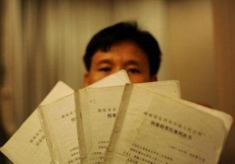

<!-- # 第九十二期：谁动了我的判决 -->

近日，南方周末连续刊发了几篇有关唐慧案的文章，在社会上引起轩然大波，在这些文章中，唐慧由之前的为女抗争，勇斗强权的弱女子形象瞬间转变为一个胡搅蛮缠，满口谎言的女骗子和泼妇。一时间，唐慧事件成为了罗生门，唐慧到底是英雄还是骗子，说法无意在此也无法在此表明态度，但是今天说法要关注的是唐慧系列案中的乐乐案的一个细节问题，上诉不加刑问题。有关的信息和理论点均基于近日南周的这篇文章——《“永州幼女被迫卖淫案”再调查：唐慧赢了，法治赢了没？》

一、何为上诉不加刑

上诉不加刑是刑诉法上一个十分重要的原则，也是各国刑诉法通行的一个原则，在绝大多数国家也都基本得到确立。上诉不加刑简而言之就是第二审人民法院审理只有被告一方提出的上诉案件，不得以任何理由加重被告人的刑罚。在我国，新刑诉法第二百二十六条规定：第二审人民法院审理被告人或者他的法定代理人、辩护人、近亲属上诉的案件，不得加重被告人的刑罚。第二审人民法院发回原审人民法院重新审判的案件，除有新的犯罪事实，人民检察院补充起诉的以外，原审人民法院也不得加重被告人的刑罚。人民检察院提出抗诉或者自诉人提出上诉的，不受前款规定的限制。可以看到，在我国如果单纯由被告人一方提出上诉，那么第二审法院将不得加重第一审法院确定的刑罚，被告人一方包括被告人、被告人的法定代理人、辩护人、近亲属。

上诉不加刑原则之所以得到确立和贯彻，它最突出的一个价值就是保证被告人的诉权，众所周知，我国的刑事诉讼是两审终审制，第二审是终审，如果对第一审的判决或裁定不服，可以提出上诉，经过二审对一审的判决裁定进行重新审核。然而，现实中，绝大多数的二审都是由被告人一方提出上诉启动的，如果被告人提出上诉有可能被第二审法院加重刑罚的话，那么被告人会有很大的心理压力，在提出上诉时会慎之又慎，甚至很有可能不会选择行使这项权利，那么这样下去，我国的二审终审制度将会受到很大的损害，甚至很有可能被虚置。所以上诉不加刑原则是两审终审制的一项保障原则。除此以外，上诉不加刑对于第一审的控审都是一种很好的监督，因为上诉不能加刑，所以会促使第一审检察院努力搜集更多的证据组成更完善的证据链，对犯罪行为进行更为精确的定性，求刑更为合理，而第一审法院也会对案件更加严肃认真负责，避免量刑畸轻的情况出现。同时，上诉不加刑也是对刑事法律中保障人权价值的很好体现。

二、重审与上诉不加刑

一直以来，在学术界有一个与上诉不加刑有关的问题被反复争论，那就是在重审时，是否要受到上诉不加刑原则的限制？根据刑诉法规定，一个案件被交至第二审法院，法院有如下的处理方式：驳回上诉、抗诉，维持原判；直接改判；撤销原判，发回原审法院重新审判。其中发回原审法院重新审判是按照第一审程序重审，所以此时，这个重审程序便具有了两重性，一方面，它是按照第一审程序审理的，理应按照刑诉法第一审程序编的有关规定进行规制，而上诉不加刑是规定在第二审程序编的，但另一方面，这个毕竟不是一审，它是二审的一个处理方式，是通过二审派生出来的一个一审程序，又具有它的特殊性。

支持重审须受上诉不加刑原则限制的学者谓重审毕竟是二审的一个派生结果，本质上还是二审，不能简单等同于一审，虽然使用的是一审程序，否则的话，将会出现很多变相加刑的情况，而事实上这种变相加刑在司法实践中屡见不鲜，很多二审法院借口案件事实不清、证据不足，发回一审法院重审，从而加重被告人的刑罚。而反对方则称根据诉讼法，我们不能必然推导出重审要受上诉不加刑限制，既然没有规定，那么重审加刑也不能被非难，但为了尽量避免重审加刑的情况，这派学者也提出了很多学理上的限制措施。

这个问题的出现应当说是旧刑诉法的立法漏洞产生的，旧刑诉法在该问题上没有标明自己的态度导致学界对此问题争论不休，而当新刑诉法出台，笔者认为，这个问题也就没有争论的空间了。

那么就先让我们来对比下新旧刑诉法在这个问题上的变化。

根据旧刑诉法第一百九十条规定：第二审人民法院审判被告人或者他的法定代理人、辩护人、近亲属上诉的案件，不得加重被告人的刑罚。人民检察院提出抗诉或者自诉人提出上诉的，不受前款规定的限制。而新刑诉法新刑诉法第二百二十六条规定：第二审人民法院审理被告人或者他的法定代理人、辩护人、近亲属上诉的案件，不得加重被告人的刑罚。第二审人民法院发回原审人民法院重新审判的案件，除有新的犯罪事实，人民检察院补充起诉的以外，原审人民法院也不得加重被告人的刑罚。人民检察院提出抗诉或者自诉人提出上诉的，不受前款规定的限制。可以很明显的看到，在这个问题上，除了新刑诉法将原190条改为第226条以外，更关键的是在原法条的基础上加了这么一句：第二审人民法院发回原审人民法院重新审判的案件，除有新的犯罪事实，人民检察院补充起诉的以外，原审人民法院也不得加重被告人的刑罚。而新刑诉法司法解释更进一步在第327条作出强调：被告人或者其法定代理人、辩护人、近亲属提出上诉的案件，第二审人民法院发回重新审判后，除有新的犯罪事实，人民检察院补充起诉的以外，原审人民法院不得加重被告人的刑罚。可见在新刑诉法环境下，除非人民检察院在重审时对新的犯罪事实提出补充起诉，其他情况下，一审法院在重审时都不得加重被告人的刑罚，新刑诉法在这个问题上给出了明确的态度，重审也须受上诉不加刑原则的限制。

三、回首再看乐乐案

上面就上诉不加刑的有关理论问题，笔者做了相关介绍，下面让我们再回到这个问题的起始点，唐慧系列案中的乐乐案。正如南方周末所言，唐慧女儿乐乐被强迫卖淫案是唐慧系列案的起点也是关键点，乐乐案历经了一次一审，两次重审，一次二审才最终定案，而我们也把目光放到这两次重审中来，看看其中有没有值得说道的地方。

南方周末最近的这篇文章里面写到：“六名被告人不服，均提起了上诉。永州市检察院则提起抗诉。……第一次重审之后，六名被告人再度提起上诉。……在永州市中院第一次重审判决后，永州市检察院除了增加对新归案的秦斌的起诉之外，并未有抗诉行为。”而第一次重审也维持了原判，而在关键的第二次重审中，只有被告人的上诉，但却最终被课以更重的刑罚。那么是否这一情况有违了上诉不加刑的法律原则呢？

其实探究这个问题很简单，只要看看这第二次重审判决做出并下达的时间就好。有了前面的讨论，我们也知道，在旧刑诉法时代，重审加刑的问题，法律是没有给出自己的态度的，即使加刑了，虽然有可能是变相加刑，也不能受到法律的非难，因为刑诉法没有明确的制止此种行为，而在新刑诉法颁布并实施后，这个问题就有了明确的法律规定了，再变相加刑就属于违反刑诉法的行为了。

还是回到这篇报道上来，我们可以看到这么一句：“永州市中级人民法院被迫于2011年3月28日下达（2010）永中刑一初字第55号判决……这是永州中院下达的第二次重审的判决，也是该院对此案的最后一次判决。”也就是说，第二次重审判决是在2011年3月28日下达的，而新刑诉法是2013年1月1日才开始正式实施的，所以这次重审判决是发生在旧刑诉法时代，法不溯及既往，这个判决也不能根据新刑诉法的规定而受到非难。令笔者震惊的是，该文章的作者在紧接着这几句的下面写了这么一段话：“在法律界人士看来，这违反了“上诉不加刑”的基本审判原则。2013年起实施的新刑诉法，明确规定发回重审的案件也不得加重刑罚……”且不论这模糊的“法律界人士”的称谓，在明知道是11年下达的判决的情况下却套用13年才实施的法律（这

两点该作者都很清楚，也都写出来了），那么该作者的法律功底及逻辑思维看来仍需要加强修炼。

到这儿，本文的态度很明确了，在乐乐案中，有关重审是否能加刑的问题，我们是持肯定态度的。这充其量是旧刑诉法时代诸多变相加刑案例中的一个最新案例罢了，但由于旧刑诉法没有明确的禁止规定，所以这种情形在法律上是完全可被允许的。

说到这里，我们不妨再宕开一笔，根据新刑诉法司法解释第228、229条的规定：“原判事实不清、证据不足，第二审人民法院发回重新审判的案件，原审人民法院重新作出判决后，被告人上诉或者人民检察院抗诉的，第二审人民法院应当依法作出判决、裁定，不得再发回重新审判。”、“第二审人民法院发现原审人民法院在重新审判过程中，有刑事诉讼法第二百二十七条规定的情形之一，或者违反第二百二十八条规定的，应当裁定撤销原判，发回重新审判”。其中刑诉法第227、228条是有关诉讼程序性的规定，与案件事实无涉，所以如果乐乐案是发生在新刑诉法实施之后的话，那么很有可能就不会经历这么波折而漫长的诉讼程序了，现在矛盾的焦点第二次重审也很有可能不会出现了。

到此，关于乐乐案的这个问题应该已经交代清楚了，但是唐慧系列案给我们的启示其实远不是这种细节的技术性问题，在这次事件中，信访制度、劳教制度以及舆论对审判的影响才是更值得我们去司考的，信访制度、劳教制度的恶，舆论对审判施加的不恰当的影响，这些问题如何去解决，不是我们三言两语能够说清楚的，但是却是我们应当持续去思考和探索的。我们希望，在今后的案件中，法治不能输，只要法治不输，就没有人输。

后记：

我觉得这个案件其实可怕的根本不在于曾经法律漏洞带来的后果，而是靠一人之力撼动了法治，看到报道上说：在今天的中国，有影响力的网民层出不穷，其中也有人往往严重缺乏法治精神。他们在社会生活中往往奉行两大信念：第一大信念叫做“公权力对抗者绝对无错”，他们选择无条件站在公民个人一边。第二大准则叫做“正当者通吃”或“受害者通吃”，这条准则适用于他们评判平等主体之间的关系，这些人往往公式化地认定，在平等主体之间发生冲突时，有正当性的一方权利无限，可以向相对方提出无限要求。

还是需要时间一步步的前进吧。

——胡逸娴

（编辑：林骥；责编：林骥）
