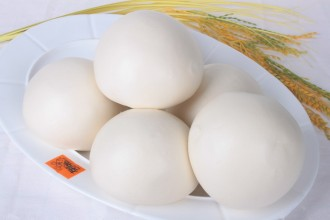

<!-- # 馒头之思 -->

对于我来说，最解乡愁的食物，不是什么面条水饺，也不是白米饭，而是馒头。古人有莼鲈之思，可西湖的莼菜和鲈鱼虽鲜美诗意如画，却隔了一层。在我的胃和味蕾寂寞孤单之时，最好的解药，或许就是这么个听上去就敦实温厚的馒头。

馒头是属于北方人的食物，更确切是属于山东人。东北人吃大米，山西陕西河南吃面条，在北京我也少见人吃馒头。只有在我的家乡山东，这样一种属于劳苦大众的食物才占据家家户户的饭桌。它热气腾腾，洁白的一大个，咬上去结实又温厚，淡淡麦香在口中悠悠一转，立刻转入胃中。它不精致，也没什么特别的味道，很多人觉得它太寡淡，殊不知妙就妙在这淡上。这是谷物最本真的味道，单吃嫌寡，所以要配上那么几个家常菜，才别致有味。

我想念馒头，如同想念那种氤氲在坊间巷里街前街后的烟火气。馒头真的是朴实的食物，它从来没法登堂入室，进入稍有档次的酒店，甚至连楼下小饭馆都无它的容身之处。它只存在百姓家中的餐桌上，是夕阳西下炊烟渐起时灶上蒸的一大炉，是夜幕初降时，穿梭在厨房饭厅的母亲使唤看电视的孩子拿上一块钱下楼去买，又或者是烈日头下，健壮的建筑工人最慷慨的消费，一买就是好几斤，填满肠胃，恢复元气。山东人获得最多的评价就是“实在”，馒头就是这么一种实在的食物。它永远都不会让你失望，因为味道总不会差。它那么廉价，能慰藉许多的苦命人。它又那么敦实，只要吃馒头，很少有吃不饱这么一说。它没那么多复杂的工序，和巧妙的心思，因此最适合壮实豪爽的汉子大快朵颐，豪气干云。水浒传里的梁山好汉，肚饿时动辄叫上两斤熟牛肉，一斤烈酒，主食自然是馒头。试想如果黑旋风杀人前还要捧着一碗米饭拿着勺子一勺一勺挖着吃，或是促溜促溜地吸着几根不解饱的面条，岂不是大煞风景。

但馒头要是真干吃，的确是太寡了。干吃自然也可以，自家蒸的馒头，未出锅先香气四溢，窜动你的味蕾。端上来更是诱人，虽无外面卖的洁白，但是纯天然的麦色，是食物的本真。可不能总是干嚼，总要配上点什么。馒头的妙处就在于配丰盛菜肴或是平常咸菜都能让人充满食欲。记得高中有一段时间，爸爸从超市买了那种腌过的胡萝卜，回来用水泡一会儿去掉过多的盐分，让胡萝卜更清透爽口，然后再切丝盛一小碗，淋上些许香油，咸津津的味道立刻渗出来，就着馒头吃实在是美味到极致，胡萝卜本身那种生硬的味道完全消失，相信每一个讨厌吃胡萝卜的人都会爱上这种吃法。我当时还说以后干脆不用做菜了，每天切点胡萝卜丝就着我就能吃下大半个馒头了。另外，一小盘橄榄菜，或是几勺老干妈，又或是切一小盘香肠，就着馒头都可以吃得香甜。当然这种吃法有点太劳苦了，更多的时候是妈妈在厨房里炒几个家常菜，端出来热气腾腾的就着吃。我永远都不能接受先吃菜后吃饭的吃法，所以一大家子凑在一起的时候总有些痛苦。长辈们觥筹交错，你敬我迎，非得等喝完酒吃完菜才上主食。美味的菜肴不搭配馒头简直是对食物的一种辜负。鲁菜还是以咸鲜为主，口味较重。若是吃个糖醋里脊或滕州辣子鸡，不就着馒头简直是暴殄天物。因为味道重会让舌头和胃都不堪重负，馒头的搭配这时就恰到好处，缓冲那些过度的调料，让烈火烹油的大鱼大肉能够舒舒缓缓地卷入平实的麦香中，一起悠悠入胃。绚丽的东西不能都堆在一起，也需要一些平淡来映衬，这才是人间味道。

更寒碜的吃法是用馒头蘸汤汁。小时候喜欢这么吃，因为一道菜的汤汁有时可能就是精华所在。红烧排骨，尖椒炒鸡，风味茄子，酸辣土豆丝，番茄炒蛋，这些有汁有料的菜肴如果舍弃汤汁真是可惜，所以就用没吃了的馒头蘸着吃，很快就能清盘，还能略减轻洗碗的负担，实在一举好几得。晚餐到这里正式结束，韵味悠长。可长大以后很少再用馒头蘸菜汁，因为说起来就显得这么不高雅不体面。人经常会为了一些面子和规矩辜负自己，也辜负食物。

人家说抓住男人的心先要抓住男人的胃。以此类推，一个人思念家乡很有可能从思念家乡的食物开始。我前几天想吃排骨和火锅，昨晚疯狂的想吃五道口的麻辣诱惑，水煮鱼毛血旺小米椒爱上小公鸡和蟹黄豆腐，解决这些暂时不可能的痴想的办法就是自己动手。惊喜的是今天下午突然想起来上周去中国超市买了一盒馒头，全麦的，上面写着纽约唐人街。馒头是那么保险的食物，不像大米一样会因为米的品种不同而口感有异，有时硬的无法下咽有时软的让人反感。于是我在来到这个美国小镇之后第一次吃到馒头。坐在窗台边上，看着窗外走过的一个个美国男孩女孩，林荫浓密，夕阳斜照，我坐在床上两腿晃来晃去，抓着一个馒头，夹两口自己炒的西红柿，时间仿佛回到小学，床紧靠窗台，每天傍晚回家趴在窗台上写作业，吃两口零食。晚风吹，安静平和。

这世间有不少的鲜花着锦，有不少的钟鼓馔玉。会有很多时刻你疯狂的渴望某种精致的美食，可更多时候，你只需要这样一个养胃暖心、平实温暖的馒头。

（采编: 万若涵；责编:王卜玄）

[【半日闲】故乡食话·茄饼](/archives/40272)——许多小时候不爱吃的东西，慢慢都能接受下来，并且尝得出滋味。

[【半日闲】花事](/zh-cn/archives/40239)——花之为事, 不虚伪，不做作，充满生气，也充满矛盾,它寄语相思,也能给人捏造未来的遐想。看花讲求缘法，而我始终只是一个看花的俗人。

[【半日闲】世界的清晨/a>——老槐树叶盛满了晨光，斑斑驳驳地照花了匆匆赶路的男女，就好像精气神都被打散了，一脸狼狈。

这样的清晨，你肯不肯停留。

[【半日闲】他们是来接我的](/archives/40205)——洛阳亲友如相问，就说我已被接走
