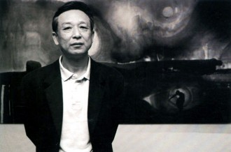
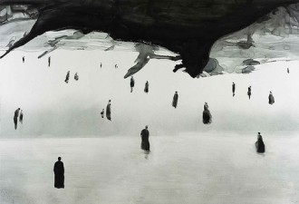

<!-- # 《灵山》：形上的流亡 -->

流亡是文学不朽的话语，从《奥德赛》到《神曲》，流亡文学为人类文明留下了诸多灿烂财富，因而勃兰兑斯在写作《十九世纪主流文学》时将流亡文学置诸卷首绝非偶然。而当文学步入“现代”后，流亡更成为主调。战火的不休与蔓延，文化的侵略与殖民，当独立思想者无法在强大的异己力量前保有自身的尊严和价值，他们要么自杀，要么流亡。无论是本雅明和阿多诺，还是昆德拉和索尔仁尼琴，他们都无不用“流亡”来捍卫了文学的品格与思想的独立。

高行健自言：“人生总在逃亡，不逃避政治压迫，便逃避他人，又还得逃避自我，这自我一旦觉醒，最终也逃脱不了的恰恰是这自我，这便是现代人的悲剧。”因而流亡又往往可理解成一种“无家可归的彷徨”。这种彷徨反映出的是这些作家们理想与现实“非情愿”的对位，其成因并非仅是原有故乡的无法生存，而更多是心灵家园瓦解与重构。

尽管《灵山》获得诺奖至今仍饱受非议，但就其文学性而言，它确实开辟中国这个历史文明古国特有的文学道路，不但重拾了汉民族诸多的文化财富，还打破了西方小说模式在行文结构、语言形式、叙事话语以及心理描写等方面的禁锢。但究其根本，《灵山》呈现出的“形上流亡”却更值得我们去观照和体认。

**一

、流亡的外沿：趋于羽化的语言流**

《灵山》实则是流亡者的自诉。小说开头显然已足以被语言规范所诟病：“你坐的是长途公共汽车，那破旧的车子，城市里淘汰下来的，在保养得极差的山区公路上，路面到处坑坑洼洼，从早起颠簸了十二个小时，来到这座南方山区的小县城。”这话尽管结构怪异，却精妙地刻画出流亡者的恍惚：坐在车上，恍惚间才意识到车况，继而才感知到路况，以及时间流逝之久。这种延迟的感知恰恰是流亡者局天蹐地的彷徨的体现。

语言与思绪的碎片化是流亡者的共性，因为一切的流亡都非出于本意，都是彷徨的。第10章中，我“啊——喂——哎”地含糊发声点破了流亡者的心乱如麻，继而“你”与“她”展开对话，立体地在语言场域里建构了自我的内在矛盾的斗争。而到了第70至72章，那些复唱、超长叙述和音调无限延长的句子，则最终透析了流亡者内心的极力挣扎与四野疾呼无果的歇斯底里，加上无休止的语流与信息流在行文中碰撞，愈加彰显出内心的混乱和迷茫。

因而，《灵山》确实开启了有别于意识流的语言流。因为，意识流是按图索骥，是读者对作者碎片化的主观心理的再拼接，并在领悟宏大心理体系背后的奇景中感知，但却仍受制于作者；而语言流更像是一种“想象写作”，尤其是连语法成份都被剥夺传统逻辑后，言说的提示也就随之消失。此时读者所做，乃是通过自身的经验和感知，甚至超验的假设对语言进行再创作，继而再对情节进行把控。这些被重新理解后的叙事更多是读者的话语，而非写者的话语。高行健在大胆地肢解了句读与语法的既定逻辑，并对各种成分进行着或有意识或无意识地拼接的同时，尽管可能破坏了文本的可读性，却规避了叙述者的“全知全能”。

尽管《灵山》的语言无法用故有的逻辑考量，因为归属传统语句的逻辑性和结构性已被破除，但这种语言流的可贵在于它不但对流亡心理进行了全面的广角呈现，而且还摒弃了自伤痕和知青文学以来的“精英意识”，将文本的阐释自由归还读者，使得语言晦涩的《灵山》较之传统叙事，具有了更强烈的“可写性”，使本是关于作者自身的历史经验“读本”，成为了真正意义上读者与写者共同“流亡”的“写本”。

**二、流亡的动机：逃向边缘的文化视野**

“寻根”是《灵山》不容置疑的表征，但其根本却是一种文化视野上的逃亡。从城市出逃的“我”奔往西南的自然山陲，这行为当中所隐含的不仅是对儒文化和道文化体用两端的争论，更是对黄河文化与长江文化二者关系的思辨。

我们不应忽视《灵山》的写作在选择长江这一文化区域上的符号意义。黄河文明一元论曾长期占据我国的历史认识，这种认识也为向心式的封建主义国家社会关系奠定了一种政治地理基础。尽管历史文物的不断出土，显示出我国政治文明的起源可能是多元的，在长江流域一带存在的多个聚落成为了冲击过去一元黄河核心的劲敌。但是随着后世政治文明的不断发展，尤其是受明清以来长期盘踞于北方的黄河文明政权的影响，政治权力却日趋向上聚拢及固化。因而，立足民间的田野调查、考古发现所长期致力于建构“多元论”的努力，终究不能促成这些早期的政治文明核心形成一种平等的多元关系，它们之间反倒逐渐演变为代表官方话语的黄河文化与代表民间话语的长江文化的矛盾与斗争。

而正是由于这种政治与文化关系上的历史延续性，我国民间话语的普遍处于一种边缘状态。尤是文革后，黄河文化与长江文化的对峙则愈演愈烈，黄河文化凭借着领袖话语和个人崇拜不断侵蚀长江文化，官方的意识形态则不断企及对知识分子乃至人民的思维封锁。这种文化的高压势必造就思想的局促，而用以教化人心的儒道则日益与社会现实相驳斥。彼时，文化形态游走于“无名”与“共名”之间，文学创作的队列俨然归于两流：一类是死守主流话语；一类则希望突破政治主题的规限，根植于权力体系外如民间话语进行创作，而倘若“想要赢得思想的自由，除了沉默便是逃亡”。因此，一心求民之瘼的高行健唯有展开逃遁，逃往民间话语的聚居地，在边缘的长江文化求索远离政治的写作土壤。

显然《灵山》的文化反制是不露痕迹的，因为以文化作为“武器”本身便是无力的。但由于《灵山》所载之景脱离“城市/政治”场域，所以又处处构成隐喻。于是就在这种“自然主义”下，高行健用逍遥出世的生命态度去求得心灵的荡涤。但他对自由的渴求不同于传统道家的“消极自由”，而是“积极自由”。同时他通过不断展现旅途中底层人民的自在状态，也表露了他渴望摒除当下处于庸俗唯物主义中的都市人的浮躁、绝望和利欲昏心的决心。

尽管高行健自嘲“成了寻根派”，但与阿城、莫言、韩少功等寻根派作家相比，《灵山》触发的不只是文化图景，还有这背后的文化隐喻。王车易位般，他隐晦地批判了将民间话语逼至边缘的文化霸权，向官方对待传统文化抱有“你放下，也就放下了”的唯政治之用的态度表达了极大不满。这种从民间文化之根精微切入，继而带出地域、政治、文化之间的羁绊，并最终到达为民间话语鼓呼正名的核心的深邃思考，使得《灵山》的“寻根”不仅是对游走在边缘的民间文化的关怀与体悟，还担当起为民间话语和长江文化回归主流文化视野的呐喊的历史使命。

**三、流亡的潜话语：以民俗为名的信仰救赎**

尽管《灵山》的其中一个意旨乃是重现失落的民间风俗，但风俗背后的神性却向官方以“科学”破除宗教的行径发出着“猗欤休哉”的反讽。高行健记叙这些的目的看似仅仅是“破除现今小说格式”，但他对所谓故事或者经历的处理显然不如莫言那样娓娓道来以引起一种集体回忆，反倒是表现出一种刻意的消解甚至超越以施行对人的信仰系统重构。

一如沈从文笔下的放蛊、嫁神，《灵山》中的“跳歌庄”、毕摩诵经、灵岩求子、雕兽头木、画符作法等在“科学”看来迷信却毫无根据的风俗，寄予着的是不同地域的人们对精神力量的理解和对善的追求。它们异于神学宗教，倒彰显着自然宗教的原始与淳朴。它们与精神统治无关，更多是一种出于对自然万物的敬畏，而全心求善的品格凝聚。

因此《灵山》描写民间风俗之余，还暗示在此当中潜藏返回上古世界形上的美好家园的信条。正如《山海经》里所记叙的那些祭祀仪式，这些尚未混合神说的信仰保有着汉文化最传统最美好的精神品质，即便它们大多倡导着因果报应、邪念怪力，背离科学，但这一切都无不求“善”，都无不期许人们能够以诚相待，以善接物。

而八十年代是大破大立人民信仰后的时代，人们的宗教信仰被所谓“物质”的科学推至边缘，强行革除。精神的虚无势必造就心灵的无畏，加之被异化的物质观，使得日益浮躁、一心追求名与利。这显然是过份物质化的信仰导向所促成的极端心态。因此这原始淳朴的民风民俗恰恰成了时代的解药，而摈弃功名利禄，回归到纯洁真诚的自然信仰中也就成为复位人们扭曲心灵的根本。

之所以称《灵山》为以民俗为名的信仰救赎，是因为其呈现民俗的目的不同于沈从文等人那种对地域文化的全景描写，而更多是希望借助地域文化的母体记忆以激活地域风俗所赋予人们的精神力量，从而人们能够凭这当下少有未被世俗化和政治化的信仰，重新找回那些遗失了汉民族品质，并以此重构信仰的空缺所导致的身心失衡。而这种精神回溯的方式则不得不说是一次关于汉民族传统文化的窘迫逃亡。

**四、流亡的内在：自我的分化与重构**

《灵山》自始便是“流亡”，但这“流亡”与政治无关，而更多是一种意识的逃亡。无论是游走在西南边陲的“我”，还是痴心寻找灵山漫不经意的“你”，其身份都是一名逃亡者——从城市的场域中逃离，继而奔向自然。这种渴望从城市中抽离的焦灼逃亡，其本质意义上与“你、我”的分离和分化是同一层面的生命形式，都是一个自我的两样分裂，都是生命内核从生命形式中落魄逃离。

流亡的起点只能是城市，因为只有城市里人心才如此高度分化。城市作为革命的策源地，漫无天日“造反”与“反造反”前所未有摧残着人的内心。自我因不堪忍受言行的高度不一而开始走向分裂，其防御机制则“压抑”本我，最终致使自我与本我割裂为二体，是为“我”与“你”。所以流亡的终点则当为自然，因为它远离城市，固然也应远离这可怕的人心。可当第10章写及迷失在高原森林的“我”的景况，总使人不自想到文革时人心的惶恐与无助。而“我”尽管已远离城市，也难逃这一心灵煎熬。于是在恐惧驱使下，“你”的无助开始引入“她”，一种用以抚慰不安的女性意识，从而使得“你”的思绪得以在这无人的自然中得以排遣。而这一引入从根本来说，是本我的彻底迷失与沦陷，亦即是心灵家园的瓦解。

于是，此后的行文便以“我”、“你”依次变换，“你”与“她”则不时交互，人物间形成了一种有趣的关系：“我”在极力地寻找失落的本我，而“你”则仍自困于旧日的怖惧难以与“我”重新结合，“她”则试图给予牵引使“你”与“我”重归一体。这种既对立又统一的矛盾关系，使三者之间形成了一种关于自我的“复调”。

然而，这流亡者的复调并非从广义的“人”出发，而是立足个体，直指自我、内心乃至潜意识，对自我进行观照和内省。它并非旨在展现心灵的彷徨与无力，尽管这种流变自是无法避免的，但这呢喃背后所蕴含的是三个“流亡”者极力渴望相互交互与对话，而非单纯地呈现荒诞与病态。例如第43章中“我”与“你”在山岭上以一种吊诡的方式相遇，便是一种试图促成“我”与“你”的重合的尝试，可惜只却因两者之间依旧存在时空的错位而擦身而过。由此可见，倘若没有“她”这一女性意识的引入对“你”施予牵引，“我”与“你”的二体斗争将长期陷入无休止的自我拉扯当中，龃龉难合。

至于“你”与“她”之间的交互与“她”对“你”的牵引则贯穿整部小说，“你”制约着“她”，而“她”又反制于“你”，两者之间处处构成反动。加之《灵山》中结合了戏剧上重复与突出、烘托与渲染等表现手法，使得表面处于被支配地位的女性意识在更高层面实现了与男性意识的对等，也因此使得男性意识和女性意识的斗争最终趋于平和并得以使“你”与“她”融为一体，继而使“我”与“你”又融为一体。

因此，《灵山》的流亡并非仅仅是逃遁，而是在流亡中不断加深对自我的体认，促成本我与自我的融合与复位。被分化的自我在内心的斗争与处突中，最终直面过去选择性遗忘的残酷记忆，自我的失语也得以通过心境的平复而得以自诉，继而反社会的防御格——本我得以与世俗性消退的自我结合。如此这般，自我在流亡中得到皈依，也实现了灵与肉的新契合。

**五、结语：不是流亡，而是出发**

放逐是现代作家的集体命运，唯有连同自我遭遇放逐并在当中涅磐重生，其文字才可能成为反映“真实”的“形”和“相”，才能触及另一种的出发。流亡的终点终究是归家，或是重构自我的心灵。因此高行健的“形上流亡”应当有着另一种含义，即其形式是精神上的流亡，而本质则是通过流亡完成自我的忏悔与救赎，继而重新出发。由此看来，《灵山》的流亡便不再仅仅是流亡，不再是一种简单的“存而在之”，而是对“存何而在”的追问，一种“在之所存”的绝对。

**参考书目** [1]高行健：《灵山》（第2版），台北联经出版社，2010年 [2]高行健，《现代小说技巧初探》，花城出版社，1981年 [3]高行健，《文学的理由》，2000年诺贝尔文学奖演讲 [4]陈思和，《中国当代文学史教程》，复旦大学出版社，2008年 [5]赵宪章，《<灵山>文体分析——文学研究之形式美学方法个案示例》，《华文文学》，2012.2 [6]李冬梅，《<灵山>与中国巫文化》，《华文文学》，2012.3

（采编：彭程；责编：彭程）

[【对话】法国作家谢阁兰笔下夏桀形象之重塑](/archives/40302)——东方遇见西方，最遥远不过文人的一纸诗骚。我们在流动的文字符指中，不断追索其能指意义。惟其如此，文学才能生发，文明方能对话。 [ 【对话】古代官员如何放假休息？](/archives/40434)——随着气温升高，又到了一年中的休假旺季。我国休假制度起源于官员休假，统治者不断在实践中完善休假制度，对现行的节日休假制度也有着一定的影响和借鉴意义。
