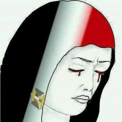

<!-- # 埃及宵禁实录：第五天 -->

在经过“愤怒日”的大规模冲突之后，军警和穆兄会双方的死亡人数已经高达700以上，而且至今双方并没有表现出任何放下武器、和平谈判的迹象。开罗市中心的街头继续上演着互相残杀的悲剧，各种撕心裂肺的哭声、喊声交杂在一起，通过各媒体的镜头，向全世界展示着这个国家伤痕累累的一面。

此时的“千塔之城”已失去往日的宁静。埃及开罗市中心有很多深黄色的宣礼塔，错综层叠地分布在破烂的房屋之中，市容建设实在无可评价。但每当夕阳西下，金黄色余晖洒满开罗城的时候，黄色的宣礼塔和同样被晕染的天空交相辉映，倒也渗透出一种肃穆沉淀的美感。而现在，残阳如血的傍晚，破旧不堪的建筑群反而成为了埃及流血冲突最佳布景。

经过几天的时间，在越来越混乱的街头暴乱中，整个事件的脉络却越发清晰。穆尔西被军方夺权直接触怒穆兄会成员，他们一跃而起，企图重掌政权；军队扣留了穆尔西，不愿看到穆兄会再次上台，于是对暴力的示威者们采取了相应的镇压手段。社交网络和部分媒体也开始越来越多地发布穆兄会手持武器向军警攻击的视频和照片，推翻了曾经声称“军警向手无寸铁的游行示威人员使用杀伤性武器”的言辞。如果说在这场冲突中，军方和穆兄会及其支持者是两股主要势力，那最近这几天奔上埃及街头呼吁停止残杀的民众将会是第三股重要的新兴势力。并不是说他们现在的阵容有多么强大，而是因为他们的参与让世界看到了埃及普通老百姓的意愿：我们拒绝流血冲突，拒绝自相残杀！前原子能机构总干事、埃及临时政府的总理巴拉迪就是为了反对政府采取暴力手段镇压示威者而辞去了官职。自由主义的民主力量未来的如何发展，将对这场冲突的走势起着的至关重要的作用。

在这些普通的埃及民众中，也分成几股不同的主要意见。可以说，大部分是反对穆兄会继续掌权，痛斥其支持者暴力的示威行为的。从不久民众集体大游行，迅速把穆兄会赶下台的成功经验就可以看出来。穆兄会在埃及其实并不得大多数老百姓的民心；还有一部分民众虽然不喜欢穆兄会，但是看着自己的同胞被军警强硬镇压甚至击毙的场景，也深深谴责这样的行为不是代表人民利益的人民警察应该做出来的事。其实，远离事件本身，从另外一个高度看来，这确是一场民族内部的自相残杀，比发生和别国战争来的更加可悲。结果显而易见，任何一方的胜利都无法让国家在短期内复原，在半年内经历过两场大动乱的埃及，就像一个经过换脑换血大手术的病人，已经奄奄一息了。

目前看来埃及政府对穆兄会已经忍无可忍，今天总理正式提出想要“依法解散穆兄会”，这意味着以后穆兄会在埃及将是一个非法组织，如果他们继续暴力升级的话，甚至可能会被冠上和基地组织一样的“恐怖组织”头衔（虽然现在FB上已经有大量网民如此称呼）。短短一年的时间，穆兄会从统治国家的权重者沦落到现在即将被剥夺政治身份，游离于恐怖分子恶名边缘的组织，埃及的政坛风云变化不得不令人瞠目结舌。当初是民主的春风吹进了埃及这片荒瘠之地，给了人民通过自由投票选择总统的权利；一年后，也是埃及民众亲手给民选出的政权划上句号。既然民主给予了埃及人民一双自由之手，那他们也必须承担起应有的责任。而今，埃及民众必须再次站出来，争取自己、国家的利益，不代表任何一个党派，也不代表当局，民意所向，才是埃及未来的方向。而下一个国家总统，或者更确切地称为“国家的第一仆人”，如果未解决埃及现有的错综复杂的问题，不管他是哪个党派，也不管是走民主宪政还是集权专制，下场都会和穆尔西一样。

（采编：纳兰辰瀚；责编：张舸）

前文回顾：

[【冲突目击】埃及宵禁实录：第一天](/archives/40153)

[【冲突目击】埃及宵禁实录：第三天](/archives/40209)

[【冲突目击】埃及宵禁实录：第七天](/archives/40312)

[【冲突目击】埃及宵禁实录：第九天](/archives/40354)
