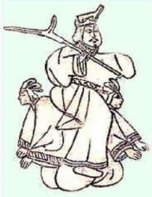

<!-- # 法国作家谢阁兰笔下夏桀形象之重塑 -->

法国作家Victor Segalen (1878-1919)旅居中国时，陪同他的一个老先生给他取了个古色古香的中文名字“谢阁兰”。而他最早为中国人所知，却是以“色伽兰”的音译名在考古界出现的。这是因为他的第一部被介绍到中国来的的作品是部考古著作：这便是1930年被冯承钧先生翻译成中文，由商务印书馆出版的《中国西部考古记》。该书记录了作者1914年2月到6月与两位友人先上西安，后下四川一路上进行的大量墓葬艺术与佛教艺术考察成果；其中最重要的无疑是陕西茂陵霍去病墓“马踏匈奴”的石雕的发现。事实上，除了这次考古外，Segalen还于1917年3月到5月间在南京附近作了对南朝古墓的考察。十九世纪末二十世纪初，欧洲近代考古刚刚走入中国；谢阁兰的这些地面考古成就不仅在西方引起重视，在中国至今也是珍贵的考古资料。六十年后的中国，“色伽兰”的名字在考古界依然占有一席之地，而“谢阁兰”的名字却在文学界作为一个风格独特的法国作家崭露头角。三联书店先后于1991年出版了Segalen 的小说《勒内×莱斯》，

译者梅斌；

于1993年出版了他的诗集《碑》，译者车槿山、秦海鹰。2006年，上海书店出版社出版了邹琰译的《谢阁兰中国书简》。“谢阁兰”三字渐渐为热爱法国文学的人所知，也开始引起越来越多的研究中法文化关系的学者的兴趣。有趣的是，仿佛考古与文学是两个世界，熟悉“色伽兰”的人常常不知道“谢阁兰”的存在；

熟悉“谢阁兰”的人常常不知道他在中国还有另一个名字 [1]。

这双重的身份在Segalen身上却有着奇妙的组合：一方面，考古学家力求对现实做最细微的观察，对历史做最确凿的考证；另一方面，作家却运用文字的炼金术把一切来源于现实的材料置换成全新的物质，能够构筑一个独立的想象世界的物质。事实上，Segalen还有第三个身份：海军医生；

没有这个身份，他难以远渡重洋踏上中国的土地。1909年6月，谢阁兰随同法国海军来到中国，既是医生，又是译员。从此，他前前后后在中国度过了五年半的时间(1909-1914； 1917年2月-7月)。除了以上提到的两次考古经历之外，谢阁兰还在刚来中国时与好友瓦赞(Gilbert de Voisins)作了一次深入中国腹地的长途旅行。他们从北京出发骑马西行，经过五台山、西安、兰州，而后到了成都、峨嵋山、重庆，最后从长江顺流而下直到上海，跨越了半个中国，

整个旅程历时七个半个月。在当时的行路条件下，这样的历险在来华的西方人中实属罕见。对中国大地如此深刻的触摸，对汉语的一定程度的掌握，对中国古籍的大量阅读 [2]，

使谢阁兰具备了相当丰富的创作材料。面对这个古老帝国的断井颓垣，他在想象中重寻消逝的古老文明，同时进行数部作品的创作。其中的诗集《碑》1912年在北京以高丽纸印刷，以中国传统折迭式书籍形式问世。诗集同时标有《古今碑录》的汉文书名与《Stèles》的法文书名；集内每首法文诗都配有中文题语，或出于古籍典故，或出于诗人自己手笔。1916年，散文诗集《画》在巴黎出版。谢阁兰来中国之前，

曾根据他在南太平洋法属波利尼西亚群岛上的经历，以当地土著毛利人在欧洲文明的威胁下面临传统覆灭的危机为题材写了他的第一部小说《远古人》(Les Immémoriaux，1907)，就此一举成名；但《碑》与《画》的出版使他的名字在法国文坛上与开始与中国紧紧地连在了一起。除了这两部作品外，谢阁兰还有多部未来得及完稿的作品，在他的女儿及一些出版商的努力下，得以在过世后陆续付梓。其中与中国直接有关的 [3]有小说《勒内×莱斯》(René Leys, 1922)，诗集《颂歌》(Odes, 1926),,散文集《出征》(Équipée, 1929)，诗集《西藏》(Thibet， 1963)，

随笔《砖与瓦》(Briques et tuiles， 1967)，

考古文献《中国，伟大的雕塑艺术》(Chine. La Grande Statuaire, 1972)，短篇小说集《想象》(Imaginaires,1972),剧本《为大地而战》(Le Combat pour le sol, 1974)，小说《天子》(Le Fils du Ciel，1975)，美学论文《异域情调论：一种多元美学》(Essai sur l'exotisme. Une esthétique du Divers,1978)。

我们可以看到，这其中的许多书是七十年代才问世的。也是从这个时候起，“谢阁兰”才开始渐渐成为法国文学界真正受到重视的名字。应该说，虽然他的文学地位越来越高，真正读他的作品的法国读者却还并不很多。他与中国的特殊关系为他赢来了一批读者，同时也失去了另一批读者：他作品里中国文字的频繁出现与中国典故的信手拈来无疑为阅读增加了难度。对于常人难懂的文字与用辞，法国有一句俗语：“这是中国话。”谢阁兰的作品显然是法国文学中令人却步的“中国话”。而在中国，谢阁兰与中国的关系也并为他赢来更多的读者。相反，面对他的《勒内×莱斯》和《碑》这两部迄今为止可用中文阅读的文学作品，许多读者的反应是困惑：如果说谢阁兰的作品采用的是中国题材，为何读起来与我们熟悉的中国相距甚远？对谢阁兰作品中的中国的否定自然也导致了一些读者对作者的否定。有人认为他对中国究竟不甚了解，有人觉得他的中国不过就是西方人的自由想象。

当一个作家把另一个国家、另一个文化纳入创作时，他的作品是否该是面反映真实的明镜？十八世纪的伏尔泰把中国请进他的《风俗论》中的时候，是无法验证他所采用的材料的真实的：因为没有去过中国，他只能引用当时在华的耶稣会士寄回法国的书信；这些书信出于宗教论争的需要，已带有很多立场与主观色彩。而二十世纪初在中国实践过考古的谢阁兰显然比谁都更清楚真实的份量。只是在他眼里，文学不应该是一面简单的映照现实的镜子。在散文诗集《画》的手稿 [4]中，他依然以镜作比，探讨真正的艺术作品与真实的关系。他认为，一部象普通镜子那般反映现实的作品只是部平庸的作品；而真正的作品则如同中国古代的一种非常特殊的铜镜：这种铜镜光滑的一面能照出摆在它前面的东西；但仔细看时，映象中还混杂了铜镜背部所刻图案，仿佛厚重的铜镜变成透明，使得镜面上现实之象与镜子自身藏在背后的秘密揉杂在了一起，

你我难辩。谢阁兰这里所指的显然是中国古代罕见的发明于西汉的“透光镜”：此镜外表与普通铜镜无二，但当光线照在镜面上时，若镜面对面有一面墙或一道屏幕，上面就会反映出镜背花纹的影像。成像的原因是因为铜镜在冷却和研磨镜面过程中产生内应力，镜面随着镜背的花纹产生难以觉察的凹凸。谢阁兰没有亲眼见到过这样的铜镜，所以在叙述中犯了个错误：他不知道镜背花纹只能在镜子对面的屏幕上才能成像，以为直接在镜面上就可以看到镜背的图案影像。这个错误却极富含义：对谢阁兰来说，文学作品应该是这样一个镜面，上面既有现实的画面，又有镜背花纹的影像；镜背的花纹无异于作者的自我世界。谢阁兰用这个比喻表达了他的创作思想：作者的自我世界在作品的镜面上扰乱了现实世界，甚至使其变形；读者在作品里虽然可以辨认出现实世界的影子，但若要明白这个影子为何不再与现实如出一辄，还要明白镜背花纹的作用，即来自作者的自我世界的干预。谢阁兰所有与中国有关的文学作品，便是这样一种看似在写中国，本质上却是在表达自己的内心世界的透光铜镜。我们在这里以作品《画》内的一组中国帝王像为例来感受一下这种特殊的创作手段。

在散文诗集《画》中，

诗人虚构了这样一个场面：众人前，他搭起一座戏台，抖出一幅幅中国古画向人们炫耀。这些画中有几幅是诗人受亲眼见过的中国画的启发创作的，但大多数都是根据文字资料

──

民间传说、古典文学或历史文献

──

所作的想象发挥。也就是说，这里所谓的“画”实际是文字之产物；戏子在“说”画，

无非也就是诗人在“写”画。这场“说画”戏分为三大部分：第一部分以“魔画”命题，主要展现的是一些神仙妖鬼画以及宫廷风俗画；第二部分“朝贡图”是一幅长卷，画的是浩浩荡荡的周边臣国向中国天子进贡的场面；第三部分是一组“历代帝王像”。这部分刚开始的时候，向众人展示中国古画的“说画人”作了个惊人的开场白。他先讲了个孔子的故事。孔老夫子一日在周王的宫殿里看先朝帝王的画像。当他看到尧舜禹的像时，不由得驻足细观，叹道：“强国盛世，就是这样开始的啊！”但当他瞥到夏桀商纣的像时，连忙垂下双目绕道而行，抑制住心中憎恶，带领弟子们悄然走开。[1：109-110]讲完了这个故事，“历代帝王像”的内容便被正式宣布了：

_

诸位可以相信，孔圣人是绝对不会愿意与我们为伍的；他的弟子就更不用说了。对于我将要献给你们的这出好戏，他们一定鄙视不已。我在这儿要画的可不是明主贤君。经过他们的画像前时，鞠个躬，

体验一下充满历史感的敬意，也就可以到此为止了。还是让我们在其他画像前多驻留一会儿吧。_

_

其他的像，画的是亡国之君，败国之帝，历代的最后一个君主，无道天子，‘何桀纣之昌披兮，夫唯捷径以窘步。’......你们会同意我的看法：历史也一样需要他们，他们的像也一样值得我们细细品味！[1 :110]_

这番开场白不可不谓语出惊人。一方面，我们可以看出谢阁兰对中国典故有相当的熟悉程度。他所讲述的孔子瞻仰尧舜画像的故事来自于《孔子家语》中的“观周”一卷：“孔子观乎明堂，睹四门墉有尧舜之容，桀纣之像，而各有善恶之状，兴废之诫焉。又有周公相成王，抱之负斧扆南面以朝诸侯之图焉。孔子徘徊而望之，谓从者曰：‘此周之所以盛也。夫明镜所以察形，往古者所以知今。人主不务袭迹于其所以安存，而忽怠所以危亡，是犹未有以异于却走而欲求及前人也，岂不惑哉！’”[2 :29] [5]开场白中还有对屈原的《楚辞》的一句援引：“何桀纣之昌披兮，夫唯捷径以窘步。”[3 : 5] [6]另一方面，熟悉中国典故，对儒家传统道德观念也了然于胸的这位法国诗人居然弃明投暗，对败国亡君表现出浓厚的兴趣。在接下来的篇章里，诗人恰恰从桀纣开始一一展示亡国之君的画像并加以评述。谢阁兰使用的史料基本来自于当时旅华传教士戴遂良神父(Léon Wieger)根据历代文献所编译的中法文对照的《历史文献》。[4]被他引入作品《画》中的帝王包括夏桀、商纣、周赧王、秦始皇、西汉哀帝、东汉献帝、蜀汉后主、东晋恭帝、北齐文宣帝、北周宣帝、隋炀帝、唐武后、唐文宗、南宋理宗、元顺帝以及明思宗。我们可以看到，这其中有七个对本朝代由兴到衰虽有责任，却不是真正的亡国皇帝 [7]。作者对史料的主观取舍由此可见一斑。更有甚者：《画》的手稿上的第一页注明1911年12月21日，辛亥革命已经发生；《画》的出版更是五年后的事了。而作品中的落款年份却始终是1911年。作者由此有意回避了民国的存在，让这组帝王像以尚未覆灭的清王朝作结。

谢阁兰为何舍弃尧舜禹这一系的圣君明主，偏偏对桀纣这一系的亡国之君感兴趣？“历代帝王像”的开场白里有一段话似乎能回答这个问题。诗人这样写道：

_“人们对历代的第一个皇帝总是百般颂扬，把他们称作开国之主、改朝之君、正义的天子、受高高在上的青天委任......但是，如果没有人先把天下搞得大乱，他们哪会有机会重整秩序？如果没有邪恶时不时地在世上舞蹈，他们哪会爱上正义，为民除害？如果没有逆道上的先驱不惜一死乃至死后身败名裂，为他们铺平了道路，他们哪会成为应命天子？_

_开国皇帝们打下江山，铸就绵延的朝代之链索；──

有时也该重新打造链环。我们还是为那些亡国之君平反昭雪吧：

没有他们把江山葬送，历史哪能推陈出新？”[1 :110-111]_

这段话乍一听违背常理，有点惊世骇俗。但如果把谢阁兰摆在他那个时代的西方思想运动的背景中，不难发现，这种对反秩序的肯定是典型的尼采思想的表达。从1890年到一战前夕，尼采的著作开始被大量翻译到法国。谢阁兰的导师，后来也成为好友的格杰(Jules de Gaultier)也是参与把尼采介绍到法国的哲学家。谢阁兰很早就开始就读尼采，

是这位狂傲不羁的德国哲学家的的第一批法国读者之一。我们知道尼采一反西方理性哲学的传统，认为世界是没有绝对理性可言的。世界不是一个静止的实体，而是永远处在各种力的冲突、斗争与平衡重建的过程中；

没有任何一种力能始终占上风。这便是尼采所称的永恒的自我创造、自我毁灭的“权力意志”的世界 [8]。

但力的斗争之说还不足以充分解释《画》中的“历代帝王像”对亡国之君的偏爱。诗人在组像的开场白中区分了两类君王。有的在轰轰烈烈的狂欢中葬送了江山。他们属于“最有灵感的、最强悍的”的亡君之列，

“在节日盛宴里，

在歌舞花月间，在血腥醉意中穿过最后的时辰”，向毁灭狂奔。但大多数亡君因为缺乏禀赋，灭亡的方式远没有那样精彩。他们或是服下毒酒，或是自缢身亡，或是梦想超度成佛，或是苟且偷生，逃之夭夭......“但其中的每一个人都在历史上留下了抹不去的一笔”；他们纵然无道，“难道不比循规蹈矩地日日操守美德更难吗？”[1 :110-112]

这独特的价值评判又是惊人之笔。但上文的最后一句引言在暗示我们：“皇帝”作为代表国家利益的天子是不能作为个人存在的。而谢阁兰笔下的这些皇帝之所以亡国，是因为在他们身上，对个人价值实现的追求盖过了他们的政治身份。换言之，在抛弃开国之主而选择亡国之君的时候，诗人抛弃的是政治王国，选择的是自我王国。而这两个王国之间是没有相同的善恶标准可言的。在尼采所宣扬的“善恶之彼岸” [9]，谢阁兰的“历代帝王像”给我们展示的实际是自我王国中的一个个勇士或懦夫。

这其中的第一勇士便是夏桀。桀的画像是这样开始的：“下方杂乱异常；色彩与形状如同沼泽地的风暴，似乎可以嗅出动物的气息；原来这里是三千人大汇聚，个个都俯卧在地。上方唯有一人

──

他面部模糊，因为生活的年代过于久远：他是最早朝代的第十七个也是最后一个君主，历史上第一个亡国的君王。图中可见他臂膀线条弯曲，肌肉隆起，让人能感觉出他彪悍异常；他颤抖的神经如公牛腱般发出铿锵之响；他揉弄青铜的双手能活生生地撕裂老虎水牛。这便是他特有的秉赋，足以鄙视他人的美德。”[1 :113]这段描写显然是受了戴遂良神父的《历史文献》中有关夏桀的一段的启发：“王淫虐。有殊力，能伸钩索铁，生裂兕虎。”根据这段话及下文可推定，戴遂良神父是从古籍《帝王世纪》里获取这些文字的 [10]。谢阁兰笔下，桀的画像继续：

桀与美人妹喜相拥作乐；随着作品中“说画人”的指点，

人们渐渐看到两人原来是坐在一堆肉山上；肉山周围是巨大的酒池；酒池对岸，三千余人正在牛饮：

他们之前被禁止吃喝了九天九夜，为的就是这场盛宴；在士兵的监视下，有谁敢酒喝得慢一点，立刻挨鞭。“说画人”最后暗示天空中星象诡异，扫帚星出现，月亮重叠，暗中商汤的面容依稀可辩：“此人将伐桀灭夏；历史有证。难道向来不是历史在评定功过吗？这也就是为什么历史把商汤这位快乐的造反者的祖先尊为‘武王’，而扔给另一位

──

那最勇猛、那最强悍、那人中之人

──

‘桀’的谥号。”[1 :115]

这个结尾意味深长。“桀”这个字之所以被选中作为夏朝灭国之君的谥号，是因为它的意思是“残暴”。而与此同时，在古代文字中，“桀”又同“杰”，即才能卓越。谢阁兰在查阅顾赛芬神父(Séraphin Couvreur)编纂的《中国古文大辞典》[5]中的“桀”这个词条时发现了这个字的两个意思。在《画》的手稿里，他记下了这个发现所带来的惊喜：“令人吃惊的巧合：文稿完成后查字典，想核实这个字的意思确实是‘非人的残暴’而不是其他平淡的意思。愿望被大大满足：‘非人’同时又有‘人之上’的意思。(......)在此幅画中加上一笔有关‘桀’字的双重意思的点评。”最后成文时，‘桀’的这两层意思并没有十分明显地被点破。但把桀称为“那最勇猛、那最强悍、那人中之人”，其与历史相左的价值评判终究还是可以窥见一斑。

事实上，在《画》之前，桀的形象已在谢阁兰1912年出版的诗集《碑》中出现。在一首题为《纵乐的君王》的诗里，作者引用了戴遂良神父的《历史文选》里有关夏桀的六个字“日亡吾乃亡耳”：桀不听伊尹进谏，声称除非太阳灭亡，他才会灭亡。全诗是这样的：

_君王啊，纵乐的君王，

您难道没听见您周围的歌声？_

_“四马在飞奔，缰绳在飘动：去恶从善将有多少新的乐趣！”_

_君王啊，君王，您的灭亡已被宣布。想想帝国，想想自己吧！_

_君王说：够了，这些恶毒的预言！我有帝国就象太阳有天空。谁能去摘太阳呢？它落了，我也落。_

_我的王位比护卫帝国的五岳还重：它横卧在五情六欲之上。让那些游牧部落来吧：我们将使他们高兴。_

_纵乐的帝国不会陨落。 [6 :134]_

这首诗与《碑》中的大部分诗一样呈上下两部分，上部分是对中国典故的引用，下部分是诗人就此进行的发挥。正如译者车槿山与秦海鹰在注解中指出的，在这首诗里，

诗人“并不是在评说历史，而是表现自己蔑视道德规范、追求自由意志的思想。”[6 :135]而这种对自由意志与独立精神的追求，在谢阁兰的世界里，实际上是出于生命的渴望。他把夏桀对政治宗教道德的藐视赋予积极的意义，是通过对原始生命力的张扬向萎靡的时代提出挑战。

这是因为，生命的力量在19世纪末20世纪初的欧洲遭到了双重威胁。这威胁一方面来自于宗教信仰的危机：尼采以一句“上帝死了”宣布传统宗教信仰的全面崩溃，而新的精神殿堂尚未存在；从追寻到失望，从失望到颓废的精神孤儿比比皆是。威胁的另一方面来自于科学迷信的盛行。工业与科技的发展使科学迷信取代了宗教信仰，世间一切，包括未来与生命，都变成了可以驾驭的东西。为了派遣对不可知的恐惧，

人们痴迷于社会进化的神话，自诩为生命的主宰；而生命一旦失去了变幻莫测的神秘，也就不再是支配一切行为的活力的源头。科学理性的独裁由此取代了生命的权威，

反而使生命蜕化。

传统价值的崩溃与现代迷信的滋长成为当时欧洲社会的两代危机，令虚无主义的幽灵到处游荡。悲观颓废成为了世纪末的欧洲人的普遍情绪。年轻时的谢阁兰也曾在这片乌云的笼罩下生活过；但尼采的昂扬重新为他燃起了生命的火焰。来中国以前，

谢阁兰曾随海军来到太平洋上的波利尼西亚群岛。岛上的海风与阳光为他展现了生命的原始的真实。后来在给友人的信中，他提到这段日子：“我曾对你说起过我的热带的幸福。这是种异常强烈的真实。在波利尼西亚群岛生活的两年生活中，我快乐得睡不着觉。有时清晨醒来，泪水会在阳光初升的醉意中落下。(......)我感到肌肉中喜悦在流淌。我快乐地思考；我发现了尼采；我写作，我自由，我身心康复，精力充沛，感官受到极佳的锻炼。”[7 :1244-1245]对尼采的发现，在谢阁兰身上，是与对生命的原始活力的发现同步的。如果说海岛上热烈的自然几乎是尼采精神的具化，来到中国后，他面对的却完全是另一个世界，一个由儒家思想统治的理性世界。谢阁兰小时受到过非常僵化的天主教教育，对宗教道德有强烈的排斥。而儒家思想在他眼里既代表了中国文化的精髓，同时又是一种某种意义上可与西方天主教相比的压抑人性的正统道德体系。这位尼采的追随者通过对桀的形象的特殊处理，表达的正是他拒绝做道德的奴隶，而做自我的主人的渴望。

在1911年9月23日写给好友孟瑟龙的信中，谢阁兰针对诗集《碑》毫不含糊地声称，他的有关中国的作品实质上是从“中华帝国到自我帝国的转移”。 [7 :1246]《画》是继《碑》之后的另一部典型的由“他者”向“自我”的转移。但与《碑》的两种文字对照、两种思想对比的形式不同的是，《画》只有法文，所展示的也仅仅是中国式的画面。这里从“中华帝国”到“自我帝国”的转移变得十分隐晦：这种转移不是由此及彼地实现，而是在同一平面，即由文字产生的“画面”上进行。这种平面的身份转移如同谢阁兰所想象的透光铜镜一般，观赏者只能通过对被映照的世界在镜面上的影像变形辨认出铜镜所负载的另一个世界的存在，即镜背花纹的世界。

在《画》中，夏桀形象的价值扭转一方面是通过“说画人”在结尾对“桀”这个字的双关含意的暗示实现的，一方面也是通过桀在“历代帝王组像”中的特殊地位表现出来的。组像中商纣没有直接出现；替他出场的是宠妃妲己。商之后是周朝的灭亡；周之后秦始皇粉墨登场。秦始皇作为组像中唯一的开国皇帝，起着承上启下的作用：他结束了“王朝”的历史，开创了“帝国”的历史。自秦始皇之后，《画》中所出现的历代皇帝里不再有强悍的“人中人”了；而“人中人”的榜样，也始终被作者定为夏桀式的人物。最幽默、最具嘲弄的是有关唐文宗的一段：文宗优柔寡断，几番想有所作为，却总是半途改变主意。在戴遂良神父的《历史文献》里，文宗欲效仿尧舜作个圣主明君，但自叹不成。[4:1736]而在谢阁兰那里，犹豫不决、缺乏魄力的文宗却苦于无法象桀纣那般彪炳千古：“朝廷画师向他建议生前就留下画像，加入历代贤王之列。于是皇上直起身子，翻了翻眼睛，牙齿嘎嘎地咬了几下，问道：‘那么照你看，朕的面容最象谁呢？’‘尧舜的尊容......’，另一位答道，显然是知书明理。皇上却怒道：‘好一个亵渎圣人的小子！’便命令热起为谄媚者准备的油锅......但接着又变了主意，令画师立即依照彪悍的暴君形象为他作像。他翻遍史书，拼命想模仿着摆出几个最垂名青史的恶虐姿态.....但是突然间他摊倒在地，泪如雨注，知道这辈子是永远也别想有这个成就了。”[1 :156]

在谢阁兰笔下，文明步步走向衰落，帝国步步走向衰落，一代代亡君的亡国方式也在走向衰落。唐文宗之后的宋理宗沉迷理学，元顺帝最爱钟表，明思宗崇祯只能用自缢来了结一生。我们上文说过，谢阁兰《画》中的帝王与其说是国家社稷的君主，不如说是自我王国的主人；而生活中的每个人都可视作是他的自我王国的君王。因此，“历代帝王像”中帝王的种种不同的生命方式，其实也就是普通生活中人们的生命方式，只不过加以典型化与戏剧化。如果说桀这样的形象体现了一种原始饱满的生命力，在他对面，除了象唐文宗这样缺乏个性的人物之外，主要有三类虚无主义者的典型。第一类是晋恭帝式的宗教虚无主义者。画中的晋恭帝已听见造反者逼近宫殿。此时该何去何从？誓死一战吗？谁不知成与败都是一场空；为被杀的皇子们报仇吗？谁不知子孙不过是人生愚妄与痛苦的延续；去讨还被辱的妻妾吗？谁不知女人是大彻大悟的关键障碍；服毒自杀吗？身为佛教徒岂能自尽......生死之间，笃信佛教的晋恭帝难生难死。这幅画无疑是对宗教虚无主义者的嘲弄：宗教把空幻的彼岸世界当作唯一真实的世界，而真实的人间生命反倒变得子虚乌有。第二类是宋理宗式的理性虚无主义者。画中，崇尚理学的宋理宗正在给太子与众臣们上课，大谈“无极”、“太极”、“太虚”、“太和”、“大一”、“大易”.....皇帝全身心沉醉于形而上的思辩：“他将讲到理在欲先，还是欲在理前。他将解决宇宙之初，根据虚实动静以及各个流派下的定义，‘太虚’是否有可能呈硬性的难题。”[1 :159]而与此同时，蒙古军已兵临城下。兵部尚书胆战心惊。尽管他尽量装做洗耳恭听，但心知国家危在旦夕；皇帝劈头盖脸掷下的这等名词砸在他的脑袋上，比兵锤还厉害。此画结尾暗示大宋江山已苦无多。这里，宋理宗虽然也是一个按自己选择的方式生活的有特色的人物形象，但作者对他的讥讽显而易见。这种讥讽来自于尼采式的对形而上学的批判。象尼采一样，谢阁兰认为自柏拉图以来，西方哲学对绝对理念的追求是一种幻影式的追求；这种追求的结果是抹杀了现实世界的价值，使人们不去珍惜这个唯一可以捕捉的，也是唯一存在的世界。第三类虚无主义者是失去一切生命的动力，甚至连宗教和理性的动力也没有的只追求平平安安地活下去的庸人。这类人是通过大清王朝的末代臣民来体现的。我们在上文中提到，虽然《画》是从辛亥革命以后开始创作的，但作品中清朝仍被作为一个尚未结束的朝代来处理。在这一部分没有皇帝出现：光绪已死，醇亲王摄政，“表现出最良好的愿望与最平庸的品德”。国家似乎一切都有条不紊，没有人想模仿历代亡国之君的丑行，也没有人想模仿秦始皇的杰作；没有宦官夺权，也没有后宫淫乱；没有麒麟呈祥，也没有星相怪异。人们生活四平八稳；“没有一个文人，没有一个政客，没有一个诗人，没有一个朝廷官员，──

说到底没有一个‘人’

──

会去辅佐或者捣毁一个如此平稳的时代，仿佛风平浪静的海面。帝国坐享在安稳之上。有人说，一些不怀好意的家伙，一些学习欧洲思想的人，正在准备一场‘革命’。他们最多只能吓唬吓唬沿海一代的商人而已......”[1 :168]原文里，“没有一个‘人’”中的“人”是大写字母开头的(Homme)。这个大写的人暗示的是真正有生命活力的人；而这样的“人”在帝国悠长历史的终端已经找不到了。取而代之的是尼采所称为的文明没落时代的“最后的人”。他们谨小慎微，

猥琐浑噩，没有任何创造力。“爱情是什么？创造是什么？渴望是什么？星球是什么？”尼采笔下“最后的人”眨着眼睛这样问。“最后的人”形成的社会是千人一面的社会：“仅有一群羊，而没有牧羊者！大家平等，大家的希望一致：谁有别的情感，便是甘心进疯人院。”[8 :10]

谢阁兰的“历代帝王像”以桀的原始野性为始，以现代人的精神衰落为终，展示了一组形形色色的生命。在尼采那里，“最后的人”的出现宣告了人类生存的危机；这种危机呼唤着“超人”的到来：“超人”代表了能够战胜上帝与虚无的新型人类的理想。而谢阁兰不满足于“超人”的概念

──

“超人”毕竟还是“人”

──

，提出了“非人”的概念。在他的美学论文《异域情调论：一种多元美学》里，谢阁兰在题为《人──

超人──

非人》的那部分中写道：“不要学中国人，把‘非人’的称号给了他们历史上最多姿多彩的人物之一，最强悍的人中之人，桀。”[9 :773]谢阁兰曾经欣喜地看到“桀”这个字中“非人”与“杰出”的意思并存，但他认为夏桀式的“非人”并不是他所定义的“非人”，因为它仅仅停留在残酷与本能的层面上，因而只能属于与被正统道德所压抑的人性相对抗的一种自由的原始的人性。而谢阁兰所定义的“非人”已不再属于“人”的范畴：这是一种与人性相对的神性。这种神性与人性迥异，但同时却是人的精神生活的创造。尼采宣告“上帝死了”的时候，不是同时宣告从此每个人都可以创造自己的神吗？

否定把夏桀式的野性定义为“非人”之后，谢阁兰在《异域情调论：一种多元美学》一书中提出了他所定义的“非人”概念：“非人：它真正的名字是‘他者’。”[9 :773]谢阁兰在他的思想体系里，首先借用西方唯心主义传统指出，对于一个主体来说，世界上任何客体都是不可能真正认知；从这个哲学意义出发，谢阁兰作了个美学意义上的发挥：主体超越认知目的

，把不可知的客体视为与己相异的“他者”时，便会产生审美快感，因为美是“异”，而非“同”的产物。在它的最高层面上，“他者”被称作“非人”即对寻常人性的超越。在谢阁兰那里，“异”的最高审美境界被“神”化了，不再属于人的范畴，如同宗教中的偶像或神。

在谢阁兰的世界里，“异”所带来的“美”取代了传统的上帝。这种把审美置于一切之上的态度不能不说是一种典型的尼采式的“审美人生”的态度。《异域情调论：一种多元美学》一反殖民传统中“异国情调”的定义，即肤浅的异域风光印象，而是将“异域”作为所有“异感”的通称，运用到经验世界的各个层面。例如，自然可被视为人类的异域；女人可被视为男人的异域。这部著作强调，由“异”产生的美只可能是多元的；而多元美的前提是差异美；同时“只有个性强的人才能感受到差异”。[9 :750]面对大千世界，每个人都可成为观赏者；但如果观赏者不把自己和观赏物之间拉开距离，清醒地认识到两者间的差别，“异”的美感就不会产生。因此，“异之美与个性精神是相辅相成的。” [9 :751]

谢阁兰的一生都在实现着一个世界观赏者的角色，尤其是中国世界的观赏者。但有着强烈个性的他从未把自我世界与中国世界相混淆。只是，在现实中，诗人与中国处于面对面的审美状态，后者对他来说是“异”之美的源泉；但在作品中，中国作为唯一的形象出现，实际上却是已经改造过了的形象，如现实世界在谢阁兰想象中的透光铜镜镜面上的投影一般。在给德彪西的一封信中，谢阁兰这样描写自己与中国的关系：“

实际上，我来这里寻找的既不是欧洲，也不是中国，而是中国的幻象。”[10 :1148]“中国的幻象”是指现实中作为审美对象的与“我”相异的中国，更是指作品中奇妙地转化成“我”的自我精神表达的“他者”。中国作为“他者”的典型，成为一个异常丰富的寓意形象(allégorie)，其寓意是与之迥异的“我”的内部世界；在《碑》与《画》等作品中

，中国甚至成为了自我世界的象征。从谢阁兰笔下的夏桀形象里，我们可以对这种以差异美学为起点的托他言我, 声东击西的独创诗学领会一二。

（采编：彭程；责编：彭程）

**注释：** [1]中华书局2004年重版了冯承钧译的《中国西部考古记》，将“色迦兰”的名字修订成“谢阁兰”。见（法）谢阁兰、伯希和、列维著，冯承钧译，《中国西部考古记·吐火罗语考》，中华书局，2004年。 [2]谢阁兰非常熟悉当时法国汉学界的研究成果，包括对儒家与道家经典的翻译、中国古典文学翻译、考古成果与绘画研究等等。他在文学创作中取材最多的是在中国传教的戴遂良神父（Léon Wieger，1856-1933）的《历史文献》（Textes historiques, 1903-1905）、《哲学文选》(Textes philosophiques, 1906）、《道教》(Taoïsme, 1911, 1913)等著作，以及顾赛芬神父(Séraphin Couvreur，1835-1919)的《诗经》、《尚书》、《四书》等中国古籍译本。 [3]谢阁兰还著有绘画评论与文学评论，如《给高更的致意》(Hommage à Gauguin，1919)、《高更在他最后的布景里》(Gauguin dans son dernier décor，1975)、《两个兰波》(Le Double Rimbaud，1978)、《古斯塔夫·莫罗：俄尔甫斯教的画师》(Gustave Moreau, Maitre imagier de l'orphisme，1984)等；以及戏剧创作《俄尔甫斯王》(Orphée-Roi，1921)、《悉达多》(Siddhârtha，1974)等。 [4]本文中所有有关《画》的手稿的引用来自于法国国立图书馆手稿部所藏的该作品的手稿。 [5]谢阁兰的直接材料来源于法国著名考古学家沙畹(Édouard Chavannes，1865-1918)的著作《中国北部考古》(Mission archéologique dans la Chine septentrionale)

第一卷，巴黎，Ernest Leroux 出版社，1913年，第32-33页。 [6]谢阁兰的直接材料来源于圣丹尼斯(Léon d'Hervey de Saint-Denys,1823-1892)翻译的《离骚》(Li-Sao)，巴黎，Maisonneuve出版社，1870年，第7页。 [7]这其中不是亡国皇帝的有秦始皇、西汉哀帝、北齐文宣帝、北周宣帝、唐武后、唐文宗和南宋理宗。 [8]尼采有言：“这个世界是：一个力的怪物，无始无终，一个坚实固定的力作为无处不在的力乃是忽而为一，忽而为众的力和力浪的嬉戏，此处聚积而彼处消减，象自身吞吐翻腾的大海，变幻不息，永恒的复归，以千万年为期的轮回在其轨道和年月的吻合中自我肯定、自我祝福；作为必然永恒回归的东西，作为变易，它不知更替、不知厌烦、不知疲倦

：这就是我所说的永恒的自我创造、自我毁灭的狄俄倪索斯的世界，这个双料淫欲的神秘世界，它就是我的‘善恶的彼岸’。”

(摘自尼采著，《权力意志》，张念东、凌素心译，商务印书馆，1991年第1版，第700-701页) [9]《善恶之彼岸》是尼采一部著作的标题。也请参看上注。 [10]见《帝王世纪》：“帝桀淫虐有才力，能伸钩索铁，手搏熊虎。多求美女以充后宫，为琼室、瑶台，金柱三千，始以瓦为屋，以望云雨。大进侏儒倡优，为烂熳之乐，设奇伟之戏，纵靡靡之声，日夜与妹喜及宫女饮酒。常置妹喜于膝上。妹喜好闻裂缯之声，为发裂缯之以顺适其意。以人驾车。肉山脯林，以为酒池，一鼓而牛饮者三千余人，醉而溺水。以虎入市而视其惊。伊尹举觞造桀，谏曰：‘君王不听群臣之言，亡无日矣。’桀闻析然，哑然笑曰：‘子又妖言，天之有日，由吾之有民，日亡吾乃亡耳。’两日斗蚀，鬼呼于国，桀醉不寤。汤来伐桀，以乙卯日战于鸣条之野，桀未战而败绩。汤追至大涉，遂禽桀于焦，放之历山，乃与妹喜及诸嬖妾同舟浮海，奔于南巢之山而死。”(（宋）李昉等撰，《太平御览》，中华书局，1998年重印，第一册，卷八十二，第386页)戴遂良神父的《历史文献》中有关夏桀的中文部分(《历史文献》第一卷，河间府献县，天主教会印刷所，1903年，第59-62页)与此文基本符合，同时也参阅了其他文献。

**参考文献：** [1] 谢阁兰.画（Peintures）[M]，巴黎，Gallimard出版社，“L’Imaginaire”丛书，1983. [2] 孔子. 孔子家语·卷三·观周[M]. (魏)王肃编.上海古籍出版社，1990年。 [3] 屈原. 楚辞·离骚[M] 郭竹平注释，中国社会科学出版社，2002年。 [4] 戴遂良. 历史文献(Textes historiques)[M]. 河间府献县，天主教会印刷所，1903-1905. [5] 顾赛芬. 中国古文大辞典(Dictionnaire classique de la langue chinoise)[Z]. 河间府献县，天主教会印刷所，1890. [6] 谢阁兰. 碑[M]. 车槿山、秦海鹰译.三联出版社，1993. [7] 谢阁兰.致孟瑟龙(Henri Manceron)书(1911年9月23日)[A].谢阁兰书信全集(Correspondance)（第一卷）.巴黎，Fayard出版社，2004. [8] 尼采.查拉斯图拉如是说[M].尹溟译.北京 :文化艺术出版社，2003. [9] 谢阁兰.异域情调论：一种多元美学（Essai sur l’exotisme）[A].谢阁兰全集(Œuvres complètes)

(第一卷) [M].巴黎 :Robert Laffont出版社，“Bouquins”丛书，1995. [10] 谢阁兰.致德彪西书(1911年1月6日) [A].谢阁兰书信全集(Correspondance)

(第一卷) [M].巴黎 :Fayard出版社，2004.

（采编：彭程；责编：彭程）

[ 【对话】《灵山》：形上的流亡](/archives/40199)——在我们惯常的理解中，流亡者获得了一片星空，却失去了整片土地。但不可否认的是，去国流亡的异邦人在广袤的大旷野中，让文明从此不断出发、永不抵达。 [ 【对话】古代官员如何放假休息？](/archives/40434)——随着气温升高，又到了一年中的休假旺季。我国休假制度起源于官员休假，统治者不断在实践中完善休假制度，对现行的节日休假制度也有着一定的影响和借鉴意义。
