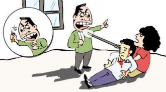
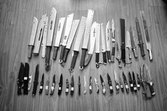

<!-- # 第九十三期：如何保护你自己 -->

**案例展示：**

杭州新闻：今年6月30日凌晨凌晨4点，睡得正熟的小张姑娘突然被一声响声惊醒，坐起一看，自家房门被一个陌生男人踢开。这个男人身高一米七左右，身形壮硕，进门后低吼：“不许喊！谁喊我就弄死谁！”，边说还边扬了扬手里的刀。

姑娘的男友小赵也醒了，但他身高只有一米六，又很瘦弱，当时被吓得一动不敢动。

陌生男人冲上来强奸了小张姑娘，得手后，陌生男人又用刀抵着小张姑娘，把她强行带走，整个过程持续了近十分钟。等他走远，小赵才回过神，慌忙追出，早已没了两人踪影。在四周找了一圈后，小赵这才报警。

“我们问过小赵，为什么嫌犯在房间里呆了这么久，当着他的面强奸他的女友，他都没反抗。”办案的萧山刑大民警说，“他说对方看起来很凶悍，手里还有刀，他当时实在是吓坏了……”

6月30日早上6点，新湾派出所民警在附近的马路边找到了小张姑娘，她衣衫不整，连路都走不动了，由于受惊过度，当时已无法跟人正常交流。

被救回派出所后，小张姑娘对民警说，嫌犯开着车把她带到钱塘江边，威胁她“如果敢乱叫，马上就把你扔进钱塘江”，然后又在车里对她性侵了两次。之后，对方开着车把她带了一段路，然后才放她下车。

****

**正当防卫：**

在这个案件中，显然受害者是很可怜的，当我们遇到不法侵害的时候，尽最大程度保护自己是理性的选择。我们无意指责小张的男朋友怯懦无能，毕竟当事人是怎样的经历背景，在那种情况下我们自己能否保持冷静，这些都是不确定的，所以我们不对他人做道德上的判断。

在这个案件中，我们希望讲述给大家的是如何正当防卫保护自己，让自己的损失降到最低。在此之前我们必须告诉大家的是，我们所说的正当防卫是要建立在有能力的基础之上，在双方实力对比悬殊，比如歹徒为多人或者持有杀伤力强的武器时，我们建议不要做无谓的抵抗，生命才是最宝贵的。

我们先了解什么是正当防卫：刑法第二十条第一款：为了使国家、公共利益、本人或者他人的人身、财产和其他权利免受**正在进行**的不法侵害，而采取的制止不法侵害的行为，对不法侵害造成损害的，属于正当防卫，不负刑事责任。

但是我们必须知道的是，正当防卫并不意味着可以肆意攻击歹徒，防卫必须局限于一定的限度内，第二十条第二款规定：正当防卫**明显超过必要限度造成重大损害的**，应当负刑事责任，但是应当减轻或者免除处罚。

有一些人会有顾虑，比如担心自己下手不知轻重，如果下手重了伤害甚至杀死了歹徒，那么是不是必须承担法律责任呢，可是对方穷凶极恶，很多防卫本身就是双方以命相搏的，

出了人命怎么办呢？这一点法律是有说明的，第二十条第三款：对正在进行行凶、杀人、抢劫、强奸、绑架以及其他**严重危及人身安全的暴力犯罪**，采取防卫行为，造成不法侵害人伤亡的，不属于防卫过当，不负刑事责任。

<

strong>那么这个防卫必要限度究竟是怎样的呢？

必要限度是使加害人丧失继续侵犯被害人的能力，只要不明显超过这个限度，而且造成了重大损害，就没关系。正当防卫时间界限是**犯罪正在进行时**，也就是你的合法权益受到紧迫的、现实的危害。简单来说，你感觉他要来侵犯你，但是他尚未着手行动，那你是不能防卫的（否则就是事先防卫）；如果他被制服、丧失侵害能力、主动终止侵害或者逃离现场且不会继续造成更严重的伤害了，你也是不能防卫的（否则就是事后防卫）。

**事前防卫和事后防卫都不属于正当防卫，甚至可能构成故意伤害或故意杀人。**

简单地说一下呢，就是如果对方没有动手，你不能先动手；如果对方停止侵害或者失去侵害能力了，比如昏迷、受伤或求饶，你不能继续攻击对方；如果对方侵害后离开，过一段时间你再遇到对方，不能攻击对方。

**举例说明：**

一女子遭到歹徒强奸，该女子挣扎中摸到一把水果刀，于是刺向歹徒，造成歹徒受伤，此时为正当防卫；但歹徒受伤后昏迷，该女子出于恐惧或者报复继续刺杀导致歹徒死亡，此时就不是正当防卫了。

当然，这个也看当事人是如何描述犯罪经过的，在这种情况下，想明白了再说很重要。

**可否使用管制刀具防卫：**

携带管制刀具属于治安处罚条例管辖，正当防卫是刑法管辖范畴，是要分别处理的。也就是说携带**管制刀具防卫并不会影响防卫的正当性（如果其他方面均满足正当防卫），但是携带管制刀具本身还是要被处理的。**

下面为大家解读一下什么是管制刀具，以免大家不小心携带了非法的防身工具：

1.匕首：带有刀柄、刀格和血槽，刀尖角度小于60度的单刃、双刃或多刃尖刀。

2.三棱刮刀：具有三个刀刃的机械加工用刀具。

3.带有自锁装置的弹簧刀（跳刀）：刀身展开或弹出后，可被刀柄内的弹簧或卡锁固定自锁的折叠刀具。

4.其他相类似的单刃、双刃、三棱尖刀：刀尖角度小于60度，刀身长度超过150毫米的各类单刃、双刃和多刃刀具。

5.其他刀尖角度大于60度，刀身长度超过220毫米的各类单刃、双刃和多刃刀具。

可以排除的：斧头不算管制刀具，厨房刀具不算管制刀具，非利器（如锤、棍）不算管制刀具。

**最后为大家介绍几种合法的防身工具：**

1.菜刀：

优点：完全合法的刀具，可以轻松购买，外形有一定的威慑性。

缺点：很难随身携带，菜刀的结构导致不是很便于战斗，较廉价的家用菜刀杀伤力有限，菜鸟很容易被夺刀。

2.斧头：

优点：不属于管制刀具，外形有一定威慑性，比一般刀具容易使用不需要太多技巧。

缺点：很难随身携带，对力量有一定要求，比较笨重，第一次攻击后容易卡入对方身体无法拔出。

3.锤子：

优点：完全合法，不需要任何使用技巧蛮力即可，不见血避免手软，不会卡入对方身体可以连续进攻。

缺点：很难随身携带，对力量有一定要求，如果不击中要害杀伤力大打折扣，很容易被夺走。

4.茶刀（茶锥）：

优点：便于携带，完全合法，比较隐蔽，对力量要求不高便于女性使用。

缺点：杀伤力很低必须刺入要害，对格斗技巧要求较高，只能在对方放松警惕下才能偷袭。

5.防狼喷雾：

优点：便于携带，无需力量和格斗技巧。

缺点：容易受环境影响，比如大风、黑暗下杀伤力和准确性降低，惯犯对此类物品有一定防范。
