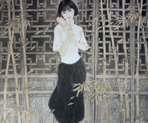

<!-- # 关于读书的胡思乱想 -->

拿到录取通知书后，状态一直很不好。跟通知书一起来的，是焦虑与失眠。开学日益临近，所谓“最后的无忧无虑读书的日子”就要到头了，可是自己开的书单还有好长好长，而且还在不断变长。虽然早就意识到“书到今生读已迟”的残酷现实，但要在心理上接受还是件很痛苦的事情。

“弱水三千，只能取几瓢饮”，茫茫书海中的权衡取舍使得我们不得不反思读书的目的。但这种目的其实又来源于个人的阅读体验，于是阅读目的同阅读史之间构成了一种微妙的相互影响的演化关系。于我而言，阅读的目的大抵可以分为三类：

一曰审美，比如从文学中寻求精神上的愉悦和慰藉；二曰求知，构建理想中的知识结构，本质上是“消费知识”；三曰钻研，比如为了研究而啃的技术性比较强的大部头，本质上是为了“生产知识”。

分类或许能使我们在无涯的书海中不致于迷失，在详略上有所取舍，但这依旧不能改变“人生有涯，而学海无涯”的现实。“以学术为志业”的确带来了更充分的阅读时间，但这个信息爆炸的时代实际上已经不可能再出产百科全书式的思想家。现代学术分工越来越精细，以至于学科内不同focus的专家之间共同语言也在不断减少。人类思想史上那些星光熠熠的名字固然是宝贵的财富，但从某种意义上说却也变成了负担。为了攀登“巨人的肩膀”，我们不得不拿出越来越长的时间学习已有的知识。可是知识的积累速度远远快于人类寿命的增长，学者的“婴儿期”也将占据其生命越来越大的比例。或许终有一日，人类知识的积累将会超过某个临界值，以至于人们不得不利用记忆芯片将知识植入大脑才能在前沿上继续开拓创新。这或许会大大加快人类文明的发展速度，但更可能的是打开了潘多拉的盒子，人类终将失去自由。

或许在自己的有生之年，“巨人的肩膀”还不至于高不可攀，但是“创新强迫症”却已经开始导致学术的“异化”。虽然社会科学的天空依旧“乌云密布”，可是好的idea并不多产。拿到tenure后固然可以十年磨一剑，可是phd、AP却需要在有限的时间内做出成果以“发送信号”证明自己的“学术潜力”，没人会养着自己“博洽群书，不著一字”。如果不愿灌水的话，发表压力会不会逼着自己做出一些标新立异乃至哗众取宠的“大新闻”来呢？又会不会沦为学术民工而不得不做自己并不认为有意义的研究呢？
****

大概无论从事什么职业，我们都要在一定程度上沦为“螺丝钉”，违心地做一些自己不喜欢的事情。早期的科学巨匠多是贵族出身，也正是因为他们衣食无忧因而可以反抗“异化”。终身教职的现代学术制度为平民学者提供了一张宁静的书桌，毕竟拿到tenure之后在很大程度上便不再受制于人。从这个意义上讲，学术界大概是异化程度最低的领域吧。

无论情愿还是不情愿，知识分子往往会不自觉地变成“痛苦的苏格拉底”，因为我们喜欢追问“意义”。这种对自己的拷问使得我们无法回避人生的虚无。一旦认识到这一点，我们便再也无法继续装作“快乐的猪”。我们究其一生的努力，实际上都是在反抗虚无。我们不断地为自己营造“意义感”，这种“意义感”或许是历史的参与感，或许是对人类社会的悲悯之心，或许是窥探世界奥秘的好奇，或许是爱与被爱的满足。古人讲究修齐治平，先忧后乐，立德立功立言，又何尝不是营造“意义感”的尝试？

但这种“意义感”又是极不可靠的。轰轰烈烈的爱情尚能转型为婚姻中的合作关系，某一人生阶段的“意义感”消弭之后，我们大概只能再次走向精神流浪吧，直到我们寻找到新的灵魂归宿。

(采编：孙晓天，责编：佛冉)

[【学而思】晒麦子](/archives/40604)——我虽在城市念书多年，深知自己内心仍是个农民，与之相伴的经历、思维方式难以改变。可是这一切无需改变，因为卑微不代表卑贱，成功也不见得高贵——它无非是生活。

[【学而思】关于学术“异化”的胡思乱想](/?p=40623)——人在江湖走，哪能不为稻粱谋。“以学术为志业”意味着学术不仅仅是我们的兴趣爱好，更是我们吃饭的家伙。我们不仅要“消费知识”，而且要“生产知识”。
