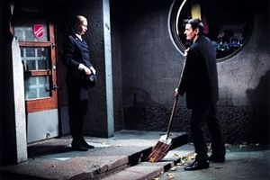

<!-- # 大力神在十字路口——电影《没有过去的人》 -->

_

“这里，又一次，记忆压着我的嘴唇，我无与伦比，却又与你相似。我就是那紧张的敏感：一个灵魂。我固执地接近欢乐，也固执地偏爱痛苦。我已渡过重洋。我踏上过许多块土地；见过一个女人和两三个男人。我爱过一位高傲的白人姑娘，她有着西班牙的宁静。我看到过一望无际的郊野，那里落日未完成的永恒已经完成。我看到过一些田野，那里，吉他，粗糙的肉体充满痛苦。我调用过数不清的词汇。我深信那就是一切，而我也将在看到在做不出任何新鲜的事情。我相信我贫困和富足中的日夜与上帝和所有人的日夜相等。”_

_ ——博尔赫斯《我的一生》_

面对名利声色与道义美德的十字路口，大力神海格力斯选择了重重磨难、沉重的责任，那十二件不可能完成的任务。这个故事为后来的文学家、艺术家、哲学家留下了无限的阐释空间。当这样的经历映射到人间，它震撼人心的程度不逊于此。

芬兰导演阿基•考里斯马基在02年拍过一部影片叫《没有过去的人》（L´HOMME SANSPASSÉ），是继“浮云”（指《浮云往事》）之后当代芬兰三部曲的第二部，继承了他黑色古怪，同时又充满了现实主义批判的风格。影片讲述的是一个男人到赫尔辛基找工作，没想到刚一到那里就被当地的小混混殴打致“死”，在他奇迹般地又活过来之后，他发现自己已经记不起一切。当地一些善良的人和慈善机构帮助了他，让他有了重新生活了下去的动力。影片的最后，男人虽然找回了以前的家庭，但是他仍旧没有记起什么，不过这已经不重要了，那一切已经是另外一个人的过往了，他又回到了赫尔辛基，回到了他真正的家——那里有他全新的生活和他爱的人。

影片中的男人原本是一个电焊工，极其嗜赌，输掉了很多钱；与妻子感情不和，经常吵架。对生活的绝望让他离开了家庭。失掉记忆后，他却可以积极地生活着，即使经历了没钱交房租、遭遇抢劫、被警察关押等许多困境，他却总是能看到希望，不断奋斗。并且，他还以最诚挚的心爱着着那个帮助他的女人。

同一个人，只不过失去了记忆，却可以拥有完全不同的世界观与生活。人们总说“江山易改，本性难移”，其实，人们很多时候并不是靠本性来判断是非对错的。杀戮、弱肉强食都不过是自然界的规律，动物可以为了捕食而不择手段，对于他们而言是没有任何伦理道德而言的。人也是动物进化而来的，不同的只是多了心智和伦理道德来压制自己的本性。

毕竟，做崇高的人太累了，要有太多的束缚与取舍，担负太多的责任、失去太多的乐趣，很多时候崇高的人更多的是活在别人的期望中——活在一个充满伦理道德的世界中。所以有些人说，做一个卑微的人更加容易做自己。这里所说的自己是不加任何限制的本性，包括自私、残忍、懒惰。

在我看来，影片中的男人原本的生活更加贴近他的本性。他只是个普通的电焊工，他不用以身作则、不用担负任何表率作用，所以他可以放任自流。以一般人的道德标准来看，嗜赌绝对是堕落的行为，但是赌博确实可以让人从中得到刺激的乐趣，否则也不会有那么多人沉溺其中，可是这种毫无节制的本性的放纵与肉体的享乐又常常让人厌恶生活。因为人的本性是阴暗的，所以当人们用阴暗的双眼来看、用阴郁的神经来感受这个世界的时候，一切就都是肮脏而喧哗、没有梦想与希望的，即使快乐也只是一种稍纵即逝的快感。

如果说人生是场无休止的激烈搏斗，那么那个男人的前半生就是输了这场战争。与其说是那次殴打使他失去了记忆，毋宁说是他毁灭了自己。面对那次殴打他没有任何反击的力量，也没有机会反击。既然他背弃了生活，生活就从背后无情地给了他致命的一击。

当他再次醒来时，他已经被生活抛弃在了世界上的某个角落，他再一次面临了每个人在生命的最初都会面临的问题，即“我来这世上做什么”。

善与恶在他的意识里有了一个全新的定义，世界观与人生观也得到了重塑。当他身无分文的时候，一个当地人帮助他接通了电线，修理了机器，当他问需要为此付多少钱时，那个人只是淡淡地说：如果我哪天掉进了沟里就拉我起来吧；当他因为记不起自己的名字而被警察欲以违抗警察执行公务罪关押时，一个素不相识的老律师以高超的业务技巧使他得到了释放，当他问是谁请他来时，律师只是说：慈善机构，然后转身就走了；当他对生活已经绝望的时候，一个女人适时地出现并给予了他无私的帮助，爱情再一次充当了拯救灵魂的角色，她让他从绝望中又看到了生活的曙光，有了想要重新生活下去的希望，他想要为她变成一个有所作为的人。

这让我不禁想到了柏拉图的“人性论”。他认定人是由“灵魂”和“肉体”构成的。灵魂来自天界，而肉体来自地界，由此肯定了人那种“顶天立地”的性格。他那著名的理想国的计划，就是要把天界的真善美落实到尘世中来。人的使命在他眼中就是在“代天行道”，这是人的“个别性”的定位；至于人的“群体性”，柏拉图认为“人”在天界本来是唯一的个体，在灵魂降临到尘世与肉体结合时，就被剖成了两半，一半成男，另一半成女，而这两半会终其一生地不断“追求另一半”。

于是，所有的事都被归到一个单纯的元素上，即所有的人都可以在它自身的存在中找到的元素——爱的能力。这个元素在灵魂中成长，成长成为决定人一生生活意义最重要的原因。

男人的肉体在那次殴打中死去了，所谓死亡在生理的意义上讲就是他的心跳停止了，我们也可以说他的灵魂也死去了。按理说，死亡是时间的标志，人往往都会经历的有两种死亡：出生之前和生命结束以后。而圣保罗说：“我天天死亡。”是的，如果真的把灵与肉分开讲的话，那么，一个人总在死亡。在博尔赫斯看来，每一次我们不能有所感受，不能有所发现，而只能机械地重复什么的时候，就是死亡的时刻。如果单独拿某一天看看，就会发现这一天里有许多次死亡。当然了，与死亡有着密不可分的关系的便是诞生。我认为任何的存在都有它的理由，就像花开是为了凋谢，果实的成熟是为了坠落与腐烂，出生也是为了死亡。当然，这并不是说我们要在有生之年一直寻求死的方法，这样就太过悲观了，这也决不是生命真正的意义。我只是想，既然死亡是生存的终点站，自然就当它是出生的目的地了，可我们的问题不在于为了什么，而是在于如何完美地完成这次的旅程。

在我看来，最好的死亡，是当你死的时候可以无怨无悔，而不会在中途就被某种乱人心智的力量引得走向堕落和毁灭的歧途。自然，我们也可以说死亡是为了诞生，这样似乎显得更有希望。

如何才能生活的充满希望呢？当我们因为分离而黯然神伤不知如何将生活继续下去时，那么就为了下一次更好的相遇而活；当我们因为生活的重压而抬不起头时，就让我们为了梦中那些漂泊在云上的日子而活；当我们终于承受不了心中巨大的痛苦时，就让我们为了心中所爱人的微笑而活。这样一切能激发生机的思想都是美好的，有些时候只是一个小小的理由就能产生惊人的动力。

我一直认为，只要人们心中有爱，无论多么巨大的苦痛都可以承受。就像那个失去记忆的男人一样，他的灵魂在那一次流浪中终于觉醒了，感受到了他对爱的需要，知道了如何付出他的爱，听到了生命中的美好对他的召唤。他以实际行动赢得了大家的尊重，还成为了当地的公众人物，所以对于他来说那个他找到爱的地方才是他真正的“家”。这种爱就像那照亮黑暗的一点烛光一样，只是那一点点的光亮却会散发出最深邃、最神秘、最丰富的光芒，而这种看似微弱的光芒却往往最不容易熄灭，因为它已经永远闪耀在了人们的心中。所以说，只要你爱过，就不会忘记爱曾赐予你的温暖。也许这一切也再次验证了那句话：“没有对生活的绝望就没有对生活的挚爱”。

人们心中有爱便衍生出了伦理道德中的作为善良的准则。在这里，我比较倾向于亚里士多德的区分。他将善分为“正善”（Bonum onestum）、“娱善”（Bonum delectabile）和“益善”（Bonum utile）。“正善”是正直的善良，人们顺着良知去做事，行所当行，避所当避，成为头顶天、脚立地的正人君子。“娱善”则会引起人们的快感、享受和满足；就像行善之后的欣喜。而“益善”是讲从善事中获得益处，对自己对他人都有好处，尤其使人心安理得。另一种分类是“主观善”（Bonum subjectivum）和“客观善”（Bonum objectivum），前者是做事的人认为的善；后者则具有普遍性和必然性。最后，善的最高层次是“至善”（Bonum supermum），即十全十美，圆满无缺，也称为“绝对善”（Bonum absolutum），与“相对善”（Bonum relativum）相对。

对大多数人来说，对知识的探求与获得，可以更好的把握生命中的那些真理；修身养性，追求道德的素养的完善则使人趋向“至善”；心灵对艺术的渴求，则使人用美好的眼光描绘出生命中那些细微的感动与美好的存在；最后，许多人追求的宗教信仰生活，则会使我们摆脱俗气，进入神圣的领域。

当然，这里的宗教信仰不一定是普遍意义上的那些宗教，它可以就是每一个人心中对于生活信仰。我认为，每个人都有自己的信仰，而那种独一无二的信仰就成为了人们自己的宗教。就像爱也是一种信仰——一种人世间最美丽的宗教。

对于信仰，许多文学家、思想家都有自己的见解。列夫•托尔斯泰认为，“若无信仰，人随时会因现时的遭际背弃一切，然后苟且于他曾经诅咒的世界里”。培根也说过：“真正的哲学始于怀疑，终于信仰”。在《圣经》（诗篇23章3-4节）中也有这样一段描述：“他使我的灵魂猛醒，为自己引导我走的路。我虽然行过死阴的幽谷，也不怕遭害，因为你与我同在，你的杖，你的竿都安慰我。”我想，正确、美好的信仰才是激励人们更好生活下去的最好的理由。在阴沉、忧伤的夜晚，他用微笑为你守候；在堕落的世界中，他用真诚洗刷着罪恶；他灿烂的笑颜将一切虚伪驱逐得荡然无存，在你的灵魂醒觉的时候，他便踏出迷雾，邀你与生命共舞。

最后，我还想说说影片结尾处的一个场景，尤其让人记忆深刻——那个男人与以前的妻子离婚之后，又回到了赫尔辛基，这一次他又遇到了当初将他打“死”的那三个人。这一回他与他们正面而视，没有任何逃避与闪躲，他默默拾起了地上的木棒准备随时还击。虽然最后不经他动手，就将那三个人抓了起来，但是这个男人拾起木棒与坏人对峙的画面却让人看到了一个灵魂面对生活两种完全不同的状态。这也是我们每个人都将面临的两种生活。生活对每个人都是公平的，最主要就在于自己如何去把握、经营。

（授权转载自时光网。采编：王卜玄，李玖玖；责编：王卜玄）
