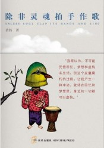
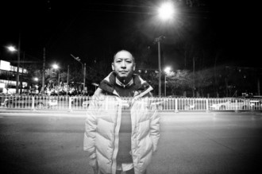

<!-- # 老尽少年心，无复相思人 -->

“一个衰颓的老人只是一个废物，是件破外衣支在一根木棍上，除非灵魂拍手作歌，为了它的皮囊的每个裂绽唱得更响亮。”

读到叶芝的《驶向拜占庭》之后，我开始与苗炜和解。

这个引用在苗炜第一本小说集《除非灵魂拍手作歌》中第三篇小故事中，借用主人公吴胖子之口道出。这个吨位200斤的胖子，青春期时是个不折不扣的大诗人，写的都是让人浑身打颤的诗，比如“我遇到太阳，就把它按到水里面，我遇到爱情，就把它按到草地上。”我要是出现在这小说中准接下去“那看来吴哥的爱情得无往不胜了，就你丫这200斤的操行，把母猪压到地上猪也反抗不了。”来京一年，我的南方口音越来越少，北京话说得孤苦伶仃一点也不可爱，故事中那个叫史小杏的姑娘就可爱多了。

在相识的那场戏中，她跳进吴胖子和苗师傅的人生，教他们认识了红松、油松、红皮云杉、桧柏、侧柏、国槐、垂柳、椿树、小叶白蜡、迎春、黄刺梅、连翘、木槿、沙地柏、月季、美人蕉，最后她带他们去喝酒。那个时候吴胖子还叫吴笑宇，体重也才70公斤，他在酒桌上背诵了大概十首歌咏植物的唐诗，一下子就俘获了史小杏的芳心。

对任何一个觉得自己必将成为大诗人的小年轻来说，青春都是一场盛宴，可以做操蛋的梦，可以说操蛋的话，甚至干操蛋的事，这一切都可以以年轻时的冲动搪塞过去。在荷尔蒙高涨的黄金时代，就算你要飞，也没人嘲笑你，因为每个人都飘飘然，都还不知道人生孤独，贫困、污秽、野蛮，又短暂，每个人都要被生活加工成碎片。

于是在酒桌上吴胖子斩钉截铁地道出人生发财的宏愿，而史小杏望着吴胖子斩钉截铁地说要结婚。接下来，吴胖子发了大财成了吴总，史小杏成了生物教师，经常给吴胖子写信。在吴胖子还是吴笑宇的时候，面对史小杏的一见倾心，他无不傲娇地说以后还会有更多的姑娘喜欢我的，在吴胖子成了吴总后，京城名媛模特大蜜每个的姑娘都卯足了劲拿胸贴他。史小杏可没这本事，她只会写信教他天冷多加衣，最后等不过嫁了个工程师移民加拿大，五年后离婚，工程师要回国抓机遇，她独居卡尔加里。吴胖子倒是一直没结婚，史小杏说他有病，我也觉得他病得不浅，小杏这么好的一姑娘，他居然不跟她好，而理由是“她是沉溺于梦想的姑娘”。再最后，史小杏对植物的爱好转移到动物的身上，在卡尔加里的一个动物园当解说员，后来在一个秋天，史小杏在某个国家公园徒步时失踪，那个地方山路陡峭，河流湍急，有棕熊出没。《燃情岁月》中特里斯坦就是在与熊的斗争中死去的。

我很感激苗炜给史小杏安排一个这样的结局。所有的青春和诗歌都得死，葬身自然算死得其所，比成为恶心的巨型行尸走肉要好千万倍。活下来的都是灵魂的残余，都是有病的。

《除非灵魂拍手作歌》这个写了一个完整人生的故事的短篇就是整本小说集的浓缩。吴胖子是活下来的所有的“我”——“挣许许多多钱，打打桥牌，喝马提尼酒，摆臭架子、出入大饭店。”，这正是《麦田守望者》中的少年霍尔顿反对的世界，忆青春的这个“我”，不过是过上成功人士生活的霍尔顿，在回忆他在反对这种生活时的岁月，这种回忆有着让人作呕的油滑，还有种阳痿气质。

这种阳痿气质在开篇《很久以前那个国庆节的红色花环》中就达到了登封造极。这个故事就是说老文青在饭局上认识了一个叫灵儿的姑娘，然后带着她逛了北京城，回忆跟初恋小南的文青岁月。然后是《失败者咖啡馆》，讲几个岁数不一的文艺青年在咖啡馆里胡诌的故事。接着在《一块肉的觉悟》中讲他如何对被世间灯红酒绿的食物喂养这件事作呕，以至于对一直想上的写美食的女作家也终于提不起兴致了。

这样的素材本身就散发着谢顶、做作、自以为是的气息，烂俗地让人作呕。北京城市里小资儿或者中产阶级那点儿破事儿，乏善可陈，写成小说也不好看。

几年前，还在一个小城市横渡穷比的青春期的我，利用每周日下午那点可怜巴巴的时间站在书店里看完了80后们在荷尔蒙驱使下的文字，然后又找来驱使他们荷尔蒙冲动的一些老家伙们写的书。曾经磨刀霍霍般地向往冯唐笔下的青春，也擦掌磨拳地渴望石康写到的北京各种局。然后，阴错阳差，还真见识了曾经想见的那些人，看到了他们的局，也看到了更多圈子的交际和局。最初是虚荣感的满足，伴随着紧张、兴奋，然后是乏味、困顿和恶心。本来寻找的是特别的灵魂，后来才知道，哪里有那么多特别的东西，很多牛逼的人事都只限于看起来如此，横行霸道地都是虚张声势的妖怪，一戳是满肚子的油水和不能自控的谎言。混圈子的江湖，哪还有灵魂，有完整的人就不错了。

从苗炜的《很久以前那个国庆节的红色花环》可以窥知这些局的主要情节。一些年轻的文艺女孩，怀着一颗拯救文艺大叔困顿的圣母心，一拨拨的投入圈子中，有的是被老男人的光环吸引心觉靠近一点就能吸取点光芒，有的是自觉是特别的灵魂希望得到另一个灵魂的感知呼应。于是，老男人们就当起了导师，开始指导人生的演说：你看我们年轻那会儿，世界可不是这样，天是蓝的，云是白的，女孩子都是矜持的，来来来我给你讲讲我们那时候是怎么器宇轩昂打飞机的。说罢，拉起女孩小手开始背诵那时候的诗。说实话，我真是被苗师傅在《很久以前那个国庆节的红色花环》中掉的那些书袋子砸酸了脑袋。

不过，大概很多女孩子都比我善良，心甘情愿地用青春写下密不可宣的文艺情节。或许也不算密不可宣。或许只是揣着明白装糊涂——谁知道呢。她们都特机警，穿跟正常白领不一样的衣服，遇到老男人就一起感叹青春，对个诗词歌赋，机智的话说得一溜一溜的，接招调情接得特巧妙，美好得跟小妖精一样。这一拨拨的女孩就像一年年的小麦一样，收割一茬又来一茬，风格都那么像。我要是老男人，保准也心驰神往。可我又常常无可避免地想：那些浑身已经散发着过夜酒酸臭汗味的老男人们还干得起来吗？不会觉得有心无力吗？

大部分人活到一定岁数都会变。大部分人都会变得有空子就钻，有便宜就占。一些男人都到了操不动的份儿上，见到姑娘也还是不忘拉拉人家小手，摸摸人家小腰。但姑娘的腰肢也真是美啊，美得跟世间不会消散的诗一样，横竖老去一拨又有一拨长起来。有人就说，留恋新鲜的胴体就是在写生命的赞美诗。年轻的时候总想着活得不是夏花般绚烂就去死，可活久了后，就变得胆小，患得患失，今日有酒今日醉，管它今日是何年，根本没有死的勇气。

《失败者咖啡馆》是组文青群像，小说中登场的有每小时收费5万却面临中年危机的咨询师老黄、从电视台辞职出来专拍纪录片的老江、文艺女中年兼咖啡馆老板娘老江媳妇、波西米亚文艺女青年电影编剧（未遂）安妮、青年思想家、报社编辑、还有“我”，这些无所事事的人整日在咖啡馆扯淡，剧情跟奥尼尔的剧本《送冰的人来了》一样。文中的老板娘最初还拒绝别人在她的咖啡馆里开成功学培训课，最后还不是把楼下改成快餐店。

“怎么就忽然成了这样，在世界的外面愉快地张望，看尽人间的荒唐，装得和他们一样。”老板娘曾经写过的诗句，卖给古装剧当片尾曲歌词了。装什么装，其实就是一样。当文青的时候，觉得自己和世界是剥离的，有种看人江湖斗的超然，但仔细一审视，自己并不是那个幸运地根本不需要也没改变的人。

人寿多辱，人活久了也会有越来越多的伤心事儿，变得破碎。我为自己变得困乏的灵魂抱歉。以前无论怎么喝酒，都是傻呵呵的笑，觉得人生真好啊，我要慢悠悠地晃下去。现在稍微沾一些酒，就开始想哭，觉得满眼都是酸楚的东西。我来世间找另一个灵魂，却最终只能搂着破碎的自己。

至于《一块肉的觉悟》，俗得令我不想做评价。《日光机场》写得太像萌芽参赛作品了。《烧鸡》写得啰嗦，令人着急，小说缺乏自我推动的动力。但我最终还是滴了两滴泪，在看完最后一个短篇《流水》时。这篇小学生作文的写法的小说，讲的是发现自己的好友父亲是患癫痫的被众人咒骂的学校教导处主任，没什么花里胡哨的东西，不是在模仿塞林格、厄普代克，脱离了村上春树的影子，也不见缝插针地塞进些诗歌，更没有那种全知全能感的传递，因而显得相当诚恳和动人。

我对苗炜毫无恶意，但我对苗炜写得那个圈子中的阳痿龌龊气氛充满厌恶。苗炜把那些个中年危机感传达得相当好，他知道有那回事儿存在，而且他要嘲讽那回事儿，于是他就连自己一起嘲讽了。这也挺可爱的。

难怪有人说不要混圈子。圈子里大多是老油条。你要问他们是谁，回答最多不过是“我也曾有过真心”罢了。你被他们夸奖特别、灵动，你以为自己终于遇到一个能看到自己的灵魂，实际上你不过遇到一个吸血鬼。

看完了苗炜的这本小说，我本来想写一首诗。潮白河就是一首晃晃悠悠的诗，它流动着把幻觉传递给我，河滩上的树都像一颗颗的蘑菇，我喜欢的男孩子蹲在树下乘凉，好多的蘑菇树，好多男孩子，我想写一首诗给这个男孩子，但是我不大知道他是谁，因为好像我心中并没有这个男孩子。

最终我只想到了一个小说。故事说的是，一个女孩跟一个男人出去看电影，后来男人带她回同一个小区的另一处房子，她开玩笑说“不会是那个房子里有你老婆吧”，没想到在她到的那个房子里果真摆着他老婆的照片，衣帽架上还有他老婆的运动衣，伤心的女孩就穿着他老婆的一件裙子跟他来了三发，期间还要打电话叫给他老婆听，扮演够了小婊子角色后，第二天早上女孩拿走了他老婆的运动衣，而他恳请不要再拿走裙子，并许诺下周末带她去买件的新裙子。女孩心中想我要拿下那件DNKY裙子后跟他绝交。

想着想着，觉得这故事真难堪。活着也真难堪，连个情书都写不下去。之前看到过一句话，说“混世和洗白两件事，对聪明人来说，都很容易，不大聪明的，都很难，胆子再怂一些的，两件事都没做过，比如世界上的大部分人。”成功的房地产商人们，都是当年失败的诗人，能拼凑两句“忍听秋雨吟，老尽少年心”

“牧草青如许，无复相思人”。要是能够像吴笑宇那样发了财，成了胖子也没啥。就怕成了身无长物的穷人，还肥肠脑满。

**驶向拜占庭******

**叶芝**

那不是老年人的国度。青年人

在互相拥抱；那垂死的世代，

树上的鸟，正从事他们的歌唱；

鱼的瀑布，青花鱼充塞的大海，

鱼、兽或鸟，一整个夏天在赞扬

凡是诞生和死亡的一切存在。

沉溺于那感官的音乐，个个都疏忽

万古长青的理性的纪念物。

一个衰颓的老人只是个废物，

是件破外衣支在一根木棍上，

除非灵魂拍手作歌，为了它的

皮囊的每个裂绽唱得更响亮；

可是没有教唱的学校，而只有

研究纪念物上记载的它的辉煌，

因此我就远渡重洋而来到

拜占庭的神圣的城堡。

哦，智者们！立于上帝的神火中，

好像是壁画上嵌金的雕饰，

从神火中走出来吧，旋转当空，

请为我的灵魂作歌唱的教师。

把我的心烧尽，它被绑在一个

垂死的肉身上，为欲望所腐蚀，

已不知它原来是什么了；请尽快

把我采集进永恒的艺术安排。

一旦脱离自然界，我就不再从

任何自然物体取得我的形状，

而只要希腊的金匠用金釉

和锤打的金子所制作的式样，

供给瞌睡的皇帝保持清醒；

或者就镶在金树枝上歌唱

一切过去、现在和未来的事情

给拜占庭的贵族和夫人听。

查良铮译

（采编：王卜玄；责编：王卜玄）

[【艺评专题】略说沈从文与汪曾祺](/archives/33560)——汪曾祺比沈从文多了士大夫气，文人气，写得更“雅”，更像文人画，更有人情世故。沈从文是真正的赤子之心，看什么都是小孩子的视角，明澈中有残酷，残酷是因为面对真相时候的心平气和。 [【艺评专题】打龙袍](/archives/33743)——正如列宁称托尔斯泰为“俄国革命的一面镜子”，一切文艺作品都不自觉地折射出了所属时代的某一面。时隔若干世纪，我们又能从《打龙袍》中看出怎样的时代气象与人物风流？ [【艺评专题】四郎探母](/archives/33838)——佘太君见到杨四郎，哭过之后，并不谈家国天下，而是问他铁镜公主是不是贤惠！这是多么家常的一个问题呢！十五年母子未见，几句家常，便是一辈子难忘的恩情了。想来，那些战火连年的时代，离家索居的儿子，思念起永世不见的母亲来，不正是这样的唱词吗？

或许有一天，等我们自己白发满头，父母俱往的时候，连这一折《坐宫》，都不忍卒听了。 [【艺评专题】王小波的不幸](/archives/33899)——迟早有一天，我们都会满足于140字的微杂文，以及《王小波最伤人的89句话》。有一天我们都会死去，追求智慧的道路还会有人在走着。但一想到这些人越来越少且越来越懒，我心里就很害怕。 [【艺评专题】走向不和](/archives/33941)——都说中国人坚忍善良质朴勤恳，我看中国人才最是霸气十足，别的国家建国史里总能找出些妥协、合作的痕迹，我们的开国先贤却非要唯我独尊，通杀全盘。每一次变革总需要血流漂杵、动乱不堪，总会引起国人的咒骂与怨言。
