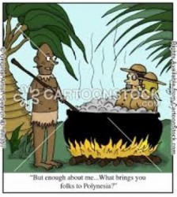
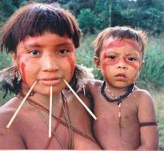
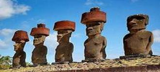

<!-- # 漫话人吃人 -->

本文无任何血腥图片或描写，只是平实叙述真刀真枪的以及传说中的吃人故事。同我所有的文章一样没有条理，只是由大量的片段凌乱堆砌而成。

**吃人的动机******

可能在现在的一般人看来，吃人的原因无非是荒年实在没别的东西可吃，或者只是在少数情况下是恶棍为了体现自己的残忍。但是吃人其实是可以有非常多样复杂的、乃至截然相反的动机的：神秘性的（把食人同创世联系在一起）、宗教性的（人祭）、仪式性的（多在葬礼上进行，吃掉尸体，以防亡灵归来）、虔敬性的（吃掉亲人以示尊敬、更好保管其肉体）、魔力性的（相信吃人可以获得力量）、法律性的（将被吃作为一种惩罚）、医疗性的（人肉治病）……不过最常见的食人动机还是一个字：饿。饿又分两种情况：一是饿慌了，实在没东西可吃而只好吃同类；二是口味刁，纯粹觉得人肉好吃，故改善下伙食。

**Cannibalism****的词源**

食人的英语写法是cannibalism，其余西方语言里的写法与之大同小异。这个术语还可以指动物的同类相残，星系的互相吞噬。楼主初见这个词的时候总觉得这个词应该和迦太基的汉尼拔（Hannibal）有关，并猜测可能是汉尼拔在长途跋涉袭击罗马时军粮不继，犯了这种事，所以后人才以他命名食人现象。有的以食人为题材的电影也有意把吃人者命名为Hannibal，其原因大概也在拼写的相似性。

但是迦太基的那位汉尼拔纯属躺枪了，cannibalism这词其实来自美洲土著加勒比人（Carib people）的名称。据考证，这个民族的名称在土著语里的本意是“勇猛”。据说这个民族征服了阿拉瓦印第安人，杀光吃光了阿拉瓦男人，把阿拉瓦女人都收为妻妾，一度成为了加勒比(Caribbean)湾的一霸。哥伦布到达加勒比湾时，听到当地的其他土著说到过所谓的Caniba人（土著语言里n、l、r不分）。土著们描述道，Caniba们住在临近的岛屿上，独眼、狗面、吃人，弄得周边部族惶惶不可终日。Cannibalism一词就来自于哥伦布记下的Caniba的发音。

**人肉的口味**

史书记载，齐桓公跟厨子易牙开玩笑说：“天下山珍海味我都尝遍了，只是没吃过人肉。”易牙为了讨齐桓公的欢心，煮了自己的亲生儿子献上。齐桓公在不知情的情况下吃了人肉，觉得很好吃，后来知道真相后十分震惊。从一个侧面也可见，在当时的开化的中原人看来，吃人已属于不可接受的行为。

另一条记载：隋末大乱时，湖北河南交界一带饥荒严重，民间人吃人成风。朱粲是当时的大匪首，他每到一处就纵兵捕人当军粮吃，他对士兵说：“世上最好吃的肉就是人肉，只要天下还有人，我们就不怕没得吃。”后来朱粲投降唐高祖李渊，李渊派段确去受降，宴席间段确酒醉，对朱粲说：“听说你爱吃人肉，人肉到底是什么味道？”朱粲答：“醉鬼肉就像糟猪肉一般味道。”段确大怒骂之，朱粲被骂也大怒，就下令将段确杀了分吃。

欧洲航海家曾经在澳洲亲睹毛利战士杀掉并肢解了一个人，然后吃掉了其部分尸体，欧洲人从这个吃人者手里买下了未被吃的人头，带回船上。后来又有毛利人上了这些欧洲人的船，他们看到那个人头，便露出一脸馋相，还用手势表示这个很好吃。欧洲人便给了他们一块脸颊肉，毛利人火烤后就很开心地啃掉了。

这些血腥的记载给我们今日这些吃不到人肉的人提供了可贵的关于人肉风味的第一手陈述，即：人肉的味道确实是不错的。

既然人肉的味道很好，那么大家为何不吃人肉呢？这是因为开化的社会有道德规范和法律约束，食用自己的同类会给周围的人带来巨大的恐惧，是一种极大的罪恶，犯下这种罪行的人会被整个社会视为危险的恶魔，所以人类对自己的同类的食欲也得以遏制。也只有在礼崩乐坏的乱世，才会在文明国家出现大规模的食人现象。

但是野蛮人管不到这么多，一些考古学家根据一些出土的人类遗物断定原始人类存在普遍的食人现象：欧洲和中国的很多古人类遗址里所发掘到的人骨都和兽骨一样，明显被火烤过或敲骨吸髓过，可见原始人吃同类就和吃动物一样。

后来各大文明的人类渐渐开化，原先不足为奇的食人也渐渐变成了稀罕事，似乎只在化外之地食人之俗才能保持较久：

万震《南州异物志》曰：乌浒，地名。在广州之南，交州之北。恒出道间，伺候行旅，辄出击之。利得人食之，不贪其财货。并以其肉为肴菹；又取其髑髅，破之以饮酒；以人掌趾为珍异，以食老也。”

《墨子·鲁问》：“楚之南，有啖人之国者；其国之长子生，则解而食之，谓之宜弟，美则以遗其君，君喜则赏其父。

《节葬下》：“越东有輆沐之国，其长子生，则解而食之，谓之宜弟。”

古中国的各种志怪笔记也多次提到过交广闽的海客浮海误入海岛上的食人国的事情。事实上，食人之俗也确实遍布太平洋沿岸及岛屿。海岛上缺乏大型动物可供肉食，可能正是这个原因使得居民不愿意浪费同类的肉，并渐渐吃上了瘾。

根据一个欧洲传教士的汇报，一个印第安头人让他的一个妻子单独居住并好吃好喝，为的是养肥了吃她。

上述几条记载中的蛮族食人一不是因为饥荒时期无可奈何，二不是出于高端大气的信仰原因，而纯粹是为吃而吃。有意思的是不开化的食人族也是知道忠孝的，好吃的东西还晓得贡献给老者、君主先吃。

文明之地也是偶有喜吃人肉之风的：据阿拉伯史学家记载：吃人肉在十三世纪的埃及曾成为一种时髦。各个阶层，各个地方都表现出对人肉的欲望：起先是隐秘的、带有羞恶的，后来几乎就堂而皇之了。当时的埃及人研究出了许多种人肉烹饪方式。

**

食人神话**

亚诺玛米人（Yanomami）居住在委内瑞拉和巴西边境的与世隔绝的高原森林中，这个民族因为Ruggero Deodato的极富争议的电影Cannibal Holocaust而臭名远扬。这部电影大家不妨百度之。

亚诺玛米人的创世故事是这样的：在人类之前，大地上居住的是所谓的“先代生灵”，他们在一连串的亲属之间的互杀、互奸、互吃之中自己灭绝了自己，极少数幸存者之一的月神所滴落下的血演化为后来的亚诺玛米人。

（萌萌的亚诺玛米儿童）

希腊神话也有亲属相食的重口故事：宙斯之父克洛诺斯推翻了自己的父亲乌拉诺斯才得到众神之王的位子，所以他的父亲诅咒克洛诺斯注定也会被自己的孩子推翻，克洛诺斯此后有孩子出生时，便立刻将其吃掉，以绝后患。宙斯出生时，母亲瑞亚害怕宙斯也被其父吞掉，所以宙斯的母亲就用一块石头抱在襁褓里，代替宙斯给孩子他爹吃。

**用肠胃埋葬至亲和仇敌**

同为吃人，有的是出于恨，有的可以是出于爱：Endocannibalism指用吃来表达对死者的敬意，对死者尸体的爱护以及借此让生者吸收死者的能量，这种情况下常需要各种仪式典礼；Exocannibalism是指用吃来彻底消灭敌人或罪人，让其无法作祟，很多犯了禁忌的传教士被土人吃是属于后者。

很多民族有吃掉死去的亲人的习俗，他们认为这样才是对死者最大的敬意。它们中的不少为了保存或获取死者的力量，主要是吃人体中被认为具有法力的部位，比如脑。太平洋的一个民族中曾经高度流行一种类似疯牛病的疾病，后来专家查明，其原因是该民族的人喜欢吃掉死去亲属的脑，导致了传染。该风俗被革除后，此疾病也消失了。

前文说过的亚诺玛米人的葬礼是这样的：他们焚烧死者的尸体，然后再把火堆中的残骨踩踏成灰，并将其放在小容器中保管。每年都有数次Pijiguao节，每逢此时，他们便把这些灰取出，在某种仪式中将其混在香蕉糜里面搅拌，然后由至亲喝下。活着的亲属们通过这种方式获得灵魂的正能量。另外为了防止恶意的亡灵归来害人，死者的所有的遗物都会被毁掉，也再不会提起死者的名字。

南美的瓦力族既吃至亲也吃仇敌，吃至亲是因为不忍心亲人的遗体被肮脏的土地所污染，并需要隆重的仪式；但是吃仇敌时就和吃野兽一样饕餮野蛮。

小说中的鲁滨逊所遇到的星期五所属的部族是只吃战俘的。

在“文明民族”看来，用吃来表达对亲人的敬爱简直不可思议。这种偏见实在是没有道理，反正生前尽过孝了，现在老人家既然死了，与其把尸体埋在土里给虫蚁、微生物吃，扔进海里给鱼鳖吃，放在天葬台上给鹰鹫吃，还不如留给自家儿孙吃，所谓肥水不流外人田是也。土葬费棺材且浪费土地，火葬会起烟且浪费柴草，都不及“食葬”节约、低碳。

**食人与性**

亚诺玛米人还有很多残忍重口的传说：两个年轻男人先杀掉了一个吃了一个小孩的老汉，然后又弓虽女干了一个妇女，并把她的外阴变成了一个长着牙齿的嘴巴。这个嘴巴能吃掉靠近的阴□茎。再后来，这个妇女变成了一只巨蛇，至今这蛇还饥肠辘辘地窥伺着亚诺玛米男人的肉体。在亚诺玛米人的语言里，吃和交配是同一个动词，所以这种两性之间的“饥渴”是有双重内涵的。

殖民时代有欧洲人汇报说，某个野蛮部族的女人特别喜欢吃男人的那啥。

至于冰恋什么的我就不细讲了，大家自己百度。

**灾难中的吃人**

从古希腊时代起，海难幸存后一起绝望地长期漂流的船员们就用抽签的方式决定先吞食自己中的哪一个。类似的事情直到较近的时代仍有发生：1820年，一艘太平洋捕鲸船被残血的鲸反杀了，幸存的船员在海上小艇漂流了几十天。一开始他们只是吃他们中劳累而死的人，后来发现不够吃，就开始抽签决定吃哪个活人。救下他们的人汇报，这些人被发现时，都瘦的不成人形，还啃着人骨不肯丢下。1884年的一起海难中有四个船员用小艇得以逃生，漂流中，十七岁的小船员吃了海水，奄奄一息，余下的三人杀了他并吃了。获救后，吃人的三人本是可以隐瞒这桩丑事的，可他们却老实承认了罪行，并在归国后被判处死刑，但是后来得到了赦免。

也曾有探险者、旅游者在深山中被大雪围困而被迫相食的事例。

马克吐温有一篇讽刺小说，题目记不得了，就以被困的饥饿的火车乘客投票相食为题材，讽刺了当时美国的竞选。

饥荒食人在各大洲都是相当常见的，漫翻我国史书，每朝每代每州每省都可见“人相食”的记载，多灾多难的天朝从来不乏吃人的记录，甚至可以说，我们每一个人的祖先中都有靠食人才活下来的。

据说复活节岛的岛民原先是靠伐木坐船捕捞海豚为生，后来生态破坏，小岛上没有木头可以做船了，于是大家都没东西吃，只好自己吃自己，最终便把自己吃光了。只留下成排的呆望的石像。

**人祭******

很多民族的人祭是要由祭司或其他人员吃掉被祭的人的：

《北史》流求：“国人好相攻击，收斗死者聚食之。其南境；人有死者，邑里共食之。战斗杀人，便以所杀人祭其神。”

《隋书》：真腊，“城东有神，名婆多利，祭用人肉。其王年别杀人，以夜祀祷。”

不过不是所有人祭都一定要吃掉被当做祭品的人，比如商朝的人祭，很多殷商遗迹可发掘出大批大批的为祭祀而被屠宰的男女成人和儿童。中国的人祭可能也经历过食人的阶段，但后来渐渐消失了：殷商故址考古表明，有的被当做祭品的人甚至是被活着埋进土里的，这样也就不存在被吃的可能了。商朝的人祭规模非常大，据一些专家认为，商朝有时发动战争纯粹只是为了抓人当祭品。东周时人祭已经变得罕见。宋襄公在东方大会诸侯的时候，竟杀了鄫国国君作为献给东夷神祇的人祭，此举遭到了激烈批评。孔子说“始作俑者其无后乎”，因为人俑像人形，所以很不人道，既然连人俑都不人道，那么人祭就是更不能接受的了。

墨西哥的阿兹特克人一贯有施行人祭并由参祭人员吃掉祭品的习俗。被吃的往往是敌对部落的俘虏，阿兹特克人庆祝胜利时，就把成千上万的俘虏宰了吃。心脏归祭司，头颅留下来堆起来，余下的部分由战士的家人带回家加上盐就着玉米吃。阿兹特克古迹中常有上万乃至上十万的吃剩的头骨。

《维茨利普茨里》是德国作家Heine的长诗，叙述了印第安人拿西班牙殖民者做人祭的故事。诗中，西班牙殖民者一面托词传播福音，一面以各种卑劣手法大举掠夺印第安人的财富，并背信弃义，欺凌那些本来对西班牙人友好热情的印第安人，印第安人不堪忍受而与之交战，败之，并俘获了一批西班牙人。俘虏按照风俗被当做人祭，人血用来愉悦战神，人肉则由印第安人分食。有趣的是，文中的印第安人的形象并不很负面，他们诚实、勇敢、朴实、愿意牺牲，他们的人祭是纯粹出于对神的虔诚而绝非口腹之欲；更有甚者，祭司为了部族的繁荣，还愿意额外向神许诺祭上自己仅有的孙子。在文中的印第安人看来，西班牙人才是来自“未被发现的陌生大陆的”的野蛮人，他们贪婪、狡诈、怯懦、虚伪、忘恩负义，更严重的是，他们虽然不吃人，却吃自己的神：基督教教义认为面包是基督肉所化，酒是基督血，那么按照印第安人的理解，基督徒吃面包和酒便是吞吃自己的神，是十恶不赦的。文学作品不可作为一手研究资料，但至少反映了不是所有欧洲人都对食人民族持有一味的歧视和憎恨。

**食人的奇效**

很多地方的人都迷信人体部分有治疗难治愈的疾病的功效。中医相信人胎盘（紫河车）大补，民间也不乏吃人胎盘以强身健体的事情，只是不知吃胎盘算不算吃人？

中国的旧医书称人血人肉可治痨病，所以才会有华小栓家的血馒头……很多人可能以为只有愚昧无知的天朝才会有这种惨剧，但事实上西方人的先人也同样没出息，他们也用人体或用其加工品治病，吃下肚或者做成油膏抹在身上。上至国王贵胄下至平民百姓很多人对其效果深信不疑。西方也曾有很多死刑犯的尸块或血被人取走药用的事迹，一些医书里也有人肉配方，历史上还常有盗尸卖给药店的掘墓案，甚至盗金字塔案。

研习魔法的人相信人肉人油人血的奇效，也会购入以施法。传说中女巫会用人油制成飞行膏，这方面内容详见《欧洲传说中的鬼怪故事》http://blog.renren.com/blog/497076294/908474515?bfrom=01020110200

**食人复仇**

希腊神话中，Tereus Philomete弓虽女干了自己的妻子的姐妹Prokne。其妻闻之怒，杀了儿子给不知情的丈夫吃。

尼伯龙根故事的原始形态中，匈奴王阿提拉眼红财宝，假意邀请自己的勃艮第妻子克里木希尔德的兄弟们来赴宴，而等他们一到就杀害了他们。克里木希尔德为了报复，杀死了自己与阿提拉的两个孩子，并把心肝烧给阿提拉吃。后来的尼伯龙根版本中，这段情节被改得面目全非：匈奴王变成了毫无恶意的慷慨东道主，反是克里木希尔德谋杀了自己的兄弟。

**被吃作为惩罚**

《南史》毗骞国：“国法刑人，并于王前啖其肉。”“国内不受估客，往者亦杀而食之。”

中国史书有对北齐皇帝高洋的暴虐命令的记载：春，正月，癸巳，齐主自离石道讨山胡，遣斛律金从显州道，常山王演从晋州道夹攻，大破之，男子十三以上皆斩，女子及幼弱以赏军，遂平石楼。石楼绝险，自魏世所不能至，于是远近山胡莫不慑服。有都督战伤，其什长路晖礼不能救，帝命刳其五藏，令九人食之，肉及秽恶皆尽。自是始为威虐。

中国历史上也不乏被处死者尸体被抢食一空的记载。袁崇焕被诬陷通敌，被判处凌迟而死，围观百姓争食“汉奸”的肉：刽子手割一块肉，百姓付钱，取之生食。顷间肉已沽清。再开膛出五脏，截寸而沽。百姓买得，和烧酒生吞，血流齿颊。

**战争中的集体吃人**

苻坚穷途末路时被困在长安，城中无粮食，而被造反的鲜卑包围。长安周围的居民纷纷自愿冒着危险来为苻坚送粮，但是大多不能活着到达城中。苻军只能靠敌人的尸体为食物。

唐朝的官军张巡和匪军黄巢都是吃人能手，他们的部队守城时都靠吃市民过活。黄巢占据长安时，城中多宝货而无粮；城外的各路官军都只想保存实力，不想与黄巢作战，反而帮黄巢提供食物：捕捉城外的山民卖给黄巢军吃，换城中的金银财宝。《秦妇吟》中对这种可怕的勾当有隐晦的描写。

十字军骑士们怀着伟大的弘扬真理的理想漂洋过海去近东收复圣地，他们久围穆斯林的Maarat an-Numan城不能下，此时军粮也早已不继。破城后，饿得眼睛发绿的基督徒军人们所做的第一件事居然不是传播救世主的福音，而是在城中大吃穆斯林。穆斯林对基督徒的怨恨良有以也。

二战期间在巴布亚岛的日本兵失去了补给，因而吞食盟军尸体，后来改吃盟军战俘，再后来只能互相吃。十六万日本兵后来只活下来一万人。

战争中大规模食人的不光是军队，也有居民。十六国时期的割据政权后赵崩溃后，首都邺城因为缺粮，城中人就把宫中的宫女几乎吃光了。网络上一些蝗汉把这桩事情栽赃到了后来才进驻邺城的慕容部鲜卑的头上。

**为忠孝食人**

这方面最著名的例子就是介子推了吧。晋公子重耳带着从属流亡时一度断粮，此时介子推割下了自己大腿的肉供主公吃。《三国演义》里有猎户杀妻以食刘备之事，此故事史书无载，应属后人发挥。割股疗亲的故事在历史上不乏效仿者，子女出于愚孝而割下自己的大腿肉以给生病的父母吃，以图达到治疗目的。

……

由于作者知识储存、理论水平所限，本文只能是一个猎奇故事帖，如有遗漏或错误，希望大家不吝补充和指正。

另外，所有的有幸还没被吃的人类朋友们，看完此文后请为你们的被吃的同类默哀三秒钟。

（采编：李以诺；责编：彭程）

[【开学季】英文系怎么办？](/archives/42040)——随着中国经济文化发展，英文系旧有的培养体制，已经无法继续吸引大量的优秀学生。原本还算热门专业的英文系早已风光不在，日渐没落了。究竟是什么原因让英文系走向低迷？英文系的出路又在哪里呢？

[【开学季】东西方政治思想史研究的同调变革——以“斯金纳革命”与“新儒家学派”为核心](/archives/41944)——在20世纪60-80年代，东西方史学界产生了一场“同步”的变革，历史学介入到政治哲学的领域之中，并试图构建出一套政治思想史研究的“新范式”。

[【开学季】荐书单列：二百年后再思托克维尔](/archives/41906)——“作为我国古老贵族的一分子，我对贵族制完全没有天生的仇视和嫉妒……家庭的记忆、个人的利益都不能使我对民主制产生天然和必然的好感。”——托克维尔
