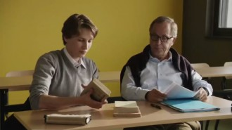

<!-- # 螳螂捕蝉，黄雀在后——《登堂入室》中“窥视”的嵌套 -->

你是否思考过人类为何痴迷于电影。

是因为电影能带来片刻欢愉？还是因为电影带给人完全不同的生命体验？抑或是如安德烈巴赞所言，是源于人类的“木乃伊”情结？这个问题对于不同的人会有不同的答案，但深究其心理机制，我想是源于人的窥视欲。对于自己当前人生经验的不满足，渴望了解甚至介入他人的人生。《登堂入室》恰恰是把握了这种人之本性，创造了一个带入感极强的故事。

这部法国电影原名“Dan la maison”意为“在屋中”，我认为这相比于译名并不是一个很合适的名字。“Dan la maison”强调的是一个结果，而“登堂入室”很明显是一个动作过程，并且在汉语中，这个词有由浅入深、循序渐进的意思，这恰恰是对主人公克劳德窥视并逐步介入他人生活的最好描述。本片讲述的是中学语文老师吉尔曼被班里一个16岁学生克劳德的作文吸引——作文讲述他如何潜入朋友家中，窥探并介入对方一家生活的故事，吉尔曼为激发克劳德的写作潜能竟逐渐成为他的同谋，最终因此丢掉了工作与家庭。影片的高明之处在于它是一个三层嵌套结构：克劳德对于拉斐尔一家的窥视；吉尔曼通过克劳德的作文对其进行窥视；观影者窥视这整个故事的发展。在这样一个复杂的层次中，角色与观影者都逐渐分不清现实与虚构了，我们不禁要思考，究竟谁是窥视者谁是被窥视者。

其实这部影片剥离出的每一层都只是一个普通的故事。我们先看第一层，克劳德对于拉斐尔一家的窥视。这其实是一部掌握更多主动权的《后窗》。《后窗》中窥视者杰弗瑞虽可以对被窥视者进行干扰，但他并没有直接介入被窥视者的生活。而本片的克劳德不但以补习数学为理由光明正大的踏入同学拉斐尔家中，更通过自己的言行举止对家里的每一个人产生影响，最终甚至达到了鸠占鹊巢的效果。

克劳德生活在一个母亲出走，父亲因公致残的家庭，这就造成他母爱及家庭温暖的缺失。同时这也是他选中拉斐尔为窥视对象的一个诱因。但克劳德却并不简单是想在拉斐尔家中体会家庭温暖，他的目标从一开始便很明确：周身散发着“中产阶级女性特有香气”的“飘逸的幽灵”——拉斐尔的母亲埃斯特。随后克劳德展开了攻势，他先取代了儿子拉斐尔的位置。在与拉斐尔父子打篮球时，克劳德的灵敏很快吸引了父亲拉斐尔的注意，父亲拉斐尔对他热情有加而把自己的儿子冷落在一旁。晚饭后克劳德和父亲拉斐尔坐在外面望着公园，克劳德发出了一段颇有深意的旁白“当他和儿子在一起的时候只会谈论体育，谈汽车，谈论篮球比赛，可是和我就完全不一样……我看到公园里有个醉汉在喂鸭子，如果他抬头看到我们一定会以为我是儿子拉斐尔。”至此克劳德的欲望已经暴露无遗。接着父亲拉斐尔与埃斯特的感情出现危机，克劳德又趁机介入，用一首诗俘获了埃斯特的芳心，他们在厨房接吻了。这时我们不禁要转回来想一想，片中父亲与儿子同名是否有所暗示，克劳德想要成为的拉斐尔究竟是儿子的位置还是父亲的位置。

第二层故事中，吉尔曼作为克劳德的指导老师和读者来满足自己的窥视欲。教师与学生的角色设定很容易让人以为这是一部类似《死亡诗社》或《超脱》的影片，但其实这只是一个幌子，吉尔曼与克劳德的真实身份有两层，一层是本片的主题窥视者与被窥视者，另一层是文学活动中的读者与作者。

吉尔曼与克劳德是很相似的，他们都有强烈的窥视他人的欲望，他们都喜欢坐在最后一排，因为“可以观察到整个教室里所有人的举动”。他们都善于利用他人满足自己的欲望。克劳德利用拉斐尔一家填补自己的情感缺失，满足自己的俄狄浦斯情结；吉尔曼利用克劳德来完成自己所不能完成的作家梦。在第一层中克劳德在窥视的同时影响了被窥视者，第二层中吉尔曼同样在自己的窥视过程中对被窥视者产生反馈。影片表现吉尔曼对克劳德产生影响的手法是很有意思的，除了每次的作文辅导吉尔曼引导克劳德修改作文外，导演还让吉尔曼直接出现在了克劳德作文所描写的场景中。在这些场景中，吉尔曼处于一个万能的上帝的位置，他可以与克劳德对话，反驳其观点，而此时场景中的人物并未发觉他的存在。这种手法将两个时空重叠在了一起，一方面是克劳德主观创造的产物，一方面是吉尔曼对与克劳德的创作的反馈，非常直观的让观众得知吉尔曼与克劳德同为这个故事的创造者，他们是同谋。

然而螳螂捕蝉，焉知黄雀在后。看似吉尔曼窥视并利用着克劳德，其实他同样也落入了圈套，由窥视者变成了被窥视者。我们回过头来看吉尔曼第一次与克劳德的私下对话。吉尔曼质疑克劳德作文内容的正当性，并说他或许应该告诉校长，但克劳德不为所动，他说“这是我写给你的，不是写给校长的”然后不由分说地把自己第二篇作文塞给吉尔曼。这段场景中吉尔曼主动找克劳德谈话，但对话的主动权却掌握在克劳德手里，他断定吉尔曼对他的故事感兴趣，他熟谙吉尔曼与自己的共通之处，他有把握将吉尔曼成为自己的同谋再变成自己窥视的对象。当克劳德被拉斐尔一家扫地出门后随即又踏入了吉尔曼家的门槛。克劳德被“解雇”算是剧情的一个转折点，从此之后事情的走向便开始失控——但仅仅是失去了吉尔曼的控制。克劳德被“解雇”的原因是儿子拉斐尔看到他与埃斯特接吻，而在这个场景中，吉尔曼是作为一个读者存在的，他还感叹了一句“啊，就差他出场了。”可见这个场景并不是意外，而是克劳德有意为之，他不仅是一篇作文的作者，也是整个故事的作者。罗兰巴特说“作者已死”意为作品在完成之际，作者就已经死亡，剩下的文学创作工作，就是读者的权利了。但对于这个故事来说，作者不但没死，还活的风生水起，完全掌控了读者的命运。到了影片的最后，克劳德找到已经一无所有的吉尔曼，问他是否愿意继续协助自己“登堂入室”，一起去窥探他人的生活，这个邀请已经将同谋的关系彻底明朗化，至此吉尔曼已经完全落入克劳德的股掌之中。

克劳德与吉尔曼窥视着他人的生活，而观众又透过镜头留意着他们的一举一动，这难道不也是一种窥视吗？影片中运用了大量的主观镜头，即克劳德偷窥的视角，这种镜头充分的满足了观众的偷窥欲，并且也让观众成为了同谋者。我们和吉尔曼一样，在现实与虚构间来回穿梭，并对两者产生了错乱感。克劳德究竟有没有和吉尔曼的妻子发生关系，我们无从得知，克劳德的最终目的究竟是什么，我们也无从得知，于是我们又成为了作者，故事中不为人知的部分由我们自己去理解，去创造。满足人的窥视欲的电影有很多，像《后窗》、《他人的生活》、《西西里美丽的传说》，但都没这部来的痛快，它让观众不仅满足了偷窥的欲望，还给人留下许多开放式的内容，任观众尽情遐想。

影片的结尾向《后窗》致敬。克劳德与吉尔曼坐在长椅上看着对面的公寓，你一言我一语地猜测着别人的生活，公寓的每个房间里都发生着不同的事，有阴谋、有情爱、有争吵、有谋杀，人世间的千姿百态就容纳于一栋公寓中。仔细想一想，你是否也暗地揣摩过别人的心思，臆想过他们的经历。回头看一看，你的窗外是否也坐着一个凝视着你的人。

(采编：裴启航；；责编：吴春凉)

注：副标题为编者所加

[<七星影像>读者已死——解读《登堂入室》的野心](/archives/42014)----拉斐尔是想象的能指，意味着完美中产阶级家庭形象的虚幻美好；吉尔曼老师是象征的能指，它不仅具备一个重要的符号身份，而且具有对想象的情节进行象征化升华的能力；克劳德是真实的能指，他不仅在想象的层面上揭露了中产阶级家庭的隐秘欲望与内在危机，而且在象征层面上瓦解了克劳德的符号价值。
