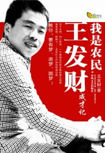

<!-- # “我们要学会与自己的内心对话”——专访爱报道创始人王发财 -->

王发财，1982年生，吉林省白山市人，现居北京。信仰基督教。初中辍学，通过自学写作成为职业撰稿人，历任多家媒体编辑、记者；2012年出版励志体自传《我是农民—王发财成才记》，入选春风文艺出版社“农家书屋”书系。爱报道工作室创始人。以传递普世价值为理念，当下研究方向为公民新闻报道、公益创新领域。在常人看来，一系列的光环笼罩着这个草根出生的年轻人，然而，他的成长背后也有着许多不为人知的辛酸与苦楚，带领他走出阴霾的，正是信仰与新闻的力量。

_王发财自传——《我是农民》_

##  做新闻：应当有一颗纯真的心

**Q：是什么让你从一个初中辍学的普通农村孩子靠自学成为一名职业撰稿人的？

**

A：其实我并不是从小就心存远志，我最早奋斗的驱动力应该说是源于对生存、对命运的恐惧。我生活的山村很封闭，家庭环境也很压抑，我只有两个选择，孤独地在那里生活下去，直到和他们一样，但那样的生活对于当时满怀梦想的我来说几乎不可能忍受。另一个选择就是逃出来，找到能让自己活下去的土壤。

** Q：那在这个过程中哪些人或事给你留下了深刻的记忆？**

A：我记忆最深的应该是跟着中国青年报吉林记者站站长彭冰去做关于政府强征农民土地的采访。那是我第一次采访，第一次真实了解到无处诉苦的农民的无奈与辛酸，也是第一次看到职业记者的严谨又不失平和，让我心生敬畏，并萌生了也想像彭冰一样去采访伸张正义的想法。

**Q：从你的作品中可以看出你有丰富的文学素养，与文学相比，新闻有着哪些更值得你坚守的地方？**

A：作家更多的是喜欢在封闭的环境中创作，是一种掏空自我的过程。而新闻的真实性让我必须敢于面对这个现实社会，同时我又喜欢与人交流，与有着不同人生、不同故事的人交流，就是在吸收多种多样的营养，这些都是新闻能给我带来的。

** Q：你没有受过新闻专业的高等教育，但现在却做着新闻传播工作。那么你认为对于媒体人而言专业知识有多重要？

你觉得新闻人还有哪些必备素质？**

A：新闻人应当有一颗纯真的心，这是最基本的。新闻人有原则，有责任感，同时必须有职业敏感性，专业素养也非常重要，因此专业培训是必要的。受到过高等专业新闻传播教育的新闻人拥有的专业知识更系统、更全面，思维方式更客观、更理性，也更善于总结经验。但关键也要看一个人的内心和价值观，这是学校教不会的。

** Q：你刚刚提到“新闻人关键也要看内心和价值观？”能具体谈谈么? **

A：新闻人的良知和传递的是否是正向的价值观至关重要。良知，包含了对社会的体验、对人性的探究；价值观包括对国家、历史、体制的思考。

**Q：近些年出现的公民记者，是否是对传统记者的一种挑战与颠覆？**

A：不是，传统记者具有身份优势和专业优势，这是公民记者无法挑战与颠覆的；我们有我们的优势，我们自愿跟传统媒体合作，共同发展新闻行业。现在越来越多的传统媒体，不再局限于单靠自身有限的采编团队，而是运用大量的独立媒体人进行参与式报道，从而支撑更新网站等新媒体平台。这样既能丰富网站信息，又能增强用户之间的互动性，也有效地缓解了新闻网站的原创信息需求。这些东西都不能仅仅靠专业知识获得。

** Q：你觉得如今公民记者尚存在哪些问题？**

A：部分公民记者存在着不能客观思考新闻真假，盲目听从许多网络水军对新闻事件发表的评论，盲目传播未经证实的消息，缺乏独立思考的能力的问题，这些都是阻碍独立媒体人生存发展的不良因素。很多独立媒体人，虽然有条件可以第一时间接触到丰富的新闻素材，或成为某些突发事件的目击者，但由于公民记者自身的不专业他们生产出来的新闻往往只是单一信源、随机的、片段的、表面的和缺乏深度的半成品。

** Q：听说你和你的媒体朋友为公民记者办培训班。公民记者培训班如何解决哪些问题？**

A：公民记者培训内容主要涉及如何成为撰稿人、如何与媒体合作、如何进行市场化写作以及公民记者采编技巧等诸多方面。

** Q：当前我们正处于社会转型期，很多方面制约着公民记者的发展，作为新闻人，是应该等待这个成熟环境的到来，还是走在时代的前沿去开拓这样的环境？**

A：这个社会不是只有对抗和妥协两种方式，在接受现有环境的前提下做一些可能的探索，也许看起来没有那些大刀阔斧的开路人那样勇猛，但同样是一种开拓。

另外，我并不指望我的声音被所有人接受，如果全社会只接收一种声音，这个社会本身就是不正常的。

##  爱报道工作室：培养思维创新理念

**Q：你的工作室取名爱报道，而基督教是“爱”的宗教，这里的“爱”是否有异曲同工之处？**

A：其实并没有直接联系。爱报道的“爱”是爱好、喜欢的意思，表示我们这样一群年轻人通过做报道来寻找自我认同。

** Q：爱报道与主流媒体之间的关系是怎样的？**

A：在当前环境下，我们和主流媒体是共生合作关系，也就是我们提供采编内容给主流媒体。

** Q：爱报道当下研究方向主要包括哪些领域？你们又比较注重哪些领域呢？**

A：我们爱报道由专题报道组、深度报道组、社会文化组、公益创新组、明星人物组、校园报道组和海外报道组七个小组组成。在这些领域中，我们很重视专题报道和深度报道两个领域。

**Q：就读者的反馈来看，哪些领域最受人关注？**

A：专题报道、深度报道、公益创新、调查维权以及教育都很令人关注。

** Q：你们打算继续扩展报道领域吗？**

A：当然要继续延伸我们的报道领域，目前我们最想做的是关于历史方面的报道。

** Q：爱报道工作室中汇聚了来自数十个高校的80后与90后年轻人，对于这些年轻人来说，爱报道带给他们哪些比在学校学习获得的更宝贵的东西？

**

A：我并不知道他们能在学校学到什么，但是在爱报道，他们学会了去了解这个社会和当下的世相人心，也学会了悲天悯人。给你看下一些团队成员写下的感受吧：

_

_我自豪每一次以一个公民个体的身份对话社会领袖、公益人士，不仅仅是因为一份独立性，也看到了这个社会对于多元的媒体报道形态的一种尊重和认可。我觉得，在爱报道团队，一份开放度的心态帮助我成就更多。

——（专题报道组）杨书源

其实一个人的成功与否，才华、运气和能力固然重要，但面对事情的心态和态度更为重要，后者直接决定了前者的“行为”。

——（公益创新组）杨莹

原来老百姓的事并不普通，和报道的深度联系起来，都是大家关心的话题。原来老板总裁也没有那么高高在上，倾心交谈，他们也都是和蔼的平常人家。报道对象不分阶层高低，但用真实时效的人和事，对读者产生亲切感、参与感和冲击力。

——（社会文化组）焦燕

看到这些团队成员写的采访感受，会觉得每一个个体的成长都是那么令人欣慰。

**Q：作为民间新闻机构，你们的经费来源是什么？**

A：我们没有得到资金支助，经费来源是和主流媒体合作赚取的稿费。

** Q：能否简单介绍一下爱报道的机构设置？**

A：爱报道下设三个部门，分别是采编、传播与培训部门。采编部门内部分工，有策划组、采访组以及编辑组；传播部门负责与各大媒体联系，包括传统媒体、主流网络以及自媒体等等，为稿件寻找合适的刊登平台；培训部门负责定期举办公民记者培训、团队内部培训以及志愿者培训。

** Q：爱报道宣传普世价值，这个普世价值指的是？

**

A：我提倡新闻报道的普世价值，是我们做的报道要具备能够影响和帮助普通人。

** Q：在这些年的新闻实践中，这一普世价值提倡效果怎么样？**

A：可能受到身份的限制，我们的报道影响力有限，但能影响一部分人也是好的，希望从身边人开始激发出他们对新闻的关注，对社会有独立的思考。

** Q：跟传统媒体相比，爱报道工作室具有哪些优势？**

A：优势主要来自于爱报道工作室的成员多数来自基层一线的公民记者，他们对社会、民生的观察体悟深厚；所撰写的报道来自公民记者身边的人和事件，直击社会底层问题，具有深度和广度。

我们秉承严肃新闻底线，在各报道领域深耕多年，获取独家新闻线索源。对于每一条线索来源，我们进行多次核实，确保稿件的真实可靠。

我们派出采访成员对当事人进行面对面的深入交流，减少通过电子邮件、电话等采访方式。所有稿件在写作前，从角度的选定、文风的选择、人物形象的塑造等，都要经过团队深入的讨论，所有稿件在发出前都有专人负责修改和校对。此外，我们会对工作室所有作者进行培训、考核和评定，不断补充新成员，优胜劣汰。

** Q：你的团队在报道中采用的是一种柔化冲突的方式，你也说过你不以揭黑为目的。是因为你觉得柔化处理比尖锐地批判更能达到预期效果吗？**

A：我们只是民间机构，这样的身份决定了我们有局限性，我们不是不想揭黑，而是不能揭黑。况且即使是正规新闻人，揭黑也同样有风险。我们现在可以做的就是给身边人传递一种思维创新理念，在民间机构能力范围之内对社会形成改变。

** Q：你刚刚提到爱报道的局限性，除此之外爱报道工作室还具有哪些不足？**

A：因为是民间机构，公信力不足的问题让我们非常困扰。许多公众人物都会在采访前询问类似于“你们的报道可以在正规媒体发表吗？”、“你有证件吗？”、“你专业吗？”等等问题，很多时候诚心诚意地去回答他们也无济于事。整个社会对我们的认知还需要有一个接受的过程，但我觉得爱报道的公信力会在一篇篇有说服力的报道中逐渐体现。

** Q：你希望爱报道工作室在这个行业中起到怎样的作用？**

A：“爱报道”要做的不是成为一个知名的媒体，而只是一个非专业媒体人与社会联通的平台。“爱报道”是新闻行业的一次思维创新尝试，我希望参与式报道能让更多多人参与其中，实现自己的新闻理想。

** Q：在未来的发展中，爱报道工作室有哪些可以把握的机遇？**

A：机遇还是有很多方面的：

在政策方面，由于未来非行政类报刊将转企业，这就意味着媒体为了更加吸引广告主和读者，必须在内容上下功夫。

在传统新闻机构方面，优秀采编记者匮乏，加上行业生态环境恶劣，记者收车马费、红包、拉广告等行业潜规则氛围笼罩。但是能一线做新闻采访的记者数量增长有限，迫使报纸采编分离和外包采编。而除大型报业集团和传统媒体的采编记者，中国专业的民间采编机构寥若晨星，而爱报道在这方面恰恰做这探索工作。

在网络传媒方面，当下的主流网络媒体主要靠无偿转载传统媒体内容吸引客户，普通网络媒体则靠发软文和维权稿过的滋润无比，但在未来没有独家内容的网站还是要靠内容吸引网民和广告主。随着博客、论坛、微博、微信等一系列自媒体的涌现，打破了传统新闻管制时代的媒体发布格局，也使得公民发声、公民采编成为可能。

_“爱报道”创始人王发财_

##  信仰的思索：学会跟内心交流

**Q：在信仰基督的过程中，你的内心有过哪些变化？**

A：我内心的变化大致分三个阶段：我曾经也喜欢趋众。到了后来，判断一个事物时我开始听从内心的选择，先问自己的心。现在判断一个事物，我会首先祷告神，等候神，给神做工的时间。

**Q：什么样的经历促使你内心发生的每一次变化？**

A：在最早的时候，我是典型的力量型人格，性格张扬，并且追求名利。这种浮躁的个性发展到后来就是目中无人，自我被无限放大。因为我是一名基督徒，我通过向基督的忏悔认罪，因此我有了时不时拷问内心的机会。每天都问问内心的感觉与未来的价值观是否一致，长此以往，看问题的思路就发生了改变。

**Q：听说你曾患过抑郁症，一个乐观开朗的人，为什么会抑郁？可以描述一下你那段时间心情吗？**

A：我之前一直怨恨自己小时候所遭受的不公平对待，坎坷的童年，没有母爱的遗憾；加上多年在社会底层的打拼经历，更是遭受很多挫折，让我没有安全感；而且我发愤图强、强迫性看书的自学，招到几乎所有人反对，但我仍然坚持。最后虽然成功了，其实从某方面来说渐渐地在内心深处生成了一种看待事物极端偏激偏执的因素。再加上我是一个地道的农民，在小山村里长大，一下子鲤鱼跳龙门突然来到城市，一个人无依无靠，单位又是末位淘汰机制，恐慌与不安全感敲击着我的心。积累久了，就自然会抑郁。

**Q：最后是什么帮助你走出了抑郁？**

A：在那段日子里，我也寻求神的帮助，但神仿佛失去了作用。但最后能够走出抑郁还是通过我坚持进行的祷告，日复一日的与自己、与神对话，不断认识自我。

对于这些不堪回首的往事，我知道怨恨是没有用的。我开始尝试着接纳过去的一切，试着原谅过去一些人和事对我的伤害，也试着接纳自己的另一面，接纳自己抑郁的这种状态。

我尽最大努力调整着，不断的战胜另一个负面的自我。并且，对抑郁有了新的理解：抑郁其实永远也无法彻底根除，它本身就是另外一个不成熟的我，我们战胜抑郁的过程就是战胜自我的过程。当你真正打败负面、抑郁，没有成熟长大的那个自我的过程，我们就获得了巨大的成功和成长，我们就能一步一步触摸到自己的心，寻找、认识到真实的自己，抑郁自然就会慢慢消除……

**Q：那对于大多数不信仰基督教的人来说，没有信仰的支撑，又应该怎样说服自己抽出时间与自己对话？**

A：试着慢下来，安静下来，和自然律一致。跟内心交流，也就是在与社会交流。与自己对话是为了内心可以更平和，一颗平和的心可以更好的应对这个纷繁的世界。即使不信仰基督，也应该坚持与自己对话。

**

Ｑ：你觉得信仰对于人生的作用是怎样的？人可以没有信仰也活得很好吗？**

Ａ：信仰是人在社会上的立足之本，莎士比亚曾说：“人一半是天使，一半是魔鬼”，信仰的作用就是约束恶的部分，而放大善的部分，恶的部分一旦被释放，社会就会混乱，所以人就不知道应该为什么而活了。

**Q：你觉得现如今的大背景下，多数中国人最应该找到的信仰是什么？又该如何去寻找它呢？**

A：我觉得现在很多中国人很浮躁、很迷茫，其实最应该找到的信仰是自我。每个人有每个人寻找自我的方法，但最基本的一点就是要能慢下来，安静下来，思考自我。

##  年轻人：明确知道自己要做什么

** Q：你如何评价当下的青年人，尤其是大学生？**

A：大学生最重要的是价值观，就是我们要成为什么样的人。如果大学毕业就想着逃离这个中国，或者考进体制内做公务员，或者买房，或者嫁个有钱的，如果我们的人生是这样的价值观，那就意义不大。当前很多年轻人缺乏自立、自知、自强，缺乏一种向下扎根向上结果的基因。

**Q：针对这样的现状，你有什么具体的可行性建议？**

A：青少年的现状跟大环境有关，具体来说，教育、文化等各方面都存在问题，这些也不是青少年自己可以改变的。既然没有能力改变大环境，就应该尽量改变自己，使自己适应大环境的同时保有自己的个性。现在青少年存在的最大问题就是根本不知道自己想成为什么样的人，正因为如此很多人把自己活成了别人。所以青少年应该该做的就是要对自我有认知，要明确知道自己要做什么，学会为自己的人生设定计划，做到这些的一个很管用又方便的办法，就是每天抽时间与自己的内心对话。

**Q：你觉得青年人在树立价值观时应该如何均衡追名逐利的本性与承担社会责任感两者的关系？**

A：每个人在社会上要先承担好自己分内的责任，然后才是对身边人和社会的责任。做好自己应该做的事，听起来非常容易，实际上这才是承担社会责任的基础。

** Q：你认为未来的新闻如何能引导年轻人去关注社会？**

A：引导年轻人去关注社会最好的方法就是参与式新闻报道，也就是公民记者的推广化。

**Q：有没有梦想过有更多的人成为独立新闻人？你觉得这个想法在中国的现状下可以实现吗？**

A：梦想都是理想化的，而事实上让更多的人都成为独立新闻人是不可能的，因为这个社会需要各种职业，需要多元化。在大数据时代，但作为媒体人，我们所做的新闻职业本身也不段在边缘。

**Q：你希望投身于新闻领域的青年人在这其中可以有什么收获？**

A：我希望他们能够看到这个社会的痛点，并尝试去改变一点什么，也希望他们能够找到真正想要成为的自己。

##  记者手记： “邻家大叔”王发财

在采访之前通过媒体报道了解到的王发财，是一个标准的草根成功男，有着励志的背景，兼济天下的世界观，以及在小圈子内众人皆知的好口碑。可我采访到的王发财并不是一个喊着大口号的制造舆论的虚浮者，他没有架子，没有包袱，也没有崇高于世人的价值观——他只是一个为了自己与身边人有共同的梦想努力奋斗的80后“大叔”。在生活中，他迷茫过，顿挫过，甚至绝望过，日复一日对信仰的祷告、对内心的过滤支持他走出了困境，走入了光明。在工作中，他的平易近人强烈地感染着“爱报道”这个年轻的团队，感染着每个与他零距离接触的每个人，他用鼓励与赞美栽培着一群年轻人的新闻梦，也用尖锐的思维创新深耕细作着“爱报道”这一亩三分地。

而在采访中，王发财展现出来的不是光鲜的一面，而是他曾经的灰暗生活，是他对现实环境的小无奈，是他对“爱报道”自身局限性的苦恼，同样也是草根阶级圆梦之旅的辛酸体现。相信在不久的将来，这个“爱唱歌、爱旅游、爱跳舞、爱生活”的大叔可以带领着“爱报道”的年轻力量们意气风发地行走，帮助他们可以帮到的人，影响更多地关注“爱报道”、关注我们这个时代的人。

北斗人物组记者

戴悦

（采写：戴悦；责编：李卓）

**北斗人物·记者节专题：**

[“时代还很粗糙，我想用人物去反映时代”

——对话《南方人物周刊》资深记者林珊珊：](/archives/43844)这个采写过李克强、王岐山的记者并不是我想象中的样子，她安静、温和，讲话看似轻松却处处不失严谨。而她对人物、时代的理解，的确让我们拥有了更多的方式与角度。

 [方可成：对我而言，新闻理想是存在的：](/archives/43911)“我的前同事、原《南方周末》编委邓科给人签名赠言时，喜欢引用罗曼·罗兰的话：“世界上只有一种英雄主义，便是注视世界的真面目——并且爱世界。”的确，“注视真面目”的爱才是真爱啊！”

 [王克勤：一个捍卫人道的专业记者：](/?p=44036)2013年2月27日，王克勤再次“失业”了。这是他第5次“被离开”自己所任职的媒体。这一次，顶了多年“第一揭黑记者”头衔，已经48岁的王克勤选择了“休息一段时间”。
