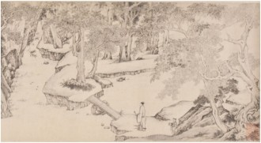

<!-- # 不如归去——《归隐：17世纪中国书画、诗歌与政治》展评 -->

项圣谟《招隐图卷》

“剩水残山色尚朱，天昏地黑影微曲。赤心焰起涂丹雘，渴笔言轻愧画图。”

1644年项圣谟（1597-1658）所做《朱色自画像》题款的前四句，满怀悲愤不安。惊闻李自成大军攻占北京，崇祯皇帝自缢于北京禁苑煤山，项圣谟选择在此时画一幅自画像。画中人以墨色勾勒，头戴儒巾，抱膝而坐，背靠青松，神情超然物外，似乎同寄情山水的中国传统文人一般，在自然中享受平静。然而背景蕴含着另一种情绪，山石树木皆用朱砂描绘，充满躁动，和白描的人像产生了鲜明的对比。在画首的两首七言律诗中，项也反复提到朱色。如此大面积地使用红色，在提倡淡泊宁静的中国文人画中十分罕见。项圣谟的红，既有衰亡思旧之感，又是表对朱姓明王朝的效忠之意。在另一套创作于1649年的册页中，项用红色描绘了一棵大树，矗立在日落红霞之中，稍远处有个执杖儒士，似乎在缅怀故土。

①

项圣谟本是明朝著名收藏家项元汴之孙。他受家学熏陶，临摹收藏古画，并受到明末两位最著名的鉴赏家——董其昌和李日华的赞赏。在明代覆亡之前，他依靠祖产过着鉴赏家和艺术家的优裕生活。 1645年，南京城被满清攻陷，他携家人避难南方，一度鬻画为生。项的境遇体现了明末文人面临的典型困境。这批文人雅士身处易代之际，心怀故国之恩，以前朝遗民自居，或誓死抗争，或隐逸山林，或潜心艺术，或遁入佛道，将清风亮节寄予丹青。

《朱色自画像》是纽约亚洲协会（Asia Society）目前展览《招隐：十七世纪中国的诗画与政治》的重点作品。《招隐》由加州圣塔芭芭拉美术馆（Santa Barbara Museum of Art）亚洲艺术部主任戴星舟（Susan Tai）和圣塔芭芭拉加州大学艺术史与建筑史系教授石慢（Peter C. Sturman）共同策划，目前巡展至纽约亚洲协会。展览的 60余幅文人书画作品，来自圣塔芭芭拉美术馆、洛杉矶郡立美术馆、台北故宫博物院等六个公共艺术机构及一些私人收藏。正如展览副标题所示，这些作品集中展现了艺术和政治的复杂关系。在明末清初——中国历史上最为激荡不安的时代之一，文人画家和职业画家如何逃避政治，以不同方式“隐”入山野和艺术之中。亚洲协会博物馆馆长招颖思（ Melissa Chiu）在接受《艺术新闻/中文版》采访时表示，展览主题反映了我们当下所处的时代背景：“在时代剧变中，艺术家没有选择描绘社会现实，而是选择归隐。可以说，这和中国的现状是平行的。如今归隐正成为复兴的思潮，越来越多的人转向佛教、禅修、旅行以获得心灵慰藉。”

展览大致分为三个时间主轴：明末，政治腐败之际文人在山水中寻求归宿；覆亡，山河巨变以后遗民在艺术中抒发悲痛；回归，清朝秩序重建后艺术家重新寻找身份认同。

进入展厅，首先呈现的是项圣谟的另一幅杰作《招隐图卷》。这副手卷，完成于 1625-26年间，正值晚明社会分崩离析之际，宦官乱政、言论钳制、党争相斗，士大夫对时局失望，不想再在政府任事。

②以项描绘出自己对隐逸山林生活的向往。画卷充满张力，展现出两种力量的互搏。身着白袍的名士出现在卷首，嶙峋的怪石群几乎挡住了他的所有去路，甚至冲出画面，直逼观画者的空间。随画卷深入，叙事再度发展，一派天真纯朴的田园风景铺展开来，白袍名士也再次出现，相伴的还有一位黑衣隐士，仿佛在后者的指引下找到了出路。正如高居翰（ James Caghill）指出，项的绘画“表达了隐居生活的单纯面，以及与社会疏离的双重主题。”③

这种退居山林的社会风尚也体现在陈继儒（ 1558-1639）的《长松草堂》中。陈继儒年少聪颖，长为诸生，与董其昌齐名。然而他没有走文人惯常的科举仕途，二十九岁焚弃儒冠，隐居昆山，建庙芦草堂，专心著述。这幅白描画像，描绘了一位隐士（也许是陈自己）坐在草堂之中，背后是一面素屏。素屏——没有任何绘画或书法的屏风，是文人高洁品质的体现。巫鸿指出，素屏在 1360年左右成为一些著名的文人画家（如王蒙、徐贲、文徵明）所喜欢的绘画母题，也与画家在社会动荡时期归隐山林的倾向符合。

④

除在山水中寻找平静外，文人雅士也从古代经典中寻找慰藉，董其昌便是其中代表。作为明代最重要的鉴赏家和艺术史家，董其昌提倡在画史中追溯“正宗”的传承，将董源和王蒙纳入他所定义的正传，并设想自己为正传的集大成者。对“正宗”的推崇既是美学态度，又是政治立场，通过重树儒家“清真雅正”的审美趣味，舒缓紧张的社会形势。这次展出的两件作品——《澄怀道观图》和《右丞诗意图》，都是其“仿古”理论的集中体现。董其昌一生为官，然时而退隐，两幅作品都作于归隐之际。前者是一套山水扇面册页，作于 1611年，亦是他第一次隐退后一年，模仿了不同时期的七位古代大师笔法，包括黄公望、李成、倪瓒等。后者作于1626年，亦即他再次隐退同年，基于他对王维——这位他定义中正宗派绘画传统祖师笔法的理解，并自题王维诗句“闭户著书多岁月，种松皆作老龙鳞。”值得一提的是，董其昌并不追求笔墨的形式，他在技法上也从来没有做到惟妙惟肖地模仿古代大师的风格。他提倡的“仿”是萃取古代杰作中的风格要素，在抽象的基础上进行形式上的探索。这也解释了为何他会在《右丞诗意图》中师法几位不同艺术家的营造法式，这也体现了巫鸿所讲的中国艺术家借援引古人，确立自身坐标，构建一种“图画语境”的持续努力。

⑤

如果说文人画家的挣扎主要来自遗民身份，那么晚明的职业画家还兼有另一份焦虑——渴望进入文人士大夫阶层，又总是被贬为工匠被轻视。陈洪绶生于仕宦之家，然后二十岁通过县试后一直未通过乡试，不得已放弃仕途，以职业画师为生。在展出的作品《史实人物图考》中，陈洪绶将自己化身为历史人物——第二和第四幅常被认为是陶渊明。长久以来，东晋末期的陶渊明一直是文人士大夫放弃俗世名利，归隐田园，以诗酒自娱的典范。头插菊花，伶仃大醉，手扶侍妾的陶渊明是陈自身的写照，既糅合了他对先贤的崇敬，又有对自身矛盾境遇的嘲讽。1644 年明朝覆灭，他的几位好友自杀殉节或加入复明大业。他并未参加任何复明运动，只是终日哭号，烂醉如泥，曾避居佛寺一段时间，后又返回俗世，仍以职业画家为生。明朝覆灭后，“隐”入宗教成为另一选择。

明末四公子之一的方以智（ 1611-1671）在清兵入粤后出家，秘密组织反清复明运动，后因“粤难”被捕，于押解途中自尽惶恐滩。展出的《梅花松图轴》由四幅竖轴组成，巧妙地运用梅花崎岖的枝干化解了狭长的构图难局。松梅常被用来比喻文人忠贞沛然之气，而映照梅花的明月则暗喻“复明”。朱耷（ 1626-1705）本为明皇室后代，在明朝覆灭后假装聋哑，遁迹空门。展览专辟小厅，展出了他以“八大山人”署名的一系列书画。其中《海棠春秋图》用错落的笔法描绘了三种海棠，题写的双关诗中以“东施”自居，表达了不容于世的悲愤。展览的最后一个时间轴——清初，回归平静。

王原祁和石涛都生于 1642年，明亡时尚幼，亡国之痛并没有年长一辈的方以智和龚贤深切。清朝政权稳定后，提倡传统中国文学艺术，吸纳汉族精英为政权服务，许多明末文人也通过科举进入仕途。王原祁和石涛虽同龄，但一生境遇南辕北辙，他们的艺术风格差异也可在这次展出的作品中窥见一斑。王原祁自幼承继家学，祖父王时敏，师承董其昌，被奉为正统派最后一位大师， 1700年被康熙皇帝召供内廷，编撰《佩文斋书画谱》。《仿大痴秋山图卷》捕捉了黄公望《富春山居图》的基本构图和精神气质，是正宗派的典型画风。石涛因家世谱系之故归为明代遗民之列。他是明朝宗师后裔，父亲企图称帝复明，失败身亡后石涛由家谱携其逃离，后削发为僧。展出的《赠黄律山水册》创作于 1694年，此时他已弃僧还俗，摆脱了明代遗民的立场。笔墨挥洒自如，极具原创力，正体现了石涛对“无法之法”的推崇。不同于正宗派的董其昌、王原祁，石涛提倡的是以无法为法，反对对笔墨和传统的因袭，试图回复古人再现自然之心。石涛的绘画和理论颠覆了既存艺术秩序，走出传统之外。

从这个意义而言，十七世纪不仅集中彰显了文人和政治错综复杂的关系，亦成为中国艺术史上转向现代主义的关键时期。而这次展览，无疑有助于两个层面的探讨。

展览另一个有趣的侧面是对女性艺术家的观照。借由薛素素和李因两幅长卷，策展人展示了女性艺术家特殊的“招隐”方式——拒绝她们在社会结构中的传统地位，通过艺术寄托家国情怀。在明代青楼出身的女画家中，李因写意花鸟独树一帜，后嫁文人葛征奇为侍妾。明亡后葛征奇去世，李因作画自给，始终以明人自居。

注：

①

项圣谟，山水册页，1949年，纸本设色，25.63*32.6厘米，纽约王季迁收藏，图见高居翰著，李佩桦等译，《气势撼人——十七世纪中国绘画中的自然与风格》，北京：生活读书新知三联书店，2009，Page132。

②

赵图，《明清之际士大夫研究》，北京：北京大学出版社，1999。

③

高居翰，《气势撼人》，Page133。

④

巫鸿著，文丹译，《重屏》，上海人民出版社，2009，Page132。

⑤

同上，Page217。

展评：纽约亚洲协会《归隐：17世纪中国书画、诗歌与政治》

原文发表于《The Art Newspaper/China》2013年五月刊。

（采编：薛晨如；责编：王卜玄）
