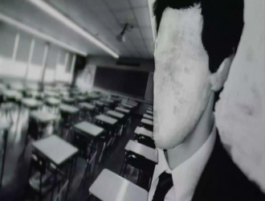

<!-- # 悲哀一种-----《超脱》影评 -->

《超脱 Datachment》讲述了一位老师在一个月的代课工作中发生的生死悲欢。导演是托尼•凯耶，擅长纪录片拍摄，记录人们少有关注的灰色带，所以不难想象为什么电影《超脱》里有着各种各样的纪录片手法，以及电影涉及的现实主义题材。与其说《超脱》是一部关于老师的电影，不如说它更像一部末日式的灾难片，主角以超凡的韧性面对生活工作中所能预想的挫折困难。它是一部彻底的悲剧电影。

影片中几乎每个角色都在承受着双重的痛苦。女校长遭到事业的冰点，雄心与师德完败在政治与商业博弈之下，为之奋斗一生的失败事业却带来家庭的淡漠与崩离。刘玉玲所扮演的女教师帕克对待工作与学生尽心尽力，在对待虐猫学生之时紧锁的眉头，话语字句之中都透露出的担忧与关切，得到的却是学生无关紧要的态度与敌对。貌似连名字都没有的眼镜老师，似乎从来都不曾存在，他没有观点没有行动，话语行为似乎从未有人注意，在被亨利关心的时候甚至感恩戴德。老师之中以查理为首的老一辈最如鱼得水，他们知道如何面对接近无可救药的学生，却不得不面对他们的对手不是学生而是家长的现实。教师们有理想有追求，却无从施展，只能每天面对不同的学生尽心尽力做着毫无意义的事，就像那只有声音与照片的录音一样“被困住了”。

耷拉着的眼角，斜瞥向两边的眉毛，“囧”然之情跃乎荧屏。不得不说，阿德里安•布罗迪囧囧有神的脸庞为主角亨利•巴斯做了很好的诠释。影片中亨利善良却建起了厚厚的心墙，将所有人事拒而自封，只有偶尔闪现出来胡子拉碴红着眼眶的独白才是亨利最真实的自己。我们可以看到这部电影里面所有人的演技，它是一部非常考验配角张力的影片，影片中的配角各代表着不同的境遇与悲哀。如同深入泥土之中盘根虬结的榕树，却给人根植弥深，冷风弥烈之感。“Datachment”一词在英语中有着“分离”“正义”“冷漠”的失意，电影的中文翻译“超脱”在笔者私以为会在一定程度上误导了观影时对情节的感官与期待。亨利作为影片的主角，他在整部影片的定位以及发展并没有展现出大陆翻译的“超脱”的结局。亨利在代课之初体现出的是毫无责任心的得过且过“我所要做的仅仅是保证没有人在上课时被杀就好了”。随着情节的发展，影片的结局却迎来了学生自杀了，恋爱谈崩了，养女移交了的结果。与其说是“超脱”，倒不如说是“玩砸了”来的更为恰当。

在导演托尼•凯耶的叙述中所探讨的重点在于现实与理想分离，在压力面前习惯于冷漠应对，教育与商业的冲突，老师与家长的不对等交流上。种种因素参杂，由一个完完整整的“人”来承受怕是难堪重负。所以影片中的亨利如他自己所说只是一个空壳，他的情绪全掩埋在了心底深处。亨利对亲人是真真付出感情的，哪怕自己的外公近乎直接造成了自小起的悲剧与家庭的残缺，亨利对于外公的爱一如既往。但他在这份真感情面前却亦被撕裂着，影片的开始亨利对着看护愤怒的吼叫——亨利是会愤怒的，有着正常人的情绪。加上在公车的流泪，亨利表露出了脆弱的一面，亲情是回避不了的现实。但对于学校里的环境，第一节课杀鸡儆猴，杀猫同学在办公室里最后一个镜头是亨利轻扬下巴转移目光，以及故事发展中偶尔的独白，亨利所表现出的是无比的抱怨与冷漠，他一直是在这个环境中的局外人。

然而转变出现在两个人身上，一个是胖女孩梅斯，一个是雏妓卢。胖女孩梅斯把亨利从局外人的身份拉扯进围城。亨利对于梅斯投入了感情，是对于一个年轻学生的欣赏，他享受着来自家里与学生的依赖，让他有了很强的存在感。胖妞梅斯，这是在整部影片中塑造的最为成功的一名角色。梅斯几乎有着所有悲哀的现实——肥胖的外形，同学的排挤，父母的不理解。这名角色糅合了作为一名悲情角色的身份以及学校中种种现实的旁观者。她用相机记录老师们的痛苦悲哀，从一开始喜欢依赖着亨利，最后用自杀将一切的情绪爆发了出来。反观雏妓卢，笔者认为却是整部影片之中塑造的最为失败的一名角色。卢承接过外公去世后家庭亲情对于亨利的缺憾，在故事之中所扮演的我想不应当只是一名聆听者与接受者。卢从一开始被嫖客打了赖上亨利到最后舍不得离开，她的情感一直处于为了依赖而依赖为了脆弱而脆弱的状态。她在影片中并没有表现出强烈的个性以及随着情节发生的改变。可以说卢与亨利的关系可以理解为卢不在出卖身体，亨利得到了一枚超市买的戒指。简化之后两人的关系令人哭笑不得。重点是，亨利在两名女孩的拉扯下，或许还受到了学校中老师对于教学态度的影响，让他从一具空壳开始出现了一丝丝的灵魂。正是这一丝丝的灵魂造成了接下来的悲剧。亨利拥抱了梅斯遭人误解，将卢送去了孤儿院。他企图将自己恢复到对一切冷漠的局外人状态，收获的却是两份悲哀。

有关亨利去孤儿院接卢的场景，我恶意地认为是为了票房而安排的。这让最后亨利在教室中读《厄舍府的倒塌》时有一种强烈的剥离感。亨利明白了冷漠，压力，恶意是会传染的，它们随着时间累加在一起等待着最不幸的人。既然如此，梅斯与卢分别得到了悲剧与圆满，亨利对于梅斯的情感应该更多是悼念与自责。然而导演却安排了一段亨利朗读爱伦坡的《厄舍府的倒塌》，这是一篇对于命运的不抗争的小说，爱伦坡也是一位崇拜死亡以及被美国高学历连环凶手所中意的作家，这与之前的桥段简直格格不入，让人感到亨利接卢的戏码十分多余。

不过，单独就结局来说，这几乎是我见过的最富有诗意的结局了，“那是秋天一个昏暗，寥落的日子里，云幕低垂，厚重的笼罩着大地。”教室走廊废纸翻飞，像是秋天里最零落的叶，旧的逝去终会有新的到来，雪融冰消之后是新生和重建。生活还在继续，依然会有人不时感知到心口的重压，依然会有人对生活绝望，自暴自弃，只留下一个策马鞭行的背影。人生多寂寞，如何超脱？

(采编：卢静；责编：王冬阳)
