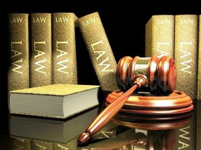
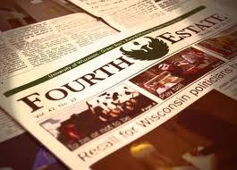
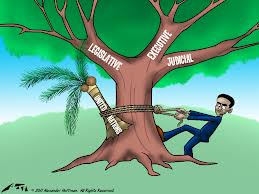
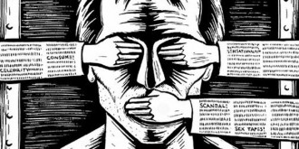

<!-- # 第七十七期：The Fourth Estate “第四权利” -->

**编者按：**The Fourth Estate is a phrase that refers to the profession of Journalism, specifically the Press,“ The Fourth Estate”本身与权利或者权力没有任何关系，只是一个简单的新闻媒体的称谓而已。新闻界并不是政府的一部份：它是私人企业。我们似乎不可能认定新闻界是政府的第四部门。新闻自由是一种制度性的权利。

### 词条简介：

The Fourth Estate is a phrase that refers to the profession of Journalism,specifically the Press.“The Fourth Estate”本身与权利或者权力没有任何关系，只是一个简单的新闻媒体的称谓而已。

### 目录：

1 众人眼中的“第四权”

2 真实的The Fourth Estate——第四阶级

3 The Fourth Branch of Government和新闻自由又是怎么回事？

3.1 The Fourth Branch of Government

3.2新闻自由

4 参考资料

5 延伸阅读

### 1 众人眼中的“第四权”

通常，人们在私下聊天，上网撰写新闻评论时，很容易将**新闻界，大众传媒，新闻自由，新闻媒体的职责**这一类概念和**“第四权”**等同起来。对西方政治制度略微了解的人，甚至会从**三权分立**的角度谈到西方的新闻界，大谈**新闻界是政府的第四分支**，以及其**对政府事务所起的监督作用**。

但是，笔者在此想指出，本文从英文原文的角度去理解The Fourth Estate真实的含义，不从汉语翻译的角度去揣测实际的意义。

首先明确权的含义。**一个是

权力（power），

一个是

权利（right）**。在中文里，这两个词汇形似音同，但是在英文里，它们却是截然不同且不可混淆的两个概念。权力与权利是现代法治国家与社会的两个轴心，**权力**主要是指**公民所委托的机关与其工作人员依法律行使社会治理的职能；权利主要是指公民依法律规定享有的各种利益**。

简单说来，就是这样的：

你家周围的那个政府为什么会管你呢，那是因为它有管你的权力（power），它怎么会有管你的权力(power)了呢，那是因为你委托它管你。那你能不能说政府的坏话了呢，当然可以，为什么，因为这是宪法规定的你拥有的不受任何形式限制的权利（right）。

### 2 真实的The Fourth Estate--第四阶级

《大美百科全书》对**The Fourth Estate**的解释：**封建时代社会三阶级（贵族

、僧侣、平民）以外的第四阶级。最初另有所指，如军队及暴民，直至新闻记者获得该项头衔为止**。（fourth estate,a term commonly applied to the public press,It is an extension of the use of “estate ”to signify the three traditional social orders of feudal society-the lords spiritual,lords temporal, and commons-and formerly was applied to other groups.such as the army and the mob,until journalists claimed the title.）

**

至于新闻记者获得该项头衔则得拜英国历史学家托马斯•卡莱尔（Thomas Carlyle:1795-1881）所赐**。他描述当时的英国国会说：柏克说在国会中有三个阶级；但是，在远处的那个记者席，却坐着比他们更重要的第四阶级。这不是比喻之辞或诙谐的说法：这是一个事实-在现代对我们非常之重要。（Burke said there were Three Estates in Parliament;butin the Reporters’ Gallery yonder,there sat a Fourth Estate more important than they all。

）

这段话是媒体被称为第四阶级的出处。因此，**The Fourth Estate用来指新闻行业，尤其指代新闻界。（This is a phrase that refers to the profession of Journalism,specifically the Press.**）

The Fourth Estate在大陆常被翻译为“第四权利”。但是人们引用的时候，将其误用为“第四权力”，通常与西方三权分立（Seperation of Powers）中的行政、立法、司法（Executive,Legislature,Judiciary）等同。有意思的是，The Fourth Estate在台湾被直接简称为“第四权”。

但是，在美国，当地媒体从不在报纸、电视、公共广播电台把媒体与行政、立法、司法并列为第四权(Fourth Power)。欧美学界从不将其等同！**新闻媒体是一种公司法人形态的组织，任何人都可以投资开设新闻媒体，跟开餐厅或水果店一样，**新闻媒体公司没有人民的授权，又怎能获得与政府权力平起平坐的所谓的第四权力呢？

**

实际情况就是The Fourth Estate本身与权利或者权力没有任何关系，只是一个简单的新闻媒体的称谓而已。**

### 3 The Fourth Branch of Government和新闻自由又是怎么回事？

####  3.1 The Fourth Branch of Government

前面指出，The Fourth Estate是第四阶级，是新闻界的意思。那国外有无指新闻界是政府的第四部门（the fourth branch of government）的说法呢？答案是：有的，但遭到学者的驳斥。

美国密苏里大学新闻学教授梅里尔（John C. Merrill）的著作《自由之必要：新闻自主的哲学》（The Imperative of Freedom,a Philosophy of Journalistic Autonomy），认为the fourth branch of government是美国自由主义派三大神话之一，**美国宪法当然没有给新闻界这种地位**，虽然许多人声称能在宪法上，为新闻界读出这些责任。他书中是这样描述的：

第三个神话是：许多美国人相信新闻界是美国政府非正式、但非常真实的一部份。也有人认为新闻界是政府滥权的监督者或制衡，是政府的对手。

传播此种神话的书刊汗牛充栋：新闻学院、报社、电台、新闻团体中到处散播这种观念，以致不知美国历史者，**倘初至该国，真以为新闻记者是由人民选举出来，以担负某一项特殊的公共功能**。

英国人仅不经意地指国会的记者席为第四阶级，而横过大西洋，阶级变成政府部门了。

**

可以确定的是：新闻界并不是政府的一部份，它是私人企业。**

**

或许新闻界自认为是政府的一部份，或政府的制衡，或某一种监督者。美国宪法当然没有赋予他们这种地位，虽然许多人可以在宪法读到这些属于新闻界的责任。

因此，我们似乎不可能认定新闻界是政府的第四部门。**

####  3.2新闻自由

新闻自由是一种权利（right），不是一种权力（power）。媒体监督政府这句话中所指的监督是一般性监督，是要依法行使的。易言之，媒体有监督政府的权利（right），而非媒体有监督政府的权力（power）。

美国联邦最高法院大法官史都瓦特在专文“Or of the Press”(26，Hastings Law Journal，1975)中，详细论述过这一问题。

史都瓦特谈的是**美国宪法对新闻自由的保障（constitutional guarantee of a free press），**他说：**to create a fourth institution outside the government as an additional check on the three official branches（在政府外创立一个第四机构作为三权的另一制衡）。而非说“to create a fourth institution within the government as an additional check on the other three official branches”（在政府内创立一个第四机构用以制衡其他三权）。**

事实上，这篇文章是史都瓦特于一九七四年十一月二日在耶鲁法学院一百五十周年纪念大会中的讲词，文中所一再强调的是，**新闻自由不同于言论自由，新闻界有权利及特权或责任（the rights and privileges,or the responsibilities,of the organized press）。**由此可知，**史都瓦特大法官认定新闻自由是一种权利（right），而非权力（power）。**

**

新闻自由是一种制度性的权利（institutional right）。**

### 4 参考资料

[1] The Fourth Estatehttp://australianpolitics.com/topics/media/the-fourth-estate

[2] What Is The Fourth Estate? And Why Should I Care?http://uspolitics.about.com/od/politicaljunkies/a/fourth_estate.htm

[3] 传播媒体的子弹会转弯－

浅谈近来新闻传播现象http://www.atlas-zone.com/think/part_1/media/page4.htm

[4]「第四权」一词误用久矣

国安组副召集人

陈锡蕃http://old.npf.org.tw/PUBLICATION/NS/091/NS-B-091-009.htm

[5] 戳破以讹传讹的媒体「第四权」说法http://focusontaiwan.blogspot.com/2007/04/blog-post.html

**5 延伸阅读**

[1] 【固执的新闻自由】新闻自由在美国！HYPERLINK "/archives/33780"

[2] 林达近距离看美国1-4

（编辑：张涛；责编：高丽）
