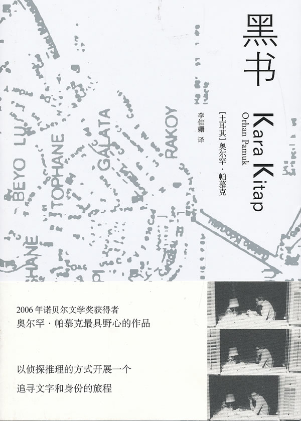

<!-- # 如梦之梦——《黑书》读书笔记 -->

我从来没有和一本书纠缠这么久——阅读它几乎耗费了我半个学期的时间。有时阅读的过程是那样轻快：精妙而离奇的故事，扑朔不定的虚构与假象，精密优美的比喻和纷繁复杂的意象交织缠绕，这些都让我深深震撼，而《黑书》中展现的语言技法又是如此之华美，每一个散发异域风情的词句和段落间都能时时刻刻奉献出惊艳来；但更多时候，这本书带给我的是痛苦：交织分岔的结构和遍布丛生的隐喻，如身历一场晦涩曲折的文字迷雾。每一个谜团都好似通向令一个谜团，每一个故事都似乎隐喻着下一个故事。在一个小小的章节间所包含的信息是如此之多，简直要模糊了小说本来的意蕴。可在这些纷繁的写作技巧和表象之后，我还是能感受到作者浓烈的哀愁：沿着古罗马帝国到拜占庭帝国的文化脉络，在宏观的历史琐碎中看到的，是奥尔罕·帕慕克倾尽心力所要表现的呼愁之城，如他所说：“我要写的是一个巨大而有丰富纹理的故事，试图捕捉精神分裂的、焦虑的伊斯坦布尔。”

故事的主线并不复杂，它讲的是在一周的时间里律师卡利普为了追寻他失踪的妻子如梦而踏遍伊斯坦布尔，并在这一过程中与诸多往事发生关联的故事。在推荐中，有人将其视作一本侦探小说，不过帕慕克却没有遵循一般侦探小说的手法去进行小说的铺陈更进，而是在书中设计了种种离奇的遭遇和故事。主人公卡利普怀疑妻子如梦和她同父异母的哥哥，一位著名的报纸专栏作家耶拉私奔，这里帕慕克巧妙地运用了耶拉专栏作家的身份，在本书中穿插了大量耶拉的专栏。这些专栏故事点缀在主线之中，构造出一个带有土耳其深刻印记的独特“东方”。隐喻和真相彼此呼应，小说如一袭锦缎铺展开来，其间包含的故事熠熠闪光。华丽辞藻丰盈着荒诞离奇的情节，人们在繁芜的语句纠缠之中隐约可见一座古老又仿佛时时濒临衰颓的城市失焦的面貌。

——伊斯坦布尔，它的名字叫做红。

书中对于这座城市的描述过于详细，让人觉得它不是一张静止的照片，也不是一段清晰的影像，更像是一幅超写实手法创作下的逼真画卷。在事件之中有事件，在人物背后有人物，每一件物品都不是孤立的，而是与周围的世界发生万千的关联。然而你顺着这些情节所扩展出的丝线走过去，踏在“帝国斜阳的哀伤”中，你看到的不是时时刻刻的记录，而是从每一个角度反复变迁的谜团。宛如阳光在七巧宝塔上一天中光线的不断变化，奥尔罕·帕慕克在一个看似简单的故事中准确地描摹了这些难以被发掘的细节。

在每一章讲述卡利普的调查的章节之后，作者都会放上一章耶拉的专栏，这些专栏不仅与其他章节发生联系和对应，它本身也成为这座梦一般的城市的一个精美注脚。糅杂了对于土耳其民族记忆的追思，东西方文化的交流和影响，教派之间复杂的争斗，政权更迭，异域传说，迷惘哲思，有时候甚至只是单纯的刻画城市的一景，远自拜占庭帝国的青砖，游走着小贩妓女和异国人的街道，变迁的海峡，

2000年的历史如一条大河日夜洗刷过城市的每一个布景。我在阅读中总是觉得自己几乎要迷失在作者构建的繁琐细节与宏大构造中，以至于常常要发出追问：他写这样一部书，是为了什么？这个故事，要告诉我们什么事情？

也许这种迷茫感正是帕慕克刻意为之，让我们只能老老实实地跟随在卡利普这个人物的背后，却犹如一个闯入迷宫的游览者，心怀紧张和兴奋，游览关于这座城市的一切。这不会是令人失望的旅程，甚至会比真的去游览更加令人狂喜：他把一座城，倒映在了文字之海中。这海中纷繁万象，也因此显现出即真实又迷幻的梦的味道。

如同女主角的名字“如梦”。不只是“梦”，而是“好似一个梦”。名字之中蕴含着一种天然的失落和凄美，也昭示着故事背后隐藏的故事：其实这整本书，也好似女主角如梦的梦境一般，精美，细致，绵延不绝，然而轻触即灰飞烟灭。只要读者从梦中醒来，马上就会意识到作者的意图，可这也是帕慕克高明的所在：他所设计的梦是如此之甘美，我们缘何要醒来呢？

如他自己所说：“是的，小说可以被定义为这样一种形式，它使技巧高明的写作者把自己的故事转化为别人的故事，这一伟大而迷人的艺术，近四百年来带给那么多读者以狂喜，给了那么多作者以灵感；但这只是小说艺术的一个方面……它把我们自己的生命当作别人的生命来描写，同时也就为我们提供了把其它人的生命当作自己的生命来书写的机会。”

值得一提的是书中人称的不断转换，总是游走在“我”和“他”之间，读者有时会觉得自己化身卡利普，行走在星罗棋布的街道中无望的搜寻自己的妻子，有时又转换为神秘的专栏作家耶拉，用一双冷静的眼睛发掘这个古老城市表象与真相间的关系。人称与人称的变化让我联想到作者在书中反复讨论的问题：“我”与“他人”的关系。“我”有没有可能完全变成“他人”？自我存在的意义何在？书中的一个章节令我非常震撼：制造假人的手艺人班迪，他正处于失业的边缘，因为人们“不想看到风衣穿到一个大胡子、O型腿、又黑又瘦、满街都是的同胞身上。顾客想要的是穿在一位来自遥远陌生国度的漂亮新面孔身上的外套，因为当他披上这件外套时，他相信自己也跟着变成了另外一个人。”作者给了我们一个悲伤的图景：“当今的土耳其人不再想当‘土耳其人’了。我们在模仿别人吗？我们的文明是不是已经失去了做自己的能力了呢？

——但是，正是当我们察觉到我们在模仿别人的时候，我们才知道我们自己是谁”。

一个民族文化认同感的缺失与一个人自我意志的缺失形成了一个对照和联系：一个人对自我的否定与一个民族对自身文化的焦虑其实有着同样的哀愁和根源。这种裂痕不可弥合，像是在时间洪流中注定要发生的变故。帕慕克似乎也看到了这点，因而他的哀伤中就更多了一份清醒的认知：对于一条正在改道的河流，时间的大潮会把你奋力改变的东西，再改变回去。他在书中描述这样的场景：“我不知道。我只知道这个迅速发展的状况在不久的将来可能导致何种后果。显然，不用多久，我们称之为乐园的博斯普鲁斯海峡就会变成一片乌黑的沼泽，只见结满泥巴的大帆船骨架闪闪发亮，像是鬼魂的森白牙齿。不难想象这片沼泽经历了炎热的夏天后，会干涸到到处都是泥粪堆，像是流经小城镇的浅溪河床，甚至是这片洼地的斜坡，在千万条巨大排水管涌出的污水长年灌溉滋养下，将会长出野草和雏菊。在这座又深又荒芜的山谷中，新生命将展开。黎安德塔位于博斯普鲁斯海峡入口处一座岩石岛屿上的灯塔。也将从泥里冒出来，伫立于岩石之上，像一座真实而骇人的高塔……这片瘟疫隔离区里所发生的灾难，将侵袭我们每一个人。”

他自己也曾说：“我想让你感觉到生活在这座城市的恐怖，而不是去现实主义地描述它。想象你自己走在伊斯坦布尔的街头，或通过金角湾的任一座桥。想想你看到的景象。所有这些令人难过的事实，拥挤的交通，历史感——2000多年的历史——拜占庭建筑转变成工厂，矗立在拙劣商品的广告牌旁边。这些破破烂烂的东西。……我想传达这种无望的感觉，这种绝望。”但是帕慕克没有局限于一座城市一个国家一个民族对于自身文明失落的无能为力和悲哀上，他把这种悲悯扩大到了整个人类的文化，展现了所有人类对于失去自我的恐惧，从而提出一个更大的哲学课题：“成为自己。”

“我知道你不满意你自己，也不满意你的生活。我知道许多夜晚，你郁郁寡欢地在房里散步，直到黎明破晓。你渴望成为另一个人，而不要做自己，但你始终无法决定该选择哪一个身份。”

“似乎这些人的脸上写满了文字，诉说着故事，仿佛他们身上印着沉默、灰心，甚至挫败的符号。从这些面孔中，你们可以看见自己的脸，不是吗？我们的人数如此众多，如此可怜，如此无助！”

“惟有当一个人不再有话可说时，他才最接近最纯然的自己。惟有当他的叙述抵达终点时，他才能够听见自己内在深沉的静寂，因为所有的往事、书本、故事和回忆全都自动关闭。惟有此时，他才会听见自己的真实声音从灵魂深处涌起，从存在的永恒黑暗迷宫中浮现，让他成为自己。”

书中随处可见这个矛盾：我们想成为自己，可我们永远不能成为自己。

帕穆克在书中认为，一个民族也好，一个单独的个人也好，都一直在与外界的抗争中努力去成为自己，或者在不知不觉中成为他人。

具有讽刺和象征意味的是，卡利普最终成为了耶拉，满足了自己成为一名作家的愿望。然而，卡利普也失去了如梦，他按照心愿得以成为他人，但是痛苦并未减少，反而增添了迷茫。

至此，故事似乎完满了起来，也步向了一个想象中的结尾。然而看完此书读者最终得到的，也仍是故事真相的片段，甚至说是碎片。我们一头栽入帕慕克构造出的梦幻之海里，沉溺其中却仍是找不出头绪。从头翻看，扑面而来的土耳其色彩的暗艳神秘，混合着谜语，传说甚至新闻故事，它们被寓言一般的行文风格和诗歌式的语言包裹着，向我们展现了一场关于一个正在陷落的繁华古都的悠远梦境。然而书的终结却不是梦的结尾，我们依然不曾醒来。

或许这也是此书名字的意义：《黑书》，意即黑暗之书，黑暗是浓郁哀愁，恰似女主角如梦的梦境和她最终的结局。漆黑的故事碎片纷纷扬扬的洒落在每一页上。我们明知每一章都有答案，可是每一章也都是谜语。我们无法从这场关于“找寻”“成为自己”“梦境与现实”的故事中脱离出去，也可能在某一个瞬间忽觉自己其实也只是身处一个如小说般繁杂而浩瀚的梦境中。

帕慕克曾说：“所有的文字，所有可信的文章，指涉的都不是生命，相反，书写本身只是在指涉一场梦。”这是卡利普的梦，是耶拉的梦，更是帕慕克的梦，我们的梦。

(采编：张山骁；责编：王卜玄)
