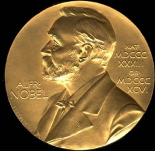
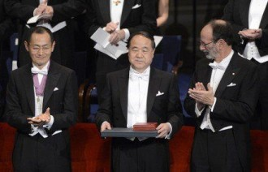

<!-- # 中国诺贝尔情结 -->

**目录：******

1 什么是诺贝尔奖

2 什么是中国诺贝尔情结

3 **中国有多少人**获得过诺贝尔奖

4 中国“诺贝尔奖”虚实提名

5 参考资料

**1 ****什么是诺贝尔奖**

诺贝尔奖是以瑞典著名的化学家、硝化甘油炸药的发明人[阿尔弗雷德·贝恩哈德·诺贝尔](http://baike.baidu.com/view/94761.htm)的部分遗产（3100万瑞典克朗）作为基金创立的。诺贝尔奖分设物理、化学、生理或医学、文学、和平五个奖项，以基金每年的利息或投资收益授予前一年世界上

在这些领域对人类作出重大贡献的人，1901年首次颁发。诺贝尔奖包括金质奖章、证书和奖金。1968年，瑞典国家银行在成立300周年之际，捐出大额资金给诺贝尔基金，增设“瑞典国家银行纪念诺贝尔经济科学奖”，1969年首次颁发，人们习惯上称这个额外的奖项为诺贝尔经济学奖。

**2 ****什么是中国诺贝尔情结**

本文所指的中国诺贝尔情结，主要是指中国人对诺贝尔自然科学奖的获奖期盼。自然科学奖相比其他奖项更追求理性，更加客观。为什么建国几十年来中国人还未获得诺贝尔自然科学奖？这种期盼长期堆积在中国人心中，形成中国人强烈的诺贝尔情结。上世纪初诺奖初创，获奖对于贫弱的中国来说还很遥远。1913年，印度诗人泰戈尔获得诺贝尔文学奖，这是第一位亚洲人获此殊荣。

囿于当时的客观条件，中国无力竞争自然科学方面的奖项，自然就特别关注与科学水平没有直接关系的文学奖。很多人认为，作为一个饱受欺凌、内忧外患的“诗歌国度”，如果能够赢得一项国际荣誉，无疑是赢得尊敬和证实自我的捷径。邻邦印度既然能够获奖，我们为什么不可以。于是，中国人的心头就开始有了“结”。自此，无论是拒绝参选的鲁迅，还是此后因过早辞世而与诺奖失之交臂的老舍、沈从文，都没能够让这个在期待和挫折中一再郁结的“诺奖情结”消散。而文学奖情结在2012年莫言获奖后逐渐褪去。

**3 ****中国有多少人获得过诺贝尔奖**

**李政道**，1926年生于上海，江苏苏州人，哥伦比亚大学全校级教授，美籍华裔物理学家，诺贝尔物理学奖获得者，因在宇称不守恒、李模型、相对论性重离子碰撞（RHIC）物理、和非拓扑孤立子场论等领域的贡献闻名。1957年，他31岁时与杨振宁一起，因发现弱作用中[宇称不守恒](http://baike.baidu.com/view/187318.htm)而获得诺贝尔物理学奖。

**杨振宁**，出生于安徽省合肥县（今[肥西县](http://baike.baidu.com/view/894540.htm)），著名美籍华裔科学家、诺贝尔物理学奖获得者。其于1954年提出的规范场理论，于70年代发展为统合与了解基本粒子强、弱、电磁等三种相互作用力的基础。1957年由于与李政道提出的“弱相互作用中[宇称不守恒](http://baike.baidu.com/view/187318.htm)”观念被实验证明而共同获得诺贝尔物理学奖。

**丁肇中**，1936年出生，美国实验物理学家。汉族，祖籍山东省日照市涛雒，华裔美国人，现任美国麻省理工学院教授。1974年，他发现一种新的基本[粒子](http://baike.baidu.com/view/150389.htm)，并以物理文献中习惯用来表示电磁流的拉丁字母“J”将那种新粒子命名为“[J粒子](http://baike.baidu.com/view/1002555.htm)”。与此同时，美国人B.里希特也发现了这种粒子，并取名为ψ粒子。后来(1975)人们就把这种粒子叫作[J/ψ粒子](http://baike.baidu.com/view/1393444.htm)。为此丁肇中和里希特共同获得1976年诺贝尔物理奖。

**李远哲**，1936年生，台湾新竹人。1974年加入美国国籍，同年去加利福尼亚大学任教，1979年成为美国科学院院士。1986年和哈佛大学的达德利·赫希巴赫与加拿大多伦多大学的约翰·波拉尼三人同获诺贝尔化学奖，以表彰他们应用交叉分子束实验方法在反应动力学方面的研究成果。

**朱棣文**，1948年生，美国华裔物理学家，生于美国圣路易斯，祖籍江苏太仓；中国科学院外籍院士。因“发展了用[激光冷却](http://baike.baidu.com/view/321218.htm)和捕获原子的方法”而获得1997年诺贝尔物理学奖。曾任美国能源部部长。

**崔琦**，1939年生，河南省平顶山市宝丰人， 1967年在美国芝加哥大学获物理学博士学位，

美国国家科学院院士。1998年10月13日，1998年与德国科学家霍斯特·施特默和美国科学家罗伯特·劳克林分享诺贝尔物理学奖，主要表彰他们发现并解释了电子量子流体这一特殊现象。

**高行健**，1940年生，江西赣州人，1962年毕业于北京外国语大学法语专业，1987年移居法国，1997年取得法国国籍。因“其作品的普遍价值，刻骨铭心的洞察力和语言的丰富机智，为中文小说和艺术戏剧开辟了新的道路”而荣获2000年诺贝尔文学奖，代表作有小说《[灵山](http://baike.baidu.com/subview/20861/5095204.htm)》、《[一个人的圣经](http://baike.baidu.com/view/3495744.htm)》等。

**钱永健**，1952年生于美国纽约，祖籍浙江杭州。美国国家科学院院士。因在发现绿色荧光蛋白方面作出突出成就，获2008年诺贝尔化学奖。

**高锟**，1933年生，中国上海人，拥有英国、美国国籍并持中国香港居民身份，曾任香港中文大学校长。2009年，因在“有关光在纤维中的传输以用于光学通信方面‘取得了突破性成就’”，与[威拉德·博伊尔](http://baike.baidu.com/view/2862904.htm)和乔治·埃尔伍德·史密斯共享诺贝尔物理学奖。

**刘晓波**，2010年获得诺贝尔和平奖。

**莫言**，1955年生，山东高密人。凭借作品《酒国》《丰乳肥臀》，“通过[幻觉现实主义](http://baike.baidu.com/link?url=FUL978_A7SEemNrKcBb7woPi1ADq_Pmir0WV5sJcOBVakV75UqyP13qBFa_mz9tt_tsQdL0q5PrV5bCDnlenY_)将民间故事、历史与当代社会融合在一起”，获得2012年诺贝尔文学奖。****

**4 ****中国“诺贝尔奖”虚实提名**

**实****Lien-Teh Wu****伍连德**，1935年获得医学奖提名，推荐人为William W Cadbury，当时任广州博济医院院长和岭南大学医学院教授。提名理由为Work on Pneumonic Plague and especially the discovery of the role played by the Tarbagan in its transmission（在肺鼠疫方面的工作，尤其是发现了土拨鼠在其传播中的作用）。

**林语堂**，1940年获得文学奖提名，1950年获得文学奖提名，1940年推荐人为Pearl Buck及瑞典地理学家Sven A. Hedin。1950年推荐人为Pearl Buck。

**胡适**，1957年文学奖提名，推荐人为香港笔会。

**沈从文**，1988年文学奖提名，推荐人为马悦然。最终因去世未能获奖。

**虚**

**鲁迅**，1927年拒绝诺贝尔文学奖的提名。“瑞典学院院士斯文·赫定在1930年代初在中国的时候，问过鲁迅他愿不愿意接受诺贝尔文学奖，说的是鲁迅拒绝接受。我查了瑞典学院的档案之后，敢肯定地说这只是谣言。瑞典学院从来没有问过一个作家愿意不愿意接受奖。鲁迅之所以没有得到诺奖：第一，没有人推荐他；第二，他的文学作品是在他逝世后才被翻译成外文。”——马悦然

**老舍**，1968年文学奖提名，中国现代文学馆原馆长、现中央文史研究馆馆员舒乙先生和已故作家萧乾夫人文洁若称。

**李敖**，2000年文学奖提名，自封。

**巴金**，2001年文学奖提名，据称诺贝尔文学奖“中国作家提名委员会主席团”王海龙曾从纽约致信作家赵本夫，称该团起草并通过了致巴金的邀请及致敬信，恳请他接受邀请，角逐诺贝尔文学奖。但后来巴金家人却告诉记者，巴金及其家人对此事并不知情。

**王蒙**，2003年文学奖提名，推荐人为“中国作家提名委员会主席团”主席冰凌，其后被认为整个“主席团”仅是骗局，属于美国注册的普通民间组织，无推荐人资格。

**虚实标准**

从1974年开始，诺贝尔基金会规定，诺贝尔奖原则上不能授予已去世的人。此外，与许多电影奖项及文学大奖不同，诺贝尔奖遵循的原则是，除了公布最终获奖者的名字外，凡作为候选人的科学家其名字都不对外公开，并设置了５０年的保密期。

因此，对于每年可能出现的各种“风声”，说某人获得提名成为诺贝尔奖候选人，其真实性必须等５０年后才能得到验证。

**5 ****参考资料******

(1) [Chronological list of](http://nobelprize.org/nobel_prizes/lists/all/)[_All Nobel Laureates_](http://nobelprize.org/nobel_prizes/lists/all/) Nobelprize.org. Retrieved

(2) Wu, Lien-Teh. ["The Nomination Database for the Nobel Prize in Physiology or Medicine, 1901-1953"](http://nobelprize.org/nobel_prizes/medicine/nomination/nomination.php?action=show&showid=1229)

(3) [E. Bruce Brooks: "Sinologists: Lin Yutang"](http://www.umass.edu/wsp/sinology/persons/lin.html)

(4) ["Nomination Database - Literature"](http://nobelprize.org/nobel_prizes/literature/nomination/nomination.php?action=show&showid=356). Nobelprize.org. Retrieved

(5) Jeffrey C. Kinkley [Selected Stories of Shen Congwen](http://books.google.ca/books?id=Ej0bmFC9ieMC&pg=PR14). Chinese University Press.

(6)

登山:《鲁迅爱过的人》

文汇出版社

(7)statutes of the Nobel Foundation, Nomination, § 7

（编辑：方小华；责编：高丽）
