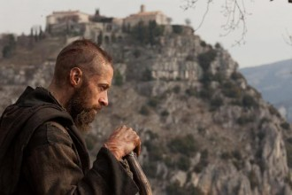

<!-- # 第一百零一期：弱势群体的面包 -->

最近重看了一遍美剧《无耻之徒》，这部剧宣扬了一种很奇怪的价值观，就是贫穷是做坏事的合理原因，因为贫穷所以逃票、骗保甚至盗窃之类的行为都该被原谅，甚至被当作是辛勤养家糊口的荣誉感。我已经看不止一部影视剧这么宣扬过，父亲靠非法勾当养活一堆孩子然后理直气壮认为自己对家庭负责。

而在中国来看，无论是微博还是论坛，也充斥着这样的说法，比如占据街道违法经营的小商小贩被清理的时候，只要他们带着孩子，大家就会觉得他们很可怜，似乎为了养活孩子而违法违规经营就变成了合法的甚至是可以被鼓励的。

按照法兰克福学派的观点，既然经济地位注定他们被剥削，那么他们的犯罪应该被宽容，因为国家在一开始有负于他们这个阶级的人。这是一种很常见但是很可怕的论调，因为这个观点让弱势群体在违法犯罪面前变得理直气壮，然而他们不明白的一点是，正是因为多数人遵守秩序才会对他们这些不守秩序的行为宽容谅解，甚至还在帮助他们并且制定宽松的规则纵容他们去破坏。而如果这种秩序真的瓦解了，这些人会生活的更惨，不再有救助、不再有补偿金、偷面包就被一枪打死。所以他们所破坏的秩序才是真正一直在保护他们的。

弱势群体违法犯罪可不可以被宽容其实是一个很有意思的法律问题，首先弱势群体的概念本身就是值得商榷的，在法律上被特殊待遇的群体包括未成年人、妇女特别是孕妇、老人等等，但关键在于如何认定这些群体在涉及违法犯罪中，其自身的“弱势身份”是该被关注的？比如同样是杀人，杀人这个结果的恶性程度与罪犯未成年或者是孕妇有什么必然的关联吗？这会涉及法律的一些基本学说，比如如果说法律为的是维护社会的利益，那么无论谁违法犯罪与这个人本身都无关，而只看他所侵犯的社会利益，也就是从侵害结果来判断行为本身，这样对于弱势群体来说就完全没有宽容的必要，因为无论这个群体如何，个体造成的侵害结果不会因为群体的特殊性而改变。

但现行法律来看并不认可这一点，而是从群体的角度来推断个人对其行为的责任，还要考虑社会危害性和主观恶性。这个角度就认为未成年人危害性较小，因为违法犯罪能力有限并且对自身行为没有完全的判断能力，孕妇危害性较小并且孕育生命，所以不适用死刑且可以从轻，此外七十岁以上老年人也可以从轻。那么这些对于弱势群体从轻或者减轻的依据其实就在于社会认为他们这个群体（注意，不是犯罪人个体）危害较小或者恶意较小。

在我看来这个观点其实比较扯淡，一个群体和群体中违法犯罪的人不能在一个平面上衡量社会危害性和主观恶性，比如一个去盗窃的未成年人，他的社会危害性与主观恶性并不能与一般的未成年人等同，按照普遍社会经验来看，违法犯罪的未成年人普遍比同龄人成熟，事实上他们知道自己在犯罪，而且他们就是故意如此的，根本不存在更少的社会危害性和主观恶性。

在实际执法中，对待未成年人、老人、妇女特别是孕妇往往是大事化小小事化了，这样其实并不利于这些群体本身，因为会让这些群体的违法成本减小，而所谓的规劝教育其实形同虚设，那么在被规劝和继续违法当中，他们必然选择成本较小而受益较大的继续违法这个选项。

与此对应的是，好在“贫穷”尚且没有被定义为法律上的弱势群体，不然的话穷人违法犯罪也会受到从轻或者减轻的待遇。我看过一个故事，不知道是真假，说一个小男孩与年迈的奶奶相依为命，生活得很是凄苦。一天小男孩为奶奶偷了一个面包，小男孩被抓住了，送到了法官面前，法官在了解了事情的经过之后，很严厉地批评了小男孩的行为，并对其根据相应的法律法规做了处罚。在宣判完之后，法官走了下来，走到了小男孩的身边，然后对小男孩鞠了一躬，说道：“我很抱歉，我对于这个社会的冷漠想向你和你的奶奶致歉，”然后，转身向其余的众人说，“我希望我们在场的每一个人，请为我们的冷漠买单。”说着，拿出了一枚硬币放在了小男孩的手里。

看完这个故事，一方面我对法官依法判案表示赞同，好在这个故事没有沦为彻底的情高于法的心灵鸡汤，但另一方面我还有一个疑问：社会冷漠吗？哪里冷漠了？为什么人们要为这个小孩的盗窃买单呢？

所有探讨“人性还是法律”的故事都忽视了一个问题，那就是人性与法律并不是冲突的，法律能够被制定出来本身就是人性的体现，所以我们废除了酷刑，减少了死刑等等，法律其实是人性的高级阶段，也就是人类摆脱了低级的激情的毫无理智的人性，进而清楚只有一个人人都会遵守的条文清晰并且被严格执行的规则才能够最大程度保护所有人的利益，而这一点是人性的高级阶段，因为这让人们不会陷于“人性与人性”之间的恶斗，自相残杀咬成一团，避免了冤冤相报、私力救济和同态复仇，社会代替个人愚蠢而冲动的人性，取而代之的是被审慎严谨制定出来的法律秩序下的人性。

回到我们一开始的问题，弱势群体之所以被人们认为应该在法律上宽容，很大程度上就是因为人们在用个人的“人性”代替法律的“人性”，也就是用感性的、冲动的、没有经过思考的人性去代替理性的、审慎的、严谨权衡的人性。人们看到的是表面的可怜，触动了内心的怜悯，但这种怜悯太过简单，因为怜悯本身并不能解决问题，甚至会阻碍问题的解决。对弱势群体真正的怜悯绝对不是放任其违法犯罪，让其他人为此买单，而恰恰是平等对待其行为，让他们回归秩序，这样秩序才能保护他们。

如果这个太绕口了，简单点说吧，一个小孩偷面包如果不受到法律惩罚，他可能会接着偷甚至偷得更多，可能会被人殴打甚至打死，而法律的惩罚实际上对他是一种保护，让他不至于因为自己的行为而对自己造成更大的伤害。

当然，还有一个稍微残酷的假设，那就是如果一个快饿死的人偷面包，也该被法律制裁吗？我是这么认为的，任何的社会阶段都有淘汰机制，如果一个人真的贫穷到快要饿死了，而穷尽我们的福利和援助政策手段又无法救助他，那么就只能认为在现有的社会阶段下，他是被淘汰了。但如果他盗窃了，还是要受到惩罚，因为法律维护的是社会整体的秩序，而这种秩序就是淘汰机制的一部分，是一条底线。而且监狱本身也是一种救助机制，只不过是极端的救助机制，有一些快饿死的人故意犯罪被捕然后享受免费食物。

对弱势群体没有人性的态度才是法律不管他们，把他们完全抛向社会，让他们自生自灭全凭运气，而没有任何惩戒来规劝他们的行为，甚至在他们快饿死的时候都无法享用监狱的免费晚餐。

七星说法NO.101（编辑：[石味诗](/archives/tag/石味诗)；责编：陈澜鑫、胡逸娴、葛瑶）

** P.S.加入“七星说法读者群”，我们一起说法！群号：262980026。**
