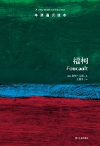

<!-- # 权力的眼睛——《规训与惩罚》读书笔记 -->

福柯在《规训与惩罚》一书中正式开始阐述监狱的形态及其扩张的历史之前，写下了这样一段话以说明自己的写作意图：“我要撰写的就是这种监狱的历史，包括它在封闭的建筑物中所汇集的各种对肉体的政治干预……如果这意味着我从现在的角度来写一部关于过去的历史，那不是我的兴趣所在。如果这意味着写一部关于现在的历史，那才是我的兴趣所在。”秉持着他独特的历史观和权力观，米歇尔·福柯把分析的目光投向了监狱这一十九世纪后广泛扩张、蔓延的惩罚形态，用他自己所信奉的可经验的方式剖析了这项惩罚制度背后的权力发展和调整史。

《规训与惩罚》是米歇尔·福柯继《疯癫与文明》后又一部描述、分析权力的运作方式和思维逻辑的著作。福柯本人曾表示，在他萌生分析监狱制度及其权力运作的想法之前，社会上兴起了一场质疑现存监狱制度的运动，因而他也想写一本关于监狱的历史的书，力图在他的经验能力之内，以“明白晓畅”的方式帮助人们理解权力的现状。[1]

福柯试图向人们解释何为权力，或者说权力是如何实施的这个核心的问题。按照当时流行的说法，人们往往把权力定义为一种遏制性的力量，就是禁止或阻止人们做某些事。但福柯不以为然，他并不先验地把权力同压抑人的力量联系起来，而是从权力的策略、机制、网络和这些决策实施的手段来解释权力。

监狱的历史正是福柯用以说明权力的实施手段和过程的经验性事例。《规训与惩罚》一书出版于1975年，是福柯影响力最大的著作之一。遵循着他“明白晓畅以让更多人理解和批评”的写作宗旨，福柯在书中将丰富而生动的史料与狂放不羁、犀利深刻的论点紧密结合在一起，让读者在形象、细致的历史进程中直截了当地掀开表象的面纱一眼望进权力实施机制的深处。

**第一部分

酷刑的淡出**

《规训与惩罚》的开头让所有曾经翻开过它的人过目不忘。弑君者达米安的公开行刑仪式血腥残暴又有条不紊，刽子手用花样迭出又各具意涵的工具和手段对达米安的肉体展开逐层递进的惩罚，整场仪式看起来惊心动魄，跌宕起伏，但总让人感觉到这场仪式的背后，权力以威严、不容侵犯的仪态冷酷地俯瞰着这一切。

福柯紧接着为我们呈现出了最戏剧性的对比：一份严密规范的作息时间表，也就是一种更为温和、细致的惩罚方式。这个极富感官冲击力的对比实际上代表了刑罚方式在历史上的一次重要转变——残酷、公开的肉刑逐渐隐藏、消失于一整套更为“温和”、“健全”的惩罚体系之中，肉体看似获得了令人动容的解脱和怜悯。十九世纪初，肉体惩罚的大场面消失了，对肉体的酷刑也停止使用了，惩罚不再具有戏剧性的痛苦表现。惩罚的节制时代开始了。[2]

尽管要使刑罚完全抹去对肉体的“酷刑”是难以做到的，但现代刑事司法体系中的“酷刑”已经逐渐被非肉体刑罚体系包裹了起来。在福柯的叙述中，惩罚方式的转变主要体现在刑罚对象的转变。

“曾经降临在肉体的死亡应该被代之以深入灵魂、思想、意志和欲求的惩罚。”[3]司法对于犯罪的性质的定义和应该受到惩罚的内容的界定都发生了扩张性的改变。人的情欲、本能、变态疾病也被纳入惩罚的范围之内，审判的目光将这些潜藏在犯罪事件背后的因素也纳入观察的领域，惩罚针对的不仅是罪行本身，也包括罪犯本人。这实际上是惩罚作用点的转换，而置换出现了新的对象领域，一个新的事实真理体系以及一大批在刑事司法活动中一直所不为人们所知的角色。惩罚权力的实践与一整套知识、技术和“科学话语”愈发紧密地纠缠在一起。[4]

在酷刑尚未退出公众仪式领域的时代，刑罚遵循着一套君主权力的思维逻辑，在这套权力逻辑下，肉体在司法过程中处于重要的位置，是刑事程序中的基本因素。“正义的执行者”司法部门将肉体作为得出或复制犯罪真相的工具，从供认罪行到处决的执行，肉体的惩罚起到了支撑起刑罚的运作和展现刑罚效果的作用。在司法的每一个环节中，肉体都以受折磨的方式彰显出它对君主权力的配合和服从。因此，酷刑和公开处决是同时兼具司法功效和政治功效的，“它用展现君权最壮观时的情景来恢复君权。”[5]从古典时代开始，君主权力的捍卫和宣扬就是进行公开处决的目的之一，而实施惨烈的酷刑的意图则是将威力巨大的君权与胆敢挑衅君权的臣民之间的实力对比以极致的方式展现给所有的臣民来看。君主是绝对的司法首领和军队首领，神圣而不可冒犯，而公开处决则是君主以戏剧性的方式对犯罪者实施报复，上演一场毫无悬念的必胜战争。

福柯认为，如果酷刑在法律实践中根深蒂固，那是因为它能揭示真相和显示权力的运作。它既是沟通犯罪与惩罚的原则，也加重了对犯罪的惩罚。它提供了展示真相和权力的场面，也是调查仪式和君主庆祝胜利仪式的最高潮。[6]而十九世纪，改革者呼吁尽可能拉开“平和的”真理探求与无法完全从惩罚中抹去的暴力之间的距离，也就是说，通过不那么残酷的肉体虐待而是以其他更为“人道”的方式呈现真理和权力。这意味着改革者开始要求刑罚权力要进行调整和改变。与此同时，现实的困境也在催促当权者改变公开处决的策略，因为作为处决仪式的受众，人民已经成为了行刑过程中一个难以控制的因素，人类天性中的同情心常常会夹杂着对当权君主的不满而在行刑现场被激发出来，形成暴动和反抗，罪犯受到怜悯，而实施权力的人反而被看做实施罪行的一方。由于权力追求更有效率的实施方式，惩罚的逻辑思维开始进行调整，公开处决逐渐退出历史舞台。

**第二部分

惩罚权力的策略**

站在改革的分岔路口，刑罚的转变大体上面临着两种选择。启蒙时代，改革者主张为过分的权力划定一条合法的界限。在当时所主张的更为仁慈的刑罚制度中，“尺度”和“人道”是改革者极其看重的因素。这类呼吁的出现有其自身相对应的事实背景。福柯通过分析历史学家对司法档案的研究得出结论：十八世纪刑罚的放宽过程实际上是一种双重运动。当时的犯罪从流血的暴力犯罪逐渐转向经济层面的诈骗犯罪，而在当时的时代背景下，财产在司法和道德方面越来越受到重视，相对应经济关系本身的复杂性，对社会的控制和管理也必须转向更为精细的方向，寻求更为细致精确的技术手段。因此原有的强势而暴力的司法手段——酷刑和公开处决因其效率低下而饱受改革者诟病。“改革者们的批评与其说是针对当权者的缺点和残忍，不如说是针对一种糟糕的权力体制。”[7]这种权力体制的功能在当时越发失调，在精细化和隐蔽化的犯罪行为面前显得过于粗笨而低效，所以君主的至上权力越来越受到批评。“人们所批判的不是或不仅是司法特权、司法的专横、年深日久的傲慢及其不受控制的权力，而是或更主要的是，司法集软弱和暴虐于一身，既耀武扬威又漏洞百出。”[8]

十八世纪，在刑罚的实践中，一种关于惩罚权力运作的新策略开始产生，其首要目的就是使对非法活动的惩罚和镇压变成一种有规则的功能，不是更少的惩罚，而是更有效的惩罚；不是更残酷的惩罚，而是更广泛和必要的惩罚。福柯指出，为了应对变得更为微妙并且广泛散布在社会中的犯罪行为，惩罚的权力需要发展出一套新的结构和技术。

回到上文中提到的两种改革选择，其中最直接地呼应“有效而广泛”的惩罚策略的一种选择是建设一座惩罚之城。惩罚之城的背后蕴含着一套进步了的权力思维和策略。首先，惩罚应该转向一种能够恰到好处显示事实犯罪的障碍性的符号体系。这套符号体系应该是经济而有效的，能够广泛地作用于整个社会，高效地控制整个弥散的非法活动领域，因此它需要具备几个主要原则：最少原则，只要使刑罚造成的伤害超过了罪犯从犯罪中获得的好处就足够；充分想象的原则，使刑罚的痛苦在想象的空间就发挥效用，从而尽量省略那些不必要的公开展示因素；侧面效果，既能够对公众形成影响，又能够尽量减少罪犯的痛苦的效应；绝对确定的原则，任何一种犯罪都应该使人们能够想象到一种明确的对应后果；共同真理原则，用充分的证据并依照普遍适用的方式来确定罪行；详尽规定原则，所有的犯罪都必须明确规定，毫无遗漏地分门别类。

从上述符号体系的原则中不难看出，十八世纪的刑罚人道化并非仅仅是人道主义的怜悯和同情，而是一种精心计算的惩罚权力经济学在广泛地应用于司法领域。权力更为聪明地把作用对象从肉体转向了灵魂，力图在人脑中传播惩罚符号以达到有效和广泛地惩治的目的。

福柯进一步指出，要想使上述那套惩罚符号武器库得到有效的实施，必须有一套对应的表象技术学。首先，它们应该尽可能地不带有任意性，使犯罪自然而然地对应到某种特定的刑罚。这样一来既有利于有犯罪倾向的人去权衡利弊，也有利于减少权力实施过程中的人为因素，使之活动类似自然准则一样的合法性，从而把权力的实施方法隐蔽起来。福柯在此甚至提到这是一种惩罚美学。“犯罪应该继犯罪而来；法律应该显得是一种事物的必然性，权力在运作时应该隐藏在自然的温和力量背后。”[9]其次，这套符号系统应该能够消除维系这种犯罪观念的主要原因，弱化导致犯罪的利益和兴趣并重新激起罪犯被削弱的高尚兴趣；时间也应该被纳入刑罚符号之内，为的是让犯罪得到足够的惩罚同时也给予他们足够的改过自新的机会，最重要的是，通过一段持续性的惩罚产生对民众的教育作用；第四，这套惩罚符号体系是针对潜在的犯罪者的，因此它需要被快速而广泛的传播，“像货币一样”在民众的头脑中取代犯罪的虚假利润。福柯指出，通过这种方式，罪犯的肉体从国王的财产变为社会的财产，所以犯罪者自然而然地被推到了社会共同体的对立面；更进一步说，这套刑罚体系还需要一套有效的宣传经济学，符码的灌输需要尽可能多的重复，而非仅仅依靠一个庆典式的公开处决仪式；最后的一条方案是，通过利用符号体系制造犯罪的障碍，击碎那些可能存在的带有英雄主义色彩的犯罪传说，以细碎具体的手段磨灭浪漫主义的犯罪情怀。

福柯提出，集齐上述表象技术学的刑罚方式应该是一个惩罚之城。犯罪行为及其相对应的惩治法律和手段将会像海报一样张贴在公共建筑之上，而小型惩罚剧场遍布这座惩罚之城，而对于城里的人们来说，进行一次预防犯罪的教育就像讲述一个寓言故事一样轻松方便。

至此，福柯已经把一种可能的惩罚权力改革方式和理念阐述得生动形象，甚至到了细致入微的地步。这种权力的逻辑转变俨然是高明聪敏的，不再像暴君一般简单地宣泄权力、报复犯罪来挽回自己的脸面，而是通过仔细、精打细算的规划和设计，逐渐使权力的痕迹隐匿于精巧的制度之后，从而逐渐用难以觉察的方式驯服已经犯罪的人，同时控制住潜在的犯罪的人。

按照这套惩罚权力的表象技术学的要求，刑罚必然要以多样化、精确化的方式来实现，更应该避免统一的刑罚。但恰恰如此相反，监禁这种仅以关押的时间长度来区分不同程度的罪行的惩罚方式却在十九世纪大行其道，几乎占据了死刑和轻微处罚之间的全部空间，成为了最基本的刑罚方式之一，一直延续到现在。从表面上看，监禁的惩罚逻辑似乎是与惩罚的符号体系的表象技术学大相径庭的，它不仅无法与特定的罪行本身相对应，而且徒增了社会开销，又让犯人无所事事。公众的监督无法触及阴森、密闭的监狱，惩罚权力又有了肆意妄为的空间。尽管饱受改革者的诟病，监禁这一惩罚形式却很快就成为了最基本的刑罚形式。

对比了惩罚的表象技术学和监禁制度后，福柯总结到：“监狱的出现标志着惩罚权力的制度化。”[10]与残暴的酷刑和改革者所倡导的编码表象学的惩罚方式相比，通过在习惯、行为中留下痕迹、对肉体施展训练来惩罚犯人的监狱制度成为了大势所趋。在这三种权力技术学的竞争中，强制的、肉体性的、隔离的、隐秘的模式以监狱为制度依托，最获得了胜利。

**第三部分

规训**

监狱相比于改革者倡导的符号表象权力技术学最明显的一个区别在于它对肉体的重视。这种规训模式将肉体视作规训的对象，并且以精密细致的技术对肉体进行约束、训练，期望收获驯顺的肉体。与以前相比，十八世纪的肉体驯顺技术增添了新的技术。肉体被施加微妙的控制，每一种性能都被施以不同的控制手段。而在驯顺手段上，也是采取了不间断、强制性的控制方法，进行不断的操练。在这套规训手段当中，最为核心的因素是纪律。在福柯的剖析下，我们早已习以为常的“纪律”实际上蕴含着我们难以想象的细节政治解剖学。

为了展现纪律背后的权力的脉络和纹理，福柯细致梳理了军事、医疗、教育和工业机构里普遍存在的规训方式。在这些规训方式中，空间的分配是一种普遍的手段。纪律的实施需要封闭的空间，也就是纪律的权力有效作用范围，在这种基础上，再进一步将人放置于确定的单元格中，从而使权力能够了解、驾驭驯顺对象，甚至能够以可解析的手段来实施策略。“纪律是一种等级排列技术，一种改变安排的技术。它通过定位来区别对待各个肉体，但这种定位并不给它们一个固定的位置，而是使它们在一个关系网络中分布和流动。”[11]纪律对人的活动也实施了精准的安排，通过确定活动的节奏、周期来确保规训的成效。同时，活动的安排中肉体被工具符码化，被要求能够有效、准确地执行命令。在这种分配技术之上，肉体成为了一种操练的肉体，能够接纳特定的、具有特殊的秩序、步骤、内在条件和结构因素的操作，而从对肉体的控制中，也产生了新的知识内容。由此，福柯所谓的权力产生知识的观点能够得到部分证明。最后，为了使训练有素的单个肉体集结成为一种高效率的机制，规训还需要对肉体进行力量的编排。

在上述的规训逻辑的控制下，理想中的驯顺肉体应该具有四种特点：单元性、有机性、创生性和组合性。权力通过使用“制定图标、规定活动、实施操练”来实现目标，获得驯服的肉体。在这权力逻辑之中，我们可以看到权力运作的周密、谨慎和全面性，而正是由于这种规训方式的细致周全和具体可操作性，它也被广泛地投射到社会共同体之上，渗透进入教育、军事、医疗和工业的方方面面。

与这种规训逻辑相对应的是一套精心安排的规训手段。层级监视使权力在纵向与横向的监督体系中得到增强；规范化裁决以不同于法律手段的方式不断对个体施加规范的压力，通过度量差距来迫使受驯者达到一致性。最后，检查以明确的方式强调了规训权力的实施者和对象之间的差异和对立，让权力的行使变得合法合理。

从我们自身可经验的感觉来看，这种规训权力的确做到了自然、隐蔽，它隐匿于日常生活的微观细节之中，让人在习以为常的规则之中不知不觉就变得顺服、满足权力施加者的期望。

而规训权力的极致化发展离不开对空间的规划和布局，所以福柯又将权力分析的领域拓宽到了建筑空间的设计上。全景敞视主义，一种由英国功利主义思想家边沁推崇的全景式监狱建筑规划思想，是福柯重点分析的对象。全景敞视主义的监狱建筑的基本构造是由四周的环形建筑和中心的瞭望塔组成。从瞭望塔的环形窗户上能够监视四周被分隔成小囚室的环形建筑内部，而各个囚室的两扇窗户一扇对着瞭望塔，以便被观察，一扇对着外部，以获取足够的光亮，使监视更为清晰。它改变了监狱原有的黑暗、隐藏的特性，保证了充分的监视便利性。全景敞视主义的后果是显而易见的，被囚禁者彻底无遮掩地暴露在中心瞭望塔的权力之眼中，由于被监视者并不能知道自己是否此刻正在被监视，所以他所感到的监视是持续的、不间断的，他知道自己会被监视，却不知道何时被监视，正是这种单向度的监视权力让被囚禁者时刻处于未知的恐惧和约束之中，从而使得权力自动化和非个性化，不需要某个具体的权力执行者也能使权力自动地发挥作用。

全景敞视主义充分利用建筑构造上的优势，在监视的基础上还可以进行权力技术的实验。实验室所要求的控制变量和对照实验都能够在掌控之中实现，因为这项技术是如此周全，以至于它几乎不会出现什么不可控的变故。甚至监视层级中的一些雇员和监视者本人也可以被更高的权力机构或者外部人员所监视，只需要一看就能够确定整个全景敞视主义的监狱模式是否在正常运行。

基于全景敞视主义的绝妙功能和不难实现的操作性，这种空间权力手段能够被运用于很多社会组织和活动领域。“凡是与一群人打交道而又要给每个人规定一项任务或一种特殊行为方式时，就可以使用全景敞视模式。”[12]对于权力实施者来说，全景敞视主义让权力的行使更加完善。通过减少行使权力的人数、增加受到权力支配的人数，让权力自动行使，产生连锁效果，任何使用全景敞视主义的权力机构都得到了强化，因而正如我们现在所见，全景敞视主义在社会中以微妙的方式不停运作，而这种运作方式让人习以为常，不觉突兀，最终，权力能够在增强自身的同时也增强了社会生产的力量，而不像以往的君主权力那样在野蛮的报复中反倒阻碍了社会的进步。

至此，规训社会在全景敞视主义的扩张中逐步形成，权力也借此扩散到社会的各个角落。福柯认为以全景敞视主义为代表的权力策略实际上是伴随着特定的历史进程到来的。人口的激增和生产机构的增多都要求权力针对这个情况进行调整和升级，而权力的策略也“不负期望”地达到了这个要求。

**第四部分

监狱的诞生**

在对人类的刑罚转变史和权力实施的策略进行详细的描述之后，福柯对监狱的诞生给出了这样的定义：“如果一机构试图通过施加于人们肉体的精确压力来使得他们变得驯顺和有用，那么这种机构的一般形式就体现了监狱制度。”[13]更确切地说：“司法被说成是‘平等的’，法律机制被说成是‘自治’的，但是它们包含着规训征服的一切不对称性。这种状况就标志着监狱这种‘文明社会的刑罚方式’的诞生。”[14]根据这一点，我们首先必须纠正我们常识中对监狱的刻板印象：密闭、黑暗、暴力横生。但监狱的诞生和合法化过程并不是依靠强制力确定下来的，而是监狱制度本身与社会的职能紧密结合在一起，它像是历史过程本身的产物，尽管我们知道它有各种弊病，却无法想象怎样才可以取代它，或者是否应该取代它。

监狱存在的合法性也与监狱本身的性质有极大的关系。首先，它以“平等”的惩罚对待一切犯罪的人，剥夺对所有人而言最重要的东西——自由。它以惩罚的时间长短来使罪犯向社会还债，饱含着经济学的意涵。不仅如此，监狱还有改造人的目的。“监狱从一开始就是一种负有附加的教养任务的‘合法拘留’形式”。[15]它将社会中的规训机制浓缩提炼以实施改造，它对犯人实施隔离，避免狱中团伙的勾结，让犯人在隔离中对权力言听计从，从而实现所谓的“良心反省”。此外，犯人被强制劳动，目的并不在于制造经济价值，而在于使犯人的肉体驯服与某种规律和运动，因此劳动就等同于惩罚。最后，监狱被部分地赋予行使判决的权力，成为一种调节刑罚的工具。

总之，监禁以符合人们“期望”的方式剥夺自由，对人进行积极的改造，利用三大模式：单人囚室、工厂和医院来替司法执行对犯人的规训，而全景敞视主义则为这三种模式的运行提供了操作上的可能性。

由于监狱制度被广泛地作为实施惩罚的方式，这项制度本身也遭到了人们的诟病。监狱制度被指责为对降低犯罪率无效、造成累犯和制造过失犯、也让犯人的家庭坠入贫困的深渊。对此，福柯的分析让人跳出大众的批评目光，从监狱制度本身来看待监狱制度的“弊病”。他指出，“监狱及其一般的惩罚并不旨在消灭违法行为，而是旨在区分它们，分配它们，利用它们。”[16]监狱的成功之处就在于它能够将犯罪的群体从混沌的社会大众缩小确定为社会边缘的某些群体，把变幻莫测的犯罪方式锁定为确定可控的“过失犯罪”行为。也就是说，监狱制造了这些犯罪，同时将这些犯罪纳入了自己的掌控范围。

至始至终，监狱制度背后的权力策略都遵循着确定性、准确性、细致性和可控性的原则，甚至以民众无法直接察觉和理解的方式使权力在自己的掌控之下细密地渗透于单个犯人的肉体之中和整个监狱体系之内，甚至扩散到更多的社会机制之中。

在《规训与惩罚》的结尾，福柯选择了描述一个极具代表性的案例来为这本在我看来狂放不羁、大胆犀利的权力分析之作收尾。相比于此书开头那让人过目不忘的达米安之死，最后一章中梅特莱农场则以最为极端的方式诠释了规训权力的功效，而梅特莱农场正式投入使用的日期也被福柯定义为监狱诞生的日子，之所以这样选择，福柯解释道：“梅特莱这个惩罚样板恰恰位于严格意义的刑罚范围的边界。在刑罚领域之外，有一系列的机构组成了‘监狱群岛’。梅特莱则是其中最著名的一个。”[17]禁闭、司法和规训机构的界限已然消失，宏大的“监狱连续统一体”已经渗透进整个社会机体。监狱连续统一体在社会中设置了彼此连接的机制，让不确定的过失行为能够在其掌控之中转变为确定的犯罪，受其惩治，而潜在的犯罪者一出生就置身于矫治和惩罚的网络之中，无论他怎么流动，最终都会进入早就为他精心设计好的某个规训机制之内。伴随着监狱体制的确立和扩张，惩罚权力也完成了策略和思维的精致转型，而对权力而言最美好的结果也随之出现：权力的威力在“自然”的方式中得到增强，却不为人所察觉。

至此，一座与改革者梦想的惩罚之城不同的“监狱之城”巍然屹立于社会之中。这座城的一砖一瓦都在权力的思忖之中修筑，一系列与之相连的监狱机制通过各自的温柔方法对城中之人实施规训，如护城河一般让这座监狱之城变得固若金汤。而城中之人的人性则成为了复杂的权力关系的工具，肉体则是多种监禁制度交汇点。“在这种人性中，我们应该能够听到隐约传来的战斗厮杀声。”[18] 交战的双方难道是残存的人性在誓死对抗渗入的权力吗？在领略了福柯对权力的细致描画之后，我反而觉得，交战的不过是权力在转变策略时的不同选择的两方，而人性，似乎早已在大敌压境之后缴械投降。

“明白晓畅以让更多人理解和批评”是福柯在写作《规训与惩罚》时的行文原则之一，但这“明白晓畅”却更像是用讲故事一般生动形象的语言讲述了对很多人来说难以想象的事实——我们身处权力之网中，我们不仅不会插翅而逃，我们反倒无动于衷。我惊叹于福柯敏锐的犀利，他所毅然揭下的面纱之后，实际上是一张让我们感到熟悉又陌生的权力之脸，而这张脸根本不是我们以为的样子。

我们曾以为权力必然与强制性、暴力和命令联系在一起，我们以为权力机构的背后一定是某一个怀着独裁阴谋的个体在兴风作浪，我们更关心权力的实施者而忽视了权力的实施过程和机制。福柯将我们忽视的东西一一揭露给我们看，让我们目瞪口呆又不知所措。在福柯的权力观中，重要的不是权力的实施者，而是权力的策略和手段。他细致地描画了社会机体中的权力之网，我们惊讶地发现他并没有告诉我们究竟是谁布下了这天罗地网，而是向我们展示了这权力之网有多么周密、细致和连贯，学校、军队、医院和工厂实际上都是规训之网的结点，都是监狱制度的改良版，它们彼此相连，相互呼应，让诞生于其间的人们无处可逃。

令人恐惧的是，被网罗住的人们并不试图逃离，因为规训和惩罚的权力手段是如此的细小、温柔，我们对它习以为常，甚至不会将那些渗透进我们日常生活的细节的东西与“规训”联想在一起。学校里的“月考”“周考”不仅是对我们知识掌握程度的考察，更是检察权力“耀武扬威”的展现和合法化；“学籍档案”的书写和记录不仅仅是为了了解学生的基本情况，更是规训权力用来识别其控制对象的技巧和创新；军事训练中对指定动作的重复和高要求，不仅是为了磨练士兵的意志，更是为了将士兵的肉体准确地掌控在规训权力的手中，割裂肉体和自主性的关系……权力的策略无处不在，无法一一列举。

权力策略的高峰则是以圆形监狱为代表的全景敞视主义在社会机体中的广泛使用。被规训者被安置在外围的孤立囚室中，接受着未知的监视和操控，建筑中心的瞭望塔是权力的眼睛，它发出单向度的监视，制造难以撼动的驯服氛围。个体作为完整的生物有机体，它的交流被阻隔、自由被控制，甚至隐私也被剥夺——没有什么能够逃过环形监狱中心的瞭望之塔的眼睛。更令权力满意的结果是，在这一系列精心设计的规训技术的掌控下，人从一开始被动地接受规训开始慢慢地自我监视、自我控制，权力的逻辑深深地烙印在受训者的大脑里，得到自然地实施。

如果我们不愿承认自己已经沦为某种规训化权力操纵的对象和工具，我们不妨从电影《肖申克的救赎》一窥权力的手腕。这部影片中的两位主角安迪·杜弗雷和瑞德都被塑造成了肖申克监狱里芸芸众囚中罕见的自由之心不死的人物。相比遭受了17年冤屈的牢狱之灾的安迪，在肖申克监狱里生活了三十年的老黑人瑞德早已自我说服，得出了自己的监狱哲学，他告诉安迪，希望是危险的东西，是精神苦闷的根源。何以得出如此结论？

肖申克监狱虽然没有呈现出圆形监狱的外形，但全景敞视主义的理念却是这座既普通又特殊的监狱的指导思想。高耸的瞭望塔和典狱长办公室位于整座监狱中心，居高临下地俯视、监控着被强制劳动的囚犯；监狱的隔离原则接近于福柯在《规训与惩罚》中所提到的“奥本模式”，夜间使用单间囚室隔离，白天劳动和进餐可以在一起。漫漫长夜，犯人们只能在狭小阴暗的囚室中与自己对话。行为不慎者更会被狱卒处以长达两个月的禁闭，关入黑暗无光的密室里，遭受彻底的隔绝。加上严格规定的作息时间表和日复一日的循环式生活，肖申克监狱对囚犯们的规训很符合福柯给出的描述。

进入监狱之时，囚犯们被要求脱光衣服，用水枪洗浴，再喷上石灰，完成这一系列仪式，正式成为监狱之城的囚徒。而典狱长要求每一个囚徒必须遵守的，则是“纪律与圣经。”三十年的牢狱规训，从最初的痛苦崩溃到后来的安之若素、习以为常，睿智淡定如瑞德，终究也逃不过规训权力的手掌。当离开肖申克监狱的日子终于来临，他脱下囚服、穿上西装的样子是如此别扭、怪异，而他在重获自由之后也会在想上厕所的时候多此一举地请求便利店老板的同意。多么驯顺的肉体！纵使你曾经以为自己足够洒脱淡然，总有一天你会意识到权力技术的力量早已在你没有察觉的细节中控制了你、内化于你的大脑和肉体之中。

“把灵魂交给上帝，把身体交给我。”典狱长的这句话揭示了肖申克监狱与福柯所展示的规训权力之间的密切联系。把你的作息交给井然有序的时间表，把你的肉体交给琐碎繁复的操练，把你的言语交给无尽的孤独长夜，如果你把自己交给那无限的规训，也许你就只能祈求上帝还能保佑你灵魂自由。

现实中，如安迪·杜弗雷那样在细密的规训中仍能心怀自由甚至凿开墙壁爬过下水道奔向自由逃出权力之眼的人不多，社会机体中更多的人则是像肖申克监狱中普通的囚犯那样，适应、被调教，最终习惯了监狱生活。我们在遵守纪律，我们在配合权力，我们甚至会主动呼吁权力的控制，因为我们习惯了秩序，我们害怕混乱的自由。

福柯在《规训与惩罚》中描述了一种权力的“化境”，用他自己的话说，这是一种“不需要武器、肉体暴力和身体约束的监视系统。那里只有一道凝视的目光。那是一道监察的目光，在它的重压之下，每个人最终都将使之彻底内在化到自己的心中，以至于自己成了自己的监视者，每个人于是就这样越过并针对自己行使着这种监视。”[19]

福柯用他自己独特的历史学方法和分析方式向人们传递出他的权力观和态度。相比痛苦暴虐的酷刑，他更反感“温柔一刀”式的规训。他在全书的结尾处刻意营造了启示录一般的氛围，力图开启一个审视规训权力的时代。平凡如我，阅读福柯的感受是从最初的毛骨悚然到困惑不解，再到读毕后的不寒而栗、恍然大悟，或许我无法指出福柯在写作此书时的虚构和方法论还存在哪些不妥，但起码我看到了福柯那挑衅者的姿态，也在他的指引之下，发现了潜藏在社会中那幽暗的权力的眼睛。

【参考书目】 [1] 米歇尔·福柯

《规训与惩罚》

三联出版社1999年5月第1版 [2] 詹姆斯·米勒

《福柯的生死爱欲》

上海世纪出版集团 2005年第1版 [3] 严锋

《权力的眼睛——福柯访谈录》

上海人民出版社 1997年1月第1版 [4] 杨善华

谢立中

《西方社会学理论》

北京大学出版社 2006年7月第1版

 [1] 《权力的眼睛——福柯访谈录》

严锋译

上海人民出版社 1997年1月第一版

第26页 [2] 米歇尔·福柯《规训与惩罚》

三联出版社 1999年5月第一版

第15页 [3] 米歇尔·福柯《规训与惩罚》

三联出版社 1999年5月第一版

第17页

 [4]米歇尔·福柯《规训与惩罚》

三联出版社 1999年5月第一版

第24页 [5]米歇尔·福柯《规训与惩罚》

三联出版社 1999年5月第一版

第53页 [6]米歇尔·福柯《规训与惩罚》

三联出版社 1999年5月第一版

第61页 [7]米歇尔·福柯《规训与惩罚》

三联出版社 1999年5月第一版

第88页 [8]米歇尔·福柯《规训与惩罚》

三联出版社 1999年5月第一版

第89页 [9]米歇尔·福柯《规训与惩罚》

三联出版社 1999年5月第一版

第119页

 [10] 米歇尔·福柯《规训与惩罚》

三联出版社 1999年5月第一版

第146页 [11] 米歇尔·福柯《规训与惩罚》

三联出版社 1999年5月第一版

第164页 [12] 米歇尔·福柯《规训与惩罚》

三联出版社 1999年5月第一版

第230页 [13] 米歇尔·福柯《规训与惩罚》

三联出版社 1999年5月第一版

第259页 [14] 米歇尔·福柯《规训与惩罚》

三联出版社 1999年5月第一版

第260页 [15] 米歇尔·福柯《规训与惩罚》

三联出版社 1999年5月第一版

第260页 [16] 米歇尔·福柯《规训与惩罚》

三联出版社 1999年5月第一版

第306页 [17] 米歇尔·福柯《规训与惩罚》

三联出版社 1999年5月第一版

第342页 [18] 米歇尔·福柯《规训与惩罚》

三联出版社 1999年5月第一版

第354页 [19] 詹姆斯·米勒

《福柯的生死爱欲》上海世纪出版集团 2005年第一版

第303页

（采编：李以诺；责编：彭程）
