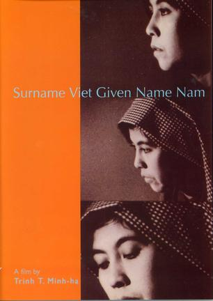

<!-- # 关于《姓越名南》——2013中国民间女性影展广州站系列观影活动文字记录 -->

**导演简介：**

崔明霞，越南裔美籍导演，她游离于各种专业之间，既是加州伯克利大学的教授，又是电影导演；既是剧本撰稿人，又是摄影师兼剪辑师；既是音乐家，又是诗人。这种多边人和漫游者的角色，使她从未失去艺术的原创力。她的电影属于典型的“女性书写”，永远在挑战着现有的规范和任何意义上的界限。

**影片简介：**

《姓越名南》是崔明霞的一部实验性纪录片，她把人类学家经常做的实地考察和访问搬上舞台，请人扮演五位背景不同的越南女性，扮演者被重新穿着与打扮，讲述她们的自身经历或对越南社会女性地位的看法，让观众看到越南复杂的国情和女性真实的生活状况，这一形式挑战了传统纪录片中所讲究的被采访者的“真实性”和“客观性”。 12月11日，女影广州在木每茶舍展映了崔明霞导演的纪录片《姓越名南》。映后，现场观众和主持人一起交流讨论了这部影片，以下为志愿者整理的讨论内容。​

**1、关于影片主题：**

主持人：看完影片，大家有什么想要分享的吗？

观众A：影片大概讲的就是导演访问五个越南女性的一些故事，后面大概就是说明这些女性为什么会接受访问的原因。影片中有一句话让我挺感动的，那就是里面有一个女性说：“因为我关心这些女性的命运，所以我愿意来表演。”可见影片出现的主角本身不一定是受害者，她只是想为越南女性发声，诉说她们的遭遇。我觉得这个很难得，当今，我们社会的很多人由于自身不是受害者，所以他们就不会挺身而出，为受害者去发声。

**2、关于影片背景：**

观众B：主持人可不可以为我们介绍一下这个影片的背景呢？

主持人：因为在搜集这部影片的相关资料时，我发现网上的资料特别少，百度查不到这部影片，用谷歌搜索才能找到小部分的资料。我了解到，台湾有一些学者对这部影片有一些研究，但大陆几乎没有，在图书馆、知网都很难找到这部影片的相关资料。由于我自身的局限，我对越南的历史也不太了解。

观众B：我之前在网上查看这次活动的相关信息时，就对这部影片的内容所表现的时间有些诧异，我在纠结到底要不要来观看这次的影片。来了之后看了影片，我发现，没有了解影片的历史背景，对影片的内容确实很难理解。我看得懂的只是，在越南社会，女性要承担很多的东西，她们要完成很多事情，但是她们的地位很难得到承认。还有，这些越南女性并不团结，她们之间会有很多猜忌。影片中有一句话：“如果女人能够互相信任，那我们就可以讨论解放。”可见，女性之间的不团结也是导致她们地位比较低下的一个原因。

观众C：我也觉得影片的末尾讲的不是很清晰，末尾不是用越南话在讲述就是用标准的美式英语在讲述。这部影片的确是需要对越南的历史有一个了解才能看得懂。这部影片的主角可以说或多多少带有女权主义色彩的，她们都是逃离越南到了美国生活的。这部纪录片和另外一部电影《投奔怒海》很相似，只不过那部影片情节性比较强。在这部记录片中，我们可以看到越南女性的地位是比较低的，但在越南社会中，女性的地位并不全是是很低的。越南的著名导演陈英雄的一部影片《青木瓜之味》，它里边所反映情况是越南女性在家庭中处于主导地位。在越南社会中，很多男性都是无所事事的，但是女性却不同，处于呼风唤雨的地位，掌管家庭中的大小事务。我认为这两部影片所反映的差异是导演的不同视角造成的。《姓越名南》这部影片的历史背景是75年至85年间，越南共产党从北方打到南方，想要统一整个越南，当时的北方可谓是比较落后的，南方是一个思想比较开放的，比较先进的地方，南部曾长时间受到法国、美国等国家的殖民。当北方的共产党统治了南方时，南方的一些医生或高级知识分子就落到比较悲惨的境遇，比如说生活上物质的贫乏。

本片的作者是以一个女性的视角去讲述，在越南内战的背景下，女性所承担的苦难相对来说是比较多，比如说女性由于身体特征的原因，在那种情况下，有时不得不出卖自己的肉体。在那个时期，有很多难民逃难到美国，所以面对越南的难民，当时的美国社会也面临一个很大的压力。这部影片可以说是美国处于越战后遗症时期导演想要给美国社会提供一个看待越南社会的不同视角。就像“911”事件之后，美国涌现很多看待穆斯林社会的纪录片一样，美国人自己说了，越战和“911”给美国社会带来影响最大的两件事。所以这部影片的导演就选择了“女性视角”这一角度对越南社会进行审视。

主持人：在影片中，我们也能看到中国对越南社会的一个影响，比如说，越南社会中其主导思想是儒家思想，越南女性要遵守三从四德。

观众C：是的，儒家思想对越南的影响很深，可以说今天的越南对儒家思想的保护、遵守比中国大陆还要好，但是越南不会承认儒家思想是源自社会。越南对于中国是一直会有一种敌视的，它认为自古以来中国就老是想要侵略它。影片中讲到的二征夫人赵氏贞，其实她在历史上的功绩并不是很大，但是，在今天的越南，二征夫人已然成为了民族英雄，在河内，有二征夫人庙、二征夫人路等等，越南已经把她的形象给拔高、神化了，原因就是她当时带领越南人民抵抗北方也即中国的侵略。之所以把二征夫人的形象给神化，这是出于民族主义的需要。所以今天中国和越南关于南海、西沙的一些争端，都是有历史原因在的，我们要去了解越南的历史，才会明白越南对待中国的态度。

主持人：非常感谢您给我们介绍了这部影片的一些历史背景知识，在了解了这些相关的背景知识后，我们对这部影片才能有更进一步的了解。不然，刚才在看电影时，我会觉得影片的讲述很乱，制作也很粗糙。

**3、纪录片的意义：**

观众C：你们有这种观看感受有很大部分的确是由于这部影片的制作粗糙造成了。刚刚主持人介绍了，这部影片的导演是一位大学老师，首先她自己对这些知识是很了解的，但是，她只是站在一个学者的角度来呈现这个视角，她没有考虑到一般受众的接收程度，影片中的主角出现时，她没有对其进行一个相关的介绍，所以这也是纪录片的受众范围比较小的原因。我在看这个纪录片时，我能够看到作者的讲述是有一条线索的，她把很多细微的东西、现象给呈现出来，让观众看到一些平常未必能够看到的地方。所以，我觉得这也是记录片的意义所在。

本周女影广州观影活动，请关注新浪微博_[@新媒体女性](http://weibo.com/u/1527379661)([http://weibo.com/u/1527379661](http://weibo.com/u/1527379661?from=profile&wvr=5&loc=infdomain)\)

（采编：万晓华；责编：万晓华）
