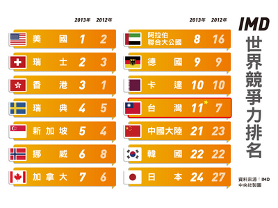

<!-- # 她要的幸福 -->

像大學聯考一樣，台灣每天都在等待5月30日的到來。瑞士洛桑管理學院（IMD）的「全球競爭力」終於放榜，台灣從去年的第7名掉到第11名。

先看看去年，5月29日那天，媒體大幅報導韓國躋身「20-50俱樂部」，也就是人均國民所得二萬美元、總人口五千萬人；是繼日、美、法、義、德、英後的第七國。

韓國如此威風，台灣人快休克了。

隔天IMD放榜，台灣第7，韓國第22。本來將要呈現水平線的心電圖，突然被電擊一下，心跳立刻恢復正常。

可見，心律不整是台灣的陳年病灶，病原是外界眼光。

再來看一下另一個衡量國力的指標──「經濟成長率」。它是一個耐人尋味的東西，大家的心很容易為它糾結在一起。

主計處公布今年第一季GDP成長率，比預期少了一半，只有1.54%。媒體形容為「腰斬」，於是死胎已久的陸參參又被拖出來鞭屍。

仔細看，媒體在報導這類新聞時，通常只會說「GDP」保幾或下修多少，從來不會說「GDP年增率」。

這兩個差在哪？

GDP的全名是「Gross Domestic Product」、「國內生產總值」，意思是「一個國家所有經濟活動，包括產品和勞務的市場價值總和」，所以單位會是「兆元」。

我們常常看到的GDP幾%，實際上指的是，全國比起前一年多賺錢的幅度，亦即「經濟成長率」。

其實只要不是太殘破的國家，GDP只會一年比一年高，錢賺的一年比一年多。台灣從2008年以來，只有2009年是-1.81（主要受金融海嘯影響），其餘都是正的。代表我們的經濟一直在成長，只是漲多漲少而已。

不知道是習慣還是真不懂，媒體常把兩者混淆，看起來就變成「成長率下滑」等於「虧本」。

一、台灣怎麼賺錢的？

雖然台灣賺的錢愈來愈多，但賺錢速度變慢也是事實。要討論原因，就要先看看台灣怎麼賺錢的？

最常見的GDP算法是從「支出面」來計算，也就是「每人所花的錢」：

GDP =

國內消費

+ 國內投資

+ 政府支出

+ 出口

- 進口

台灣的「經濟奇蹟」就是從「出口」而來，因為歐洲人都喝下午茶去了、美國人都開趴去了，所以工廠需要的勞動力，都被任勞任怨的亞洲人撿起來。台灣剛好站在這波浪頭上，很快把經濟拉抬起來。

那時設立很多加工出口區，外銷機械、零件、服飾、塑膠等。後來科學園區成立，改賣高階一點的晶片、晶圓、面板這類電子零件，賺了更多的錢。

不過一直以來，台灣都是給美國提鞋的小弟，淨是賺辛苦錢。比如幫國外大牌組組電腦、裝裝手機，像一支水果手機假設賣2萬好了，某台廠只賺800元，約4%。但因為數量太龐大，光撈零頭還是撈不少。

好景不常，二十一世紀後，要比勞動成本，比不過中國；要比科技創新，比不過韓

當台灣還在替大哥提鞋子時，韓國已經穿著自己的鞋子「趴趴走」。歐洲人買手機會看到機殼上鑲著Samsung，但他從來不會把水果手機拆開來看晶片來自哪裡。

另一方面，台灣一直是國際孤兒，什麼自由協定、合作協議通通沒份，等於在出口貿易戰場上，少了別人一根矛。導致台灣現在佔全世界出口額的比重，已經比韓國少一半。

這樣的產業結構，到現在都沒改變，「出口」還是佔了台灣GDP的65%。

高度依賴出口，就會跟全球景氣綁在一起，人家打一個噴嚏，我們就流十桶鼻水。這次GDP成長率縮水，主計處就解釋，國外景氣衰退幅度超過預期：

1. 中國、歐洲景氣轉弱，重要廠商營收負成長，如宏達電、台塑。

2. 蘋果手機全球市佔率下滑，導致鴻海虧損。

3. 塞浦勒斯銀行擠兌危機，國內股市遭波及。

（資料來源：http://www.dgbas.gov.tw/ct.asp?xItem=34016&ctNode=2858&mp=1）

可見，台灣經濟就是靠著幾座大山跟幾座小廟撐著。如果土石流沖毀了小廟，政府就斷了香油錢；如果再山崩，ROC就等著被PRC收購。

韓國更驚險了，三星一家公司的營收就佔韓國GDP的22%，加上現代、LG、SK，就高達50%。

特別是三星手機，佔了集團營收的6成，因此哪天如果手機在全球市場失利，這家公司就腥臭了。

（參考資料：

http://zh.wikipedia.org/wiki/%E9%9F%A9%E5%9B%BD%E8%B4%A2%E9%98%80

http://www.businessweekly.com.tw/mag/cover.php?id=1929

http://www.cw.com.tw/article/article.action?id=5032848&page=1

http://money.chinatimes.com/100rp/08korea/main1-5.htm）

其實韓國人口不算少，但發展模式也跟小島經濟一樣，老覺得自己人太少，怎麼賣都不划算，只好拿國內資源轉賣國外。

身為東亞四小龍的一條，台灣孜孜不倦模仿三小龍，因此不管景氣怎麼跌，抓來的藥方仍舊是：繼續科技、繼續出口、繼續全球。

一如中學的資優班可以得到最多關愛，放牛班自己去吃草，已經走過經濟起飛年代的台灣，幾項「金雞母」產業還是享有國家恩准的水電補貼、租稅優惠，其他的，請相忍為國。

（參考資料：

http://tw.news.yahoo.com/%E7%94%A8%E9%9B%BB%E8%A3%9C%E8%B2%BC-5%E5%A4%A7%E7%94%A2%E6%A5%ADa%E6%8E%89398%E5%84%84%E5%85%83-213000839.html

http://www.nownews.com/2013/05/29/327-2944648.htm）

問題是，台灣實在太瘦了，要植臉上的皮，就要挖屁股上的肉。

我們繼續把大量資源押在落後的產業、殘酷的舞台、詭譎的國際情勢，結果就是，對外是貿易戰爭，對內變成「掠奪式經濟」。

二、何以競爭、以何競爭？

經濟學有一個名詞叫作「外部成本」，也就是企業將經營成本與風險轉嫁給社會，由不相干的大眾一起分攤。

比如餐廳將排油煙管正對馬路出氣，惹得行人一身腥；或者店家將展示櫃直接推到騎樓，路人走起路來像參加障礙賽。

或者，先前曾在校門口的人行道看到蟑螂大軍四處流竄，停在紅燈前的機車騎士都不知道把腳放哪裡好。不過有同學說，他曾在同個地方，看到蟑螂們漫天飛舞。

後來某天晚間十點，我看到某家小吃店的人提著水桶，往馬路旁的水溝倒黃色液體……終於懂了。

這些，店家都不需要支出任何一筆費用。

但這些都是小意思，更高干的手法，是把成本分攤到員工的勞動條件上。

前幾年我一直在想，「八點檔」向來為各電視台兵家必爭之地，不知何故，現在竟被棄為荒地，不是製播場景永遠在客廳、辦公室、醫院的長壽劇，就是購買大陸片，或者拿十幾年前的八點檔重播。

直到我出社會後，終於懂了。八點，哪個年輕人有閒工夫坐在電視機前殺時間？不是還在加班，就是剛下班還在外面吃晚餐。所以周日十點的偶像劇才會取而代之，成為憂鬱星期一前的療癒時段。

再舉個自己的例子。上個月某天接到「即將」去上班公司的電話，時間是傍晚六點。「黃重豪，剛剛寄了一份資料給你，你把稿子寫出來，今天晚上交，最晚不超過明早八點。」

電話那頭乾淨俐落，完全表現出軍隊的「雄壯」、「威武」、「嚴肅」、「剛直」、「確實」、「速捷」、「沉著」、「勇敢」，連假惺惺說個「請問你晚上有空嗎」、「不好意思，有件事情想麻煩你」都省下了。

我戰戰兢兢打開信件，是個沒寫過的稿件類型，也無參考範本，我只好臨空描摹。果不其然，成果不符期望，人還沒進去，先被罵了一頓！

算一算，這已經是從我找工作以來，第三次，還沒正式上班就先被要求做事。

第一次，老闆叫我提早去「見習」，誰知一去，什麼都沒教就被推上第一線。我坐在桌前不知所措，小聲問了一下隔壁同事：「嗯……請問是打電話過去採訪嗎？」她冷冷答道：「就打啊！」隨即撇頭不再理我。

後來跟另一個人出去跑新聞，那人友善許多。

我問：「這裡目前最資深的是待多久？」

他說：「半年吧。」

我又問：「哦，那你來多久了？」

他回答：「三個月。」接著又說：「不過今天是我最後一天上班。」

離別前，他跟我說：「你的薪水一定比我高。」

我說：「怎麼可能，我這麼菜！」

他說：「我2萬2。」

我愕然道：「好吧，真的比較高，高3000……」

推測是我比他多了一個學位。

「試上班」以及後來的正式上班，天天工時都是14小時。老鳥好一點，13小時。

第二次的經驗是，正式上班前，我答應先幫忙寫份稿件，老闆又說：「考慮我們還不那麼相互了解，所以前兩個月算試用期，每月2萬元。」

我一直在想，企業一定要這樣子對待員工才能存活嗎？反過來，如果不這樣善用員工，就會失去競爭力，那這家公司也沒什麼前景可言了。

我也很疑惑，一直要求央行貶值的工商大老，對競爭力的想像到底是什麼？

偏偏，台灣一直放任這種風氣，用以堆砌經濟的前景。

因為我們總相信，只要熬過去，一切就是我的了。於是沒法的，就接受22K，努力累積工作經驗；有法的，就努力賣肝賺錢，再急流勇退；更有法的，拿個厲害學位，到國際舞台發光發熱，也不必鳥台灣小鼻子小眼睛的雇主了。

如果上不了國際舞台，又不甘被剝削，或許公職是條好路。

有人說考試最公平了，各憑讀書的本事競爭。

不過實際上，考試也是殘酷的資本競爭，早有研究指出，能透過聯考能考上國立大學的，多半是都會區、中上階層的子弟。意即，制度正用高學費懲罰弱勢家庭。

這種階級複製的效果，會透過補習班更加強化，因為考生只要出得起高額學費，就能降低面對考試的風險與不確定性。所以想改變自己的社會階層，沒有一定的資本，還是玩不過人家。

有時候不公平的體制會被維護，是來自一種「時序補償」的心理。這跟當兵有點像，每個新兵都有被學長呼來喚去的經驗，因為「菜鳥就是該死」。但曾經的菜鳥變成學長後，終於「媳婦熬成婆」，又會不知不覺以同樣方式對待新菜鳥，於是學長學弟制就不斷被鞏固，這就是典型的階級複製。

公部門讓考績乙等在新人之間輪流，主管優先享受甲等；或者被民眾羞辱久的公務員反嗆：「有本事你來考啊！」都是固化階級的心理。

利用對下一世代的剝奪，來補償上一世代的所失，是一個社會沒辦法進步的重要原因。

三、Michael Sandel的課堂案例，如果發生在台灣？

哈佛大學政治系教授Sandel開的「正義」課程，在美國反應還好，在亞洲卻人人為之瘋狂，或許他提出的思想辯證，戳中了發展中國家內心的陰暗。

舉幾個Sandel在課堂上問學生的問題，我再私自把它延伸：

案例A：

假設你是火車司機，某天剎車壞了，卻發現前面有5名工人蹲在軌道上，同時右岔道只有1名工人。你會怎麼選擇？

案例B：

假設你是急診室醫生，某天突然來了5名輕傷、1名重傷病患。時間有限，救重傷，5名輕傷就會死；救輕傷，1名重傷會不治。你會怎麼辦？

Sandel現場調查的結果，多數學生選擇「殺一救五」。原因很簡單，如果用人命來計數，這個方法怎麼算都是最經濟的。

其實這個調查完全去除了脈絡，也就是說，課堂上的學生一律忽略這6個人的身分、背景、來歷，只憑最素樸的直覺來做決定。在此前提下，這6條人命是等價的。

那我換個假設：

案例C：

假設你已經知道前方軌道上的5名工人前科累累，又是竊盜又是強盜；而分岔道上那位，工作勤快，曾獲模範工人表揚。你會怎麼選？

情境再轉換一下：

案例D：

假設那5名前科累累的工人，是因為上一個公司惡性倒閉，又被政府控告積欠健保費，為了養家活口，只得犯案。而那名模範工人常常假借法定職權恐嚇取財，但尚未被揭發。你會改變選擇嗎？

可見，我們的所知永遠有限，卻常用自以為的道德良知來做選擇，認為「最多數人」的利益就是正義。

如果再加入社會地位的元素，形成另一個情境：

案例E：

假如前方軌道上有5名一身髒汙的工人，而另一條岔道上，穿著西裝的交通部長剛好下來巡視。你該怎麼辦？

有時候，我們什麼都不知，有時候又知道的太多了，變得不知道怎麼選擇，只好用最便捷的方法──「利己」來考量，於是道德與否，就變成其次了。

這有點像學者John Rawls說的「無知之幕」（veil of ignorance）：（案例參考自百度百科）

假設你要投胎前，站在新生命的布幕後，等待上帝安排出身。不過上帝給個機會，讓你決定這個世界的財富要怎麼分配。

假設你選擇把所有富人抓起來，瓜分他的財產。結果布幕一拉開，你投胎成比爾蓋茲的兒子，恐怕會後悔得要死。

反之，你選擇把Windows訂超高價，而且保證暢銷。想不到布幕拉開，你變成非洲饑民的孩子，連電腦長什麼樣都不知道。

可見，只有當你不知道自己可能是誰時，才能想清楚「正義」是什麼。

現實生活中，是什麼讓我們的人性不樸素了？

Sandel還提了兩個例子。

案例F：

假設你站在天橋上，看到一列火車失控了，軌道前方有5名工人，你旁邊剛好有個胖子，把他推下去，可以擋住失速的列車。於是你伸出顫抖的雙手……

案例G：

假設你是醫生，急診室有5名分別需要心、肺、腎、肝、胰的病患，但醫院沒庫存了。這時你發現，正好有位來健檢的健康男子，正在打盹，你緊握著手裡的麻醉針……

很殘忍吧！但很不幸的，台灣救經濟，就是用最後這兩個案例來救──把毫不相干的人拖下水，要他做經濟發展的陪葬品。

「全球化」總是被出口導向的國家編織為一個美夢，「國際化」則是奔赴這場盛宴的華麗衣裳。許多亞洲國家紛紛換掉自己的粗布衫，穿上制式的西服與會。不過他們從來沒從殖民歷史中意會到，自己只是端茶的小弟。

全球化從來不是理想國或溫柔鄉，相反的，它非常殘酷，殘酷到你必須動用國本，才有籌碼上場角力。

以科技業為例，要戰什麼，就是戰尺寸！

像是晶圓越大越好，代表可以裝置的IC愈多，於是這些尖端產業動用人海戰術，把全台灣理工頭腦最好的人網羅到這裡，成天研究如何從4、5、6、8英寸，推進到12、14、15、16英寸，沒完沒了。

肝不好的、太想家的、想看八點檔的，就退下去，換別人上來。反正科技廠有的是錢，砸錢砸到堪用的人來就對了。

而後中科三期要徵地、中科四期要徵地、竹科竹南基地要徵地、竹北知識園區要徵地、桃園航空城要徵地……小小一個台灣，土地徵收的案件數是日本的十倍。

用這樣的方式治理國家，就像玩大富翁一樣，錢多的買地、炒地皮，權多的用搶奪卡、陷害卡。總之，玩家往地圖上隨便一畫，便有人要遭殃。

在大富翁的世界裡，人們生活只有一件事，就是用金錢一決高下。

有次在環評會場外，不小心被拉上台舉標語。因為怕被家人從鏡頭看見，我小心翼翼用牌子遮住臉，卻從牌子下方看到台下一位阿嬤，巍巍顫顫的淚流不止。

我完全不認識她，但我不敢想像，如果是自己的阿嬤，在這種場合落淚、失態，會是什麼樣子？

政府角色本該是一道防火牆，放手讓企業出去廝殺的同時，挺起背脊擋住外面的槍林彈雨。但台灣完全反過來，把外邊的叢林法則整套搬進來，讓優勝劣敗的角力在國內赤裸裸上演。

偏食的產業結構，掠奪的，不只是陽光、空氣、水；掠奪的，是下一代的「機會」。

四、有競爭力，卻又無力？

其實真要比的話，台灣的競爭力是不差的。全世界約有兩百個國家，台灣這麼一個鼻屎大小的地方，能排進前20名，就已經領先90%的國家了。

那為什麼我們這麼有競爭力，卻又這麼無力？

很大的原因是，台灣不夠多元。

想打棒球的，會被利誘打假球。

想玩樂團的，大人會說「七桃」囝仔。

喜歡演藝的，要露事業線。

熱愛大自然，會被說阻礙經濟發展。

想當莊稼人，土地會被徵收。

想住舊社區，房子會被強拆。

當新聞記者，一定要會八卦。

想………..的，家長會說你沒出息，一定會餓死！

這是因為，台灣只有工序思維，沒有工藝思維。

「工序」是指一個人，在一個工作台，對一個標的，連續施作各種勞動的程序。

在台灣，治理國家、經營產業、職業勞動、教育學子，都好像執行某種工序，所有活動的成果都必須能計價、計量、計時，成品非得待價而沽，不然沒有意義。

偏偏從工序產出的半成品，又不值錢。真正值錢的，是由好幾個工序組合起來的工藝產品。

可是我們的社會太沒安全感了，禁不起成就工藝之前的風險，只要什麼什麼數字稍微一下挫，就緊張的不得了。

如果GDP成長率比美國、日本低，是一件非常羞恥的事，那我們繼續當開發中國家吧！

把海外工廠通通搬回來、把薪資壓低一點、把工時拉長一點、把勞動效率提高一點、把生產要素榨乾一點。

誰跳樓不用理他，他肯定是沒競爭力的人；台灣有129條水系，再怎樣也汙染不完；大不了，把元素週期表吃過一輪，也就如此。

最近在看美國一部殭屍影集，叫做The Walking Dead，但其實我最不喜歡看殭屍吃人或人殺殭屍的場面了，噁心至極。我愛看的，是那種非虛構的虛構情節。

一群災難下的倖存者，在殭屍環伺中四處流浪，物質享受消失了，道德法律也崩解，人類慾望退到最低層次的「求生」。

起初他們共同生活、分工合作，比如男生出外找食物，女生留營理庶務。隨著不確定性愈來愈高、資源日漸稀少，團隊成員開始互相猜忌，連誰該洗衣服沒洗也會不爽。

即使各懷鬼胎，生活也會偶發一些小美好，比如某個小女孩走失後，大家留下來一起生活的最大動力，就是找到那位女孩。

為了要不要放走敵方陣營抓來的俘虜，他們也起了激烈爭論。一方認為不該殺殭屍以外的「人」，另一方覺得這是縱虎歸山。槍決俘虜前夕，有個人心痛欲絕的說：「這個世界雖然殘酷，但我寧可相信，這個世界還沒變成我們想像的那樣。」（印象中的台詞）

最後，小女孩死了，俘虜也被殺了。於是他們開啟下一關的殘酷考驗。

真實社會中，沒有殭屍，所以我們總是跟孩子說，多讀書、多拿學歷、多卡好職位、多賺更多錢，才能讓自己過好生活。

不過我們從來沒跟孩子說，過好生活的目的是什麼？

我們看到某某人考上法官、獲聘教授、當上工程師，直覺的反應就是：厲害、優秀、勝利、值得學習！

有人說，當教授就是回饋社會的方式、當法官就是維護正義的方法。然而，教授也好、法官也好，都只是一個「職位」，一如農夫、部長、工人、律師、司機。

法官地位崇高，但也可能草菅人命；農夫養活眾生，也可能濫灑農藥；教授桃李春風，也可能誤人子弟；工人賣命起樓，也可能偷工減料；會計師妙手理財，也可能助大戶逃稅。

可見，這些職位都只是一個檻，跨過去後，後面的路怎麼走完全是另一回事。

可是，我們什麼都不管，看到什麼師、什麼長的，就直接讚譽；看到以勞力為生的，就直接藐視。

於是備受榮寵的，享盡資源、沉浸掌聲，就傾向將這套「優秀」的傳統定義，一代一代複製下去；

那些備受貶抑的，連自己都瞧不起自己，只會再把這套自我否定的思維，一代一代傳承下去。

於是「幸福」成為了稀有財、炫耀財，再也不是普世價值。

何以至此？因為我們根本不知道幸福是什麼。

幸福從來不是商業廣告裡的用詞而已，它完完全全是需要經過辯論的。可惜它太抽象了，我們只好把它簡化為對某些行為的模仿，像喝星巴克一樣──那青綠秀髮的魔女、飄盪空氣的芬芳、燈影搖曳的空間，只要走進去，就先濡了一身優雅。

「優雅」之虛無飄渺，相當於我們都摸不清的「幸福」，只好把幸福等同於對經濟力、競爭力的追求。

不過如果回過頭來看看IMD、WEF對競爭力的定義，就會發現根本不是那麼一回事。

「一個國家創造『資源附加價值』，並增進『全體國民財富』的實力。」（IMD）

「一個國家達到『永續』經濟成長及『高國民平均所得』的總體能力。」（WEF）

顯然，附加價值、全體國民財富、永續、高國民平均所得，台灣都遠遠落後，那那些排名不就都假的？

那幸福到底是什麼？

姊姊養了一個異常好動的小孩，平時來阿公阿嬤家，屋子那麼小，她還是可以衝來衝去。有次她一進門，眼睛閃著光芒往我衝過來，我還以為她要抱我，結果她衝到桌前就停下來了，拿起一個小塑膠包裝物把玩。那絕對不是玩具。

從廚房衝到客廳、從客廳衝到廚房，只要她腳步一停下，就開始東張西望，用銳利的眼神，搜尋下一個沒見過的東西，比方髮夾、眼鏡、原子筆、面紙、紙盒、光碟等，通通可以打量許久。再小一點的時候，拿紙在她面前撕成兩半，她還會笑成瘋子。（證據：https://www.facebook.com/photo.php?v=201699336543204&set=vb.100001094166050&type=3&theater）

好奇是人類的天性，就算長大後，好奇心也不會消失，只會被壓抑。

因為人們會依照一些既定印象給各種職位排序，建構成金字塔型的「社會地位」。許多人在這座塔下，遺失了自己的好奇心。

看著可愛又忙碌的小甥女，我一直在想，到底要把什麼樣的環境留給她？

是要留一個相對友善的環境，讓她可以自由發展興趣和志向，比如音樂、舞蹈、戲劇、文學、漫畫、種田、炸雞排、泡咖啡、烤麵包、種草莓、摘香菇、做紅豆餅，隨便都好。

還是要叮嚀她，從小就要好好讀書、考好大學、讀明星科系、當醫生、工程師或進外商銀行；最好可以出國讀書，能不回來就不要回來，如果要回來，記得找一家夠大的公司養你一輩子，或者志在公職，一生幸福。

但如果她的爸爸媽媽，給她很多教育資源了，她還是不爭氣，成為比我這平庸人還要平庸怎麼辦？

我這沒用的舅舅該著急嗎？

老實說在我們這個社會，對從事「沒賺錢遠景」工作的人來說，最奢侈的，從來不是過好生活，而是「父母的肯定」！就連李安也是到拍《斷背山》之前，才得到父親的認同，可惜沒多久父親就過世了。

我很不希望，到了下一代，人們看到誰取得非物質上的成就，第一個反應是先酸「家裡有錢」；我也不希望，到了下一代，文史哲的畢業生，仍舊只能當老師，社會科學畢業生，還是只能考公職。

我更不希望，當我垂垂老矣，而正值壯年的兒女，已經進入一個人吃人，而不勞殭屍的世界。

我希望，我們從現在開始釐清，幸福到底是什麼？

(采编：余泽霖；责编：陈澜鑫；

)
