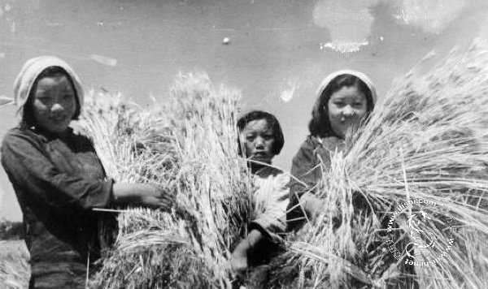
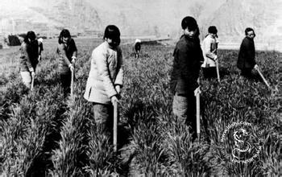

<!-- # 生存的“理性”——皖中汪村农业集体化的农民记忆 -->

自上世纪50年代初开始到70年代末结束的农业集体化运动，是我国传统土地经营方式的重大转变，广大农民在中国社会变革中始终扮演着重要的角色，他们用行动不断改变和创造新的社会面貌，他们在参与中更新着历史的演进。因此，他们应当成为这些实践过程的话语者和解说者。

然而，在那些农村发展史或农民生活史的编录中，我们看到的更多是宏大历史背景和具有转折意义的历史事件。对于那些发生在普通农民身上，为农民自身实践所创造的乡土历史，却逐渐被人忽视，变得悄无声息。从参与和创造过农村历史的农民这里出发，通过他们对过去的记忆和感悟，我们可以获得一些从正式或公共途径无法获得的价值信息。这些信息有助于我们重新体会和洞察农村的历史，更深入地揭示那些存在于日常生活中国家——公民间的治理关系。

本文所讲述的个案村庄汪村，坐落于安徽省中部的肥西县，是一个以经营种植业为主的传统村庄。笔者于2013年1月-2月在该村庄开展了40多天的实地调研。在村内收集村民口述资料的同时，为了增加访谈资料的完整性，笔者还进入当地县城寻找那些集体化时期生活在汪村的老人。所以，本文所有的定性分析资料均来自对在汪村生活过的村民进行的深度访谈。

##“一、集体化的生活记忆”

当让村民谈谈自己对集体化时期的回忆，他们第一反应通常是半响说不出话来。只有从那些与他们每天生活息息相关，为他们思维高度关切的事件出发，才能让他们的回忆有个清晰的脉络，在此，这些事实是通过对“食物”和“集体劳动”的记忆来被把握和加以回顾的。

###（一）食物匮乏的饥饿

对于汪村农民来说，食物匮乏对他们内心记忆的影响是深远持久，难以磨灭的。村民在集体化时期不只遭受饥饿的折磨，还有很多人由于缺乏食物而失去了生命。

“当时不是‘粮食过关（大跃进）’嘛，59年冬天生产队就没粮了，朝上头要，他们也没有。好多人都饿死了，饿死不就算了嘛，侠们（孩子）哭都没劲了，家里头大人找几个人抬到岗头上（地势较高的土坡）就埋了。记得60年初啊，好长时间田里头见不到草青。（问：怎么回事？）你讲怎搞的，人饿没办法，草根都找吃的啦。那也不够吃啊，反正就看你命嘛，能熬就能活下来。到了62年，整个汪岗大郢就只剩90几个人了，58年还是270人呢，都饿死了，好多家全家都没人了。”

除了食物供给的匮乏外，衣物布料的缺乏也能够反映当时村民的贫苦。一位村民在回忆小时候关于穿衣发生的事情时，不禁黯然伤神。他感叹道：“那时候过年也没衣裳穿啊，就望能搞几尺布，扯个花褂子穿嘛。我家隔壁的小玉宝跟我关系最好，反正天天就我们两个玩。那天早上，玉宝妈过来了，把一件棉袄递给我妈了。我妈把棉袄递到我床头，跟我讲：‘没衣裳穿，就穿这件吧。’我猜到玉宝是昨晚死的了。不假，那天一天都没看到玉宝，以后也没看到。要是他活着，也老咯！（沉默一阵……）我们（状况）还好，有的人家侠们多，一条裤子轮流穿。今个老大出门，那就给他，回来就脱了，哪个出去就给哪。”

###（二）集体劳作的辛苦

日常劳动是农民生活的主要部分，农民白天的时间大多都是放在经营土地的劳动中。合作化运动使村民从家庭生产的私领域中走出来，所有劳动都变成公共集体性的。这其中蕴藏的汗水和辛苦构成了对那个时期独特的记忆。

“六月心（农历六月中旬），天要是旱的话，那就麻烦了。岗头上，水够不上去，那就得人工去车水（用旧式人力水车打水）。再够不着，那就家家挑粪桶（这时用来装水）去硬干啊。你看现在打水机方便，那时候，写（使用）人像写牛一样的。生产队锣一敲，就要乖乖去。大中午心（正中午），都跑在那里干。（问：等凉快一点干不行吗）你讲照就照了么，他们（指生产大队）叫你甚时候干就甚时候干，都不顶龙（形容乱来）呐。”

辛苦的劳作往往伴随着村民四季，农闲的冬天也没能让村民歇息修整。以前，机械化水平很落后，城市和农村的饮水灌溉工程完全都是依靠人工挖掘，担挑完成的。一位老人谈到上河时，饶有兴趣地道：“庄稼一收回来，上头就下命令了，每家都要出人了。那年冬天，我们去挑上派河，周围几个乡镇的人都出动啦，好几万人，蚂蚁一样的。一担一担土就是人工去挑、抬，干到腊月二十几才回来。回来看到人少了，估计是在那饿死的，不知道怎搞的。

##“二、艰苦生活背后精神世界的愉悦”

通过汪岗农民对过去记忆的叙述与回顾，我们体会到了浓厚的苦涩与艰辛。他们在讲述时，偶尔会表露出一些愉悦的神色，尤其是在集体访谈中，村民聚在一起回首过去的生活，许多共同的美好记忆又重新被拉了回来，令整个讨论现场充满了欢欣与活泼的气氛。这种情绪的表达主要体现在对集体劳动和娱乐活动的回忆与感受。

###（一）集体劳动的欢笑

“那一阵不晓得怎搞就亮快活，也不像现在那样绕遭（形容发愁）秧田缺不缺水，稻生不生虫。（问：那一阵不是没的吃吗？）吃是没的吃，那一直都没的吃啊。就你一个人去绕遭这些，你就有得吃啊？干活不都是像玩一样子嘛，几个人凑到一起，家长里短，有说有笑，磨（时间）到中午，收家伙（农具）回去吃饭。活干少了，肯定吃的少咯。（问：那双抢不也挺累的吗？）嗯，那双抢不得了啊，那是要写命干，真不是开玩笑的。话讲回来，一累大家都累嘛，又不是哪一个。”“家门口人聚在一起，都歌唱毛主席，跟党的口号走么，心里头就是伸坦（高兴）么，反正不感觉到怎么累。”

###（二）公共娱乐的愉悦

在集体劳动之余，汪村人民还有属于自己的公共娱乐活动。其中，村民印象最深刻的当属唱大戏和舞狮子。这里就唱大戏的访谈记录做一番描述。

“唱戏一般都是要收工的时候嘛，有时还没收工，开场的锣就响起来了。都没心思干活啦，拍拍裤子灰一轱辘（形容速度快）都哄过去了。（问：队长不管吗？）他管什么呀，自己都喜欢听戏，早早就去候着了。再说，人家庄子（村子）也有人来啊，顺手也能收毫票和粮嘛！”“跟你讲，唱戏那天上午我们就在田坎那棵大树上挂红布了，其他生产队一看不就晓得了嘛，都快活的很啊！”“汪岗唱戏那真是不得了啊，有回囯圆唱难过（剧情悲惨）戏，我在家刷碗过后去，场上真没一个人做声，只看到老奶奶在那抹眼水。哎！唱的太好了。（问：那合作化之前怎么没有搞？）搞不起来嘛，没人组织弄这些，都是搞着玩的。”一提到汪村的唱戏，村民们就会表现出异常振奋。那是他们的“拿手好戏”，同时也是大家在一起合作互动所带来的集体欢愉。集体化加强了汪村村民间的整合与凝聚力，同时也让村民在劳动之余（甚至有意减少劳动），有充足的精力和时间去进行群体娱乐，他们的精神世界由此得到了丰富和提高。

集体化运动是在平均主义思想指导下对农村社会管理模式的一种实验性探索，也是国家不顾客观实际而错误地对农村社会进行改造的宏大工程。在那些走过集体化历程的汪村村民的描述中我们很容易看到，这种尝试性试验让农民背负了巨大的生存压力，承担了艰辛的劳动负荷。然而，他们在遭受苦难的同时，精神上却表现出一种前所未有的愉悦，他们对生存现状并没有太多的抱怨与反抗，反而乐在其中，对生活不曾失去信心，并不断在实践中努力寻求和构建理想化的未来生活。

对于物质贫乏与精神愉悦并存的这种看似矛盾而又实际存在的现象，我们在疑惑和费解之余，不禁想问：他们在遭受苦难的同时，那种精神上的愉悦感从何而来？需要肯定的是，汪村农民在对集体化的回忆和感受时所遵循的那套逻辑思维并非空穴来风，这些生活场景的背后有着更为深厚的社会历史原因，因而还需要从他们的记忆中继续挖掘并做出思考。

##“三、符号权力：国家干预对农民生活的重构”

农业集体化建立起一种新的社会规范结构，它消除了人与人之间地位上的不平等，使之统一于一个理想型的共同体中。因而，汪村农民把在追求理想愿望过程中遭受的苦难看做是合情合理的。对于这些，我么可以围绕他们对“平等”与“理想社会”的回忆与感悟中进一步得出。

###（一）“日子再苦，大家都一样”

“毛主席那时候就一个好么，都过苦日子，没有大地主。你想，没有毛主席打江山，我们不还是要过苦日子嘛。开头么，是要苦一点，他老人家自己不都穿补丁嘛。（问：你怎么看待大跃进饿死这么多人？）嗯……粮食过关也没办法嘛，又不是哪一个人饿死，家家都有饿死的，还不是那时候人生的命不好嘛。”

从村民对苦日子的描述和理解，我们并没有看到他们对这种“苦”怀有太多的抱怨，而是觉得这种“苦”是自然的，不需加以任何怀疑的。农民口中所说的“又不是哪一个人饿死”、“反正大家都一样”等这类话语表明了社会比较的激励作用。汪村农民在集体化分配体系中感受到的“平等”不仅是普遍贫穷使他们获得公平待遇的一种心理平衡。农民认为集体化让他们摆脱了地主压迫和剥削，实现了所有人的生活平等，即使这种平等是建立在贫穷的基础上，他们对此也不会有太大的异议。

###（二）“好日子还在后头勒”

“天天干活，天天喊口号啊，‘学大寨，赶郭庄’嘛。你看人家建设得多好，我们就要跟人家学习嘛。那阵子，上头说修梯田。其实呢，陡坡是可以修梯田，他们讲要全面学习，把平地也带着修成一块块梯田。一讲农业学大寨，那个热情高啊，真恨不得带晚（熬夜）把梯田修好。上头说：修好了梯田，才能更好地迈向社会主义……”

这场气势宏大的农村改革工程赋予了农民高度的参与热情。汪村农民认为集体化为他们开辟了一条通往美好未来的道路，而美好未来的实现必须要他们付出贫苦的代价。国家发起了这场运动，并且依靠意志指令引导着这场运动，农民在长期实践中将这种意志内化进了心智结构。他们把对理想社会的愿景付诸在了集体化的实践中，将这场灾难性的实验归结为合乎理性的进步。今天，当我们在否定集体化运动，而赞扬改革开放提高我们生活水平的时候，汪村的农民却不以为然。他们有着自己的解释逻辑：今天的“乐”是建立在过去“苦”基础上的，包产到户不是对集体化的否定，而是对它的延续和发展，正是这样一种精神认同支撑着他们敢于承受并且能够承受那些艰辛和苦难，从而为我们讲述着那段刻骨的历史记忆。

###（三）话语中的符号权力对农民的建构

汪村农民把自己对集体化最真实、最深刻的记忆用话语表达出来，透过这些话语，我们体味到了作为一项工程参与者而非旁观者所具有的独特记忆。谈论语言的特点往往需要进入语言产生的具体时空，而语言的理解则决定于是否遵循语言游戏的规则，只有参与语言游戏，才能正确地遵循相应地规则。

汪村作为参与这场集体化实验的一个小村庄，国家行政力量确立的制度性基础重构了村民的认知系统与行为模式，村民的话语表达和对集体化的观点立场便是这种预设权力关系的体现。那些处于被支配地位的农民不愿意承认自己被一种不可见的权力所支配，建立在符号权力之上的集体化治理模式重构着汪村农民的认知和行为。

那么，我们不禁要问：汪村农民为何默认了这种权力的合法性并屈服于它？最好的解释就是，村民对权力的认可其实是一种建立在认识基础上的“误识（misrecognition）”，他们主动参与了这场集体化运动，并与运动的发起者——国家权力，达成了一致的共谋（collusion）。

汪村农民在集体化中经历的生活形态及各种回忆与感悟都是这种符号治理权力的体现。那种能给人们思想强加以社会区隔的或新或旧的视野的权力，依赖于靠以前斗争获得的权威，即党在革命战争到建立共和国期间的树立的丰功伟绩，早已化作权威潜移默化到每个农民的认知结构中，惯习使村民不加反思地在时间上延伸这种权威资本，并被赋予真理和信仰的意义，以至于他们能够轻易地与集体化中的“非理性”因素达成共谋。所以，村民们总是把上级的指令和自身的处境视为不容置喙的事实，“毛主席那时候好啊，三反五反，跟着总路线走哇”，“日子再苦，大家都一样嘛”。同时，他们也不是作为被支配者，全然被动地去接受他们遭受的饥饿与苦难，反而将这一切合理化了，“你看现在，是不是实现‘五网化’了？”，“好日子还在后头勒”。

##“四、生存理性：农民对集体化的能动性建构”

至此，我还不想简单地给这次对汪村集体化历程的探讨画上一个句号，因为村民对集体化的回忆和感悟还远远不止这些方面。当我们再回到宏大的历史背景时，我们就会发现：人民公社制度最终还是被废除了，集体化也遭遇了被瓦解的命运。

老人们曾饶有兴趣地说：“老早以前，还有什么‘中稻搬家’，上头来检查，怕给他们看到稻在田里干了。（队长）不就叫大家把干田的稻割到有水的田里头堆着，人来了，就只带他们去潮（有水）田看。哪晓得半夜大雨一下，全冲到河里了。那稻都排场（形容长势好）的很呐，干毫不要紧呐，一场大雨都会回青啊，灌浆没结束就给他们割掉了。（问：之后怎么办？）能怎搞呢，都是在瞎搞。讲什么猫狗尸体能肥田，功夫不都瞎耽误了嘛！那也没办法。只好那样了。”

一位在集体化时期曾当过队长的农民告诉我：“到了后期，干活都在磨洋工，我也带管不管了，都不像个干的啦。你要下劲（使劲）干，你不就孬嘛，我当队长的，又不给你添几分工，可是的？荒了的田，老奶奶们去点毫豆子，新（种）毫棉花，哪去管她呢。‘四人帮’垮台垮的了，那些家伙（造反派）也活跃不起来了，也没人嚷嚷着‘割尾巴’了。”

由此观之，生活在集体化中的村民，他们并非完全盲目地去追随上面的指示。他们知道“中稻搬家”纯粹是瞎折腾，也知道荒地上种一点作物算不得“搞资本主义”。在充斥着响应号召、听从指示等话语符号的生活中，他们还能够保持内在的一些理性因素，不致于完全成为了被动的接受者。

“再讲，公社也没哪不好，就是越来越不像个搞的了。到后期，自家都顾不上，都没什么心思搞公社了。其实呐，上头不还是为老百姓想嘛，到下头就变了，下头人搞到后来就乱搞啦！再不搞责任制怎么行呢，自家干自家的，哪个也乱不起来了。”

农民在实践中逐步认识到集体化当初规划的理想社会蓝图已经离他们越来越远，但作为参与和“共谋”的集体化成员，他们始终没有去否定集体化本身。农民内心此时处在一种矛盾状态中。于是认为，村民不搞集体，是下头出了问题，上头还是为他们好的。在汪岗农民这里，集体化的种种不合理并非是这场运动本身造成的，而是运动的实践者——基层，发生了混乱。家庭联产承包责任制的实行，只是为了挽回和恢复一种生产秩序，让大家“乱不起来”。农民通过建构这种思维模式实现了在不否定集体化基础上对其进行否定，从而有效回避了符号权力的功效发挥。

集体化是国家与农民在互动中达成的一致“共谋”。当它设立的理想社会目标和实施手段走向分离，甚至异化为反对集体化理想本体的力量时，作为受损者的农民来说，他们的生存理性便会凸现出来，成为捍卫集体化理想的内生力量。

集体化倡导的共产主义价值理念正好与农民固有的生存愿望形成完美契合，让农民在此找到了一条达到理想境界的道路。所以，即便在今天也很少有农民因对集体化深恶痛绝而不愿回首，他们更多的是对集体化无法顺利实施而感到遗憾。基层混乱导致集体化愿景无法进行，用包产到户取代集体化，是为了克服秩序本身的缺陷，好让自己的理想愿望继续延续下去。那些现在不为外界认可的不合理秩序，在农民那里都被塑造成了“理性化”的姿态。农民这种积极的能动建构不是回避生活苦难与屈从国家力量的结果，而是他们内在自发形成的机制用以抚平遭受的苦难与艰辛，坚持对理想生活的企盼。从这层意义上来看，农民对集体化的价值肯定也是一种对理想社会进行能动建构的生存理性。

（编辑：肖瑶；责编：谭翔云）

（诚挚感谢中央财经大学社会发展学院的汪永生同学提供的稿件，如需作者联系方式或咨询相关情况，可联系栏目组xiangyun.tan@ibeidou.net）
