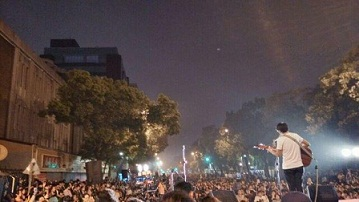
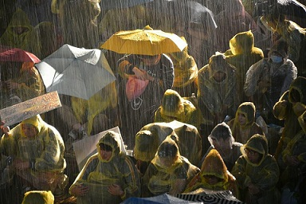

<!-- # 為破局的民主進一解 -->

不久前的大埔案遊行，有人揭下了立法院的國旗，被王大院長斥為目無法度。王院長大概不會料到，僅僅過了幾個月後，立法院不但議場被佔，連招牌也被眾人卸下，和平時代的政府尊嚴蒙羞至此者，台灣可算是絕無僅有。

場外的眾生，對在立院正在進行的抗爭臧否參半，很多人覺得今晚議場裡終於吶喊出了民眾自己的聲音，也有人覺得他們已經衝撞到到代議民主的底線。面對今晚在議場內外的抗爭，很多人都在問同一個問題：我們究竟要什麼樣的民主？我們究竟要求怎樣一個未來？

###哪來的民調民主

過去一段時間，關於服貿有過不少民調，從審查程序到審查內容，無論是立委還是民眾，主張意見必定要拿出民調數據說話。一旦有人主張包裹表决，就有人舉出「七成五民眾支持逐條表决」的民調來反駁，一旦有人主張某一具體開放條款，也一定有人舉出另外的民調來論證利弊得失。

很多人覺得不奇怪，立法院原本就是民意機關，以民意為依歸，正是立法委員的責任所在。但真正的問題在於，立法院的民意立基於「代議民主」，立法委員是人民用選票選出來的，一位立委可以代表民意，可以精確到個位數，民調則不同，民調因其樣本、基數等不同，所得到的數據只能是「僅供參考」，特別是媒體的民調，偏差之大，經過總統大選的人應該都深有體會。一位代表二三十萬民意的立委，拿起不知從何而來的民調，說他代表了這個國家的七八成人在講話——如果代議民主將其擺在中心地位，那便是紊亂了立法院的根本體制。

但是有些立委就固執地認為，只要手上有一份民調，他就可以代表正義的大多數講話，只要有一份民調，少數就不再是少數，多數也未必是多數。最後，不單是質詢台上的意見表達，就連議事程序本身都變成「民調民主制」，不禁讓人從根本上質疑，在這個民調漫天的網路時代，四年一度的立委選舉到底還有什麼用。

其實民調民主的最大問題，還不在於民調的作成方式，而在於對「代議民主」這種制度的根本誤解。代議民主所以產生，不單是因為眾口難調，而且期望以代議方式，用精英的專業來制衡容易被鼓動的民意，在精英和普羅之間尋找一種平衡。所以民調民主固然有其成立空間，但如果不經代議民主的最後檢驗，無異於開放所有人鉅細靡遺地就每件事情去投票——我想今天大部份台灣人，都既沒有這個時間，也沒有這份專業。

###回歸到憲政民主

但是有人要問，如果民意有了變動，代議民主的代表確實不能反映當前民意，難道就聽之任之嗎？民調民主固然可能帶來民粹，但面對「七成五民眾支持逐條表决」這種高民調結果，誰又能輕易否定其中的最新民意？

這次服貿在立法院的破局，原因就在這兩種民主的衝突，沒有能得到很好的調和。國民黨有代議民主的優勢，民進黨有民調民主的數據，兩相對峙，反映的已經不僅是藍綠之爭，更是民主模式的抉擇。問題是，如果國民黨一再想憑國會多數強渡關山，民進黨真的只有號召起人民對抗這一途嗎？

服貿的根本問題，就在於國民黨一開始就將如此重大的問題在規範位階上定位成行政命令，否則根本不會有「立法院職權行使法」第61條三個月審查期限的問題。所以，民進黨要想翻盤，除了有可能依同條再透過院會展延一次，就只有集合起三分之一以上的立法委員，以服貿應當透過法律而非行政命令定之這一憲法理由，聲請大法官解釋。

其實按照「立法院職權行使法」的第62條，行政命令審查通過後，還要報請院會「存查」，因此立法院也是職權的行使者，當然也可以行使職權遇有違憲疑義來聲請釋憲。

這兩條體制內的道路怎麼選，民進黨儘可以好好再打打算盤。

###請慎用廣場民主

當然，可能更多的人會問，今天大家既然已經衝進了立法院，為甚麼不乾脆用廣場民主，用社會運動的方式來達到訴求？廣場民主，難道不也是補強代議民主的一種方式嗎？

我承認，遊行示威不但是人民的基本權利，作為多元聲音的表達，流動民意的體現，廣場民主在一個國家的憲政體制中有不可或缺的補強作用。但是我請大家看一下，想一想台灣這兩年來的廣場民主，街頭上站出來多數都不是直接的當事者，而是穿梭於各種遊行中的「公共知識人」，甚至是大遊行中夾雜諸多小遊行。也就是說，關心公共議題的，在洪案時是那二十五萬人，到現在可能還是那二十五萬人。

我並不是說有這麼多人，這麼多知識人，這麼多社會菁英去關心公共議題有何不對，這是這個社會強大的第三股力量，是這個社會的財富與希望。但是不同於強大的兩黨，菁英的廣場民主，所依靠的只有民眾的信任、社會的清望；不同於兩黨的染缸政治，菁英的廣場民主一旦沾染顏色，很可能就一無所有——如果民眾從此不相信他們，那麼代表民眾的他們將一無所有。

所以，對在議場、在廣場上的菁英們來說，他們承擔不起「暴民」的這一惡名，因為他們參加的並不止是這一場戰鬥，而是再造台灣民主的大戰役。適時而進喚醒民眾，適時而退保存自己，才是對社會信任的最好報答。

這一夜，台灣有很多人同我一樣，同在議場、在廣場的戰士們一樣，徹夜未眠，希望用自己的行動喚起人民，一起見證台灣民主的這個轉折時刻。

我很希望，兩黨在經歷這關鍵一夜後，能有勇氣有擔當接下這一段的接力棒，讓議場中破局的民主重現生機。

(采编：余澤霖；责编：余澤霖)
