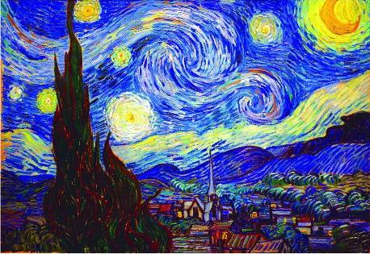
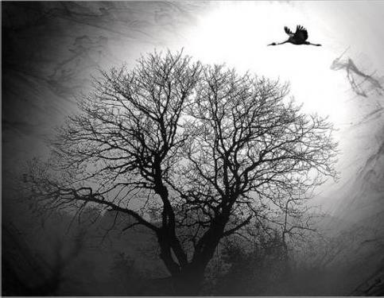

<!-- # 【写作者】纯粹的写作者 -->

纯粹的写作者的确并不存在，毕竟人的鞋上都是沾了尘土的。年轻人长于激情，年长者长于阅历，此两者殊途但同归，需要的都是对于潜意识的接纳。无关乎头脑的敏捷，它借作者之手呈现的往往是他自己也感到惊诧的东西，潜意识通过他这条沟渠得以涌现（其中包含大量他自己也无法理解的象征）。写作的过程有如时间在沙漠中，或是在海洋深处越沉越深。此时写作者往往会兼具瞎子聋子哑子的特征，进入一种透明的状态。

常有人通过旅行，读书或是纵欲去寻找写作的灵感。也许那会有所裨益，但它们带来的副作用往往更大。且不论纵欲会使自身的流露与意欲混淆不清（著作如此便被酒肉之气绑缚）。好书的唯一作用是照应一下，让人找到自己的门，是为悟，绝非让你模仿他人的方法和路径。又如相片会把回忆框死，旅行会把你对一个地方的幻想框死。而那绚烂的幻想则是你出生时全部历史长河中人类的想象所赠与你的，仅需让它们自然呈现。你在这条小路上走走停停，左手边的怪兽同你一起呼吸急促，无人能预见下一步会看见什么遭遇什么。

不要为写作而写作。切记不可创造花里胡哨的金边为作品戴上滑稽的礼帽。虚假的审美体验使人视野狭隘，误入歧途。正如先哲所言，凡自然未能使之完美者，艺术使之完美。如此，再押韵再精巧的句子如若没有精神也得删除。暂不谈它是著作的累赘，会掩盖真实的力量。人性认同喜欢的句子可能是自身病态人格的一种缺陷，是对人类癖好亦即虚荣的一种阿谀。这对于读者是极不负责的。

反之过于直白的言语又是一堵墙，看似明明白白实则无路可走（或者说太过明亮的光线使人目盲）。写作从来不是二分法，更不是粗暴的非黑即白。艺术需要通过曲折之道进行揭示，此非故弄玄虚，而是因为人类的语言丢掉了太多东西。如此便需要意象。意象是对语言局限性的辅助，或是对图腾和象征的模糊代入，与花哨的边角料有本质的不同。而后以写成之文为参照，去掉遮掩之物后留下的符号就不单是写作者的符号，而是全人类的符号。

写作者往往会对自身进行误判，因为他们虽然从潜意识中学到不少，但意识上依然是弄不明白自己的普通人（在这一方面优秀的读者可能比写作者更加明晰）。当作者对将写之事有一个隐隐约约的概念时，他的内心就已开始为这个概念在茫茫后海中寻找。可能过数天半月或是数年这一完整的生命体终于成型，喷薄而出。前一阶段是为孕育期，正如母亲不需要刻意努力就能生出孩子，作品的呈现也绝非刻意努力的结果。又如孕妇会得到小心的照料，孕育期的作者也会得到上天的护佑（这往往会导致他们性格乖僻任性）。一个真正的写作者靠文字的生育就能心满意足，这与把作家当幌子的伪君子差异是巨大的。

当写作者写完了一份著作，他就是把他的著作独自推向风雨飘摇中去了，他再也无法与他的作品同行。真正的写作者往往创造了自己的先驱，他需要去追赶作品们的脚步。头脑里的作品和写下的作品间隔了两座山的距离。

不要去在乎读者头脑的反应，重要的是与他们自己也未必察觉的内心相互呼唤。与这个时代一样，多数读者不再在赤裸的风中阅读（多数作者也不在赤裸的风中写作），他们把词汇赶进建筑并用尺子丈量（所以对于文章的点评常常显出读者之尺本身的狭隘）。但若在乎这些，你的作品也会丢失自然。永远也不要埋怨读者，读者以一种隐秘的方式参与了写作这一过程。自怨自艾即是画地为牢，不要总想着打动他人，写者的眼泪比读者的感动更为重要。仅让自然通过你展现它自身给房间里的人看就够了。

孤独对于写作的确必不可少，但不要过度寻找它，更不要装出孤独或以孤独为荣。真正的写作者可以陷入自身的白雾，每一次新的闪暴雨电都可以给灵魂带来颤栗洗刷的体验。切莫在文中过分强调过分呼喊，闪光的内容自己会从文中脱颖而出。太阳底下无新事，所有的言论早已被揭示得透彻无误，历朝历代的写作者们所做的是对置若罔闻的大众反复言说。而理性的作用是对内心无节制播放带的卡壳与裁剪。

写作的技巧终究无法言述，是文非思量分别之所能解。另外，就像睡眠时外界变化会影响梦境一样，写作者的作品多少会带有这一阶段的影子。但是一步也不要离开自然，直立行走的人类妄图离开土地却又到达不了天空，于是被自然与世隔绝。纯粹的写作从某种意义上讲是一种回归，是对于大众所行之路的一种，是对于社会倾斜天平另一端的加码。在这条路上，孤独或许会成为他的竹梗之节，白昼或许会变成他一贫如洗的绝望。

写作者并不解谜，他们更接近于掘墓者，所做的仅是将谜题揭示（解谜的写作者是危险的，他们极有可能会被噤声）。但是真正好的作品不光是一种揭示、点出未有之物或对大众意识的一种反补，它更是一种谶言、沟通远古与现今，逝者与生者、潜意识（在古代被誉为神圣之言）与意识的一座桥梁。

这过程是一次冒险，是对洞穴之音的回喊。写作是写作者是举着火把在徘徊不定的黑暗中寻找的其他出路，并待重返光明之日任由世界加冕他鞋上的尘土。

(采编：张蔚涵；责编：薛晨如)
