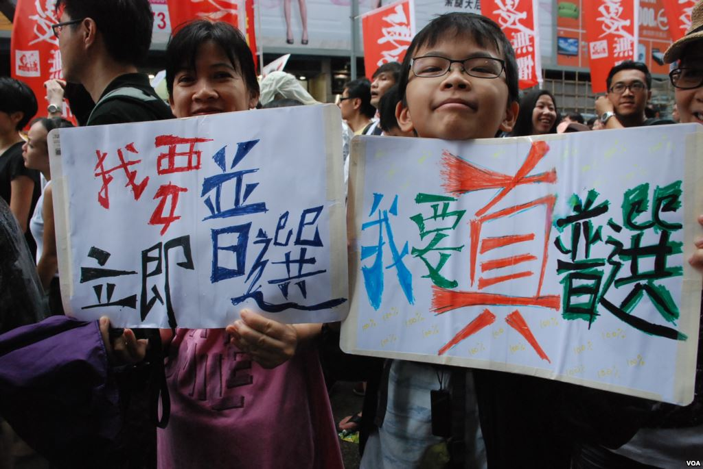
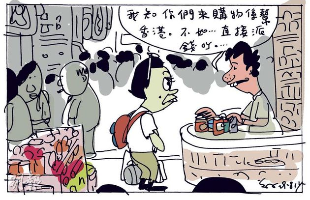

<!-- # 民主台灣帶來的自我想像 -->

## 編者按：台灣民主帶來的經驗，除了給予大陸一定的影響，對於同為兩岸四地的香港，亦帶來了一定的影響。那麼一個普通的香港青年又是如何看待民主台灣的呢？#

在台灣，台灣公民有權利直接選舉與罷免中華民國的總統與副總統；在香港，香港特別行政區首長(以下簡稱「香港行政長官」或「特首」)則透過代表香港社會的不同界別、立法會議員、區域性組織、香港地區全國人大，以及香港地區全國政協委員代表所組成的選舉委員會所選出，並由中華人民共和國國務院總理簽署國務院令任命之。在缺乏民意基礎的代議政制之下，香港市民無法發揮監督政府的功能，香港人(以下簡稱「港人」)如何繼續追求適合香港實際情況的民主呢？

回歸「祖國」16年來香港的政治氛圍不斷改變，對於親中、親香港政府的組織和團體來說大陸化是香港的唯一出路，但對於真正關心香港的支持者而言，即使政治制度對香港民主進程有多不利也好，如果沒有人願意堅持人民應有的權利的話，不管公民抗命是否香港民主過程中的最後希望，至少「香港是我家」的概念應該是每位香港人對民主未來的最大期望。

***香港是「中國式民主」的試驗場嗎？***

全國人大常委會副秘書長兼香港基本法委員會主任李飛於今年11月訪港時，明確強調《基本法》第45條第二款清楚列明，行政長官普選提名權只授予提名委員會，委員必須由機構提名，同時指出民主程序需符合以下三項關鍵要求：第一、所有提名委員會成員的提名權是平等的，而提名委員會是以一個機構形式提名，其結果必須體現出提名委員會的「集體意志」；第二、被選出來的行政長官必須由一個愛國愛港人士擔任，甚至不能與中央對抗；第三、規定了特首候選人的數目。

李飛這一次訪港顯然對行政長官的普選制度說明了一個關鍵要素，無論未來香港特首是否在公民投票的基礎下產生出來，其選舉制度必然是在「小圈子」的框架下進行，而且候選人必定是服從和聽命於中央，更直接的訊息是，整個選舉的遊戲規則是不包括「小圈子」以外的人士參與，這是否對所有非親共政黨或是擁有共產黨背景的候選人表示，他們將會是遊戲中的輸家，這還是有待觀察。

香港未來是否能獲得港人所希望、所追求的民主仍然是未知之數，但可以確定的是，參與香港社會運動的背後不但要打破中共政府為香港所設計的框架限制，更需要的是每位香港人都應為香港的未來出力，不論結果是如何使人失望也好，團結與目標一致才能積累更多的人民力量。正如許知遠所言：「每一個人都可以是抗爭者。」這一句話正正掀露出香港回歸16年來，抗爭的道路特別顛簸、特別艱難，現在香港所面對的是一個缺乏民意基礎、忽視人權的國家。不管是英國殖民時期，還是當代的「中國殖民時期」，香港社會對於「借來的時間，借來的空間」已習以為常，預期把自己當作過客，倒不如問有多少港人願意為香港奮鬥、為香港堅持與抗爭。這一仗成功與否，除了制度上的不公義之外，最重要的是港人雙眼不要繼續被「功利」二字所蓋著，是時候把黑布摘下來。

這樣看來，台灣的民主發展對於部分港人而言既嚮往又羡慕，即使「民粹」一詞曾經對台灣的民主發展引起懷疑，但隨著時間的洗禮，我認為台灣未來發展是朝著正面多於負面，至少當行政首長的領導不符合人民理想與期望時，卻能運用民主的力量罷免之。

在回歸前香港人對於台灣的印象以及視線，都是停留在台灣議會中激烈的口舌與戲劇性的肢體暴力的場面，講到民主大家都漠不關心，甚至以犬儒的態度對待，當中主要原因都可歸咎於港人的「政治冷感」(以前對政治不感興趣)以及對中共政權的危機還未能意識和體驗；直到天安門事情的發生，港人才開始醒覺到民運前對中共政權的過多期待，在坦克對抗手無寸鐵的學生身上破滅；回歸之後香港更是另外一片景象，社會資源在法律的漏洞下被新來港的中國大陸移民(簡稱「新移民」)取得香港居民的身份，這些新移民表面上換來新香港人的稱謂，但換不來香港人本身的共同經歷和核心價值、換不來香港人的文化認同，換不來香港人對作為「他者」的新香港人的肯定。這明顯地透露出香港人本身與新移民，甚至後來的新香港人，本來就不在同一位置上，因而才會將「新」與「舊」來區分「自我」與「他者」。

回過頭來看台灣，多年在台的經驗讓自己感受到台灣真的擁有一個能包容多元的社會，而本省人、外省人與原住民之間的衝突相較之下較不明顯，而且所看到的是多元種族的融合，就算對各族的深層問題不太了解也好，這可算是台灣對公民教育的重視而獲得的最大功勞。既然台灣選舉上出現過兩大政黨輪替的經驗，某程度上也代表著台灣人對民主制度充滿信心，願意透過自己的投票權投給自己信任的候選人，選出能領導台灣未來的最佳人選。

既然事實如此，台灣不需要再為統獨爭論、台灣地位未定論等規範和短暫時間內無法解決的問題所阻礙台灣民主的發展，反而應該把眼光放在未來中台融合起來的話，台灣應怎樣面對呢？應擔任怎樣的角色呢？哪些路徑台灣可以依賴或跟隨呢？若果選擇與中共抗爭的話，香港正在努力打這一張仗，在已經作出最壞打算的前提下，堅持香港人的共同價值；若果是順從中共政權的話，就會是現在的澳門，用銀彈政策為緊急的社會問題延長時間。身為一個土生土長香港人的我會認為在台灣、香港、澳門三地裡，台灣是民主的最後防線，希望透過多年來的民主經驗找出未來最佳的途徑。

***中港矛盾加劇惡化：搶奪社會資源***

香港除了在民主路上不斷受到許多的挑戰之外，香港特區政府對於新移民無力控制，主要要素有以下兩項：

第一、特區政府無法對新移民的來港人數作出限制、或是透過訂立和實行配額等限制條件來發揮實際效用。因為香港現存的移民審批權並不是由香港負責，其審批、簽發及中華人民共和國前往港澳通行證(簡稱「單程證」)均屬於中國內地政府的職權範圍，以致中國大陸來港移民的數目無上限；

第二、香港政府不斷在經濟數字上競賽的同時，忽略了香港的社會資源與港人的訴求，甚至為已經水深火熱的香港不斷輸入人民日報海外版所報道的「新香港人」，制造一個「非輸入內地移居人士不可」的現象，而這些現象的部分原因不得不歸咎特區政府一味向中共政府討好，不理會社會的承載力與包容性而犧牲了香港人對政府的信任，賠上了香港的未來，接下來所提到的「港澳個人遊」計劃更是一個活生生的例子。

隨著2003年港澳兩地特區政府對中國大陸居民推行「港澳個人遊」計劃，吸引不少中國大陸居民以個人旅遊方式、透過簡單的簽注手續到訪香港及澳門，而每逢中國國慶及農曆新年春節等長假期更是港澳個人遊的高峰期。不過實施此政策至今，一方面為香港的地產霸權、消費市場、旅遊酒店業帶來可觀收入之外，香港的社會資源直接成為當中的受害者。到頭來移民城市生活多年的香港人面對著人數不斷增加的「雙非嬰兒」(指父母皆非港人而在港出生的嬰兒，因香港實行屬地主義取得居留，可享有香港社會資源及福利)、大規模地購買嬰兒日用品如奶粉、尿片，以及大量「雙非孕婦」來港產子等問題，造成香港本地教育、醫療、政府興建的廉價公共房屋等社會福利分配不均，引起更多中港衝突與矛盾，嚴重的社會分化，港人與新移民之間在身份與對國家的認同上出現偏差。

***中國化的香港***

目前台灣在領土、主權上都獨立於中國的管治版圖，其大陸化的影響可算是沒有澳門和香港顯著。近年來台灣已成為港人對民意負增加的特區政府表達不滿聲音的平台，有過百名港人分別透過香港的《明報》、《都市日報》及台灣的《自由時報》登廣告，倡議香港面對著無法避免的中國化，引起台灣政府與人民的關注和了解香港赤化的嚴重性。

雖然回歸前的香港是由英國人統治，華人無法成為該土地的當家，但至少當時的香港人能保留人與生俱來的權利與自由，但回歸後的香港雖然歸由港人治理，但每一屆特首的表現都未如市民所想，未如市民所期望，使香港社會在這種政治氛圍之下分裂成出三種不同的聲音：第一、激進民主，支持香港實現普選與民主、體現人民監督政府的權利；第二、提倡「愛國愛港」的組織崛起，這些組織是以「反對暴力政治文化、維護香港的繁榮穩定、及對香港有利的事作出行動上支持」為宗旨，但其行為往往在衝突中表現得過於激進、違背了其行動的本身目標，而且盲目地維護政府；第三、本土化主要是捍衛香港的核心價值如司法獨立。政府的信用在港人心中已是破產、再加上香港社會的凝聚力也面臨著日益增加的新香港人的來臨，香港人應如何面對呢？

總言之，與海峽另一邊的台灣、同為特別行政區的澳門相比之下，香港與中共政府之間的對抗在三地之中走得最快、最前，而台灣的民主發展對香港而言是學習的對象，而且台灣的民主經驗更應充當香港的激勵因素，成為香港在民主路上的合作伙伴。

End

原文轉載自兩岸公評網：http://www.kpwan.com/news/viewNewsPost.do?id=851

(採編：李宜佳

責編：余澤霖)
