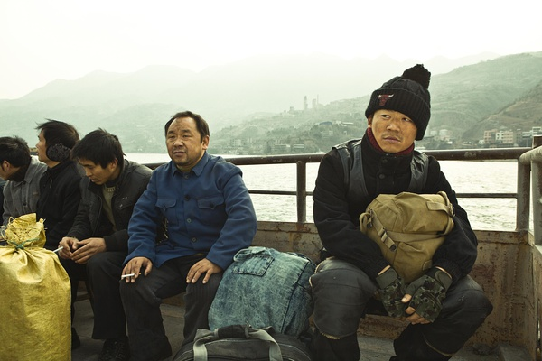
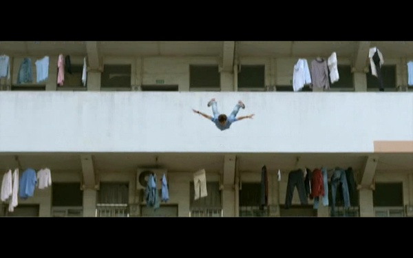

<!-- # 荒谬、对立与暴力——《天注定》影评 -->

相对于那些流行的、普遍的作品，人们有时候反而更喜欢那些小众的、边缘的、甚至是被禁止的作品。仿佛因为它的被禁，才更显现出了它的价值与意义。对于这个国家所发生的这一切，用一句最近流行的话语来说就是：你懂的。

带着期待的心情看完了这部被禁却又拿下众多奖项的电影，我只能说贾樟柯果然没有让我失望。影片总共由四个故事组成，不过于我而言，电影的情节始终是次要的，最重要的乃是导演透过情节所想要表达的东西。因此此文将在简略地介绍过情节之后，透过三个关键词，即荒谬、对立与暴力来阐释这部电影的深刻意

在第一故事中，山西某煤老板与村长的勾结，发家致富，然而整个农村却陷于荒芜的境地。农民大海（姜武饰）因不满这种权贵现象，用自己的猎枪杀害了村长、煤老板以及与他们相关的人。第二个讲述的则是一个杀人犯三儿（王宝强饰）游走全国各地，强取钱财的故事。而在第三个故事中，在按摩店做服务的小玉（赵涛饰）因不堪忍受两名有钱男子的调戏与凌侮，拔刀杀人。最后一个故事讲述的则是二十出头的青年小辉（罗蓝山饰）来到东莞的夜总会打工，结识了美丽的同乡。然而爱情虽美好，现实却残酷。在生活的重压之下，小辉选择了跳楼来结束自己的生命。

看完整部影片的第一个感受就是荒谬。毫无预兆的，大海拿出猎枪杀人，不仅杀害了煤老板和村长，乃至于不相关的人也遭到了杀害。在这个故事中，贾樟柯无比真实地呈现出了那些血淋淋的镜头，坐在电影院里，你都能听到旁边女生的惊吓声。而第二个故事中的三儿，也是在光天化日之下，不仅抢下贵妇的包包，更是直接开枪打死了那对夫妇。这种荒谬感伴随着整部影片。法国哲学家卡缪（Camus）在其成名小说《局外人》中深刻地探讨了荒谬这一现象。主人公默尔索以一种冷漠、虚无的态度面对这个世界，对一切都感到漠不关心，即便亲人死去、自己锒铛入狱他也毫不在乎。这正如同三儿杀人时的面无表情一般，仿佛他什么都不在乎，什么都了无兴趣，而“只有开枪的那一瞬间是有意义的”。这是荒谬的，可是这种荒谬到底来自于何处？毫无疑问的，个体的迷失与整个社会有着脱离不了的关系。而贾樟柯的电影之所以独具魅力，正在于他对社会的深刻剖析。仿佛正如他的电影所预料的那般，3月1日昆明火车站遭遇恐怖袭击。这是荒谬的吗？不，这一切就真实地存在于我们的生活之中。也正如贾樟柯在台湾富邦讲坛上的题目所说的，“我不诗化这个世界”，是的，贾樟柯无意诗化这个世界，而是要尽可能真实地呈现这个世界。而这荒谬的原因，则存在于贾樟柯想要深入探讨的对立与暴力之中。

八十年代以来在中国接受教育而长大的人们，恐怕都不会喜欢马克思主义，因为那是教科书中的教条。然而我们不要忘了，马克思的初衷乃是充满人道关怀的，他渴望建立一个消除阶级差异、人人平等的社会。可是在信奉马克思主义的中国，却变成了一个阶级僵化、阶级对立的社会，这是多么讽刺的一件事。权贵与平民间的对立、富商与平民间的对立、甚至警察与平民间的对立，这种对立某种程度上将中国的社会撕裂为二。上层的人不知下层的人过的怎样，下层的人也无力反抗上层的人。影片中的大海多次想要上书中南海，然而却了无希望，不仅如此，他因为他的反抗还差点招来了杀身之祸。整部影片可以说都沉浸在一种压抑、绝望的氛围里，我相信贾樟柯想要表现的正是底层人民生活的绝望。他希望透过这部电影，告诉更多的人们，没错，今天的中国确实强大了，但在这个所谓的强大的国家里，尚有着一大批被忽视的、被边缘化的人们。当小玉被富商拿着金钱连打三十多个耳光的时候，我的内心是难过的。因为伴随着这种社会对立而来的，就是人与人之间的不平等、人与人之间的不尊重，而人更是在这种对立之下，（借用卢卡奇Lukacs的术语）被商品、金钱所物化了。

如果说荒谬是感觉，对立是现象，那么暴力或许就是背后深层的原因。每一个故事中，都充斥着暴力，一种来自人民的暴力。没错，人民同样也是暴力的承载者，但是更根本的则是国家机器的暴力。如果没有国家机器的暴力，人民又怎会走上暴力之路。“国家机器“（State Apparatus）这一术语，始创于阿图塞尔（Althusser），用来形容社会中一切体制，如教育、媒体、官方机构对人的影响。在国家机器之下，人只是被动地被形塑了。而国家机器的暴力则是渗透进生活的每一个角落。在第一段故事中，毛泽东的肖像总共出现了三次，这就很难让人不去联想贾樟柯在此处的用意。这一肖像所代表的，正是中国这几十年来的国家机器。如果說賈樟柯在《三峽好人》中還只是隱隱約約地隱射了國家機器，那麼在這部《天註定》中，他的用意是再明顯不過了，他透過他的鏡頭直接批判著國家機器以及由此而來的社會亂象。

不过再让我们回过头来想一个问题，国家机器所使用的暴力当然是恶的象征，那么人民呢？人民在此使用暴力就是正当的了吗？当大海拿着猎枪走出房门时，舞台上放的正是一出“林冲夜奔”的京剧，寓意着传统“官逼民反”的思惟。但在今日的社会，我们仍然能用这样的思惟去进行社会变革吗？这种暴力对暴力的方式能够使一个国家进步吗？我想这正是贾樟柯所提的问题，他控诉了国家机器的暴力，但是对于人民的暴力同样也持有否定的态度。当为了发泄对社会的不满，而在幼儿园随意砍杀儿童时，我们又怎能说正义得到了实现呢？当一个人因为内心的苦闷与无助，而选择跳楼时，我们又要怎么期待这个社会会变得更好呢？

“不用怀疑我爱国，我爱的一塌糊涂”，这是贾樟柯在台湾接受访谈时所说的话。是的，他的电影被禁了，但这被禁的背后，是他一颗炽热的心。贾樟柯正是希望透过自己的镜头，展现这个社会不被人注意、但却无比真实的一面，影片中的每一个故事都是对现实的一次再现。第一个故事对应于2001年的“胡文海事件”，第二个故事对应于2012年的“周克华事件”，第三个故事对应于2009年的“邓玉娇事件”，第四个故事则对应于2010年的“富士康跳楼事件”。

贾樟柯电影的现实性伴随着浓厚的政治关怀，这一次更是加入了对暴力的探讨，或许我们会感到不和谐、感到不舒服，甚至有时候不想去面对，但无论如何，我们都无法逃避发生在这片土地上的一切。

(采编：陈方青

余泽霖；责编：王冬阳)
