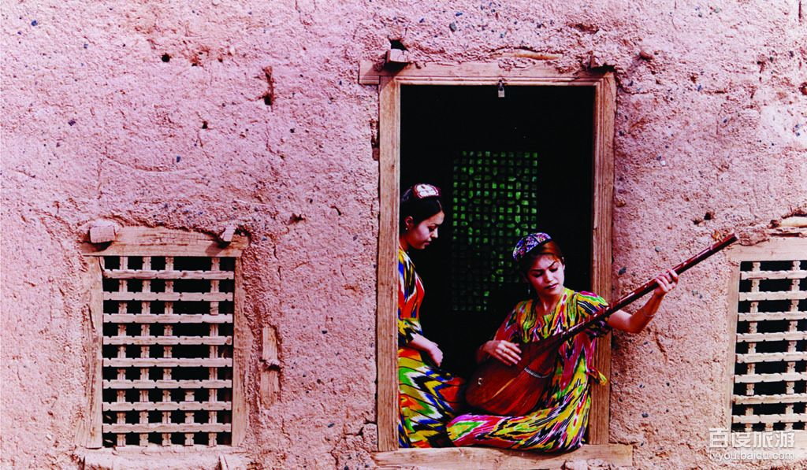

<!-- # 我的朋友阿伊古丽 -->

### 一、没那么好，没那么坏，和你们一样##

古丽的妈妈是吐鲁番的城市户口，但是嫁到了城郊的小村子里，虽然古丽的爸爸妈妈没有受到基础的教育，但是他们都认为学习是改变命运，让人有出息的最好方法。古丽在回忆童年的时候并没有太多印象，这和我差不多。爸爸妈妈从事农业劳动，古丽的爸爸有时候又会去做点小生意，所以从小到大古丽想吃什么几乎都可以被实现。

她记得八岁时，她的爸爸妈妈为了给她过生日特意开车到城里去买了蛋糕和零食，在家里办了小聚会，这给她留下了非常深刻的印象。农村的孩子没有什么过多的游戏，这在哪里的农村都差不多。

女孩子们更多的喜欢在家里帮忙做家务，古丽从小就学会了做各式各样的家务活，她说这是她妈妈教育她的。她还有个弟弟，总喜欢和村子里的一些年龄比较大的孩子一起玩，而古丽的妈妈是不允许的。因为古丽的妈妈觉得这些大孩子不去上学，是会教坏弟弟的。

他们的村子比较小，两公里以外才有学校，所以古丽在舅舅家住以便于上学读书。而等弟弟要去上小学的时候，古丽的爸妈只好自己坚持去把他送到两公里以外的小学，途中有很多大型的货车十分危险。有一位阿訇的媳妇带着很多家长去找村干部，希望可以解决这个问题，但是并没有得到理想的解答。因此，很多家长不把孩子送到学校去，而是由自己教育或者交给一些私人的经师来教导。

古丽的家在南疆和北疆之间，交通还算便利，而显然很多地方因为地区环境问题而导致的麻烦远远不限于教育方面。而仅就基础设施的学校来说，全国其他地方也是如此，校车超载的新闻就是佐证。

古丽一直非常努力的读书，她相信读书的人才有出息这样的她父母给她的家庭教育。在舅舅家度过初中岁月之后，她凭借十分优秀的成绩得到了内高班的名额，可以免除学费住宿费等诸多不可能负担的费用到教育资源比较好的广东读书。

她第一感觉并不是觉得广东发达而感到兴奋和向往，而是她觉得她的成绩和努力得到了认可而兴奋，她的许多同学想法和她相似。就这样，她和全新疆通过成绩挑选的很多同学一起进入到全国各地的内高班中继续高中学业，而她的很多小学和初中同学并没有选择继续学业，有的选择外出打工，有的就留在家里务农。

内高班的生活并没有丰富多彩，古丽觉得就是充实，但并没有快乐或难过，就是一种安静平淡的状况。当然，也会有一些不好的回忆，比如总还是会有一些同学对插班生们抱以不友善的态度，但是大多数人都十分友好，古丽有很多广东本地的好朋友，她会和他们讲一些知心话。古丽的每一步都是凭借努力和政策的支持向前推进的，所以她的父母对中央的很多政策都十分理解支持，他的亲戚们也会讨论中央的政策支持对新疆的众多好处。他们拥护这些出发点善良的政策。

在内高班里古丽认识了一个南疆的同学，他有一次和古丽说，他在南疆生活的村子终于通电了。古丽这时候才知道，原来新疆的很多地方连电才刚刚开始通上，她觉得这些人生活的很苦。她发现自己好像还不算了解自己的民族，还没有等到开始了解自己民族的时候就已经离开了那片土地。高中的时候，她经常陷入思考中，她在和本地汉族的交往中思考自己到底是怎样的民族的孩子？思考着自己的民族有着怎样辉煌的历史又是怎样倾覆的。

而这个年龄的人都是这样的，经常陷入思考。她对自己上内高班的选择，有了一点后悔。

可是这时候她才高中，并不知道为什么后悔。

### 二、可怕的是我们根本就不了解##

很多人认为“新疆问题”是经济问题，政策问题，民族问题，但古丽并不这么认为。她反问我说“那个落后的地区不是经济问题，政策问题等等问题，只不过因为民族留给人们的印象，导致人们认为新疆的经济政策出现的问题是和别的地区不同的，其实并没有不同。”古丽认为把民族问题凸显出来并没有必要，因为她的家庭里也不觉得民族是一个问题，直白地说就是他们的脑子里并没有出现过民族问题这个概念。

古丽的南疆朋友的家乡有一位阿局长，在老乡接收记者采访时，阿局长就蹲在枣树下，手里拿着新折的草梗，嘟囔着今年大枣的收成一定很好。记者问老乡“你们对地方干部有什么意见么？”阿局长从地上蹿起来，将草梗掷在枣树下。几乎是喊叫般地非常激昂地说：“他会有什么意见，我们南疆的农民是世界上最幸福的农民。我们乡村干部在农忙的时候，天没亮就下地帮农民种地，天黑了才下班。他们还能有什么意见！”

憨厚的核桃种植大户笑而不语。事实确实如此，地方干部干的活儿很苦很累。而姚新勇也指出这样的事，地方干部在工作作风上十分粗鲁，剽悍，但他们多数也是村里能干的人。不过在方法上难免有不妥的时候，比如用高音喇叭指挥村民劳动的粗暴举动。这也“归功”于国家政策，维族干部的比例是要保证的，而且比例是很大的。

对维族干部的扶持，无形中会对维族汉族干部之间的关系产生影响，而维族干部和百姓的关系也并未因为他们本身的同民族有过多改善。在某些人的嘴里，他们宁愿把维族干部归类到“维奸”的行列里，他们被指出卖了维族利益与中央勾结，当然这种指责一般针对高层的干部。这些骂声除了不怀好意的恶意之外，也不能否认腐败问题的因素。

但是我们是很少了解到对新疆干部腐败问题的查处的新闻。一是这样的问题很敏感，不论是查处维族干部还是汉族干部都有可能出现不必要的麻烦，二是这样的信息并不是我们想知道就可以知道的。但真的是因为干部腐败才造成矛盾吗？

古丽说在她的记忆里他们的村子很少有人是处于严重饥饿无法饱腹的状态的，但她知道有些地方是有人吃不饱饭的。古丽觉得经济确实是他们民族振兴的一个很大的阻碍，但这并不是新疆出现一些问题的根本原因。古丽的高中同学去在新疆的国企应聘，第一要求就是汉语，她的同学因为是参加双语班，所以汉语的交流没有太大问题。但是很多人，多数没有继续读书的人，是会因为这样的客观条件阻挡而没有工作机会，只好去选择一些老式的师徒制家庭作坊去学手艺，或者干脆不工作，呆在家里。

国家给了新疆很多经济援助，新疆的经济也在发展的路上，总需要时间去解决问题。很多平民家庭需要的是安静踏实的生活，他们并不在意谁更富。而反而是更富的一些人，要去资助制造事端的人，经济真的是根本原因吗？

古丽说，很多新疆人生活在小村子里并没有收到很多教育，他们很多人是单纯的。当他们遇到了一些不公平的事，难过的坎儿，他们会选择宗教作为依靠。也该如此，宗教总是在困难中闪出光芒的。

一些不去上学的孩子们，有的进入了私人的讲经班，也有些人是故意不让孩子去上学，执意让孩子接受私人讲经班的教育。这些讲经班良莠不齐，派系复杂。极端保守主义的分子利用讲经班的方式传播思想，给予承诺。历史的例子证明，精神的力量有时候总是很强大的。历史的例子也证明，一些希望建立自己天下的人总是要给人精神的鼓励和浮在空中的承诺。这是历史规律，洪秀全这样，毛润之也如此。这些极端的讲经班中，要培育的是自己的“战士”，并不是学生。犹太人至今没有回到迦南，但是他们从未分散。自治区政府也认为，打击非法的讲经班是有必要的也是紧迫的。

上面的地方腐败问题，经济问题，宗教问题，是不是就是造成“新疆问题”的根本呢？

新疆主席努尔克认为，这些问题根本不是“新疆问题”，因为所谓的新疆问题是伪命题，新疆没有问题。

“9·11”之后的十年，中国一直把一些问题作为中美合作的一个前提去考量，而现在随着美国在阿富汗的撤军，这个前提已经不存在了。中国西部国家其主导性和独立性明显增强，越来越能够影响本地区的事务。政府的角色准备好了吗？是不断的强调民族的多元，还是在此基础上讲认同？除了用钱弥平新疆与内地发展差距以外，我们有没有第二个办法？我们有没有尝试第二个办法？这是一个关键问题。出现了问题并不可怕，可怕的是我们并不了解。

### 三、我们更需要的是幸福的生活##

关于幸福的生活的定义，每个人都有不同的答案。

对于古丽来说，幸福的生活就是回到故乡，了解自己的民族，文化，去找回自己的归属感。我问她，你对未来又怎样的打算呢？古丽很迷茫，和我一样。她说她觉得自己是站在两种文化之间的人，现在回想，她是后悔的。高中时候她不知道后悔的原因，现在她觉得是因为与在新疆本地上学的人相比，她对自己民族文化的了解并不充足，而对汉族的文化，也没有认真的了解。但她觉得这可以靠时间解决，努力地去了解，去学习，总会是经历更多，收获更多。

她说，这世界或许并没有那么复杂。民族，宗教，经济，政治，如果我们以更开阔的心怀去对待，发现大家向往的东西大多一样，安定的生活，丰富的文化，坚定的信仰，是人们自己把事情弄复杂的。

我们最后还是简单的聊了聊昆明的事，古丽说，她很讨厌这样的人，她的家人也不喜欢这些人，但是他们这样做应该是有原因的，找出原因应该更有意义。他们不能代表一个民族，但是民族，宗教是他们的标签，纽带。

我本来想文艺地结尾，微博段子中维族大妈救下汉族姑娘，痛心疾首的说，“你知道乌鲁木齐是什么意思吗？是优美的牧场。你看，都被他们糟蹋成什么样子了。”我问古丽，乌鲁木齐是优美的牧场的意思吗？

古丽的眼睛清澈明亮，她认真的回答我“听说在蒙古语里是优美的牧场，不过维语中的意思是像罗马一样的地方。”

原来意思是像罗马一样的地方。

不过不管是不是罗马，对生活的热情和美好向往总是不分宗教和民族的。

编辑：赵乾；责编：张山骁；
