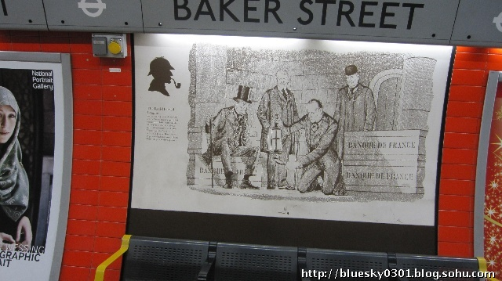

<!-- # 十号线上的福尔摩斯 -->

夏洛克•福尔摩斯如果生活在现代中国，具备同样犀利的头脑、锐利的双眼和适应中国国情的知识储备，他的观察力会更加敏锐，还是有所退化？

北京地铁的众生相丰富而多样，是一个很好的观察场所。每天，这里有数百万人流经过。

瞬间即可历遍浮生千相。如果福尔摩斯在世，他应该站在这里，把川流的人群一一归类，随口叫出他们的年龄、职业、身份和去向。和站在雾气氤氲的伦敦铁道系统内审视着大衣包裹、神色凝重的人群相比，哪一种情形下他的判断会更加轻松？

此时，我就站在早晨的北京十号线地铁里，前后左右都挤满了人，手被紧紧地按在大腿两侧，以至于我甚至难以从口袋里掏出自己的手机。在我的侧前方是一位衣着时髦的女郎，黑色丝袜包裹着细致的双腿、紧身短裤、青色罩衫和夹克外套。我本能地开始推测起她的年龄、职业和收入状况，可惜我连半个福尔摩斯也不是，反而越发迷惑。除了夹克，她的其他衣着没有任何牌子标签，质料也无特色，除了明显不能跻身于身着爱马仕的那一群人之中，这身穿着可以在三里屯的高档西餐厅和动物园的二手市场里同时看到。更致命的是，她甚至没有带包包——即使如今A货假货横行，至少还能从包的材质上看出点端倪。

当然，我们可以用气质来判断她的阶层。但在这时间的地铁里，除了笔直站立，一个人毫无其他站姿可言。我们也可以追问，一个高级白领或者较为富贵的女孩家，不会在这个时候费神赶地铁。但我们知道，遇到急事时，即使是一个坐拥百万资产的北京人也不会犯傻到去堵在三环上晒太阳。

最要命的是，即使我们知道她非富非贵，也无从判断她从事的大致职业方向——赶去服装店的店员、4S店的销售员、秘书、媒体从业者，大体上都没有独特的谋生工具，手指上也没有特殊的磨茧。在现代服务业——北京城海量的工作者可以归于此类——首要的谋生工具就是电脑。面对电脑的工作形态基本集成了文字处理、传输、交流乃至给出最终工作成果的全部过程。世界早已不像维多利亚时代的工业化初期国家，明显地被分为劳动阶级和资产阶级。在那个时代，谋生工具多样，劳动阶级操纵着笨重机器会留下明显的印记。但在今天，随着电脑将一大批工作内容集中化、简便化，越来越多人的直接从事案头工作，从而远离了具体的生产资料。这无疑也为快速识别一个人的工作属性带来了困难。

更重要的是，现代营养充沛、食物过剩也为识别人的富裕程度带来困难。大腹便便的除了老板，还可能有保安。一个久坐的程序员也可能在30岁出头就养起啤酒肚。在营养短缺时代——从人类这个物种诞生之际直到上世纪80年代这漫长的岁月里——人的营养直接影响了体貌，而体貌可以相对轻松地反推出一个人的阶层。在那个时代，红润的脸颊、肥胖的身材很难出现在拥挤的贫民窟。这也是为什么柯南道尔对诸如米尔沃顿（那个写欺诈信的上流恶棍）等人的描写寥寥几笔就刻画出了典型的资产阶级特征。但中国教科书上对地主、资产家的描写在今天已经基本过时。反而是有钱有知识的阶层开始越发注重起保持苗条、合适的身材。

我曾经和友人讨论过，福尔摩斯在今天判断一个人背景的最大障碍是什么。我给的备选答案是淘宝。淘宝所代表的规模制造业和全国销售网络是衣饰工业化生产的集中体现，也是中国制造为全球社会带来的最显著变化之一。在快递业蓬勃发展的支撑下，一种款式的衣服在全国的主要城市随处可以买到。流行的款式被复制、仿造、转眼传遍大江南北。批量生产的流水线彻底改变了衣饰的生命周期和传播特征。

在这个过程中，人们的穿着在横向差异化大幅提升的同时——不同的款式、颜色、花样五花八门——纵向的差距却在急剧缩小。除了如真皮等高级材料，各类化纤的普及使得质料上的成本差距在缩小，舒适的材料被广泛运用在从低端到高端的各类服饰上。福尔摩斯从横向的差异上至多只能读出一个人品味的特性，却难以深入看出其阶层差异。这对于他的演绎推理或许是致命的。这正像一个品行端正的男青年在灯光昏暗的夜店中面临的经典难题——每一个女士都性感迷人、烈焰红唇，但从那些可以在淘宝上花百元以下也可以在名牌店花千元以上买到的服饰中，你永远分辨不出她们是外围、驻场，什么级别的外围、驻场，还是一个失意的，在夜场等待真爱的自营老板娘兼文艺女青年。

今天，十号线上的福尔摩斯固然能轻松地看出一个焦急的男青年正在等待的是他的约会对象（包括是男是女），还是公司合伙人，但要判断出他们下一步的去向依然有些困难。以吃为例，维多利亚时代的伦敦高档餐厅集中的区域有限。有身份的人可选择的餐厅远远不及今天的遍地开花。服务业的发达造成了去向的多样化。而且，福尔摩斯会发现大部分人在决定去向之前会盯着一个发亮的盒子，打开一款叫大众点评的软件。除了拇指的操作，外表上极难判断出他们今晚的就餐地点。

这就面临着社会学理论上的一个经典难题——一个对多个的问题。也就是说，同一种现象可以对应着数十种成因，以及数百种后果。在变量相互作用极其复杂的情况下，每一种成因都深有可能。资本主义在西方兴盛可能是因为资源的分布，可能是因为技术的累积，甚至还可能是因为宗教信仰的原因。同理，一个盯着手机的人，毫无疑问，是最大的黑匣子。你甚至无法判断他是在阅读短信、聊微信还是查餐厅。他的眉头紧锁或喜笑颜开可以和无数种可能相对应。只有读懂了手机内容，才能读懂一个人的心。这也是为什么在大数据时代，掌握了一个人的手机数据比24小时观察一个人都来得有效。

最后，我也是当这个地铁上的女孩拿出手机后，才大体读出了点她的二三事。她的手机是最简单的联想低端机，屏幕清晰度极低。就在这极低的清晰度下，我瞟到了一则短信（大意）：您的工行银行卡（注：不是信用卡）消费28元，余额268元。我抬起了头，仿佛看见了她脸庞上闪过等待发工资的焦急。

(采编：王佚菲；责编：曹楚)
