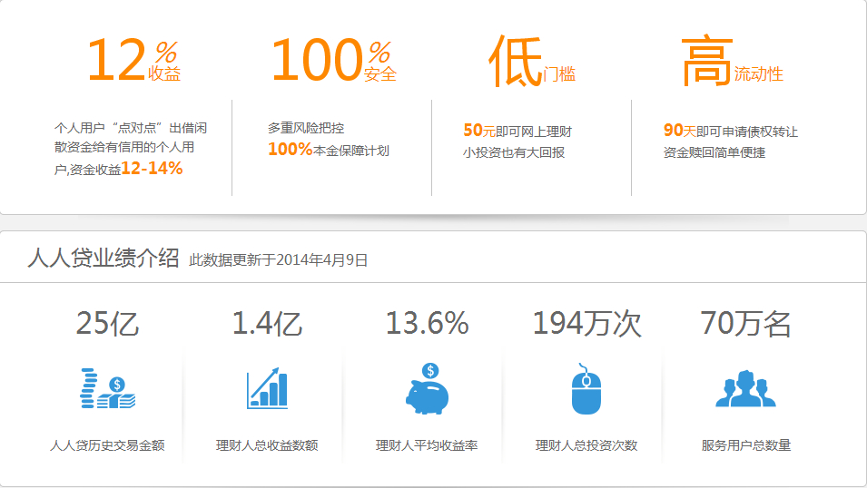

<!-- # 民间金融合法化进程聚焦——非法集资还是民间借贷？ -->

**一、

重提“吴英案”——P2P网络借贷平台的承接者身份**

大多数人现在对民间金融的了解可能起源于互联网金融的甚嚣尘上，近几年以P2P网络贷款为典型代表的互联网金融模式在国内“草根”资本市场中悄然兴起并以燎原之势发展壮大，中央除下发了一两份文件提示注意网络贷款风险之外，并未明确表示其对P2P网贷的态度抑扬与否，同时，一些政府关于规范互联网金融的政策性文件陆续出台，

虽然从2013年开始，P2P网贷平台爆发了大量风险事件（主要以平台倒闭、老板跑路、负责人以非法集资等罪名被送入司法程序等为主），但是从全国范围看，政府对于网络信贷这一以互联网为载体的“民间借贷”模式的态度并非是打击遏制。其实就当下的社会政策背景而言，完全可以断言，P2P网络借贷这种实质依旧是“民间借贷”的互联网金融产品在立法上得到承认并被纳入法制监管框架之下仅仅是时间的问题。

本文中所指“民间金融”主要是指民间融资即向不特定公众的民间借贷行为。在互联网金融尚未兴盛的年代里，民间金融的路途却已经布满荆棘血泪涂地。时间退后到2010年之前，那时的人们提起民间金融，可能首先会想到的就是2009年将民间借贷的合法性争论推向舆论顶峰的一系列针对中小企业家的非法集资类案件，其中最著名的当属“吴英案”。“吴英案”历时三年，被告吴英经过一审二审之后最终以集资诈骗罪被判处死缓，社会公众对此判决结果是无奈甚至不满的，它的背后是当权者无视市场经济中民间资本强烈的投资欲望与民营企业迫切的融资需求，而对民间借贷的合法性进行的一次彻底的否定，对非法集资行为在民间借贷中的“红线”进行了扩大化地界定。**经济评论家叶檀曾发表评论称“一次又一次血的代价，为何没能取缔民间集资？中国经济不需要血祭，需要的是机制。预防犯罪要靠市场高效的运作体系与严格明确的法律条文，恰恰在这两方面，存在巨大制度缺陷”。**

正如叶檀所言，尽管吴英等民间金融家们在民间金融的道路上付出了惨痛的代价，市场的强大需求却令民间金融不但从未丧失活力反而在逆境中愈发蓬勃。

P2P网络借贷平台便是民间金融以互联网为依托，在国内险恶的政治与法制环境下所创造出的又一力作。其主要作用就是将有投资愿望的个人手中的资金，使用信用贷款的方式贷给有借款需求的人。目前，这类网贷平台主要有三种模式：

第一类是线下交易模式，这类模式下的P2P网站仅提供交易的信息，具体的交易手续、交易程序都由P2P信贷机构和客户面对面来完成。首批入驻温州民间借贷中心的“宜信”是这种模式的典型代表。

第二类是承诺保障本金和利息的P2P网站，一旦贷款发生违约风险，这类网站承诺先为出资人垫付本金。目前市场上以此种模式运营的P2P网站占绝大多数。

第三类是不承诺保障本金的P2P网站，以上海的“拍拍贷”为唯一代表。当贷款发生违约风险，拍拍贷不垫付本金。上述后两类P2P网站都以提供线上服务为主，网站作为中介平台，借款人和出借。

2012年起，温州贷、人人贷、盛融在线等上百家P2P网贷平台如雨后春笋般成立并迅速发展壮大，据统计，2012年全国P2P网贷平台成交额为200亿元左右，2013年的成交额约为1500-1800亿元，有专业人士声称，2014年P2P行业将迎来井喷式发展，全国范围内P2P网贷平台年度交易总量突破1万亿元，参与用户超过1000万，平台数量将超过2000家。

**二、民间金融缘何而起**

为何民间金融屡禁不止，在压抑的监管环境下不断创新发展呢？究其源头，须从民营企业融资难的问题谈起。

一直以来，我国的金融业主要是靠银行业支撑，四大国有银行把持着国家金融命脉，即使是在股份制银行、城市商业银行、民营银行纷纷林立壮大的现今金融结构下，银行依旧存在侧重为国有经济服务的态度偏向，对于国有企业的贷款需求往往愿意慷慨解囊，但对民营企业特别是中小型企业贷款却设定了相当高的信用标准。本就在成长中的民营企业囿于自身的规模与资信，也很难通过资本市场重重的监管标准，进入股票或者债券市场进行融资。

实体经济的快速发展使得民营企业需要不断扩大生产规模、进行设备和产品的更新换代等，由此产生了极大的资金需求，这种资金缺口无法通过正规的融资途径来填补，就只能转向法律“灰黑色地带”寻求资金支持。有了市场需求便有了商品服务的提供者，民间金融市场便由此而生，面对走投无路又急需资金投入生产的民营企业，民间金融的投资者们也就是民间借贷关系中的借款人当然会“狮子大开口”。吴英案中，吴英向借款人融资时所约定的年利率最高达到了150%，最低的也有30%之多，在吴英案案发前的江浙一带，民间借贷的年利率基本都在30%以上，而当下各种P2P网贷产品的年收益率也大多处于不低于25%的状态，远远超过银行同期存款利率以及保险、证券、基金等的回报率。显而易见，在高利率诱惑下，自然会有大把的投资人愿意甚至于争相恐慌地将自己手中的资金投入到民间金融的业务中去。

**三、法律风险——模糊的红线**

民间金融兴起于畸形的“社会主义市场金融环境”，在缺乏法律监管的“灰色地带”暗中运作，伴随着高额的回报是巨大的风险，首先，是一般性的风险——这所有金融产品都会面临的，由于借款合同的还款本息固定，不存在市场不景气而导致无法获得收益的情形出现（该风险在股市中较为常见），因而在以民间借贷为主的民间金融行为中主要是信用风险：当市场不景气或者实体经济企业管理不当或者借款人借款之初便具有欺诈故意时，投资人的本息无法被偿还，也就是一般意义上的“欠债不还”；其次，就是法律和政策的风险，比如民间金融行为很有可能在运作中会触犯法律的禁止性规定，或者是国家出台新的法律法规禁止民间金融业务，这些都会导致民间金融被政府以法律的名义强制停止运作。

**回顾历史，我们可以发现，可以扼杀一项由市场自发形成的新事物的，往往并非市场本身，而是僵化的监管框架。民间金融也不例外，在民间资本市场风生水起之时，最大的风险来自于法律，而其中争议最大的便是民间借贷行为随时可能被定性为非法吸收公众存款而定罪的风险。**

我国法律体系中尚无“民间借贷”的概念，在《合同法》、《担保法》等民法中仅仅对“自然人间的以及自然人向企业的借款合同”做出了非常简单的规定。《刑法》第176条中的把“非法吸收公众存款罪”界定为“非法吸收公众存款或者变相吸收公众存款，扰乱金融秩序的”，该描述十分简单且构成要件内容模糊。

最高人民法院于2010年出台的《关于审理非法集资刑事案件具体应用法律若干问题的解释》中规定了“非法吸收公众存款、集资诈骗等非法集资犯罪活动”应当符合的四个标准，分别是：1、未经有关部门依法批准或者借用合法经营的形式吸收资金；2、通过媒体、推介会、传单、手机短信等途径向社会公开宣传；3、承诺在一定期限内以货币、实物、股权等方式还本付息或者给付回报；4、向社会公众即社会不特定对象吸收资金。

同时，该解释还列举了十一个非法吸收公众存款罪的情形，其中包括了以投资入股的方式非法吸收资金、以委托理财的方式非法吸收资金、利用民间“会”、“社”等组织非法吸收资金、其他非法吸收资金的行为。

我们可以发现，**实践中的民间借贷行为是很容易与刑法中的“非法吸收公众存款”概念相混淆的，历年来针对非法吸收公众存款类犯罪的审判实例中所出现的争论也可以证明二者的模糊边界已饱受诟病。**

“非法吸收公众存款”这一罪名，始于对社会主义金融秩序的保护，社会主义金融秩序的一个指导原则就是保证国有经济控制国家金融的命脉，民营企业或个人以借贷方式“吸收公众存款”的行为显然对这种国家垄断权力产生了威胁，但随着时代的发展，自中国加入世贸组织时承诺阶段性开放国内资本市场后，国有经济对于金融业的垄断力度渐渐减弱，《刑法》第176条及其司法解释关于“非法吸收公众罪”内涵与外延完全有必要进行精简和缩小。

**四、小结**

当下的P2P网络借贷业务，同样是游走在“非法集资”与“民间借贷”边缘的金融行为。目前，P2P网贷市场由于缺乏合理规制而乱象横生，平台倒闭、老板跑路、以P2P名义进行诈骗等的案件高发，这是该行业的信用风险，而以“衢州中宝案”为代表的案件中，司法机关以“非法吸收公众存款罪”逮捕P2P平台老板，表明了P2P网络借贷业务的法律政策风险依旧是威胁行业发展的最大问题之一。**很多地方政府在央行尚未表明态度之时，对待这一创新民间金融模式的态度各不相同，比如上海、深圳等采取的政策较为宽松开放，浙江省却十分严厉，但无论如何，相比较吴英案时期国家对于民间借贷的坚决态度，P2P网贷也算不上时运不济。**

无论是若干年前民营企业老板的直接借贷，还是如今互联网金融中的P2P网贷，都代表着资本追逐高利的基本市场规则。因此，无论法律和政策对民间金融进行何种程度的否定、打击和压制，都无法取缔这种金融形式，而恰恰相反的是，强大的资本需求和投资愿望使得民间金融市场对于消极法律政策的“免疫性”不断增强。**历史早已告诉人们，堰塞不如疏洪，与其不断打压民间金融的发展，使其游离于法律边界之外并陷入“无监管无规制”状态，待到投资者们损失了大笔资金后，再将大批优秀的民营企业家们推入囹圄，不如将民间金融在立法上加以承认并出台法律法规对其进行规制和监管。**

(编辑：何盼盼

)
