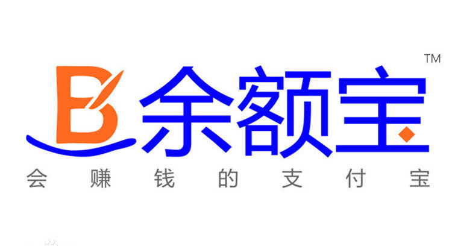

<!-- # 余额宝与奶酪 -->

央行和几大国有银行围剿支付宝、余额宝的背后是对奶酪的追逐。

近来几年，互联网金融业务兴起，支付宝、余额宝等热潮掀起。截至2014年1月15日15时支付宝和天弘基金发布的数据显示，余额宝规模已超过2500亿元，客户数超过4900万户，天弘基金靠此一举成为国内最大的基金管理公司。

正当余额宝在金融市场闹得沸沸扬扬，余额宝即将受到冲击的恐慌却突然袭来。

2014年3月16日，央行将一纸《支付机构网络支付业务管理办法》征求意见稿下发至众第三方支付企业手中。紧接着，3月22日，随着建行下调支付宝快捷支付额度，四大行悉数降低了额度。其中，支付宝交易量最大的建行将支付额度调低到了单笔最高5000元，每月不超过5万元，这一项专门对支付宝“快捷支付”的制裁直接让余额宝陷入困窘境地，广大宝民闻则色变。

支付宝曾与传统商业银行、银联一度保持着着良好的合作关系，央行也给予支付宝等第三方支付平台较为宽松的政策，一夜之间，友好联盟分作敌营，央行老母变了黑脸。看似突如其来的对支付宝、余额宝的打击，绝不是空穴来风。

**一、余额宝的真实面目**

余额宝到底是什么？

乍一看，它主要吸收支付宝客户支付宝账户内的闲置沉淀资金，并返以客户利息，有着类似银行储蓄的功能，但余额宝的收益率远高于银行，各大商业银行活期存款利率约为0.35%，而余额宝的收益率则稳定在5%左右（具体数据以及走向参照右图）。

其实，余额宝本质是让支付宝用户购买一款货币基金，

具体是指由第三方支付平台支付宝与天弘基金合作打造的一项全新的互联网基金业务余额增值服务。

余额宝基于支付宝而发展起来。为了更便于理解余额宝的本质，笔者首先谈谈支付宝是什么。支付宝是独立第三方支付平台，国内有学者提出，第三方支付即是指具备一定经济实力和信誉保障的独立的非银行机构，与各大银行签约进行合作，提供与银行支付结算系统接口的交易支持平台，为买卖双方提供货币支付，资金清算等服务而形成的网络支付模式。通俗来说，它是当消费者与商家达成购买协议后，利用该平台提供的账户进行付款，由平台通知商家货款到帐、要求商家发货；消费者收到货物后确认付款，平台再将货款转至卖家的支付模式。

从法律角度来看，支付宝公司拥有合法的第三方支付牌照，牌照的颁发者为央行。其营业行为受到央行《非金融机构支付服务管理办法》的规制，该办法于2010年9月1日开始施行。其第三十条规定：“机构的实缴货币资本与客户备付金日均余额的比例，不得低于10%。本办法所称客户备付金日均余额，是指备付金存管银行的法人机构根据最近90日内支付机构每日日终的客户备付金总量计算的平均值。”例如若支付宝目前注册资本为10亿元，其备付金账户最多只能容纳100亿元，反之则违规。该条明确限制了第三方支付机构账户内的备付金沉淀，对第三方支付机构的资金吸收起到一定的监管作用。那么超过2500亿元规模的余额宝是如何逃过现有的监管体制的？

这就是支付宝公司在金融产品设计上的高明之处了。它把基金销售行为定义为直销，并严格按照直销来设计业务流程，使资金和资产的所有权在转移流动过程中不会转移给支付宝公司，而且支付宝公司把从基金公司获得的收益作为支付宝提供交易平台的对价，名称上界定为“管理费”，这样就成功地规避了监管风险。支付宝拥有的只是基金支付许可，这与第三方机构所拥有的基金销售牌照的职能和业务范围仍旧是存在区别的，但实质上余额宝已达到第三方代销效果，其业务模式显然已“越线”。它实质上是钻了法律漏洞迅速发展起来的互联网金融业务，其发展的波折，其可能受到的打压限制是可预想的。

**二、央行与四大银行的角色扮演**

余额宝、支付宝开展的如火如荼，央行以及四大商业银行的举措却给了当头一棒。

首先，它们得有当头一棒的资格。它们的确有。

中国人民银行是中华人民共和国的中央银行，中华人民共和国国务院组成部门之一。中国人民银行根据《中华人民共和国中国人民银行法》的规定，在国务院的领导下依法独立执行货币政策，履行职责，开展业务，不受地方政府、各级政府部门、社会团体和个人的干涉。1983年国务院决定中国人民银行专门行使国家中央银行职能。含金融风险防范与化解、统计数据、银行卡、金融规章、反假货币工作、公告栏等。网络金融业务当然也被涵括在内，处于央行的监管之下。

接着，它们要有当头一棒的能力。

央行用一系列文件的出台，商业银行配以高效率执行力一齐证明了这一点。2010年央行出台《非金融机构支付服务管理办法》，确定了央行第三方网络支付的监管主体地位，将例如支付宝之类的网络第三方支付机构纳入法律规范的体制之内，给予其合法身份。牌照的发放使得网络第三方支付企业从以前的灰色地带正式纳入央行的监管体系中。合法的资格增强客户们的信赖度，这对发展较为壮大的第三方支付平台的鼓励与保护的效果很显著。作为国内最为先进的独立第三方支付平台——支付宝深受其益。就如“水能载舟，亦能覆舟”的道理，央行给予合法的资格，宽松自由的发展环境让支付宝、余额宝渐渐壮大，事情的进展也随时可能急转直下。

俗话说姜还是老的辣，这话一点儿也不假。央行近期对第三方支付企业进行的密集打压，作为执行机构的商业银行以“安全”为名对支付宝快捷支付转账进行限制的政策合法且合乎契机。尽管第三方支付目前并未爆发大规模安全危机，但余额宝原本发展的坦途突然面临着一堵厚厚墙壁的阻碍，前途未卜。

**三、央行与四大银行的“围剿”理由**

前文提到的余额宝的漏洞，以及央行与四大行的“实力”其实已经为这场“围剿”做足了铺垫。

然而，支付宝发展初期，央行未采取任何强硬手段抵御支付宝可能出现的安全漏洞，传统银行并未大规模限制支付宝快捷支付及转账限额。短短几年，支付宝以及衍生而出的余额宝等理财产品风生水起，它们自身的弊端渐渐显露，它们对传统银行的冲击也越发猛烈。“围剿”也就这样开始了。

不论是台面上宣扬的，还是深层次凿出来的，开始的理由并不单一。

首先，民众最关注的安全问题。其一，网络本身具有的不确定性，虚拟网络中木马病毒无处不在无孔不侵。其二，余额宝、支付宝提出的被盗全额补偿保障措施让人有后顾之忧。举个例子，支付宝有如下条款：“您可以就使用本服务时因不能归责于您的原因造成的理财产品损失（投资性风险及相关金融机构原因造成的损失除外）申请支付宝的补偿，但能否得到补偿及具体金额取决于支付宝自身独立的判断。

您同意并认可支付宝最终的补偿行为并不代表前述资金损失应归责于支付宝，亦不代表支付宝须为此承担其他任何责任。”它将最终的判断权绝对的归于第三方机构自身，这样的条款暴露出补偿制度的“荒唐”，同时余额宝仅承诺当用户资金被盗时将全额补偿，却并未对用户收益提供保障措施。这意味着一旦用户因收益发生争执，法律纠纷难以避免的时候，用户却补救不能。

目前，它虽有着便捷高收益的极大诱惑力，但存在的安全隐患也是巨大的。

第二，法律问题。余额宝欠缺销售基金资格。余额宝投资的实质就是购买基金，但无销售基金牌照，仅凭借“支付资格证”的支付宝联手天弘基金通过直销模式的监管规避式创新模式，显然是变相从事私下基金购买。

同时，支付宝余额宝业务中有部分基金支付结算账户并未向监管部门进行备案，也未能向监管部门提交监督银行的监督协议，违反了《证券投资基金销售管理办法》第 29 条、第 30 条和《证券投资基金销售结算资金管理暂行规定》第 9 条的规定。

更为严峻的是，有关互联网金融的立法仍是一大片空缺，对于互联网对个人信息的保护，投资者维权体系和相关机构的信用体系相当不完善。在互联网金融方面的审查力度、

指导力度和监督力度较弱，利用余额宝等新型网络金融方式进行洗钱犯罪以及侵犯客户隐私等网络侵权问题“风起云涌”却难以查处解决。投资者的维权意识淡薄，对于网络金融投资所面临的风险并不完全自知。

最后不得不说的利益问题。以上的问题并不只存在了一两天，央行、四大商行突然慎重，一紧手中的绳索当然不是心血来潮。这其中利益冲突是最明显，最直接简单的缘由，也是我们不可忽视的深刻导火索。余额宝、支付宝在极短时间内分流了大量银行存款，让原属于银行的钱绕了一圈后再次回到银行，极大地抬升了银行的吸存成本。银行做出全方位的监督限制不仅是为了控制风险，也是为了防止商业银行的存款迅速流失。余额宝相较发展数年的传统商业银行，短短大半年的发展，势头强劲，差点抢走银行手中的大奶酪。

奶酪才是不得不防的迫切缘由啊。

信息时代里，互联网金融发展的趋势是势不可挡的，余额宝规模膨胀及其在资金市场地位的提升，使得银行业面临着金融体系资本性脱媒和互联网技术性脱媒的双重冲击。兼具便捷性和利率市场化优势的余额宝、支付宝正是广大民众所渴求的便利消费方式与财富增值渠道，它让人们“钱生钱”的梦想成真来得更快。

然而，事情并不是仅有商业竞争那么简单。

钮文新在其博文中称，余额宝吸血鬼、金融寄生虫，称它们并未创造价值，而是通过拉高全社会的经济成本并从中渔利。“当余额宝和其前端的货币基金将2%的收益放入自己兜里，而将4%到6%的收益分给成千上万的余额宝客户的时候，整个中国实体经济、也就是最终的贷款客户将成为这一成本的最终买单人。”

这不是为了哗众取宠，这也不是为了制造恐慌。商业本就是利益为先，追究不了孰是孰非。互联网金融最终还是要受宏观实体经济的约束，受到法律与监管部门的束缚与监督，一个完善的金融体制稳定市场，一个全面的法律监管体系维护民众的利益才是我们需要的。传统商业银行如何与互联网金融博弈，央行如何寻找平衡点，左右着“求富”的投资者的每次选择。每次选择都左右着金融体制的转变方向与转变速度。

而现在，谁也不知道这口奶酪会被谁吃掉。

（编辑：陈澜鑫）
