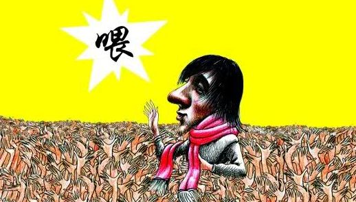

<!-- # 中大辩论之三：客观不是借口 -->

*编者按：*

*8月21日广州大学城200多名环卫工人集体罢工抗议。起因是物业公司变更，环卫工人们今后去向没有得到确认，缺少无固定期限劳动合同的他们在原物业公司拿不到经济补偿。今后若跟随新物业公司九年的工龄可能清零，若跟随原物业公司可能被安排到其他地区，而他们希望继续留在大学城从事环卫工作。*

*这些工人从2004年大学城规划建设以来便就地就业从事环卫行业。2005年，他们的劳动关系从市桥环卫处转到“广州广电物业管理有限公司”，该物业公司与今年4月竞标失利后未跟合同到期的工人续合同，也没有跟已签订两三次固定期限劳动合同的工人签订无固定期限劳动合同。在之前的合同中，没有具体工作地点和起止日期，公司甚至要求工人在空白合同上签字。相关部门对此事互相推诿未作出积极回应。*

*8月21日亦是中山大学开学之日。“日晒雨淋九年合同终止，不承认工龄，请政府帮帮我们！”的横幅不仅引起学生们的注意，也激发了一场中大校内对此事的辩论。有学生积极加入环卫工的抗议队伍，与工人们一起坐在烈日下并参与报道、传播。也有学生对此持观望态度，表示不参与签字。*

*在小编看来，这不仅是围绕环卫工人权益的争辩，更是关于大学生是否应该参与公共事务、如何参与公共事务、什么是权益、如何维权的讨论。北斗网将推送中大辩论的数篇文章，与广大读者共同关注讨论广州大学城环卫工抗议一事。*

***您可将想法、短评、社论发至北斗各平台或邮箱contribution@ibeidou.net ，我们将有选择得整理发布读者反馈。***

*本文是陆凉同学对《我为何不签名》的反驳，原题为《客观不是借口——回应麦子林夕同学》。*

8月29日晚，中大青年微信发表了一封名为《我为何不签名》的个人文章，作者麦子林夕声称近日愈演愈烈的学生帮助环卫工维权事件，尤其是《我们为何应该声援环卫工人》一文引发了她极大的不安。那么作为上文的起草者，我感到有必要澄清整个事件的许多方面，消除麦子同学的不安，也让更多同学理解我们协助环卫工人的意义。

首先，作者声称自己在校媒以及其他同学的文章中只看到了关于环卫工人及其维权行动的描述，而广电物业在其中是失声的。针对这一点，我首先要说明的是，主流媒体如直播广州（8.21）、羊城晚报（8.22）、网易新闻（8.28）的相关报道中均采访了广电物业的相关人士。

所以，我实在不理解作者所说的，“广电物业在媒体上失声的”，有什么事实根据。作者声称自己在没有了解全局的情况下不愿作出评论，但是双方的论点、论据主流媒体都已经有过报道，如果有人还是没有了解到这些信息，那这恐怕不是热心学生的错。

而且，即使在这些没有直接采访广电物业相关人士的学生报道中，也没有任何诋毁或者抹黑广电物业的地方。广电物业长期以来侵害环卫工人权益的事实确凿无误，绝不会因为记者的采访而变为合法。首先在长达十年的合作时间中多次侵害工人的合法权益，从2005年到2014年期间，广电物业共与环卫工人签订过五次合同（05年10月1日到06年12月1日、06年12月到07年2月28日、07年10月到10年9月30日、10年9月30日到14年4月30日、14年4月30日到14年8月31日）。按照《劳动合同法》，连续签订两次固定期限劳动合同即应在签订新合同时签订无固定期限合同，然而广电物业显然没有遵守法律法规。

回到工人当下的诉求，广电物业拒绝支付经济补偿金的做法是明显违法的。《劳动合同法》第三十八条、《最高人民法院关于审理劳动争议案件适用法律若干问题的解释（四）》第十三条、《劳动合同法实施条例》第十八条都有明文规定，在此不做引用。广电物业此次竞标失败，已经无法继续履行原劳动合同约定的工作条件（包括工作地点和工作内容），按照法律规定劳动者可以要求不续订劳动合同，并要求公司给予法律规定的经济赔偿。

以上内容都是不容置疑的事实，学生丝毫没有扭曲事实、抹黑广电物业，反倒是广电物业在微博上利用海量水军抹黑学生“勾结境外势力”云云。

所以，我也无法理解作者所谓的“一味指责”是什么意思，如果不能把广电物业的违法行为叫做“违法”的话，那么我无话可说。

第二，作者称热心学生的帮助环卫工人会给他们带来二次伤害、造成物业公司和环卫工人的对立、不利于矛盾的化解、导致环卫工人再就业困难。那么我需要澄清的是，2014年8月4日，广电物业告知工人竞标失败此后不能继续承包大学城的环卫工作。其后，工人希望公司就合同到期后的安置问题表态，然而广电物业对于工人的要求置之不理。无奈之下，工人们从8月8日起接连求助于环卫局、劳动局等政府部门，也是毫无回应。在毫无选择的情况下，工人们才选择了在8月21日中山大学开学日停工抗议。工人们给出三天期限，希望公司正面回应其诉求，然而这一次也是苦无回音。真正的罢工开始于8月26日，这是工人们最后的选择，唯有寄希望于社会大众的关注和帮助他们才有可能获得合法合理的赔偿。虽然到目前为止广电物业仍仗着其国企身份傲慢忽视工人，但是如果没有其他社会力量的介入，那么工人们的诉求必然无法实现、工人们的合法权益必然无法得到保障。

所以，我同样不理解麦子同学说的大学生导致工人与企业站在了对立面是什么意思。工人们不是没有试图通过常规途径解决问题，问题是广电物业毫无谈判

的诚意。是广电物业傲慢的态度把工人推到了自己的对立面，而不是学生鼓动工人去和企业对抗。事已至此，如果不借助于外部力量的谴责监督，难道要让工人们回

家等着广电物业会突然之间大发善心吗？

此外，作者断定维权会使工人们变成“烫手山芋”，从此

没有下家敢雇佣工人们更是子虚乌有。这个论断如此鲁莽以致于反驳甚至不需要思考，番禺区环卫局在招标书中已经明确规定“中标公司必须无条件接收原有的环卫工人”。所以建议大家在指责他人不够客观之前，先自己动动手指去了解一下已经公开的信息。

更何况，工人维护自身权益原本合法合理，但如今维权反倒会使自己陷入难以再就业的困局，这种处境难道是合理的吗？按照作者的逻辑，难道工人权益受到侵害时只能默不作声，等着企业和政府去积极解决问题吗？上文

我们已经看到了企业和政府在应对工人合法诉求时的不作为，所以我实在不认为这是一剂良方。

当然，过往经验告诉我们罢工中的工人代表常常会被企业秋后算账。虽然现实如此，工人在与企业博弈的过程中处于天然劣势（如果作者真的愿意了解的话有大把的文章书籍可看，在此不再赘述），但是团结的工人们完全有力量让无良企业遵守法律，也有足够的力量保护自己的工人领袖免遭打击。工人们虽然劣势却不是所谓的“弱势群体”，更不是求着老板给份工作的乞丐！

第三，作者断言大学生过多的介入会造成纠纷解决过程中的混乱，会妨碍司法进程。这个观点同样相当奇怪，且不说现在事件根本还没有进入法律程序，就算进入了法律程序，工人和学生的行动又怎样才能影响法庭的判决？（如果作者知道其中的诀窍，我倒是很想学学）而且工人罢工、学生声援丝毫没有违反法律，都是法律容许范围内的行为，这“妨碍司法”的罪名又从何而来？

抛开这些不说，让我们从最现实的角度来考虑。诉讼程序动辄数月，作为连生存尚且艰辛的环卫工人如何有经济实力和时间进行诉讼？财大气粗的企业耗得起，环卫工人们耗不起。对广电物业来说，走诉讼程序的成本远远小于给工人进行经济补偿。但是对工人来说，既然诉讼程序与要求集体谈判都合法合理，为什么要去选择成本极高的诉讼程序呢？

在此情况之下，天然劣势的工人如果没有自身的团结斗争以及其他社会力量的协助，避免不了被无良企业欺凌。这就是工人维权的意义！这就是大学生协助他们的意义！

最后，客观理性的背后是批判思维而不是选择性的相信。作者在文中引用了一条微博，“这批环卫工有一部分是‘职业维权队伍’在别的街镇的环卫项目拿过赔偿又来到大学城参加到环卫工作队伍的…说句公道话大部分员工是善良的也是被煽动的”，我有时候实在看不懂这世道，难道工人维护自身合法权益索取赔偿错了吗？为什么不是无良企业而是保护自己的工人竟成为了这个社会的“坏分子”？“大

多数善良的工人是被煽动的”，这句话我承认前半段，至于是不是被煽动的，建议愿意了解真相的人去现场自己看一看、问一问，你自然会有一个明白的答案。有些人污蔑工人不过是为了掩盖他们损害了工人权益的事实，有些人在没有事实依据、毫无判断的情况下相信他们的话让我很难同意他是客观的。

作者在其文章的最后说，“愚昧的好心在效果上等于作恶”。

那么，我也必须告诉理中客们，自以为是的客观在效果上等同于帮凶！

（采编：余泽霖；责编：叶璐蓓）
