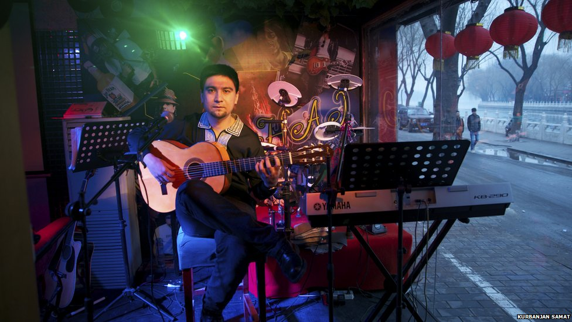
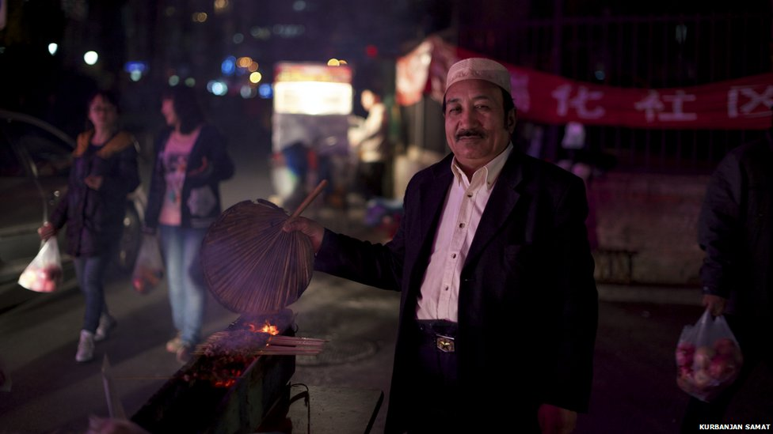
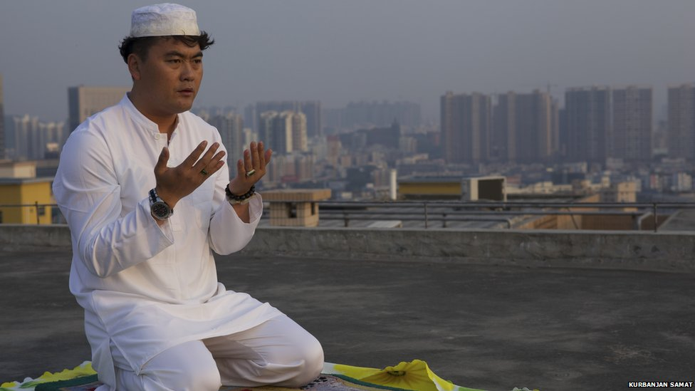
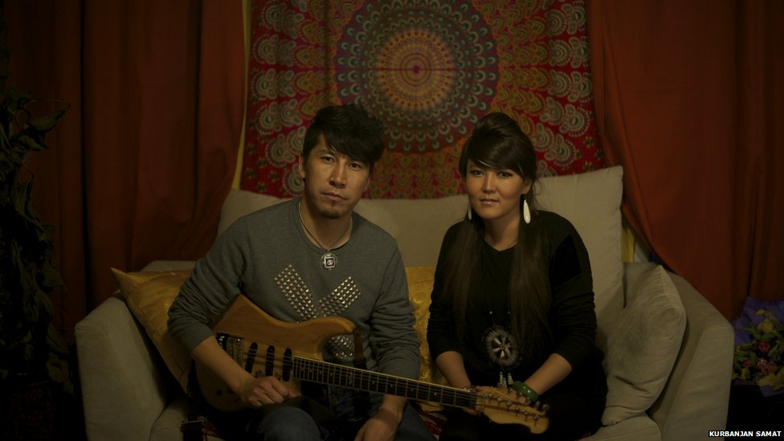
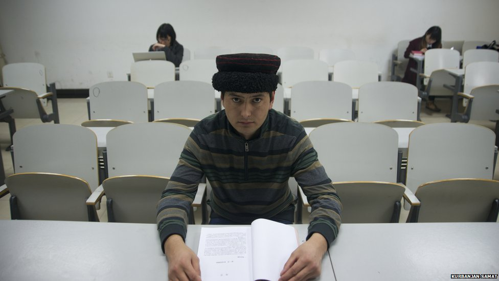
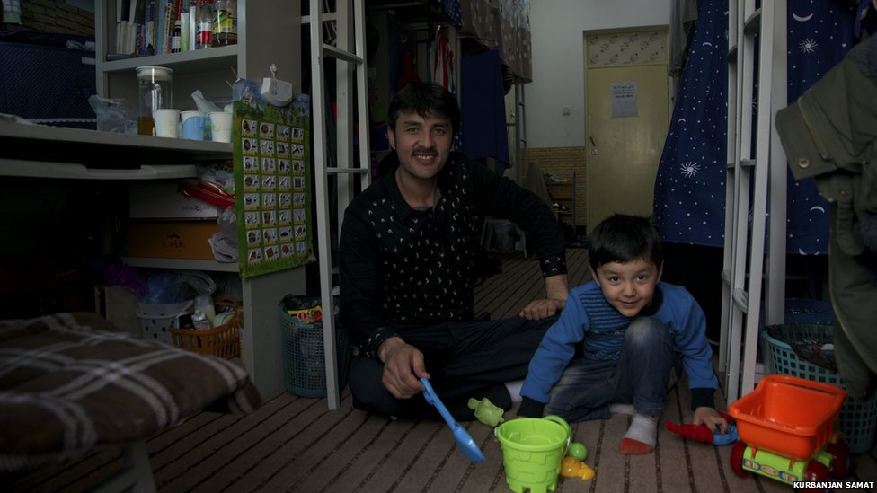
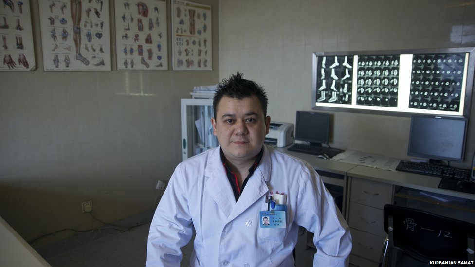

<!-- # “我来自新疆” -->

去年十二月，Kurbanjan开始了“我来自新疆”的摄影计划，以图告诉人们新疆不是只有水果贩子和扒手。

Kurbanjan Samat：“我拍摄的对象全都是来自新疆的普通人。”

“我在中国的二十多个城市见过好几百人，”Kurbanjan Samat解释说。“摄影对象们的故事促使我坚持着。”

维吾尔族摄影师Kurbanjan坚持致力于改变普通中国人对自己家乡新疆的印象。

去年十二月，Kurbanjan开始了“我来自新疆”的摄影计划，以图告诉人们新疆不是只有水果贩子和扒手。

如今，它已收集一百多个新疆人的肖像，以及他们的民族和职业。

辽阔的新疆位于中国的僻远西北部，许多少数民族在此居住，其中最大的是信奉伊斯兰教的维吾尔族。

我叫Parhat Alimjan，我来自新疆的维族人，27岁，在中国传媒大学获得了新闻学位。我和朋友们组建了一支叫Bilaye的民族摇滚乐队，同时也是一支名叫One Drop的雷鬼乐队的吉他手。2010年的时候，我和一群音乐家一起在北非演出。我太爱音乐了，没顾上自己的个人生活。我的家人希望我早点结婚，所以我现在想要首先找个女朋友。

我是Elik Abdurehim，我来自新疆，维族人，61岁。我1982年的时候在乌鲁木齐开了一家饭店，那时中国正经历着改革开放。一支来自北京的调查小组来到我们街市，特别喜欢我们这的氛围。他们和乌鲁木齐市政府讨论，然后把我们十多个生意人带到了北京。我卖水果和新疆烧烤，很受北京人喜欢。现在我的三儿子得了脑瘫，我们花光了积蓄为他治病。我的梦想是他能够早日康复。我也希望我的其他孩子能够得到好的教育，同时保留住我们的文化和传统。

我是Nefise Nehemat，我来自新疆，维族人，35岁。我有一个一岁半的儿子。2008年从华东政法大学毕业以后，我在上海Jindu律师事务所从事律师工作。我儿时的梦想是在中国最大的城市当一个帮助他人的律师。今年，我在美国Emory University开始我的硕士学习。我现在的梦想是当选人大代表，为少数民族女性的维权。

我叫 Zhang Zhiqiang，我来自新疆，汉人，35岁。我在深圳做手机生意。我在哈萨克斯坦做生意的时候开始信仰伊斯兰教。我现在一天祷告五次。我的梦想是今年找一个穆斯林女朋友结婚。

我叫Bayirta，Bayin是我的妻子。我们是来自新疆的蒙古人。我今年30岁。我以前是中国第一支西藏土著乐队Manishi的吉他手和作曲人。我妻子以前是一名歌手。2013年的时候，我们在新疆巴音郭楞蒙古自治州举行了一场半个月的蒙古传统婚礼，然后我们在北京的一家西藏饭店又举行了一场婚礼。我们希望今年里能成立我们自己的乐队。

今年早些时候发生了几场维族人制造的暴力袭击事件，“维族分裂分子”成了一个充满仇恨的词。许多中国人觉得维族人和新疆人总的来说不可信。

“正当第一组照片在网上得到一些好评的时候，发生了昆明袭击事件”，Kurbanjan 说，“我不得不加速工作。”

今年三月发生在昆明火车站的大规模刺杀事件中29人遇难。不久，新疆首府乌鲁木齐，一个露天市场发生爆炸，又有31人遇难。

“我那时很痛苦”，Kurbanjan说，“我们人民之间的误解正在加深，但是我不想隔阂扩大，我想让大家更亲近。”

那以后，Kurbanjan会在照片中详细描述这些居住在中国各大城市的普通新疆人的追求。从街道小贩到电影明星，Kurbanjan希望他们的故事能够触动人们的心。

“不管他们是精英还是普通人，我都一视同仁。”

“主厨、小贩、白领，他们都是人。我讲述他们的故事来激励新疆的年轻人，也为了让其他中国人看到新疆人民在电视节目之外的真实色彩。”

Kurbanjan 来自新疆西部和田地区的一个贫寒家庭，他对家乡人追求成功的艰辛深有体会。

当他第一次来到首都北京，他一边在一家烤肉摊干活一边做玉石生意，直到他对摄影产生热情。

“对一个新疆人来说，取得成功需要比其他人多付出三倍努力”，Kurbanjan说，“我的摄影对象激励着我。他们的勤劳给予我能量。”

我叫Memedik Dilkar，我来自新疆，塔吉克族，今年24岁。我的家乡在新疆塔什库尔干塔吉克自治县。2012年大专毕业后，我在新疆成为了一名客户经理。现在我在中国民族大学攻读学士学位，我希望拿到本科文凭，我的梦想是找到一份好工作。

我叫Tiliwaldi Sidik，我是来自新疆的维吾尔族，今年30岁。从新疆大学毕业后，我在当地一所学校教汉语。2008年我结婚了。现在我在中国民族大学攻读维吾尔语的硕士学位。我的妻子回新疆了，但儿子和我一起留在北京，因为这儿的学校更好。虽然我与妻子现在不得不分开，但从长远看这是值得的。

我叫Xawkat Repik，塔塔尔族，来自新疆，今年30岁。我做骨外科医生七年了。2010年结婚以前我在新疆工作，我争取机会来到了北京与妻子团聚。现在我是中国武警医院的一名医生。许多新疆的病人常慕名而来，一些人刚到北京就联系我寻求帮助，毕竟他们很难遇到一位讲维语的医生。

目前Kurbanjan在把他的照片编辑成一本书，如何处理每个人的故事而不涉入进他们的挫折让他很伤脑筋。

“我也能感受到那种压力。我的拍摄对象常把他们的负面情绪倾泻给我，网上也有很多恶毒的信息。”Kurbanjan说。

“但我根本不会在意那些批评，我要保持积极的心态。”

当BBC跟随Kurbanjan去拍摄一个对象时，他被禁止进入某个公司，因为他的身份证表明了他来自新疆。

几分钟后，另一位来自新疆的女士也被同一栋建筑拒之门外，尽管她收到了工作面试邀请。

在盛夏的高温中，Kurbanjan站在那里，有些恍惚。

“在几年前我可能会发脾气，但现在我不会了。愤怒改变不了任何事情。”他说。

文章来自BBC China Blog

原文标题：Changing Minds Through Xinjiang Portraits

地址：http://www.bbc.com/news/blogs-china-blog-28539053

（翻译：刘铮、张山骁；责编：刘铮）
