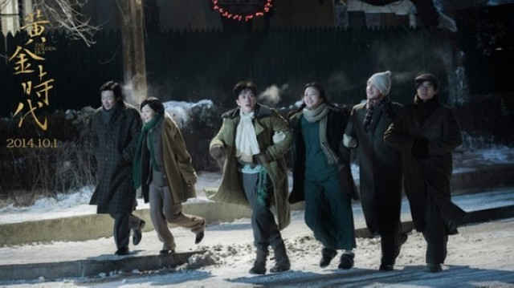
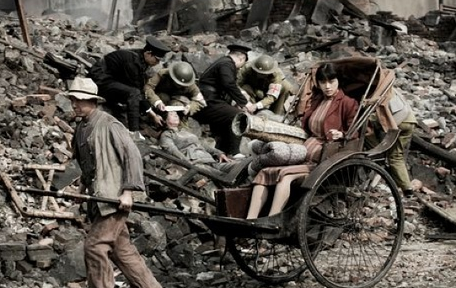

<!-- # 《黄金时代》的时代究竟是什么？ -->

若我警醒自己保持恭敬，我会说：这片儿的导演、编剧、演员努力了，看得出。若我稍一放肆，我就得说：这片儿的导演、编剧、演员压根没有理解自己试图表达的命题。

《黄金时代》和《一代宗师》很像：标题很大，不肯把自己老老实实简单定位成某位历史人物的传记片；叙事很细碎，或许是因为他们坚信“平淡之中见真情，明星也是老百姓”；台词有亮点，前者是把文学作品和历史传记中的句子一支支捋下，插在人物头上，后者则留下无数“念念不忘，必有回响”的金句。

以上是昨晚我在煎熬中看片的第一体会。

昨晚在宝山万达看的提前场，放映后有明星见面会。三个小时的电影看得我肠胃煎熬，后排的汤唯粉丝响亮地嗑着瓜子，瓜子皮洒落一地。好容易捱到结束，再等明星出现。汤唯、田原都漂亮，冯绍峰、朱亚文也端得是明星范儿。提问环节，我得到了提问机会，强压砸场子的冲动，问出一个“你们觉得你们和角色有什么契合点？”的问题。明星们不知所云的回答，让我觉得自己在苦苦求索的，不过是一只车库里的隐形喷火龙。

回到电影，电影的细节不想再刍议。批评它细碎，可以反击说是“只见树木，不见森林”；批评演员塑造差，可以反击说“这是间离效果”；批评节奏、批评编剧……总好像在替没批评到的其他部分开脱。

若我警醒自己保持恭敬，我会说：这片儿的导演、编剧、演员努力了，看得出。若我稍一放肆，我就得说：这片儿的导演、编剧、演员压根没有理解自己试图表达的命题。

王家卫把《一代宗师》拍成了一代打架唯美、在个人感情与国仇家恨间纠结的金句发明大师，许鞍华把《黄金时代》展现成了一群服装极尽精细、旅程踏遍全国的俊男靓女，哪怕考虑上萧红的“黄金时代”是“笼子”里的，那笼子也不过是病和穷。

明明把时代命题的牌坊竖了起来，却极尽投机取巧之能事，竟以为用服饰、对白、生活细节的真实就能铺陈出时代感——这难免说明，电影的制造者，根本就没有理解时代是怎么回事。

时代应该是一种控制感。它是系在人物四肢上看不见的线，不是人物服饰上看得见的花纹针脚。它让人物产生，摁着人物的头曲曲折折地走，直到灭亡。

时代应该是一种强力的逻辑，它能解释一个东北地主家庭的闺女为什么异想天开追随表哥逃到北平求学，也能解释一名著名女作家何以刚过三十就死于日本控制下的殖民地岛屿。

时代不是呈现，它不是告/诉我们这些过往的事情究竟是怎样——二萧分手的罗生门？

它得告诉我们，这些逝去的人、事、物，缘何被时间定格成了如今的样子。

这个问题很难，但不容躲避，特别是当“时代”这个词已被豪迈地写在标题中。你可以寻找角度去回答它：写孤儿的狄更斯，写老处女的巴尔扎克，写婚嫁的简·奥斯汀，写通奸的王小波，甚至写《呼兰河传》、《生死场》的萧红本人，都交出了他们的答卷。但对于这部《黄金时代》来说，编、导、演三方都像是裸考的学生，并且宁愿贿赂考官博得同情来通过考试，也不愿直面考题，献上自己脑中（或许可怜的）所有。

逃避回答会造就最糟的结局：纵使许鞍华、汤唯甚至萧红，这些名字本身，便可赚得太多宽容和同情。但从回答“时代”命题的角度来说，哪怕是《建国大业》与《建党伟业》，都足以各扇此片五个耳光。

（采编：徐蕾；责编：王卜玄）
